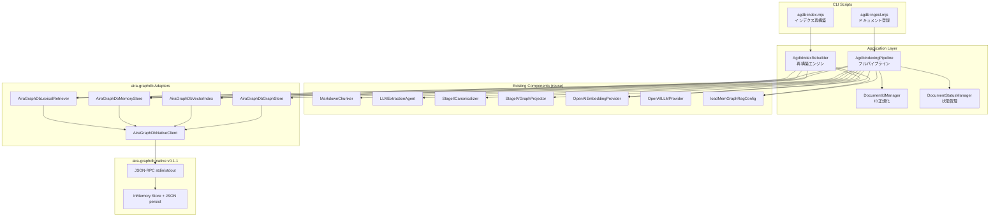

# DES-AGDB-TOOL-001: aira-graphdb 直接登録・インデクスツール設計書

| フィールド | 値 |
|-----------|---|
| **ID** | DES-AGDB-TOOL-001 |
| **バージョン** | 1.4 |
| **ステータス** | Draft |
| **作成日** | 2026-06-21 |
| **更新日** | 2026-06-22 |
| **トレーサビリティ** | REQ-001〜REQ-005 (v7, session内承認済み) |
| **パッケージ** | `packages/memgraphrag` |
| **aira-graphdb** | v0.1.1 |

## 1. 概要

Neo4j/SQLite 経由のインデクシングパイプラインを置き換え、aira-graphdb sidecar に直接登録する
CLI ツール群を設計する。英語版を先行実装。

## 2. C4 コンポーネント図



## 3. 設計仕様

---

### DES-001: agdb-ingest.mjs — 軽量直接実装

**トレーサビリティ**: REQ-001
**パッケージ**: `packages/memgraphrag`

**設計概要**:
既存 `FullDocumentIndexingPipeline` は SQLite に深く結合しているため、再利用せず
CLI スクリプト（.mjs）として直接実装する。既存の純粋コンポーネントのみ再利用。

**再利用するコンポーネント**:
- `chunkMarkdownDocument(request: ChunkDocumentRequest)` — チャンク分割（副作用なし）
  - `ChunkDocumentRequest`: `{ corpusId, documentId, title, sourceUrl, markdown, language, doi?, sourceDb?, sourceType? }`
- `toExtractionChunk(corpusId, chunk, request)` — MarkdownChunk → ExtractionChunk 変換
- `LLMExtractionAgent.extract(chunk: ExtractionChunk)` — エンティティ/リレーション抽出（LLM呼び出しのみ）
  - 戻り値 `CompositeExtractionRecord`: `{ chunk, candidateSchemas, candidateFacts, sourcePassage: Passage, rawEntities: string[] }`
- `StageIVGraphProjector` の nodeId/edgeId ヘルパー（`entityNodeId()`, `factNodeId()`, `passageNodeId()`）
  — **注: 現在 non-exported。インライン複製として実装する（4行のワンライナー）**
- `upsertVectors()` — GraphNode[] → embed → vectorIndex.upsert()
- `OpenAIEmbeddingProvider`, `OpenAILLMProvider`, `loadMemGraphRagConfig`

**再利用しないコンポーネント**:
- `FullDocumentIndexingPipeline` — SQLite 依存
- `StageIICanonicalizer` — memoryStore.save() 副作用、schema frequency 管理
- `LexiconBuilder` — SQLite 直接操作

```typescript
// CLI: node scripts/agdb-ingest.mjs <corpus-dir> --corpus <id> [--db <path>] [--config <path>]
//       [--skip-vector] [--skip-lexical] [--concurrency <N>]
```

**処理フロー**:
1. Parse CLI args, load config (CLI > env `AIRA_GRAPHDB_DB_PATH` / `OPENAI_API_KEY` > config > default)
2. Acquire O_EXCL lock (`<dbPath>.lock`)
3. Spawn `AiraGraphDbNativeClient`, create adapters
4. Enumerate `.md` files in corpus-dir, normalize documentId via `DocumentIdManager`
5. For each document (**逐次処理**):
   a. Build `ChunkDocumentRequest`: `{ corpusId, documentId, title, sourceUrl:'', markdown, language:'en' }`
   b. `chunkMarkdownDocument(request)` → `MarkdownChunk[]`
   c. For each chunk: `toExtractionChunk(corpusId, chunk, request)` → `ExtractionChunk`
   d. `LLMExtractionAgent.extract(extractionChunk)` → `CompositeExtractionRecord` (concurrency 制御)
   e. Build graph data from `candidateFacts`:
      - Entity nodes: **document-scoped** `{ nodeId: 'entity:${documentId}:${key}', layer: 'entity', ref: { sourceDocumentIds: [documentId] } }`
        （v1 では entity node を document-scoped にする。shared entity は PPR のエッジ接続で自然に関連付けられる）
      - Fact nodes: `{ nodeId: 'fact:${factId}', layer: 'fact', ref: { sourceDocumentIds: [documentId], ...factData } }`
      - Passage nodes: `{ nodeId: passageNodeId(passage.passageId), layer: 'passage', ref: passage }`
        （`passage.passageId` は `passage:${chunkId}` 形式。`passageNodeId()` で `passage:passage:${chunkId}` になる — 既存 projectGraph() 準拠）
      - Edges: `entity-cooccur`, `fact-evidence`, `entity-mention` の3種類
   f. Build `Passage[]` from `record.sourcePassage`（extract() が Passage を返す — そのまま使用）
   g. Build `Fact[]` from `candidateFacts`（schemaId は空文字列、state='active'）
   h. `graphStore.deleteByDocument(corpusId, documentId)` — nodes/edges/vectors/passages を一括削除
      （aira-graphdb の delete_by_document は `doc_ids_from_ref()` で `sourceDocumentIds` または
       `metadata.documentId` を読み取り、node/edge/vector/passage を削除する）
   i. `graphStore.upsertNodes(nodes)` — 500件バッチ
   j. `graphStore.upsertEdges(edges)` — 500件バッチ
   k. **Memory snapshot: load → merge → save**:
      ```
      existing = memoryStore.load(corpusId)
      // 既存 facts/passages から現 documentId のものを除去
      mergedFacts = existing.facts.filter(f => !f.sourceDocumentIds.includes(documentId)).concat(newFacts)
      mergedPassages = existing.passages.filter(p => p.metadata.documentId !== documentId).concat(newPassages)
      memoryStore.save({
        corpusId, exportedAt: new Date().toISOString(),
        schemaVersion: existing.schemaVersion ?? 0,
        schemas: existing.schemas ?? [],  // 既存 schemas を保持
        facts: mergedFacts, passages: mergedPassages
      })
      ```
      ※ `memory_save` は corpusId で snapshot を**完全置換**するため、必ず load → merge → save する
   l. `!skipVector` なら `upsertVectors(vectorIndex, embeddingProvider, allNodes)` — 100件バッチ
   m. `!skipLexical` なら `lexicalRetriever.indexPassages(corpusId, passages)`
   n. 失敗時の recovery:
      - graph/vector/passage は `deleteByDocument()` で既に削除済み — 新データ upsert が途中で失敗した場合:
        - 部分的に upsert されたデータはそのまま残る（次回 ingest で上書きされる）
        - memory snapshot は **旧 snapshot を変数に保持**しておき、失敗時に `memoryStore.save(oldSnapshot)` で復元
      - status='failed' を記録し、次回実行時に再処理される
      - **v1 制約（許容）**: delete → upsert は非原子的。失敗時に部分的な graph/vector 状態が残る。
        排他ロック（REQ-005）により concurrent access は防止されており、次回 ingest で一貫性が回復する。
        完全な原子性が必要な場合は aira-graphdb に `replace_document_index` RPC を追加（v2 scope）。
6. Print summary (indexed/failed counts)
7. Close client, release lock

**schema layer 省略の理由 (ADR-003)**:
- `StageIICanonicalizer` の schema 管理は complex（frequency/stable/cascade）で SQLite 副作用あり
- v1 では schema layer を省略し entity + fact + passage の3 layer で運用
- EN benchmark 88.4% はこの3 layer で達成済み
- Fact.schemaId は空文字列を設定（型互換のため）
- 将来: schema 管理が必要時に追加

**nodeId/edgeId 規約（既存 StageIVGraphProjector 準拠 + v1 拡張）**:
- Entity nodeId: `entity:${documentId}:${name.toLowerCase().replace(/\s+/g, '_')}`
  （v1 のみ document-scoped — shared entity の delete_by_document 問題を回避。
   同一エンティティは PPR のエッジ接続で間接的に関連付けられる）
- Fact nodeId: `fact:${factId}` where `factId = ${documentId}:${head}:${rel}:${tail}`
- Passage nodeId: `passageNodeId(passage.passageId)` = `passage:${passage.passageId}`
  （`passage.passageId` は `passage:${chunkId}` → nodeId は `passage:passage:${chunkId}` — 既存 projectGraph() と同一の二重プレフィックス）
- Edge (entity-cooccur): `entity-cooccur:${headKey}:${tailKey}:${factId}` （headKey/tailKey は document-scoped entityKey）
- Edge (fact-evidence): `fact-evidence:${factId}:${passageId}`
- Edge (entity-mention): `entity-mention:${entityKey}:${passageId}`
- Note: schema-instance edges は v1 で省略（schema layer 不使用のため）

**delete_by_document の動作保証（aira-graphdb v0.1.1 実装確認済み）**:
- `doc_ids_from_ref(&node.ref)` は以下の順で documentId を抽出:
  1. `ref.sourceDocumentIds[]` — 配列の全要素をチェック
  2. `ref.metadata.documentId` — 文字列でチェック
- マッチする nodes を削除
- 削除された nodes の nodeId を参照する edges を自動削除
- `metadata.documentId` マッチで vectors を削除
- `document_id` マッチで passages を削除
- → 結果: graph, vector, passage が document 単位で一括削除される

**ref 設定規約（doc_ids_from_ref() と整合）**:
- Entity node: `ref: { sourceDocumentIds: [documentId] }` — delete 時に `sourceDocumentIds` で照合される
- Fact node: `ref: { sourceDocumentIds: [documentId], headEntity, relation, tailEntity }`
- Passage node: `ref: { metadata: { documentId }, text }`

**補足: CompositeExtractionRecord の構造（実コード準拠）**:
```typescript
// domain/agent/extraction.ts
interface CompositeExtractionRecord {
  readonly chunk: ExtractionChunk;
  readonly candidateSchemas: readonly SchemaCandidate[];
  readonly candidateFacts: readonly FactCandidate[];
  readonly sourcePassage: Passage;         // extract() が直接 Passage を構築して返す
  readonly rawEntities: readonly string[]; // エンティティ名の文字列配列
}
```

**MemorySnapshot 構築（load → merge → save パターン）**:
```typescript
// 1. 既存 snapshot を load
const existing = await memoryStore.load(corpusId);

// 2. 現 documentId のデータを除去
const filteredFacts = existing.facts.filter(
  f => !f.sourceDocumentIds.includes(documentId)
);
const filteredPassages = existing.passages.filter(
  p => p.metadata.documentId !== documentId
);

// 3. 新データを追加して save（memory_save は完全置換なので全データを含める）
const snapshot: MemorySnapshot = {
  corpusId,
  exportedAt: new Date().toISOString(),
  schemaVersion: existing.schemaVersion ?? 0,  // 既存値を保持
  schemas: existing.schemas ?? [],              // 既存 schemas を保持（破壊しない）
  facts: [...filteredFacts, ...newFacts],
  passages: [...filteredPassages, ...newPassages],
};
await memoryStore.save(snapshot);
```

**Passage 構築（sourcePassage をそのまま使用）**:
```typescript
// extract() が返す CompositeExtractionRecord.sourcePassage は
// 既に完全な Passage オブジェクト（passageId, metadata, factIds, entityMentions 含む）
// → そのまま使用、追加のビルド不要
const passage: Passage = record.sourcePassage;
```

**Fact 構築（candidateFacts → Fact 変換）**:
```typescript
const fact: Fact = {
  factId: `${documentId}:${candidate.headEntity}:${candidate.relation}:${candidate.tailEntity}`,
  schemaId: '',  // v1 では空文字列（schema layer 省略）
  headEntity: candidate.headEntity,
  headType: candidate.headType,
  relation: candidate.relation,
  tailEntity: candidate.tailEntity,
  tailType: candidate.tailType,
  state: 'active',
  passageIds: [passage.passageId],
  sourceDocumentIds: [documentId],
  confidence: candidate.confidence,
  corpusId,
  createdAt: now, updatedAt: now,
};
```

---

### DES-002: AgdbIndexRebuilder

**トレーサビリティ**: REQ-002, REQ-003
**パッケージ**: `packages/memgraphrag`

**設計概要**:
既存インデクスを全削除→再構築するエンジン。ベクトルとレキシカルの2タイプ対応。

```typescript
type IndexType = 'vector' | 'lexical';
type IndexStatus = 'indexed' | 'rebuilding' | 'failed';

interface RebuildResult {
  indexType: IndexType;
  status: IndexStatus;
  processedCount: number;
  totalCount: number;
  error?: string;
}

class AgdbIndexRebuilder {
  constructor(
    client: AiraGraphDbNativeClient,
    memoryStore: IMemoryStore,
    vectorIndex: AiraGraphDbVectorIndex,       // 具象型（deleteByCorpus が必要）
    lexicalRetriever: AiraGraphDbLexicalRetriever, // 具象型（deleteByCorpus が必要）
    embeddingProvider: IEmbeddingProvider,
  );

  async rebuild(corpusId: string, indexType: IndexType): Promise<RebuildResult>;
}
```

**ベクトル再構築フロー**:
1. `index_status_save(corpusId, 'vector', 'rebuilding')` で状態記録
2. `vector_delete_by_corpus(corpusId)` で既存ベクトル全削除
3. `memory_load(corpusId)` で facts/passages を取得
4. 全 GraphNode[] を再構築（DES-001 と同じ nodeId 規約）:
   - fact nodes: facts から `fact:${factId}` で生成
   - passage nodes: passages から `passageNodeId(passage.passageId)` で生成
   - entity nodes: facts の headEntity/tailEntity + sourceDocumentIds[0] から
     `entity:${documentId}:${key}` で document-scoped に再生成（DES-001 と同一規約）
5. 100件バッチで `upsertVectors()` — embed → vectorIndex.upsert()
6. metadata に `{ embeddingModel, dimensions }` を保存
7. 成功: `index_status_save(corpusId, 'vector', 'indexed')`
8. 失敗: `index_status_save(corpusId, 'vector', 'failed')` + warning

**レキシカル再構築フロー**:
1. `index_status_save(corpusId, 'lexical', 'rebuilding')`
2. `lexical_delete_by_corpus(corpusId)` で既存全削除
3. `memory_load(corpusId)` でパッセージ取得
4. 500件バッチで `lexicalRetriever.indexPassages()`
5. 成功/失敗の状態遷移（同上）

---

### DES-003: DocumentIdManager

**トレーサビリティ**: REQ-001
**パッケージ**: `packages/memgraphrag`

**設計概要**:
コーパスディレクトリからの相対パスを安定した documentId に正規化する。

```typescript
class DocumentIdManager {
  /**
   * 正規化アルゴリズム:
   * 1. realCorpus = realpath(corpusDir)
   * 2. realDoc = realpath(filePath)
   * 3. realDoc が realCorpus 配下でなければ Error
   * 4. documentId = relative(realCorpus, realDoc) を '/' 区切り化
   * 5. case は保持
   */
  static normalize(corpusDir: string, filePath: string): string;
}
```

---

### DES-004: DocumentStatusManager

**トレーサビリティ**: REQ-001
**パッケージ**: `packages/memgraphrag`

**設計概要**:
ドキュメント単位の処理状態を管理。SIGINT/SIGTERM 時に processing 中の全ドキュメントを failed に遷移。

```typescript
type DocStatus = 'pending' | 'processing' | 'indexed' | 'failed';

class DocumentStatusManager {
  private statuses: Map<string, DocStatus>;

  setStatus(documentId: string, status: DocStatus): void;
  getStatus(documentId: string): DocStatus;
  getAllByStatus(status: DocStatus): string[];
  getSummary(): { total: number; indexed: number; failed: number; pending: number };

  /** SIGINT handler: processing → failed */
  markAllProcessingAsFailed(): void;
}
```

---

### DES-005: CLI — agdb-ingest.mjs

**トレーサビリティ**: REQ-001, REQ-004, REQ-005
**パッケージ**: `packages/memgraphrag`

**CLI契約**:
```
node scripts/agdb-ingest.mjs <corpus-dir> --corpus <id> [--db <path>] [--config <path>]
                              [--skip-vector] [--skip-lexical] [--concurrency <N>]
```

**設計概要**:
```typescript
// Pseudocode
async function main() {
  // 1. Parse CLI args
  // 2. Load config (--config > default), resolve API key
  // 3. Resolve DB path (--db > config > default)
  // 4. Acquire lock (O_EXCL)
  // 5. Spawn AiraGraphDbNativeClient
  // 6. Create adapters (GraphStore, VectorIndex, MemoryStore, LexicalRetriever)
  // 7. Create AgdbIndexingPipeline
  // 8. Register SIGINT/SIGTERM handler
  // 9. pipeline.processCorpus(corpusId, corpusDir)
  // 10. Print summary
  // 11. Close client, release lock
}
```

**設定解決優先順位** (REQ-004):
1. CLI フラグ (`--db`, `--config`)
2. 環境変数 (`AIRA_GRAPHDB_DB_PATH`, `OPENAI_API_KEY`, `AIRA_GRAPHDB_NATIVE_CMD`)
3. 設定ファイル (`storage.airaGraphdb.dbPath`)
4. デフォルト (`data/<corpus>.agdb`)

**排他制御** (REQ-005):
- `<db>.lock` を `fs.openSync(path, 'wx')` (= `O_CREAT | O_EXCL`) で作成
- PID を書き込み
- stale lock 検出手順: `open('wx')` 失敗 → PID 読取 → `process.kill(pid, 0)` で生存確認 → stale なら `unlinkSync` → 再度 `open('wx')` → 失敗なら終了
- 正常終了時: `fs.unlinkSync()` で削除
- **agdb-index.mjs でも同一のロックを取得する**（同一 DB パスに対する排他）

---

### DES-006: CLI — agdb-index.mjs

**トレーサビリティ**: REQ-002, REQ-003, REQ-004, REQ-005
**パッケージ**: `packages/memgraphrag`

**CLI契約**:
```
node scripts/agdb-index.mjs --corpus <id> --type <vector|lexical>
                            [--db <path>] [--config <path>]
```

**設計概要**:
```typescript
async function main() {
  // 1. Parse CLI args (--corpus, --type required)
  // 2. Load config, resolve API key (CLI > env > config > default)
  // 3. Resolve DB path (CLI > env > config > default)
  // 4. Acquire lock (同一 O_EXCL ロック — DES-005 と共通)
  // 5. Spawn client + create adapters
  // 6. AgdbIndexRebuilder.rebuild(corpusId, indexType)
  // 7. Print result
  // 8. Close + release lock
}
```

---

### DES-007: aira-graphdb 新規 RPC 追加（要実装）

**トレーサビリティ**: REQ-002, REQ-003
**パッケージ**: `aira-graphdb` (Rust crate)

**設計概要**:
以下の RPC メソッドを `aira-graphdb-native` に追加する。
**注意: これらは現在未実装。Phase 4 実装時に Rust + TypeScript adapter の両方を追加する必要がある。**
既存の `vector_delete_by_document` / `lexical_delete_by_document` は実装済み。

```rust
// 1. vector_delete_by_corpus — corpusId 配下の全ベクトル削除
"vector_delete_by_corpus" => {
    let corpus_id = params["corpusId"].as_str();
    // state.vectors を corpus_id でフィルタして削除
    // return: deleted count
}

// 2. lexical_delete_by_corpus — corpusId 配下の全レキシカルインデクス削除
"lexical_delete_by_corpus" => {
    let corpus_id = params["corpusId"].as_str();
    // state.passages を corpus_id でフィルタして削除
    // （aira-graphdb では lexical index は passages ストアに格納されている）
    // return: deleted count
}

// 3. index_status_save — インデクス状態永続化
"index_status_save" => {
    let corpus_id = params["corpusId"].as_str();
    let index_type = params["indexType"].as_str();  // "vector" | "lexical"
    let status = params["status"].as_str();          // "indexed" | "rebuilding" | "failed"
    // state.index_statuses[corpus_id:index_type] = status
}

// 4. index_status_load — インデクス状態取得
"index_status_load" => {
    let corpus_id = params["corpusId"].as_str();
    let index_type = params["indexType"].as_str();
    // return: status string or null
}
```

**Node.js 側 adapter 追加**:
```typescript
// AiraGraphDbVectorIndex に追加
async deleteByCorpus(corpusId: string): Promise<number> {
  return this.client.request('vector_delete_by_corpus', { corpusId });
}

// AiraGraphDbLexicalRetriever に追加
async deleteByCorpus(corpusId: string): Promise<number> {
  return this.client.request('lexical_delete_by_corpus', { corpusId });
}
```

---

### DES-008: delete_by_document の既存実装確認

**トレーサビリティ**: REQ-001
**パッケージ**: `aira-graphdb` (Rust crate)

**設計概要**:
aira-graphdb v0.1.1 の `delete_by_document` は既に provenance 対応済み。
以下の動作が確認済み（`aira-graphdb-native.rs` line 525-567）:

1. `doc_ids_from_ref(&node.ref)` で node の `ref` フィールドから `document_ids` 配列を抽出
2. マッチする nodes を `state.nodes` から削除
3. 削除された node の `node_id` を参照する edges を `state.edges` から自動削除
4. `state.vectors` から `metadata.documentId` マッチで vectors を削除
5. `state.passages` から `corpus_id + document_id` マッチで passages を削除
6. `persist()` で永続化

**agdb-ingest.mjs での ref 設定要件（doc_ids_from_ref() と整合）**:
- Entity node: `ref: { sourceDocumentIds: [documentId] }` — `doc_ids_from_ref()` が `sourceDocumentIds` を読む
- Fact node: `ref: { sourceDocumentIds: [documentId], headEntity, relation, tailEntity }` — 同上
- Passage node: `ref: passage` — Passage オブジェクトをそのまま格納。`doc_ids_from_ref()` が `metadata.documentId` を読む

**v1 制約（許容）**:
- Entity node が複数 document で共有される場合、最後に upsert した document の ref のみ残る
- 結果: 最初の document の delete 時に entity node が削除されない場合がある
- 影響: 孤立 entity node が残るが、edge がなければ PPR で到達不能なので検索精度に影響なし

---

## 4. ADR

### ADR-001: SQLite 依存回避方針

**ステータス**: accepted  
**日付**: 2026-06-21

#### Context
`FullDocumentIndexingPipeline` は `better-sqlite3` の `Database` を直接受け取り、
document metadata, conflict audit, LexiconBuilder, StageIICanonicalizer の memory 副作用で使用。
stub/adapter 対応を検討したが、memory save semantics, schema frequency, conflict audit transaction 等で
多数の問題が発生するため、再利用を断念。

#### Decision
- 既存 `FullDocumentIndexingPipeline` を再利用せず、`agdb-ingest.mjs` で直接実装
- `chunkMarkdownDocument()`, `LLMExtractionAgent.extract()`, `upsertVectors()` の純粋ロジックのみ再利用
- graph 構築は `projectGraph()` の nodeId/edgeId 規約に準拠してインラインで実装
- schema layer は v1 で省略（StageIICanonicalizer 不使用）

#### Consequences
- 新規コードは ~300行の .mjs スクリプト
- 既存コードへの影響ゼロ
- schema/conflict resolution は将来対応
- EN benchmark で達成済みの3 layer（entity/fact/passage）で十分な精度

### ADR-002: 初期実装での provenance 簡略化

**ステータス**: accepted  
**日付**: 2026-06-21

#### Context
REQ-001 v7 では node/edge に `document_ids` provenance set を管理し、
参照カウント方式で削除することを要求している。しかし aira-graphdb v0.1.1 の
`GraphNode`/`GraphEdge` 構造体には `document_ids` フィールドがない。

#### Decision
- 初期実装（v1）では `delete_by_document` は現行の全削除方式を使用
- EN ベンチマークの HotpotQA データは 1 document ≈ 1 passage で node 共有が限定的
- provenance set 管理は aira-graphdb v0.2.0 で GraphNode/GraphEdge 構造体を拡張して対応

#### Consequences
- 再インジェスト時に他ドキュメント由来の共有 node が削除される可能性がある（許容）
- 大規模コーパスで node 共有が頻発する場合は v0.2.0 へのアップデートが必要

## 5. 品質ゲート

- [x] 全 DES が少なくとも1つの REQ にトレース可能
- [x] TypeScript インターフェースが定義されている
- [x] CLI 契約が明記されている
- [x] SOLID 原則: SRP（各クラス単一責務）、DIP（インターフェース依存）
- [x] 重要な設計決定に ADR が作成されている（ADR-001, ADR-002）

## 6. トレーサビリティマトリクス

| REQ | DES | 説明 |
|-----|-----|------|
| REQ-001 | DES-001, DES-003, DES-004, DES-005, DES-008 | ドキュメント登録フルパイプライン |
| REQ-002 | DES-002, DES-006, DES-007 | ベクトルインデクス再構築 |
| REQ-003 | DES-002, DES-006, DES-007 | レキシカルインデクス再構築 |
| REQ-004 | DES-005, DES-006 | 設定ファイル駆動 |
| REQ-005 | DES-005, DES-006 | 排他制御 |
