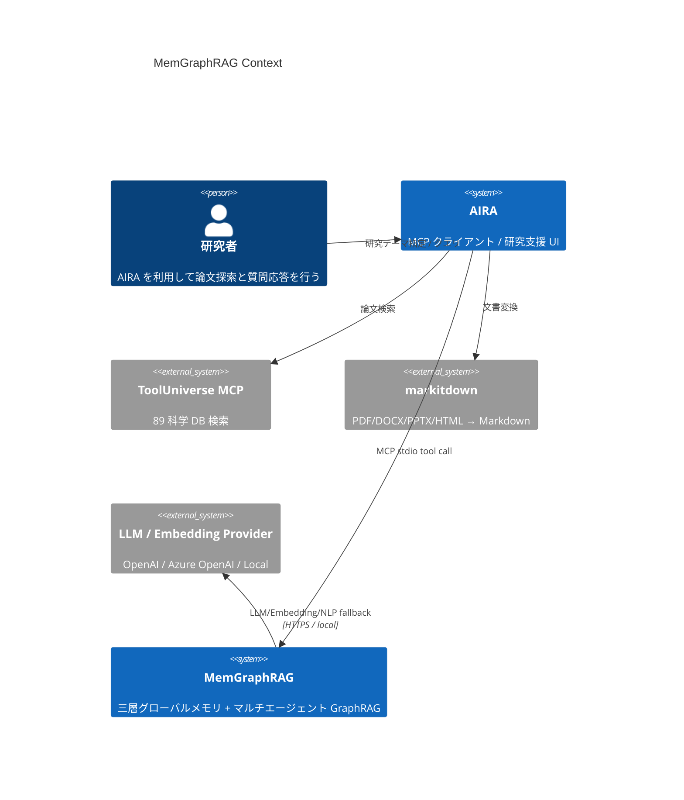
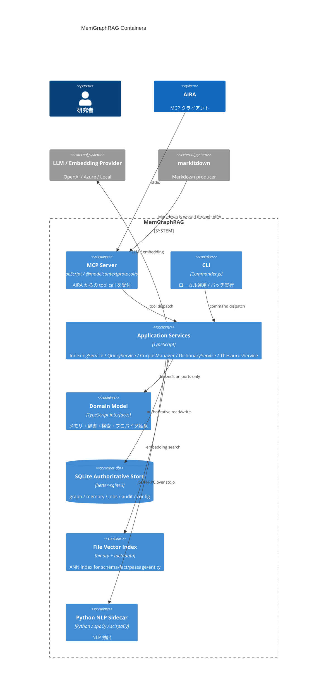
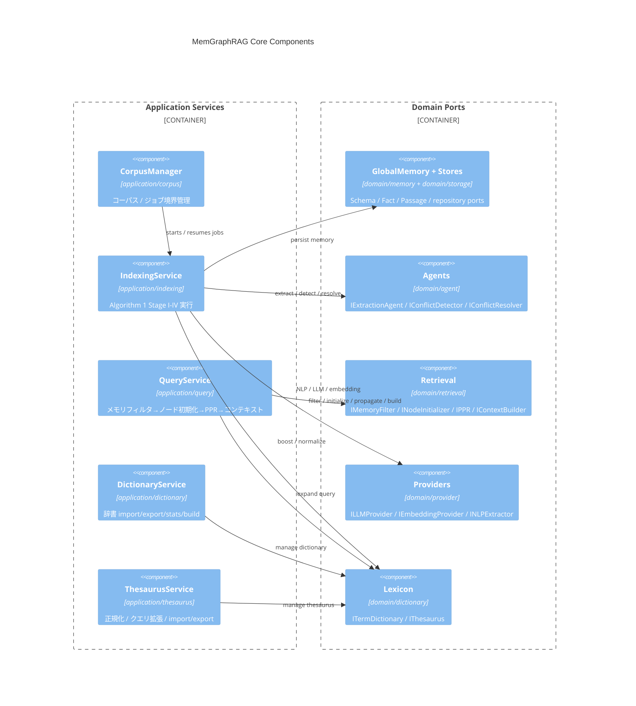
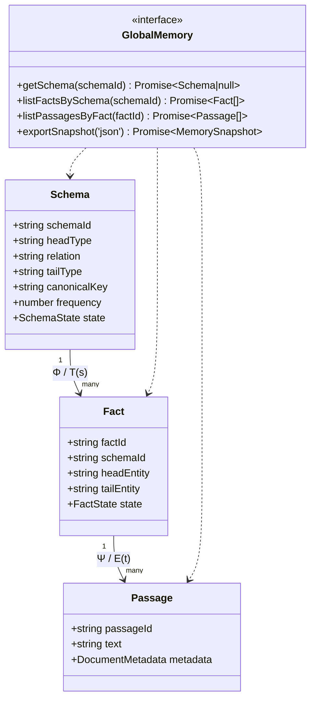
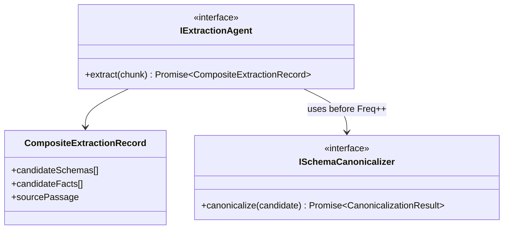
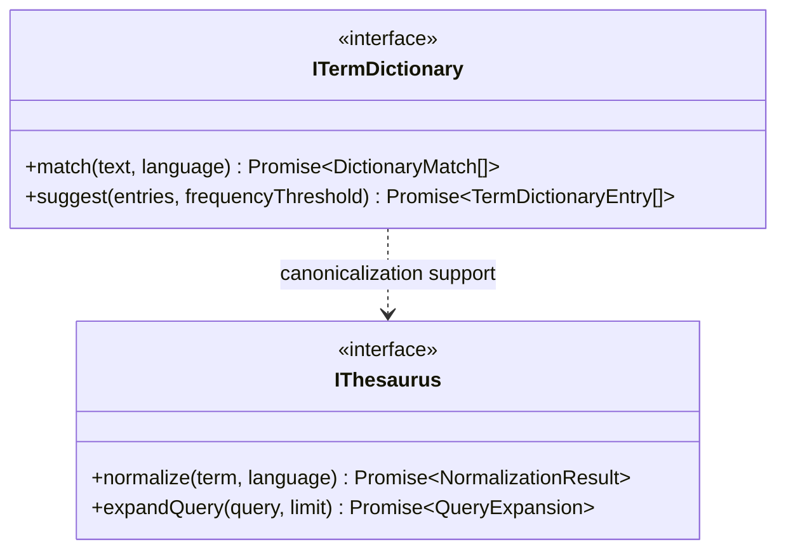
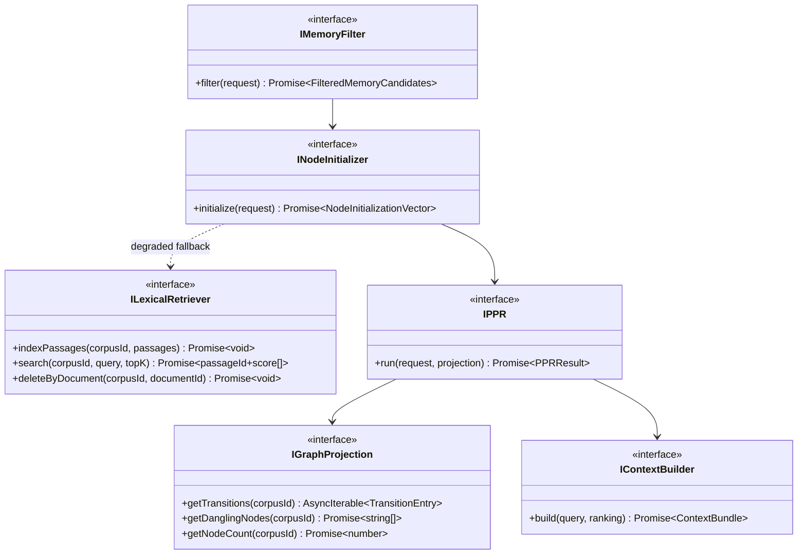
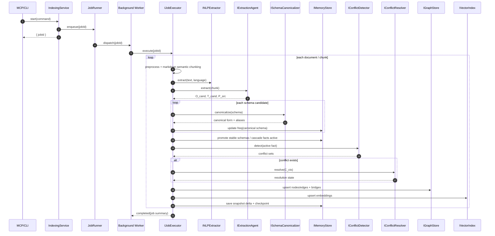
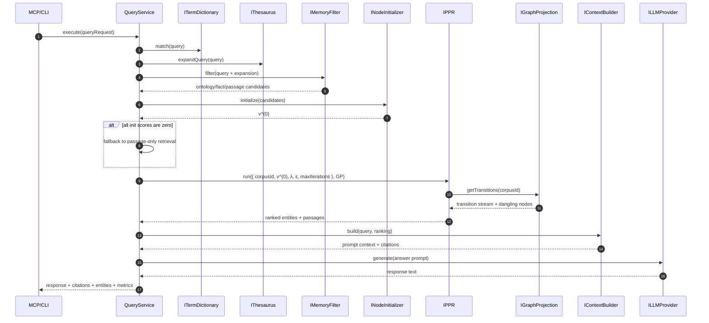

# MemGraphRAG 設計書

**Document ID**: DES-MEMGRAPHRAG-001
**Version**: 1.4
**Status**: Draft
**Created**: 2026-06-07
**Traceability**: REQ-MEMGRAPHRAG-001 v1.2

---

## 1. システムアーキテクチャ概要

MemGraphRAG は `packages/memgraphrag` 単一パッケージ内に 4 層（domain / application / infrastructure / interface）を持つライブラリファースト設計とする。AIRA からは MCP stdio サーバーとして利用され、同一コアを CLI からも再利用する。論文 Algorithm 1 Stage I-IV、式 6-8、9-16、PPR をアプリケーションサービスでオーケストレーションし、具象依存はすべて infrastructure に閉じ込める。

### 1.1 C4 Context Diagram (Mermaid)



### 1.2 C4 Container Diagram (Mermaid)



### 1.3 C4 Component Diagram (Mermaid)



## 2. パッケージ構成

### 2.1 物理構成

```text
packages/memgraphrag/
├── src/
│   ├── domain/
│   │   ├── memory/
│   │   ├── agent/
│   │   ├── dictionary/
│   │   ├── retrieval/
│   │   ├── storage/
│   │   └── provider/
│   ├── application/
│   │   ├── indexing/
│   │   ├── query/
│   │   ├── corpus/
│   │   ├── dictionary/
│   │   ├── thesaurus/
│   │   └── runtime/
│   ├── infrastructure/
│   │   ├── storage/
│   │   ├── llm/
│   │   ├── embedding/
│   │   ├── nlp/
│   │   ├── retrieval/
│   │   ├── api/
│   │   ├── security/
│   │   ├── config/
│   │   └── logging/
│   └── interface/
│       ├── mcp/
│       ├── cli/
│       └── runtime/
└── tests/
    ├── unit/
    ├── integration/
    ├── contract/
    └── benchmark/
```

### 2.2 層責務と SOLID 適用

| 層 | 主責務 | 依存先 | SOLID 適用 |
|----|--------|--------|------------|
| Domain | ルール・型・抽象ポート | なし | SRP: 1 抽象 1 責務 / ISP: 小さいインターフェース |
| Application | ユースケース orchestration | Domain | DIP: port 依存 / OCP: policy 差し替え |
| Infrastructure | SQLite, OpenAI, Python などの具象 | Domain | LSP: 各 adapter は port 契約準拠 |
| Interface | MCP / CLI / DI composition root | Application | SRP: transport ごとに分離 |

設計ルール:
- Domain は `better-sqlite3`, `openai`, `@modelcontextprotocol/sdk` を直接 import しない。
- Application は `IGraphStore` / `IVectorIndex` / `IMemoryStore` / provider ports のみを受け取る。
- Interface 層のみが実行時設定を解釈し、依存を組み立てる。
- 単一パッケージ構成を維持しつつ、requirements 上の `memgraphrag-mcp-server` 責務は `src/interface/mcp` に内包する。

### 2.3 品質・テスト設計方針

| 観点 | 設計方針 | 対応要件 |
|------|----------|----------|
| ユニットテスト | Domain / Application を pure port mock で検証 | REQ-MG-NF-007 |
| 統合テスト | MCP ツール入出力、SQLite WAL、Python sidecar fallback を検証 | REQ-MG-070-078, REQ-MG-NF-009 |
| ベンチマーク | indexing/query の throughput・latency を benchmark suite で計測 | REQ-MG-NF-001-004 |
| 契約テスト | MCP JSON schema と CLI option contract を固定化 | REQ-MG-NF-011, REQ-MG-060-067 |
| セキュリティテスト | corpus_id 分離、secret masking、安全な error envelope を検証 | REQ-MG-NF-012, 015, 016 |

### 2.4 メモリバジェット設計方針（REQ-MG-NF-002）

| コンポーネント | メモリ制約戦略 |
|---------------|--------------|
| PPR ベクトル | ノード数 × 8bytes（float64）。100K ノードで ~800KB。v^(k) と v^(k+1) の 2本のみ保持 |
| IGraphProjection | row-stochastic 遷移を `AsyncIterable` ストリーミングで返却。全行列をメモリに展開しない |
| FileVectorIndex | namespace ごとに memory-mapped I/O。検索時のみ候補ベクトルをロード。L_conf/L_bridge でスキャン上限 |
| Embedding cache | LRU キャッシュ（上限: config `embedding.cache_max_entries`、デフォルト 10,000 エントリ） |
| Chunking | ストリーミング chunker。1 ドキュメント分のチャンクのみメモリ保持 |
| SQLite | WAL + mmap。`PRAGMA mmap_size` をデータサイズに応じて設定（デフォルト 256MB） |
| ベンチマーク検証 | 100K ノード / 10K ドキュメントで RSS ≤ 4GB（通常）/ 2GB（query のみ）を CI で計測 |

### 2.5 DES 番号体系

| 番号帯 | 対応レイヤー |
|--------|------------|
| DES-MG-001〜019 | Domain Layer |
| DES-MG-020〜029 | Application Layer |
| DES-MG-030〜039 | Infrastructure Layer |
| DES-MG-040〜049 | Interface Layer |
| DES-MG-050〜059 | Config / Cross-cutting |

## 3. Domain Layer 設計

### 3.1 ドメインモデル (TypeScript interfaces)

#### 3.1.1 三層グローバルメモリ (Schema, Fact, Passage, GlobalMemory) → REQ-MG-001~006

##### DES-MG-001: 三層メモリコアモデル

**トレーサビリティ**: REQ-MG-001, REQ-MG-002, REQ-MG-003, REQ-MG-004, REQ-MG-005, REQ-MG-080, REQ-MG-081, REQ-MG-082, REQ-MG-NF-016  
**パッケージ**: `packages/memgraphrag/src/domain/memory`

**設計概要**:
Ontology / Fact / Passage を corpus_id で完全分離した不変モデルとして表現する。Schema-Instance アライメント Φ（式 9-10）と Fact-Evidence グラウンディング Ψ（式 11-12）は ID 参照で保持し、Schema の state は `pending | stable`、Fact の state は `active | inactive` で明示する。Schema canonicalization は `canonicalKey` と alias 集合で表し、頻度 `frequency` は canonical 化後にのみ加算する。

```ts
export type LanguageCode = 'en' | 'ja' | 'mixed' | 'unknown';
export type SchemaState = 'pending' | 'stable';
export type FactState = 'active' | 'inactive';
export type MemoryLayer = 'ontology' | 'fact' | 'passage';
export type BridgeKind = 'type_based' | 'similarity_based';
export type ProvenanceSource = 'llm' | 'nlp' | 'dictionary' | 'thesaurus' | 'manual' | 'import';

export interface Timestamped {
  readonly createdAt: string;
  readonly updatedAt: string;
}

export interface CorpusScoped {
  readonly corpusId: string;
}

export interface SchemaAlias {
  readonly label: string;
  readonly language: LanguageCode;
  readonly source: ProvenanceSource;
  readonly confidence: number;
  readonly isCanonical: boolean;
}

export interface DocumentMetadata {
  readonly documentId: string;
  readonly title: string;
  readonly sourceUrl: string;
  readonly doi?: string;
  readonly sourceDb?: string;
  readonly sourceType?: 'pdf' | 'html' | 'docx' | 'pptx' | 'md';
  readonly language: LanguageCode;
  readonly convertedAt?: string;
  readonly sectionPath: readonly string[];
  readonly chunkId: string;
  readonly chunkIndex: number;
  readonly offsetStart: number;
  readonly offsetEnd: number;
}

export interface Schema extends CorpusScoped, Timestamped {
  readonly schemaId: string;
  readonly headType: string;
  readonly relation: string;
  readonly tailType: string;
  readonly canonicalKey: string;
  readonly aliases: readonly SchemaAlias[];
  readonly frequency: number;
  readonly state: SchemaState;
  readonly stabilizationThreshold: number;
  readonly factIds: readonly string[];
  readonly sourceDocumentIds: readonly string[];
  readonly version: number;
}

export interface Fact extends CorpusScoped, Timestamped {
  readonly factId: string;
  readonly schemaId: string;
  readonly headEntity: string;
  readonly headType: string;
  readonly relation: string;
  readonly tailEntity: string;
  readonly tailType: string;
  readonly state: FactState;
  readonly passageIds: readonly string[];
  readonly sourceDocumentIds: readonly string[];
  readonly confidence: number;
  readonly temporalScope?: string;
  readonly granularityParentFactId?: string;
}

export interface Passage extends CorpusScoped, Timestamped {
  readonly passageId: string;
  readonly text: string;
  readonly normalizedText: string;
  readonly metadata: DocumentMetadata;
  readonly factIds: readonly string[];
  readonly entityMentions: readonly string[];
  readonly qualityFlags: readonly string[];
  readonly qualityScore?: number;
}

export interface MemorySnapshot extends CorpusScoped {
  readonly exportedAt: string;
  readonly schemas: readonly Schema[];
  readonly facts: readonly Fact[];
  readonly passages: readonly Passage[];
  readonly schemaVersion: number;
}

export interface MemoryStatistics extends CorpusScoped {
  readonly totalSchemas: number;
  readonly stableSchemas: number;
  readonly totalFacts: number;
  readonly activeFacts: number;
  readonly inactiveFacts: number;
  readonly totalPassages: number;
  readonly linkedFacts: number;
  readonly detectedConflicts: number;
  readonly resolvedConflicts: number;
  readonly connectedComponents: number;
}

export interface GlobalMemory extends CorpusScoped {
  getSchema(schemaId: string): Promise<Schema | null>;
  getFact(factId: string): Promise<Fact | null>;
  getPassage(passageId: string): Promise<Passage | null>;
  listFactsBySchema(schemaId: string): Promise<readonly Fact[]>;
  listPassagesByFact(factId: string): Promise<readonly Passage[]>;
  listFactsByPassage(passageId: string): Promise<readonly Fact[]>;
  exportSnapshot(format: 'json'): Promise<MemorySnapshot>;
  importSnapshot(snapshot: MemorySnapshot): Promise<void>;
  getStatistics(): Promise<MemoryStatistics>;
}
```



##### DES-MG-002: 密インデキシング、状態遷移、スナップショット

**トレーサビリティ**: REQ-MG-001, REQ-MG-004, REQ-MG-005, REQ-MG-006, REQ-MG-072d, REQ-MG-NF-009  
**パッケージ**: `packages/memgraphrag/src/domain/memory`

**設計概要**:
Schema 安定化は `State(o) = stable if Freq(o) ≥ τ else pending` を厳密に適用する。Stable 昇格時のみ関連 Fact を `active` 化し、ドキュメント削除時は Passage → Fact → Schema frequency の順でカスケード更新する。Snapshot は authoritative store の代替ではなく、JSON データ交換表現として `MemorySnapshot` に限定する。

#### 3.1.2 エージェント (IExtractionAgent, IConflictDetector, IConflictResolver) → REQ-MG-010~018, 010b

##### DES-MG-003: Composite Extraction と Schema Canonicalization

**トレーサビリティ**: REQ-MG-010, REQ-MG-010b, REQ-MG-017, REQ-MG-018, REQ-MG-050, REQ-MG-052, REQ-MG-053, REQ-MG-055  
**パッケージ**: `packages/memgraphrag/src/domain/agent`

**設計概要**:
Algorithm 1 Stage I を `A_ext(c_i) → {O_cand, T_cand, P_src}` として抽象化する。抽出時に Schema を正規化し、`canonicalKey = normalize(headType) + relation + normalize(tailType)` を計算してから frequency を加算する。正規化には辞書・シソーラス・埋め込み類似度を利用するが、確信度が閾値 `δ_schema` を下回る場合は別 Schema として保持する。

```ts
export interface ExtractionChunk {
  readonly corpusId: string;
  readonly documentId: string;
  readonly chunkId: string;
  readonly text: string;
  readonly normalizedText: string;
  readonly language: LanguageCode;
  readonly metadata: DocumentMetadata;
}

export interface SchemaCandidate {
  readonly headType: string;
  readonly relation: string;
  readonly tailType: string;
  readonly canonicalKey: string;
  readonly aliases: readonly SchemaAlias[];
  readonly confidence: number;
}

export interface FactCandidate {
  readonly headEntity: string;
  readonly headType: string;
  readonly relation: string;
  readonly tailEntity: string;
  readonly tailType: string;
  readonly supportingSpanIds: readonly string[];
  readonly confidence: number;
}

export interface CompositeExtractionRecord {
  readonly chunk: ExtractionChunk;
  readonly candidateSchemas: readonly SchemaCandidate[];
  readonly candidateFacts: readonly FactCandidate[];
  readonly sourcePassage: Passage;
  readonly rawEntities: readonly string[];
}

export interface CanonicalizationResult {
  readonly canonicalHeadType: string;
  readonly canonicalRelation: string;
  readonly canonicalTailType: string;
  readonly aliases: readonly SchemaAlias[];
  readonly confidence: number;
  readonly mergedIntoSchemaId?: string;
}

export interface IExtractionAgent {
  extract(chunk: ExtractionChunk): Promise<CompositeExtractionRecord>;
}

export interface ISchemaCanonicalizer {
  canonicalize(candidate: SchemaCandidate): Promise<CanonicalizationResult>;
}
```



##### DES-MG-004: Conflict Detection Agent

**トレーサビリティ**: REQ-MG-011, REQ-MG-013, REQ-MG-014, REQ-MG-015, REQ-MG-018, REQ-MG-NF-004  
**パッケージ**: `packages/memgraphrag/src/domain/agent`

**設計概要**:
Algorithm 1 Stage III の前半を担当する。対象は `active` Fact のみで、候補集合は `T_conf = {t' ∈ M_fac_active | t' ≠ t_new ∧ same_corpus ∧ (Sim > δ ∨ Match)}` を満たす上位 `L_conf` 件に限定する。Conflict type は `mutually_exclusive | temporal | granularity` の 3 つで分類し、構造的統合用の bridge 候補も同時に返せるようにする。

```ts
export type ConflictType = 'mutually_exclusive' | 'temporal' | 'granularity';

export interface ConflictCandidate {
  readonly factId: string;
  readonly similarity: number;
  readonly symbolicMatch: boolean;
  readonly thesaurusDistance?: number;
}

export interface ConflictSet {
  readonly corpusId: string;
  readonly newFact: Fact;
  readonly conflictingFacts: readonly Fact[];
  readonly candidates: readonly ConflictCandidate[];
  readonly conflictType: ConflictType;
  readonly scanLimit: number;
}

export interface ConflictDetectionRequest {
  readonly corpusId: string;
  readonly newFact: Fact;
  readonly activeFactLimit: number;
  readonly similarityThreshold: number;
}

export interface IConflictDetector {
  detect(request: ConflictDetectionRequest): Promise<readonly ConflictSet[]>;
}
```

##### DES-MG-005: Conflict Resolution Agent

**トレーサビリティ**: REQ-MG-012, REQ-MG-014, REQ-MG-015, REQ-MG-077, REQ-MG-NF-014  
**パッケージ**: `packages/memgraphrag/src/domain/agent`

**設計概要**:
`C_ctx = Ψ(t_new) ∪ ⋃ Ψ(t')` で evidence context を構築し、解決状態を必ず 6 値 union で返す。`temporalized` と `granularity_linked` は両立保持を表し、`unresolved` は手動レビューの対象として監査テーブルへ送る。解決後に Stage IV の bridge 生成に必要な metadata を残す。

```ts
export type ConflictResolutionState =
  | 'resolved_keep_new'
  | 'resolved_keep_existing'
  | 'merged'
  | 'temporalized'
  | 'granularity_linked'
  | 'unresolved';

export interface ResolutionEvidence {
  readonly passageId: string;
  readonly supportsFactIds: readonly string[];
  readonly rationale: string;
}

export interface ConflictResolution {
  readonly state: ConflictResolutionState;
  readonly confidence: number;
  readonly keptFactIds: readonly string[];
  readonly inactivatedFactIds: readonly string[];
  readonly derivedFacts: readonly Fact[];
  readonly evidence: readonly ResolutionEvidence[];
}

export interface ConflictResolutionRequest {
  readonly conflictSet: ConflictSet;
  readonly evidencePassages: readonly Passage[];
}

export interface IConflictResolver {
  resolve(request: ConflictResolutionRequest): Promise<ConflictResolution>;
}
```

#### 3.1.3 辞書・シソーラス (ITermDictionary, IThesaurus) → REQ-MG-020~036

##### DES-MG-006: 専門用語辞書モデル

**トレーサビリティ**: REQ-MG-020, REQ-MG-021, REQ-MG-022, REQ-MG-023, REQ-MG-024, REQ-MG-025, REQ-MG-026  
**パッケージ**: `packages/memgraphrag/src/domain/dictionary`

```ts
export type DictionarySource = 'api' | 'manual' | 'extracted' | 'approved_candidate';

export interface TermDictionaryEntry extends Timestamped {
  readonly termId: string;
  readonly term: string;
  readonly canonicalForm: string;
  readonly domainCategory: string;
  readonly aliases: readonly string[];
  readonly frequency: number;
  readonly confidence: number;
  readonly source: DictionarySource;
  readonly version: string;
}

export interface DictionaryMatch {
  readonly entry: TermDictionaryEntry;
  readonly matchedText: string;
  readonly boostFactor: number;
}

export interface DictionaryStatistics {
  readonly totalTerms: number;
  readonly domains: Readonly<Record<string, number>>;
  readonly boostAppliedRate: number;
  readonly discoveredTermCount: number;
}

export interface ITermDictionary {
  upsertEntries(entries: readonly TermDictionaryEntry[]): Promise<void>;
  match(text: string, language: LanguageCode): Promise<readonly DictionaryMatch[]>;
  suggest(entries: readonly string[], frequencyThreshold: number): Promise<readonly TermDictionaryEntry[]>;
  exportJson(): Promise<Readonly<Record<string, unknown>>>;
  importJson(data: Readonly<Record<string, unknown>>): Promise<void>;
  getStatistics(): Promise<DictionaryStatistics>;
}
```

##### DES-MG-007: シソーラスモデル

**トレーサビリティ**: REQ-MG-030, REQ-MG-031, REQ-MG-032, REQ-MG-033, REQ-MG-034, REQ-MG-035, REQ-MG-036  
**パッケージ**: `packages/memgraphrag/src/domain/dictionary`

```ts
export type ThesaurusRelationType = 'synonym' | 'hypernym' | 'hyponym' | 'related';

export interface ThesaurusRelation extends Timestamped {
  readonly relationId: string;
  readonly sourceTerm: string;
  readonly targetTerm: string;
  readonly relationType: ThesaurusRelationType;
  readonly language: LanguageCode;
  readonly weight: number;
  readonly bidirectional: boolean;
}

export interface NormalizationResult {
  readonly canonicalTerm: string;
  readonly originalTerm: string;
  readonly appliedRelations: readonly ThesaurusRelation[];
}

export interface QueryExpansion {
  readonly originalQuery: string;
  readonly expandedTerms: readonly string[];
  readonly rewrittenQuery: string;
}

export interface IThesaurus {
  normalize(term: string, language: LanguageCode): Promise<NormalizationResult>;
  expandQuery(query: string, limit: number): Promise<QueryExpansion>;
  getRelations(term: string): Promise<readonly ThesaurusRelation[]>;
  suggestSynonyms(pairs: readonly [string, string][]): Promise<readonly ThesaurusRelation[]>;
  exportJson(): Promise<Readonly<Record<string, unknown>>>;
  importJson(data: Readonly<Record<string, unknown>>): Promise<void>;
}
```



#### 3.1.4 検索 (IMemoryFilter, INodeInitializer, IPPR, IContextBuilder) → REQ-MG-040~046

##### DES-MG-008: メモリフィルタリングとノード初期化

**トレーサビリティ**: REQ-MG-040, REQ-MG-041, REQ-MG-044, REQ-MG-045, REQ-MG-046  
**パッケージ**: `packages/memgraphrag/src/domain/retrieval`

```ts
export interface QueryRequest {
  readonly corpusId: string;
  readonly text: string;
  readonly topK: number;
  readonly topM: number;
  readonly threshold: number;
  readonly contextTokenLimit: number;
}

export interface MemoryCandidate<TItem> {
  readonly layer: MemoryLayer;
  readonly item: TItem;
  readonly similarity: number;
}

export interface FilteredMemoryCandidates {
  readonly ontology: readonly MemoryCandidate<Schema>[];
  readonly facts: readonly MemoryCandidate<Fact>[];
  readonly passages: readonly MemoryCandidate<Passage>[];
  readonly expandedTerms: readonly string[];
  readonly fallbackRequired: boolean;
}

export interface NodeInitializationVector {
  readonly scores: Readonly<Record<string, number>>;
  readonly fallbackTriggered: boolean;
}

export interface NodeInitializationRequest {
  readonly query: QueryRequest;
  readonly candidates: FilteredMemoryCandidates;
}

export interface IMemoryFilter {
  filter(request: QueryRequest): Promise<FilteredMemoryCandidates>;
}

export interface INodeInitializer {
  initialize(request: NodeInitializationRequest): Promise<NodeInitializationVector>;
}
```

**数式設計**:
- Entity 初期化: `P_init(e) = mean_{f ∈ Facts(e)} Sim(q, f)`
- Type 初期化: `P_init(t) = SchemaRelevance(t) × 1 / log(deg(t)+2)`
- Passage 初期化: `P_init(p) = Sim(q, p) × α × σ(IDF_density(p))`
- 各ノード型ごとに L1 正規化し、結合後の `v^(0)` を生成する。

##### DES-MG-009: PPR とコンテキスト構築

**トレーサビリティ**: REQ-MG-042, REQ-MG-043, REQ-MG-044, REQ-MG-046, REQ-MG-NF-003  
**パッケージ**: `packages/memgraphrag/src/domain/retrieval`

```ts
export interface RankedNode {
  readonly nodeId: string;
  readonly score: number;
  readonly layer: MemoryLayer;
}

export interface TransitionEntry {
  readonly sourceNodeId: string;
  readonly targetNodeId: string;
  readonly weight: number;
}

export interface IGraphProjection {
  getTransitions(corpusId: string): AsyncIterable<TransitionEntry>;
  getDanglingNodes(corpusId: string): Promise<readonly string[]>;
  getNodeCount(corpusId: string): Promise<number>;
}

export interface PPRRequest {
  readonly corpusId: string;
  readonly initialVector: NodeInitializationVector;
  readonly teleportProbability: number;
  readonly convergenceEpsilon: number;
  readonly maxIterations: number;
  readonly topK: number;
  readonly topM: number;
}

export interface PPRResult {
  readonly rankedPassages: readonly RankedNode[];
  readonly rankedEntities: readonly RankedNode[];
  readonly iterations: number;
  readonly converged: boolean;
  readonly l1Delta: number;
}

export interface ContextBundle {
  readonly promptContext: string;
  readonly citedPassages: readonly Passage[];
  readonly citedFacts: readonly Fact[];
  readonly confidence: number;
}

export interface ILexicalRetriever {
  indexPassages(corpusId: string, passages: readonly Passage[]): Promise<void>;
  search(corpusId: string, query: string, topK: number): Promise<readonly { passageId: string; score: number }[]>;
  deleteByDocument(corpusId: string, documentId: string): Promise<void>;
}

export interface IPPR {
  run(request: PPRRequest, projection: IGraphProjection): Promise<PPRResult>;
}

export interface IContextBuilder {
  build(query: QueryRequest, ranking: PPRResult): Promise<ContextBundle>;
}
```

**ローカルオンリー / 劣化動作契約**:

| Capability | Normal Mode | Degraded Mode (`local_only`) |
|-----------|-------------|------------------------------|
| Node initialization | Embedding similarity | BM25/TF-IDF via `ILexicalRetriever` |
| Schema canonicalization | Embedding + dictionary | Dictionary + exact match only |
| Conflict detection | Embedding sim + symbolic | Symbolic `Match()` only |
| NLP extraction | Python sidecar | `RegexExtractor` |
| Response generation | LLM | Template-based summary |
| Query expansion | Thesaurus + embedding | Thesaurus only |



#### 3.1.5 ストレージ抽象 (IGraphStore, IVectorIndex, IMemoryStore) → REQ-MG-NF-008~009

##### DES-MG-010: 永続化ポート

**トレーサビリティ**: REQ-MG-NF-008, REQ-MG-NF-009, REQ-MG-NF-010, REQ-MG-005, REQ-MG-078  
**パッケージ**: `packages/memgraphrag/src/domain/storage`

```ts
export interface GraphNode<TRef extends Schema | Fact | Passage = Schema | Fact | Passage> {
  readonly nodeId: string;
  readonly corpusId: string;
  readonly layer: MemoryLayer;
  readonly ref: TRef;
  readonly label: string;
}

export interface GraphEdge {
  readonly edgeId: string;
  readonly corpusId: string;
  readonly sourceNodeId: string;
  readonly targetNodeId: string;
  readonly relation: 'schema_instance' | 'fact_evidence' | 'type_based_bridge' | 'similarity_bridge' | 'is_a' | 'part_of';
  readonly weight: number;
  readonly bridgeKind?: BridgeKind;
}

export interface VectorRecord<TMetadata extends Readonly<Record<string, unknown>>> {
  readonly id: string;
  readonly corpusId: string;
  readonly namespace: 'schema' | 'fact' | 'passage' | 'entity';
  readonly values: readonly number[];
  readonly metadata: TMetadata;
}

export interface VectorSearchRequest {
  readonly corpusId: string;
  readonly namespace: 'schema' | 'fact' | 'passage' | 'entity';
  readonly queryVector: readonly number[];
  readonly topK: number;
  readonly threshold?: number;
}

export interface VectorSearchMatch<TMetadata extends Readonly<Record<string, unknown>>> {
  readonly id: string;
  readonly score: number;
  readonly metadata: TMetadata;
}

export interface JobCheckpoint {
  readonly jobId: string;
  readonly corpusId: string;
  readonly processedDocumentIds: readonly string[];
  readonly updatedAt: string;
}

export interface IGraphStore {
  upsertNodes(nodes: readonly GraphNode[]): Promise<void>;
  upsertEdges(edges: readonly GraphEdge[]): Promise<void>;
  getNode(corpusId: string, nodeId: string): Promise<GraphNode | null>;
  getNodes(corpusId: string, layer?: MemoryLayer): Promise<readonly GraphNode[]>;
  getAdjacent(corpusId: string, nodeId: string): Promise<readonly GraphEdge[]>;
  getEdges(corpusId: string, sourceNodeId?: string): Promise<readonly GraphEdge[]>;
  deleteNodes(corpusId: string, nodeIds: readonly string[]): Promise<number>;
  deleteEdges(corpusId: string, edgeIds: readonly string[]): Promise<number>;
  deleteByDocument(corpusId: string, documentId: string): Promise<{ deletedNodes: number; deletedEdges: number }>;
  deleteByCorpus(corpusId: string): Promise<{ deletedNodes: number; deletedEdges: number }>;
}

export interface IVectorIndex {
  upsert<TMetadata extends Readonly<Record<string, unknown>>>(records: readonly VectorRecord<TMetadata>[]): Promise<void>;
  search<TMetadata extends Readonly<Record<string, unknown>>>(request: VectorSearchRequest): Promise<readonly VectorSearchMatch<TMetadata>[]>;
  deleteByDocument(corpusId: string, documentId: string): Promise<void>;
}

export interface IMemoryStore {
  load(corpusId: string): Promise<MemorySnapshot>;
  save(snapshot: MemorySnapshot): Promise<void>;
  saveCheckpoint(checkpoint: JobCheckpoint): Promise<void>;
  loadCheckpoint(jobId: string): Promise<JobCheckpoint | null>;
  validateIntegrity(corpusId: string): Promise<readonly string[]>;
}
```

#### 3.1.6 外部プロバイダー (ILLMProvider, IEmbeddingProvider, INLPExtractor) → REQ-MG-018, 051, 054

##### DES-MG-011: Provider Ports

**トレーサビリティ**: REQ-MG-018, REQ-MG-051, REQ-MG-054, REQ-MG-NF-005, REQ-MG-NF-012, REQ-MG-NF-013  
**パッケージ**: `packages/memgraphrag/src/domain/provider`

```ts
export interface TextGenerationRequest {
  readonly prompt: string;
  readonly systemPrompt?: string;
  readonly temperature?: number;
  readonly maxTokens?: number;
  readonly responseFormat?: 'text' | 'json';
}

export interface TextGenerationResponse {
  readonly text: string;
  readonly model: string;
  readonly usage: {
    readonly inputTokens: number;
    readonly outputTokens: number;
  };
}

export interface EmbeddingRequest {
  readonly texts: readonly string[];
  readonly model?: string;
}

export interface EmbeddingResponse {
  readonly model: string;
  readonly vectors: readonly (readonly number[])[];
  readonly cached: boolean;
}

export interface NlpEntity {
  readonly text: string;
  readonly label: string;
  readonly start: number;
  readonly end: number;
  readonly confidence?: number;
}

export interface NlpExtractionRequest {
  readonly text: string;
  readonly language: LanguageCode;
}

export interface NlpExtractionResponse {
  readonly language: LanguageCode;
  readonly entities: readonly NlpEntity[];
  readonly nounPhrases: readonly string[];
}

export interface ProviderHealth {
  readonly healthy: boolean;
  readonly message?: string;
}

export interface ILLMProvider {
  generate(request: TextGenerationRequest): Promise<TextGenerationResponse>;
  healthCheck(): Promise<ProviderHealth>;
}

export interface IEmbeddingProvider {
  embed(request: EmbeddingRequest): Promise<EmbeddingResponse>;
  healthCheck(): Promise<ProviderHealth>;
}

export interface INLPExtractor {
  extract(request: NlpExtractionRequest): Promise<NlpExtractionResponse>;
  healthCheck(): Promise<ProviderHealth>;
}
```

## 4. Application Layer 設計

### 4.1 IndexingService → REQ-MG-010~017, 072

##### DES-MG-020: IndexingService

**トレーサビリティ**: REQ-MG-010, REQ-MG-010b, REQ-MG-011, REQ-MG-012, REQ-MG-013, REQ-MG-014, REQ-MG-015, REQ-MG-016, REQ-MG-017, REQ-MG-072, REQ-MG-080, REQ-MG-081, REQ-MG-082, REQ-MG-083, REQ-MG-084, REQ-MG-NF-001, REQ-MG-NF-004, REQ-MG-NF-006, REQ-MG-NF-017

**責務**:
- Markdown 前処理・品質検査・見出しベース chunking
- Algorithm 1 Stage I-IV orchestration
- Schema canonicalization → frequency update → stable promotion → cascade fact activation
- conflict detection / resolution / bridge generation / graph projection
- document 単位 checkpoint 記録

**依存**:
`INLPExtractor`, `IExtractionAgent`, `ISchemaCanonicalizer`, `IConflictDetector`, `IConflictResolver`, `ITermDictionary`, `IThesaurus`, `IEmbeddingProvider`, `IGraphStore`, `IVectorIndex`, `IMemoryStore`

**公開契約**:
```ts
export interface IndexDocumentInput {
  readonly documentId: string;
  readonly markdown: string;
  readonly title: string;
  readonly sourceUrl: string;
  readonly doi?: string;
  readonly sourceDb?: string;
  readonly sourceType?: 'pdf' | 'html' | 'docx' | 'pptx' | 'md';
  readonly language?: LanguageCode;
}

export interface IndexDocumentsCommand {
  readonly corpusId: string;
  readonly documents: readonly IndexDocumentInput[];
}

export interface IndexingResult {
  readonly addedNodes: number;
  readonly addedEdges: number;
  readonly conflictCount: number;
  readonly skippedCount: number;
}

export interface DeleteDocumentResult {
  readonly documentId: string;
  readonly deletedPassages: number;
  readonly inactivatedFacts: number;
  readonly demotedSchemas: number;
  readonly deletedVectorRecords: number;
}

export interface IJobExecutor {
  execute(jobId: string): Promise<IndexingResult>;
}

export interface JobRunner {
  enqueue(jobId: string): Promise<void>;
  cancel(jobId: string): Promise<void>;
}

export interface IndexingService {
  start(command: IndexDocumentsCommand): Promise<{ readonly jobId: string }>;
  resume(jobId: string): Promise<void>;
  cancel(jobId: string): Promise<void>;
  deleteDocument(corpusId: string, documentId: string): Promise<DeleteDocumentResult>;
}
```

**非同期ワーカーモデル**:
`IndexingService.start()` はジョブレコードを永続化して `JobRunner.enqueue(jobId)` を呼び、MCP には `{ jobId }` を即時返却する。重い処理は `IJobExecutor` を実装するバックグラウンドワーカーが `jobId` を受けて実行し、進捗・チェックポイント・完了サマリーを jobs/checkpoints テーブルへ反映する。

**Algorithm 1 対応**:
1. Stage I: `extract()` で `{O_cand, T_cand, P_src}` を生成。  
2. Stage II: canonicalize → `Freq(s)` 更新 → `stable` 判定 → Fact 活性化。  
3. Stage III: `IConflictDetector.detect()` → `IConflictResolver.resolve()`.  
4. Stage IV: `IGraphStore.upsertNodes/Edges()` と bridge 生成。  
5. Checkpoint: `IMemoryStore.saveCheckpoint()` を document 単位で実施。

**Document indexing flow (enqueue + background worker)**



### 4.2 QueryService → REQ-MG-040~046, 073

##### DES-MG-021: QueryService

**トレーサビリティ**: REQ-MG-040, REQ-MG-041, REQ-MG-042, REQ-MG-043, REQ-MG-044, REQ-MG-045, REQ-MG-046, REQ-MG-073, REQ-MG-NF-003, REQ-MG-NF-017, REQ-MG-NF-018

**責務**:
- query normalization, dictionary boost, thesaurus expansion
- 三層 Top-K filtering と `τ_r` 適用
- 式 6-8 による `v^(0)` 構築
- `v^(k+1) = (1-λ)·W·v^(k) + λ·v^(0)` による PPR 実行
- context assembly, citation attachment, response generation, metrics 返却

**公開契約**:
```ts
export interface CitationDto {
  readonly passageId: string;
  readonly documentId: string;
  readonly title: string;
  readonly sourceUrl: string;
  readonly doi?: string;
  readonly sourceDb?: string;
  readonly section?: string;
  readonly snippet?: string;
  readonly score: number;
}

export interface EntityHit {
  readonly entity: string;
  readonly type?: string;
  readonly score: number;
}

export interface QueryMetrics {
  readonly durationMs: number;
  readonly retrievalCandidates: number;
  readonly filteredCandidates: number;
  readonly pprIterations: number;
  readonly fallbackUsed: boolean;
  readonly topK: number;
  readonly topM: number;
  readonly threshold: number;
}

export interface QueryResponse {
  readonly response: string;
  readonly citations: readonly CitationDto[];
  readonly entities: readonly EntityHit[];
  readonly metrics: QueryMetrics;
}

export interface QueryService {
  execute(request: QueryRequest): Promise<QueryResponse>;
}
```

**Query flow (memory filter → node init → PPR → context)**



### 4.3 CorpusManager → REQ-MG-071~071c

##### DES-MG-022: CorpusManager

**トレーサビリティ**: REQ-MG-071, REQ-MG-071b, REQ-MG-071c, REQ-MG-072b, REQ-MG-072c, REQ-MG-072d, REQ-MG-NF-006, REQ-MG-NF-016

**設計概要**:
CorpusManager は `corpus_id` を境界とする唯一の aggregate root 管理者である。SQLite 内で corpora / documents / jobs / checkpoints / audit_logs を管理し、すべての application call に `corpus_id` を注入する。delete_corpus は hard delete、cancel_job は processed 分保持、delete_document は参照整合を壊さない差分更新を行う。

```ts
export interface CorpusInfo {
  readonly corpusId: string;
  readonly name: string;
  readonly description?: string;
  readonly documentCount: number;
  readonly nodeCount: number;
  readonly createdAt: string;
}

export interface CorpusStats {
  readonly memory: MemoryStatistics;
  readonly graph: {
    readonly nodeCount: number;
    readonly edgeCount: number;
    readonly connectedComponents: number;
  };
  readonly dictionaries: DictionaryStatistics;
  readonly documents: readonly {
    readonly documentId: string;
    readonly title: string;
    readonly indexedAt: string;
  }[];
}

export interface JobError {
  readonly code: string;
  readonly message: string;
  readonly documentId?: string;
}

export interface IndexingSummary {
  readonly addedNodes: number;
  readonly addedEdges: number;
  readonly conflictCount: number;
  readonly skippedCount: number;
}

export interface JobSummary {
  readonly jobId: string;
  readonly status: 'pending' | 'running' | 'completed' | 'failed' | 'cancelled';
  readonly processedCount: number;
  readonly totalCount: number;
  readonly errorCount: number;
  readonly errors?: readonly JobError[];
  readonly summary?: IndexingSummary;
}

export interface ConflictSummary {
  readonly conflictId: string;
  readonly type: ConflictType;
  readonly resolutionState: ConflictResolutionState;
  readonly confidence: number;
}

export interface ConflictAnalysis {
  readonly conflicts: readonly ConflictSummary[];
  readonly distribution: Readonly<Record<string, number>>;
}

export interface GraphExportPage {
  readonly format: 'graphml' | 'json';
  readonly data: string;
  readonly offset: number;
  readonly limit: number;
  readonly hasMore: boolean;
  readonly nextOffset?: number;
  readonly totalNodes: number;
}

export interface DeleteCorpusResult {
  readonly corpusId: string;
  readonly cancelledJobs: number;
  readonly deletedDocuments: number;
  readonly deletedNodes: number;
  readonly deletedEdges: number;
  readonly deletedVectorRecords: number;
}

export interface CorpusManager {
  create(name: string, description?: string, config?: Readonly<Record<string, unknown>>): Promise<CorpusInfo>;
  delete(corpusId: string): Promise<DeleteCorpusResult>;
  list(): Promise<readonly CorpusInfo[]>;
  getStats(corpusId: string): Promise<CorpusStats>;
  getJobStatus(jobId: string): Promise<JobSummary>;
  cancelJob(jobId: string): Promise<{ readonly jobId: string; readonly status: 'cancelled' }>;
  analyzeConflicts(corpusId: string): Promise<ConflictAnalysis>;
  exportGraph(corpusId: string, format: 'graphml' | 'json', offset: number, limit: number): Promise<GraphExportPage>;
}
```

**Cascade Order**:
1. Cancel active jobs for corpus  
2. Delete vector index records  
3. Delete graph edges → nodes  
4. Delete passages  
5. Inactivate facts / recompute schema frequencies  
6. Delete corpora record  
7. Validate integrity

### 4.4 DictionaryService → REQ-MG-020~026, 075

##### DES-MG-023: DictionaryService

**トレーサビリティ**: REQ-MG-020, REQ-MG-021, REQ-MG-022, REQ-MG-023, REQ-MG-024, REQ-MG-025, REQ-MG-026, REQ-MG-075

**設計概要**:
DictionaryService は add/search/stats/import/export に加えて API build と candidate approval を提供する。検索時は exact/alias/canonical の 3 経路、stats では boost 適用率と discovered term count を返し、build_dictionary_from_api は Semantic Scholar adapter を介して指数バックオフ・24h cache を適用する。

```ts
export type DictionaryAction = 'add' | 'search' | 'stats' | 'import' | 'export';

export interface DictionaryCommand {
  readonly corpusId: string;
  readonly action: DictionaryAction;
  readonly entry?: TermDictionaryEntry;
  readonly query?: string;
  readonly data?: readonly TermDictionaryEntry[];
}

export interface DictionaryResult {
  readonly action: DictionaryAction;
  readonly entries?: readonly TermDictionaryEntry[];
  readonly statistics?: DictionaryStatistics;
  readonly exportData?: Readonly<Record<string, unknown>>;
}

export interface DictionaryService {
  handle(command: DictionaryCommand): Promise<DictionaryResult>;
  buildFromApi(corpusId: string, domains: readonly string[], maxPapers: number): Promise<{ termCount: number; domainDistribution: Readonly<Record<string, number>> }>;
}
```

### 4.5 ThesaurusService → REQ-MG-030~036, 076

##### DES-MG-024: ThesaurusService

**トレーサビリティ**: REQ-MG-030, REQ-MG-031, REQ-MG-032, REQ-MG-033, REQ-MG-034, REQ-MG-035, REQ-MG-036, REQ-MG-076

**設計概要**:
ThesaurusService は normalization / lookup / import / export / stats を統括する。Cycle validation を import 時に実施し、query expansion では synonym を優先し関連語は上限件数で制限する。Conflict detection では thesaurus distance を similarity score の補助特徴量として返す。

```ts
export type ThesaurusAction = 'add' | 'lookup' | 'stats' | 'import' | 'export';

export interface ThesaurusCommand {
  readonly corpusId: string;
  readonly action: ThesaurusAction;
  readonly relation?: ThesaurusRelation;
  readonly term?: string;
  readonly data?: readonly ThesaurusRelation[];
}

export interface ThesaurusResult {
  readonly action: ThesaurusAction;
  readonly relations?: readonly ThesaurusRelation[];
  readonly normalization?: NormalizationResult;
  readonly statistics?: Readonly<Record<string, unknown>>;
  readonly exportData?: Readonly<Record<string, unknown>>;
}

export interface ThesaurusService {
  handle(command: ThesaurusCommand): Promise<ThesaurusResult>;
}
```

## 5. Infrastructure Layer 設計

### 5.1 SQLiteGraphStore → IGraphStore

##### DES-MG-030: SQLiteGraphStore

**トレーサビリティ**: REQ-MG-014, REQ-MG-015, REQ-MG-NF-001, REQ-MG-NF-003, REQ-MG-NF-008, REQ-MG-NF-009, REQ-MG-NF-010, ADR-001

**設計概要**:
SQLite を authoritative store とし、WAL + foreign key + transaction により graph 書き込みを atomic にする。PPR は SQL ではなく row-stochastic adjacency を memory-mapped iterator として提供し、計算自体は application/domain contract に従って実装する。

**主要テーブル**:
- `corpora(corpus_id, name, description, created_at)`
- `schemas(schema_id, corpus_id, head_type, relation, tail_type, canonical_key, frequency, state, version)`
- `schema_aliases(schema_id, label, language, source, confidence, is_canonical)`
- `term_dictionary(term_id, corpus_id, term, canonical_form, domain_category, aliases_json, frequency, confidence, source, version, created_at, updated_at)`
- `thesaurus_relations(relation_id, corpus_id, source_term, target_term, relation_type, language, weight, bidirectional, created_at, updated_at)`
- `dictionary_candidates(candidate_id, corpus_id, term, frequency, confidence, source, status, created_at)`
- `facts(fact_id, corpus_id, schema_id, head_entity, relation, tail_entity, state, confidence, temporal_scope)`
- `passages(passage_id, corpus_id, document_id, text, normalized_text, metadata_json, quality_score)`
- `fact_passages(fact_id, passage_id)`
- `graph_nodes(node_id, corpus_id, layer, ref_id, label)`
- `graph_edges(edge_id, corpus_id, source_node_id, target_node_id, relation, weight, bridge_kind)`
- `documents(document_id, corpus_id, title, source_url, doi, source_db, source_type, indexed_at)`
- `jobs(job_id, corpus_id, status, processed_count, total_count, error_count, summary_json)`
- `checkpoints(job_id, corpus_id, payload_json, updated_at)`
- `audit_logs(event_id, corpus_id, action, target_id, payload_json, created_at)`

### 5.2 FileVectorIndex → IVectorIndex

##### DES-MG-031: FileVectorIndex

**トレーサビリティ**: REQ-MG-011, REQ-MG-014, REQ-MG-040, REQ-MG-042, REQ-MG-NF-004, REQ-MG-NF-008

**設計概要**:
Namespace ごとに `*.f32`（連続ベクトル）+ `*.jsonl`（metadata）+ `manifest.json` を持つ file-based ANN index を採用する。upsert は append + tombstone compaction、search は corpus_id / namespace で partition された ANN index を利用する。`L_conf` と `L_bridge` 上限により O(N²) を回避する。

### 5.3 SQLiteMemoryStore → IMemoryStore

##### DES-MG-032: SQLiteMemoryStore

**トレーサビリティ**: REQ-MG-004, REQ-MG-005, REQ-MG-006, REQ-MG-072, REQ-MG-072b, REQ-MG-NF-006, REQ-MG-NF-008, REQ-MG-NF-009

**設計概要**:
`MemorySnapshot` の保存先ではなく、authoritative SQLite state から snapshot を組み立てる adapter とする。Checkpoint は document 単位で `processedDocumentIds` を保存し、resume 時に未処理 document のみを再実行する。起動時 `validateIntegrity()` で orphaned edge / broken Φ / broken Ψ を検出する。

### 5.4 OpenAILLMProvider → ILLMProvider

##### DES-MG-033: OpenAILLMProvider

**トレーサビリティ**: REQ-MG-018, REQ-MG-043, REQ-MG-NF-012, REQ-MG-NF-015, REQ-MG-NF-017

**設計概要**:
OpenAI SDK を wrap し、temperature / maxTokens / model を request 単位で受ける。retryWithBackoff、rate-limit classification、secret masking を統一し、開発モード以外では stack trace を MCP error details に渡さない。

### 5.5 OpenAIEmbeddingProvider → IEmbeddingProvider

##### DES-MG-034: OpenAIEmbeddingProvider

**トレーサビリティ**: REQ-MG-010b, REQ-MG-011, REQ-MG-040, REQ-MG-054, REQ-MG-NF-012, REQ-MG-NF-013, REQ-MG-NF-017

**設計概要**:
バッチ embedding と local cache を提供し、schema canonicalization / conflict detection / retrieval / bridging の共通基盤とする。`local_only: true` のとき OpenAI 実装は組み立てず、未設定なら `LOCAL_EMBEDDING_REQUIRED` を返す。

### 5.6 PythonSidecarExtractor → INLPExtractor

##### DES-MG-035: PythonSidecarExtractor

**トレーサビリティ**: REQ-MG-050, REQ-MG-051, REQ-MG-052, REQ-MG-083, ADR-002

**設計概要**:
Python 子プロセスを stdio JSON-RPC で起動し、`health`, `extract_entities`, `extract_noun_phrases` を呼び出す。英語は `en_core_sci_lg`（scispaCy）、日本語は GiNZA（`ja_ginza_electra` モデル、spaCy ベース日本語 NLP ライブラリ）、mixed は sentence-level route で分割する。起動失敗時は RegexExtractor または LLM extractor にフォールバックする。

**JSON-RPC 例**:
```json
{
  "jsonrpc": "2.0",
  "id": "health-1",
  "method": "health",
  "params": {}
}
```

### 5.7 RegexExtractor → INLPExtractor (fallback)

##### DES-MG-036: RegexExtractor

**トレーサビリティ**: REQ-MG-051, REQ-MG-NF-013

**設計概要**:
ローカルオンリーモードおよび sidecar 障害時の劣化動作を担う。英語は title case / acronym / noun phrase パターン、日本語は連続名詞・カタカナ語・括弧付き略語を抽出対象とし、Schema/Fact 抽出品質低下を `qualityFlags` とログに記録する。

## 6. Interface Layer 設計

### 6.1 MCP Server (all MCP tools with JSON schemas) → REQ-MG-070~079b

##### DES-MG-040: MCP Server

**トレーサビリティ**: REQ-MG-070, REQ-MG-071, REQ-MG-071b, REQ-MG-071c, REQ-MG-072, REQ-MG-072b, REQ-MG-072c, REQ-MG-072d, REQ-MG-073, REQ-MG-074, REQ-MG-075, REQ-MG-076, REQ-MG-077, REQ-MG-078, REQ-MG-079, REQ-MG-079b, REQ-MG-NF-011, REQ-MG-NF-015, REQ-MG-NF-016

**設計概要**:
`@modelcontextprotocol/sdk` の stdio transport を使用する。各 tool handler は JSON schema で入力を事前検証し、失敗時は MCP プロトコルの error channel に `ToolError` を content として載せて返す。CLI と同じ application service を呼び出し、Interface 層は validation / serialization / error translation のみに責務を限定する。

**ツール一覧**:

| Tool | Service Method | Input Schema | Output Schema |
|------|----------------|--------------|---------------|
| `create_corpus` | `CorpusManager.create()` | `#/$defs/create_corpus.input` | `#/$defs/create_corpus.output` |
| `delete_corpus` | `CorpusManager.delete()` | `#/$defs/delete_corpus.input` | `#/$defs/delete_corpus.output` |
| `list_corpora` | `CorpusManager.list()` | `#/$defs/list_corpora.input` | `#/$defs/list_corpora.output` |
| `index_documents` | `IndexingService.start()` | `#/$defs/index_documents.input` | `#/$defs/index_documents.output` |
| `get_job_status` | `CorpusManager.getJobStatus()` | `#/$defs/get_job_status.input` | `#/$defs/get_job_status.output` |
| `cancel_job` | `CorpusManager.cancelJob()` | `#/$defs/cancel_job.input` | `#/$defs/cancel_job.output` |
| `delete_document` | `IndexingService.deleteDocument()` | `#/$defs/delete_document.input` | `#/$defs/delete_document.output` |
| `query` | `QueryService.execute()` | `#/$defs/query.input` | `#/$defs/query.output` |
| `get_stats` | `CorpusManager.getStats()` | `#/$defs/get_stats.input` | `#/$defs/get_stats.output` |
| `manage_dictionary` | `DictionaryService.handle()` | `#/$defs/manage_dictionary.input` | `#/$defs/manage_dictionary.output` |
| `manage_thesaurus` | `ThesaurusService.handle()` | `#/$defs/manage_thesaurus.input` | `#/$defs/manage_thesaurus.output` |
| `analyze_conflicts` | `CorpusManager.analyzeConflicts()` | `#/$defs/analyze_conflicts.input` | `#/$defs/analyze_conflicts.output` |
| `export_graph` | `CorpusManager.exportGraph()` | `#/$defs/export_graph.input` | `#/$defs/export_graph.output` |
| `build_dictionary_from_api` | `DictionaryService.buildFromApi()` | `#/$defs/build_dictionary_from_api.input` | `#/$defs/build_dictionary_from_api.output` |

**JSON Schema catalog**:

```json
{
  "$schema": "https://json-schema.org/draft/2020-12/schema",
  "$id": "memgraphrag.mcp.tools.schema.json",
  "title": "MemGraphRAG MCP tool schemas",
  "$defs": {
    "CorpusId": {
      "type": "string",
      "pattern": "^[a-z0-9][a-z0-9_-]{2,63}$"
    },
    "JobId": {
      "type": "string",
      "pattern": "^job_[a-zA-Z0-9_-]{8,}$"
    },
    "DocumentId": {
      "type": "string",
      "minLength": 1,
      "maxLength": 128
    },
    "LanguageCode": {
      "type": "string",
      "enum": [
        "en",
        "ja",
        "mixed",
        "unknown"
      ]
    },
    "SourceType": {
      "type": "string",
      "enum": [
        "pdf",
        "html",
        "docx",
        "pptx",
        "md"
      ]
    },
    "ConflictResolutionState": {
      "type": "string",
      "enum": [
        "resolved_keep_new",
        "resolved_keep_existing",
        "merged",
        "temporalized",
        "granularity_linked",
        "unresolved"
      ]
    },
    "ToolError": {
      "type": "object",
      "additionalProperties": false,
      "required": [
        "code",
        "message"
      ],
      "properties": {
        "code": {
          "type": "string",
          "enum": [
            "INVALID_PARAMS",
            "CORPUS_NOT_FOUND",
            "JOB_NOT_FOUND",
            "PROVIDER_FAILURE",
            "RATE_LIMITED",
            "CORRUPTED_GRAPH",
            "UNSUPPORTED_LANGUAGE",
            "LOCAL_EMBEDDING_REQUIRED",
            "FEATURE_REQUIRES_API"
          ]
        },
        "message": {
          "type": "string"
        },
        "details": {
          "type": "object",
          "additionalProperties": false,
          "properties": {
            "request_id": { "type": "string" },
            "field": { "type": "string" },
            "retry_after_ms": { "type": "integer", "minimum": 0 },
            "degraded_to": { "type": "string" }
          }
        }
      }
    },
    "Citation": {
      "type": "object",
      "additionalProperties": false,
      "required": [
        "passage_id",
        "document_id",
        "title",
        "source_url",
        "score"
      ],
      "properties": {
        "passage_id": {
          "type": "string"
        },
        "document_id": {
          "$ref": "#/$defs/DocumentId"
        },
        "title": {
          "type": "string"
        },
        "source_url": {
          "type": "string"
        },
        "doi": {
          "type": "string"
        },
        "source_db": {
          "type": "string"
        },
        "section": {
          "type": "string"
        },
        "snippet": {
          "type": "string"
        },
        "score": {
          "type": "number",
          "minimum": 0,
          "maximum": 1
        }
      }
    },
    "DocumentInput": {
      "type": "object",
      "additionalProperties": false,
      "required": [
        "document_id",
        "markdown",
        "title",
        "source_url"
      ],
      "properties": {
        "document_id": {
          "$ref": "#/$defs/DocumentId"
        },
        "markdown": {
          "type": "string",
          "minLength": 1,
          "maxLength": 10485760
        },
        "title": {
          "type": "string",
          "minLength": 1
        },
        "source_url": {
          "type": "string",
          "minLength": 1
        },
        "doi": {
          "type": "string"
        },
        "source_db": {
          "type": "string"
        },
        "source_type": {
          "$ref": "#/$defs/SourceType"
        },
        "language": {
          "$ref": "#/$defs/LanguageCode"
        }
      }
    },
    "JobSummary": {
      "type": "object",
      "additionalProperties": false,
      "required": [
        "job_id",
        "status",
        "processed_count",
        "total_count",
        "error_count"
      ],
      "properties": {
        "job_id": {
          "$ref": "#/$defs/JobId"
        },
        "status": {
          "type": "string",
          "enum": [
            "pending",
            "running",
            "completed",
            "failed",
            "cancelled"
          ]
        },
        "processed_count": {
          "type": "integer",
          "minimum": 0
        },
        "total_count": {
          "type": "integer",
          "minimum": 0
        },
        "error_count": {
          "type": "integer",
          "minimum": 0
        },
        "errors": {
          "type": "array",
          "items": {
            "$ref": "#/$defs/ToolError"
          }
        },
        "summary": {
          "type": "object",
          "additionalProperties": false,
          "properties": {
            "added_nodes": {
              "type": "integer",
              "minimum": 0
            },
            "added_edges": {
              "type": "integer",
              "minimum": 0
            },
            "conflict_count": {
              "type": "integer",
              "minimum": 0
            },
            "skipped_count": {
              "type": "integer",
              "minimum": 0
            }
          }
        }
      }
    },
    "DictionaryEntry": {
      "type": "object",
      "additionalProperties": false,
      "required": [
        "term",
        "domain",
        "confidence",
        "source"
      ],
      "properties": {
        "term": {
          "type": "string"
        },
        "domain": {
          "type": "string"
        },
        "aliases": {
          "type": "array",
          "items": {
            "type": "string"
          }
        },
        "frequency": {
          "type": "integer",
          "minimum": 0
        },
        "confidence": {
          "type": "number",
          "minimum": 0,
          "maximum": 1
        },
        "source": {
          "type": "string",
          "enum": [
            "api",
            "manual",
            "extracted",
            "approved_candidate"
          ]
        }
      }
    },
    "ThesaurusRelation": {
      "type": "object",
      "additionalProperties": false,
      "required": [
        "term",
        "target",
        "relation"
      ],
      "properties": {
        "term": {
          "type": "string"
        },
        "target": {
          "type": "string"
        },
        "relation": {
          "type": "string",
          "enum": [
            "synonym",
            "hypernym",
            "hyponym",
            "related"
          ]
        },
        "weight": {
          "type": "number",
          "minimum": 0,
          "maximum": 1
        },
        "bidirectional": {
          "type": "boolean",
          "default": true
        }
      }
    },
    "QueryMetrics": {
      "type": "object",
      "additionalProperties": false,
      "required": [
        "duration_ms",
        "retrieval_candidates",
        "filtered_candidates",
        "ppr_iterations",
        "fallback_used",
        "top_k",
        "top_m",
        "threshold"
      ],
      "properties": {
        "duration_ms": {
          "type": "integer",
          "minimum": 0
        },
        "retrieval_candidates": {
          "type": "integer",
          "minimum": 0
        },
        "filtered_candidates": {
          "type": "integer",
          "minimum": 0
        },
        "ppr_iterations": {
          "type": "integer",
          "minimum": 0
        },
        "fallback_used": {
          "type": "boolean"
        },
        "top_k": {
          "type": "integer",
          "minimum": 1
        },
        "top_m": {
          "type": "integer",
          "minimum": 1
        },
        "threshold": {
          "type": "number",
          "minimum": 0,
          "maximum": 1
        }
      }
    },
    "create_corpus.input": {
      "type": "object",
      "additionalProperties": false,
      "required": [
        "name"
      ],
      "properties": {
        "name": {
          "type": "string",
          "minLength": 1,
          "maxLength": 128
        },
        "description": {
          "type": "string",
          "maxLength": 2048
        },
        "config": {
          "type": "object",
          "additionalProperties": true
        }
      }
    },
    "create_corpus.output": {
      "type": "object",
      "additionalProperties": false,
      "required": [
        "corpus_id",
        "name",
        "created_at"
      ],
      "properties": {
        "corpus_id": {
          "$ref": "#/$defs/CorpusId"
        },
        "name": {
          "type": "string"
        },
        "created_at": {
          "type": "string",
          "format": "date-time"
        }
      }
    },
    "delete_corpus.input": {
      "type": "object",
      "additionalProperties": false,
      "required": [
        "corpus_id"
      ],
      "properties": {
        "corpus_id": {
          "$ref": "#/$defs/CorpusId"
        }
      }
    },
    "delete_corpus.output": {
      "type": "object",
      "additionalProperties": false,
      "required": [
        "corpus_id",
        "cancelled_jobs",
        "deleted_documents",
        "deleted_nodes",
        "deleted_edges",
        "deleted_vector_records"
      ],
      "properties": {
        "corpus_id": {
          "$ref": "#/$defs/CorpusId"
        },
        "cancelled_jobs": {
          "type": "integer",
          "minimum": 0
        },
        "deleted_documents": {
          "type": "integer",
          "minimum": 0
        },
        "deleted_nodes": {
          "type": "integer",
          "minimum": 0
        },
        "deleted_edges": {
          "type": "integer",
          "minimum": 0
        },
        "deleted_vector_records": {
          "type": "integer",
          "minimum": 0
        }
      }
    },
    "list_corpora.input": {
      "type": "object",
      "additionalProperties": false,
      "properties": {}
    },
    "list_corpora.output": {
      "type": "object",
      "additionalProperties": false,
      "required": [
        "corpora"
      ],
      "properties": {
        "corpora": {
          "type": "array",
          "items": {
            "type": "object",
            "additionalProperties": false,
            "required": [
              "corpus_id",
              "name",
              "document_count",
              "node_count",
              "created_at"
            ],
            "properties": {
              "corpus_id": {
                "$ref": "#/$defs/CorpusId"
              },
              "name": {
                "type": "string"
              },
              "document_count": {
                "type": "integer",
                "minimum": 0
              },
              "node_count": {
                "type": "integer",
                "minimum": 0
              },
              "created_at": {
                "type": "string",
                "format": "date-time"
              }
            }
          }
        }
      }
    },
    "index_documents.input": {
      "type": "object",
      "additionalProperties": false,
      "required": [
        "corpus_id",
        "documents"
      ],
      "properties": {
        "corpus_id": {
          "$ref": "#/$defs/CorpusId"
        },
        "documents": {
          "type": "array",
          "minItems": 1,
          "maxItems": 100,
          "items": {
            "$ref": "#/$defs/DocumentInput"
          }
        }
      }
    },
    "index_documents.output": {
      "type": "object",
      "additionalProperties": false,
      "required": [
        "job_id",
        "status"
      ],
      "properties": {
        "job_id": {
          "$ref": "#/$defs/JobId"
        },
        "status": {
          "const": "pending"
        }
      }
    },
    "get_job_status.input": {
      "type": "object",
      "additionalProperties": false,
      "required": [
        "job_id"
      ],
      "properties": {
        "job_id": {
          "$ref": "#/$defs/JobId"
        }
      }
    },
    "get_job_status.output": {
      "$ref": "#/$defs/JobSummary"
    },
    "cancel_job.input": {
      "type": "object",
      "additionalProperties": false,
      "required": [
        "job_id"
      ],
      "properties": {
        "job_id": {
          "$ref": "#/$defs/JobId"
        }
      }
    },
    "cancel_job.output": {
      "type": "object",
      "additionalProperties": false,
      "required": [
        "job_id",
        "status"
      ],
      "properties": {
        "job_id": {
          "$ref": "#/$defs/JobId"
        },
        "status": {
          "const": "cancelled"
        }
      }
    },
    "delete_document.input": {
      "type": "object",
      "additionalProperties": false,
      "required": [
        "corpus_id",
        "document_id"
      ],
      "properties": {
        "corpus_id": {
          "$ref": "#/$defs/CorpusId"
        },
        "document_id": {
          "$ref": "#/$defs/DocumentId"
        }
      }
    },
    "delete_document.output": {
      "type": "object",
      "additionalProperties": false,
      "required": [
        "document_id",
        "deleted_passages",
        "inactivated_facts",
        "demoted_schemas",
        "deleted_vector_records"
      ],
      "properties": {
        "document_id": {
          "$ref": "#/$defs/DocumentId"
        },
        "deleted_passages": {
          "type": "integer",
          "minimum": 0
        },
        "inactivated_facts": {
          "type": "integer",
          "minimum": 0
        },
        "demoted_schemas": {
          "type": "integer",
          "minimum": 0
        },
        "deleted_vector_records": {
          "type": "integer",
          "minimum": 0
        }
      }
    },
    "query.input": {
      "type": "object",
      "additionalProperties": false,
      "required": [
        "corpus_id",
        "query"
      ],
      "properties": {
        "corpus_id": {
          "$ref": "#/$defs/CorpusId"
        },
        "query": {
          "type": "string",
          "minLength": 1,
          "maxLength": 4096
        },
        "top_k": {
          "type": "integer",
          "minimum": 1,
          "maximum": 100,
          "default": 10
        },
        "top_m": {
          "type": "integer",
          "minimum": 1,
          "maximum": 50,
          "default": 5
        },
        "threshold": {
          "type": "number",
          "minimum": 0,
          "maximum": 1,
          "default": 0.5
        }
      }
    },
    "query.output": {
      "type": "object",
      "additionalProperties": false,
      "required": [
        "response",
        "citations",
        "entities",
        "metrics"
      ],
      "properties": {
        "response": {
          "type": "string"
        },
        "citations": {
          "type": "array",
          "items": {
            "$ref": "#/$defs/Citation"
          }
        },
        "entities": {
          "type": "array",
          "items": {
            "type": "object",
            "additionalProperties": false,
            "required": [
              "entity",
              "score"
            ],
            "properties": {
              "entity": {
                "type": "string"
              },
              "type": {
                "type": "string"
              },
              "score": {
                "type": "number",
                "minimum": 0
              }
            }
          }
        },
        "metrics": {
          "$ref": "#/$defs/QueryMetrics"
        }
      }
    },
    "get_stats.input": {
      "type": "object",
      "additionalProperties": false,
      "required": [
        "corpus_id"
      ],
      "properties": {
        "corpus_id": {
          "$ref": "#/$defs/CorpusId"
        }
      }
    },
    "get_stats.output": {
      "type": "object",
      "additionalProperties": false,
      "required": [
        "memory",
        "graph",
        "dictionaries",
        "documents"
      ],
      "properties": {
        "memory": {
          "type": "object",
          "additionalProperties": true
        },
        "graph": {
          "type": "object",
          "additionalProperties": true
        },
        "dictionaries": {
          "type": "object",
          "additionalProperties": true
        },
        "documents": {
          "type": "array",
          "items": {
            "type": "object",
            "additionalProperties": false,
            "required": [
              "document_id",
              "title",
              "indexed_at"
            ],
            "properties": {
              "document_id": {
                "$ref": "#/$defs/DocumentId"
              },
              "title": {
                "type": "string"
              },
              "indexed_at": {
                "type": "string",
                "format": "date-time"
              }
            }
          }
        }
      }
    },
    "manage_dictionary.input": {
      "type": "object",
      "additionalProperties": false,
      "required": [
        "corpus_id",
        "action"
      ],
      "properties": {
        "corpus_id": {
          "$ref": "#/$defs/CorpusId"
        },
        "action": {
          "type": "string",
          "enum": [
            "add",
            "search",
            "stats",
            "import",
            "export"
          ]
        },
        "entry": {
          "$ref": "#/$defs/DictionaryEntry"
        },
        "query": {
          "type": "string"
        },
        "data": {
          "type": "array",
          "items": {
            "$ref": "#/$defs/DictionaryEntry"
          }
        }
      },
      "oneOf": [
        {
          "properties": { "action": { "const": "add" } },
          "required": ["entry"]
        },
        {
          "properties": { "action": { "const": "search" } },
          "required": ["query"]
        },
        {
          "properties": { "action": { "const": "import" } },
          "required": ["data"]
        },
        {
          "properties": { "action": { "const": "stats" } }
        },
        {
          "properties": { "action": { "const": "export" } }
        }
      ]
    },
    "manage_dictionary.output": {
      "type": "object",
      "additionalProperties": false,
      "required": [
        "action",
        "result"
      ],
      "properties": {
        "action": {
          "type": "string"
        },
        "result": {
          "oneOf": [
            {
              "type": "array",
              "items": {
                "$ref": "#/$defs/DictionaryEntry"
              }
            },
            {
              "type": "object",
              "additionalProperties": true
            }
          ]
        }
      }
    },
    "manage_thesaurus.input": {
      "type": "object",
      "additionalProperties": false,
      "required": [
        "corpus_id",
        "action"
      ],
      "properties": {
        "corpus_id": {
          "$ref": "#/$defs/CorpusId"
        },
        "action": {
          "type": "string",
          "enum": [
            "add",
            "lookup",
            "stats",
            "import",
            "export"
          ]
        },
        "relation": {
          "$ref": "#/$defs/ThesaurusRelation"
        },
        "term": {
          "type": "string"
        },
        "data": {
          "type": "array",
          "items": {
            "$ref": "#/$defs/ThesaurusRelation"
          }
        }
      },
      "oneOf": [
        {
          "properties": { "action": { "const": "add" } },
          "required": ["relation"]
        },
        {
          "properties": { "action": { "const": "lookup" } },
          "required": ["term"]
        },
        {
          "properties": { "action": { "const": "import" } },
          "required": ["data"]
        },
        {
          "properties": { "action": { "const": "stats" } }
        },
        {
          "properties": { "action": { "const": "export" } }
        }
      ]
    },
    "manage_thesaurus.output": {
      "type": "object",
      "additionalProperties": false,
      "required": [
        "action",
        "result"
      ],
      "properties": {
        "action": {
          "type": "string"
        },
        "result": {
          "oneOf": [
            {
              "type": "array",
              "items": {
                "$ref": "#/$defs/ThesaurusRelation"
              }
            },
            {
              "type": "object",
              "additionalProperties": true
            }
          ]
        }
      }
    },
    "analyze_conflicts.input": {
      "type": "object",
      "additionalProperties": false,
      "required": [
        "corpus_id"
      ],
      "properties": {
        "corpus_id": {
          "$ref": "#/$defs/CorpusId"
        }
      }
    },
    "analyze_conflicts.output": {
      "type": "object",
      "additionalProperties": false,
      "required": [
        "conflicts",
        "distribution"
      ],
      "properties": {
        "conflicts": {
          "type": "array",
          "items": {
            "type": "object",
            "additionalProperties": false,
            "required": [
              "conflict_id",
              "type",
              "resolution_state"
            ],
            "properties": {
              "conflict_id": {
                "type": "string"
              },
              "type": {
                "type": "string",
                "enum": [
                  "mutually_exclusive",
                  "temporal",
                  "granularity"
                ]
              },
              "resolution_state": {
                "$ref": "#/$defs/ConflictResolutionState"
              },
              "confidence": {
                "type": "number",
                "minimum": 0,
                "maximum": 1
              }
            }
          }
        },
        "distribution": {
          "type": "object",
          "additionalProperties": {
            "type": "integer",
            "minimum": 0
          }
        }
      }
    },
    "export_graph.input": {
      "type": "object",
      "additionalProperties": false,
      "required": [
        "corpus_id",
        "format"
      ],
      "properties": {
        "corpus_id": {
          "$ref": "#/$defs/CorpusId"
        },
        "format": {
          "type": "string",
          "enum": [
            "graphml",
            "json"
          ]
        },
        "offset": {
          "type": "integer",
          "minimum": 0,
          "default": 0
        },
        "limit": {
          "type": "integer",
          "minimum": 1,
          "maximum": 10000,
          "default": 10000
        }
      }
    },
    "export_graph.output": {
      "type": "object",
      "additionalProperties": false,
      "required": [
        "format",
        "data",
        "offset",
        "limit",
        "has_more",
        "total_nodes"
      ],
      "properties": {
        "format": {
          "type": "string",
          "enum": [
            "graphml",
            "json"
          ]
        },
        "data": {
          "type": "string"
        },
        "offset": {
          "type": "integer",
          "minimum": 0
        },
        "limit": {
          "type": "integer",
          "minimum": 1
        },
        "has_more": {
          "type": "boolean"
        },
        "next_offset": {
          "type": "integer",
          "minimum": 0
        },
        "total_nodes": {
          "type": "integer",
          "minimum": 0
        }
      }
    },
    "build_dictionary_from_api.input": {
      "type": "object",
      "additionalProperties": false,
      "required": [
        "corpus_id",
        "domains",
        "max_papers"
      ],
      "properties": {
        "corpus_id": {
          "$ref": "#/$defs/CorpusId"
        },
        "domains": {
          "type": "array",
          "minItems": 1,
          "items": {
            "type": "string"
          }
        },
        "max_papers": {
          "type": "integer",
          "minimum": 1,
          "maximum": 1000
        }
      }
    },
    "build_dictionary_from_api.output": {
      "type": "object",
      "additionalProperties": false,
      "required": [
        "term_count",
        "domain_distribution"
      ],
      "properties": {
        "term_count": {
          "type": "integer",
          "minimum": 0
        },
        "domain_distribution": {
          "type": "object",
          "additionalProperties": {
            "type": "integer",
            "minimum": 0
          }
        }
      }
    }
  }
}
```

###### MCP ↔ Domain DTO マッピング規則

- `DictionaryEntry` は wire-level の簡略 DTO（実質 `DictionaryEntryDto`）として扱い、`term`, `domain`, `aliases`, `frequency`, `confidence`, `source` のみを公開する。MCP server adapter は `DictionaryEntry`（MCP）↔ `TermDictionaryEntry`（domain）の変換時に `domain` → `domainCategory` を適用し、受信時は `termId` / `canonicalForm` / `version` / timestamps を自動生成し、送信時はそれらの内部詳細を取り除く。
- `ThesaurusRelation`（MCP）↔ `ThesaurusRelation`（domain）は `term` → `sourceTerm`, `target` → `targetTerm`, `relation` → `relationType` を対応づけ、受信時に `relationId` / `language` / timestamps を補完する。
- `Citation`（MCP）↔ `CitationDto`（application）はセマンティック 1:1 対応で、snake_case ↔ camelCase 命名変換を行う。
- `QueryMetrics`（MCP）↔ `QueryMetrics`（application）は camelCase ↔ snake_case の命名変換のみを行う。
- `manage_dictionary.output` / `manage_thesaurus.output` は MCP のワイヤー互換性のために汎用 `{ action, result }` envelope を返す。MCP adapter が `DictionaryResult` / `ThesaurusResult` をこの envelope に直列化し、`result` の内容は action に応じて entries / relations / statistics / exportData などへ展開される。

> **実装注記**: MCP server adapter は action 値に応じて不要なフィールドを無視する。
> 型安全性は TypeScript の `DictionaryCommand` / `ThesaurusCommand` discriminated union で保証し、
> JSON Schema はワイヤーレベルのバリデーションのみ担当する。

**AIRA MCP 設定テンプレート**:

```json
{
  "mcpServers": {
    "memgraphrag": {
      "command": "node",
      "args": [
        "path/to/memgraphrag/dist/interface/mcp/index.js"
      ],
      "env": {
        "MEMGRAPHRAG_DATA_DIR": "./data/memgraphrag",
        "OPENAI_API_KEY": "${OPENAI_API_KEY}",
        "MEMGRAPHRAG_NLP_BACKEND": "python-sidecar"
      }
    }
  }
}
```

### 6.2 CLI Commands → REQ-MG-060~067

##### DES-MG-041: Commander.js CLI

**トレーサビリティ**: REQ-MG-060, REQ-MG-061, REQ-MG-062, REQ-MG-063, REQ-MG-064, REQ-MG-065, REQ-MG-066, REQ-MG-067, Article II

**設計概要**:
`registerIndexCommand(program)` などの register パターンを採用し、MCP と同じ application service を呼び出す。出力は human-readable table と `--json` の二系統を提供し、進捗表示は long-running job のみ stderr に流す。

| Command | 主要 Options | 呼び出し先 |
|---------|--------------|------------|
| `memgraphrag index` | `--input --output --config` | `IndexingService.start()` |
| `memgraphrag query` | `--query --graph --top-k --top-m --threshold` | `QueryService.execute()` |
| `memgraphrag dictionary <build|import|export|stats>` | `--config --domain --file` | `DictionaryService` |
| `memgraphrag thesaurus <import|export|lookup|stats>` | `--file --term` | `ThesaurusService` |
| `memgraphrag stats` | `--corpus-id --json` | `CorpusManager.getStats()` |
| `memgraphrag init` | `--output` | config writer |
| `memgraphrag visualize` | `--corpus-id --format graphml` | `CorpusManager.exportGraph()` |
| `memgraphrag conflicts` | `--corpus-id --json` | `CorpusManager.analyzeConflicts()` |

### 6.3 Runtime Lifecycle / DI Composition Root

##### DES-MG-042: MemGraphRagRuntime

**トレーサビリティ**: REQ-MG-070, REQ-MG-NF-005, REQ-MG-NF-006, REQ-MG-NF-012, REQ-MG-NF-017

**設計概要**:
DI composition root として config から provider backend を解決し、`ILLMProvider` / `IEmbeddingProvider` / `INLPExtractor` の具象実装を差し替え可能にする。新しい adapter は token 登録を追加するだけで組み込み可能とし、既存 application/domain コードの変更を不要にする。

```ts
export interface MemGraphRagRuntime {
  start(): Promise<void>;
  shutdown(): Promise<void>;
  getService<T>(token: symbol): T;
}

export function createMemGraphRagRuntime(config: MemGraphRagConfig): MemGraphRagRuntime;
```

**Startup order**:
1. load config  
2. open SQLite (WAL)  
3. start Python sidecar  
4. health check providers  
5. preload graph metadata  
6. ready

**Shutdown order**:
1. cancel running jobs  
2. flush audit log  
3. close Python sidecar  
4. close SQLite  
5. done

## 7. 設定・コンフィグレーション

##### DES-MG-050: MemGraphRAG YAML Config Schema

**トレーサビリティ**: REQ-MG-001, REQ-MG-010b, REQ-MG-011, REQ-MG-014, REQ-MG-040, REQ-MG-042, REQ-MG-051, REQ-MG-054, REQ-MG-065, REQ-MG-NF-011, REQ-MG-NF-012, REQ-MG-NF-013, REQ-MG-NF-015, REQ-MG-NF-016, REQ-MG-NF-017

```yaml
version: 1
local_only: false
data_dir: ./data/memgraphrag

algorithms:
  schema:
    stabilization_threshold: 2      # τ
    canonicalization_threshold: 0.9 # δ_schema
  conflict:
    similarity_threshold: 0.8       # δ
    scan_candidate_limit: 100       # L_conf
  bridging:
    similarity_threshold: 0.7       # δ_b
    candidate_limit: 50             # L_bridge
  retrieval:
    top_k: 10                       # K
    top_m: 5                        # M
    threshold: 0.5                  # τ_r
    ppr:
      teleport_probability: 0.5     # λ
      passage_damping: 0.05         # α
      convergence_epsilon: 1.0e-6   # ε
      max_iterations: 50

chunking:
  chunk_size_tokens: 600
  chunk_overlap_tokens: 100
  context_token_limit: 8000

providers:
  llm:
    backend: openai
    model: gpt-4o-mini
    temperature: 0.1
    max_tokens: 2048
  embedding:
    backend: openai
    model: text-embedding-3-large
    cache_dir: ./data/memgraphrag/cache/embeddings
  nlp:
    backend: python-sidecar # python-sidecar | llm | regex
    python_command: python3
    request_timeout_ms: 30000
    healthcheck_timeout_ms: 5000

storage:
  sqlite_path: ./data/memgraphrag/memgraphrag.sqlite
  vector_index_dir: ./data/memgraphrag/vectors
  wal_mode: true
  auto_migrate: true

security:
  redact_stack_traces: true   # NF-015: never expose in production
  corpus_isolation: strict    # NF-016: all queries scoped to corpus_id

limits:
  document_max_bytes: 10485760
  batch_max_documents: 100

logging:
  level: info
  audit_log_path: ./data/memgraphrag/audit.jsonl
  structured_log_path: ./data/memgraphrag/runtime.jsonl
```

```ts
export interface MemGraphRagConfig {
  readonly version: number;
  readonly localOnly: boolean;
  readonly dataDir: string;
  readonly algorithms: {
    readonly schema: {
      readonly stabilizationThreshold: number; // τ
      readonly canonicalizationThreshold: number; // δ_schema
    };
    readonly conflict: {
      readonly similarityThreshold: number; // δ
      readonly scanCandidateLimit: number; // L_conf
    };
    readonly bridging: {
      readonly similarityThreshold: number; // δ_b
      readonly candidateLimit: number; // L_bridge
    };
    readonly retrieval: {
      readonly topK: number; // K
      readonly topM: number; // M
      readonly threshold: number; // τ_r
      readonly ppr: {
        readonly teleportProbability: number; // λ
        readonly passageDamping: number; // α
        readonly convergenceEpsilon: number; // ε
        readonly maxIterations: number;
      };
    };
  };
  readonly chunking: {
    readonly chunkSizeTokens: number;
    readonly chunkOverlapTokens: number;
    readonly contextTokenLimit: number;
  };
  readonly providers: {
    readonly llm: { readonly backend: string; readonly model: string; readonly temperature: number; readonly maxTokens: number; };
    readonly embedding: { readonly backend: string; readonly model: string; readonly cacheDir: string; };
    readonly nlp: { readonly backend: 'python-sidecar' | 'llm' | 'regex'; readonly pythonCommand?: string; readonly requestTimeoutMs: number; readonly healthcheckTimeoutMs: number; };
  };
  readonly storage: { readonly sqlitePath: string; readonly vectorIndexDir: string; readonly walMode: boolean; readonly autoMigrate: boolean; };
  readonly security: { readonly redactStackTraces: boolean; readonly corpusIsolation: 'strict'; };
  readonly limits: { readonly documentMaxBytes: number; readonly batchMaxDocuments: number; };
  readonly logging: { readonly level: 'debug' | 'info' | 'warn' | 'error'; readonly auditLogPath: string; readonly structuredLogPath: string; };
}
```

## 8. ADR (Architecture Decision Records)

### ADR-001: SQLite as authoritative store (not JSON)

**ステータス**: accepted  
**日付**: 2026-06-08

**Context**: 三層メモリ、ジョブ、監査ログ、graph edge を atomic に更新する必要がある。JSON は交換用途には有効だが、`Φ/Ψ` 整合性と WAL を提供できない。  
**Decision**: SQLite + WAL を authoritative store とし、JSON は snapshot/export/import のみとする。  
**Consequences**: REQ-MG-NF-009 を満たしやすい。GraphML/JSON export は read model になる。

### ADR-002: Python sidecar for NLP (not WASM/JS-native)

**ステータス**: accepted  
**日付**: 2026-06-08

**Context**: scispaCy / GiNZA 相当の性能を TypeScript ネイティブのみで再現するのは困難。  
**Decision**: Python sidecar を標準 NLP backend とし、JS regex/LLM を fallback とする。  
**Consequences**: 日英学術抽出精度を確保できる一方、sidecar health check と local-only degradation 設計が必要になる。

### ADR-003: PPR λ=0.5 (not α=0.85)

**ステータス**: accepted  
**日付**: 2026-06-08

**Context**: 原論文は一般的な damping α=0.85 ではなく `λ=0.5` の teleport を採用し、ローカル近傍重視を明示している。  
**Decision**: 更新式 `v^(k+1) = (1-λ)·W·v^(k) + λ·v^(0)` をそのまま採用し、default λ=0.5 とする。  
**Consequences**: query quality と論文トレーサビリティが一致する。一般的な PageRank 実装の default 値は使わない。

### ADR-004: MCP stdio transport (not HTTP)

**ステータス**: accepted  
**日付**: 2026-06-08

**Context**: AIRA 連携要件は project-local MCP config で即時登録可能な transport を求める。HTTP は認証・ポート管理・運用コストを増やす。  
**Decision**: MCP server は stdio transport を採用し、CLI と同一 process model を共有する。  
**Consequences**: REQ-MG-070/079b を単純化できる。サーバー起動時に graph preload が必要になる。

### ADR-005: Schema canonicalization before frequency counting

**ステータス**: accepted  
**日付**: 2026-06-08

**Context**: `Method`, `Technique`, `Approach` のような同義 Schema を先に統合しないと `Freq(s)` が分散し、Stage II stable promotion が崩れる。  
**Decision**: `ISchemaCanonicalizer` を Stage I の直後に実行し、canonicalKey に対してのみ frequency を加算する。  
**Consequences**: REQ-MG-010b と REQ-MG-013 の一貫性が保たれる。alias 保持と低信頼マージ回避が重要になる。

### ADR-006: File-based ANN vector index (not external vector DB)

**ステータス**: accepted  
**日付**: 2026-06-08

**Context**: External vector DBs (Pinecone, Qdrant, Milvus) add operational complexity and network dependency. MemGraphRAG targets single-machine deployment.  
**Decision**: Use file-based ANN index (f32 binary + JSONL metadata + manifest) with in-process search.  
**Consequences**: No external service dependency. O(N) brute-force for small corpora, HNSW for larger ones. Limits to ~1M vectors per namespace on single machine.

### ADR-007: Semantic heading-based chunking (not fixed-size)

**ステータス**: accepted  
**日付**: 2026-06-08

**Context**: Fixed-size token chunking breaks semantic boundaries (sections, paragraphs). Academic papers have clear heading structure from markitdown.  
**Decision**: Use heading-based semantic chunking with configurable max chunk size and overlap.  
**Consequences**: Better passage quality for Ψ grounding. Requires heading detection heuristics for documents without clear structure.

### ADR-008: Default embedding model text-embedding-3-large

**ステータス**: accepted  
**日付**: 2026-06-08

**Context**: Paper uses unnamed embeddings. Need a practical default that balances quality and cost.  
**Decision**: Default to OpenAI text-embedding-3-large (3072 dims) with configurable model override.  
**Consequences**: High-quality embeddings for schema canonicalization and retrieval. Users can switch to smaller/local models via config.

## 9. トレーサビリティマトリクス

| REQ ID | 要約 | 優先度 | 対応DES/節 |
|--------|------|--------|------------|
| REQ-MG-001 | グローバルメモリ - Ontology | Must | DES-MG-001, DES-MG-002, §3.1.1, §4.1, §5.1-§5.3, §6.1 |
| REQ-MG-002 | グローバルメモリ - Fact | Must | DES-MG-001, DES-MG-002, §3.1.1, §4.1, §5.1-§5.3, §6.1 |
| REQ-MG-003 | グローバルメモリ - Passage | Must | DES-MG-001, DES-MG-002, §3.1.1, §4.1, §5.1-§5.3, §6.1 |
| REQ-MG-004 | グローバルメモリ - インデキシング | Must | DES-MG-001, DES-MG-002, §3.1.1, §4.1, §5.1-§5.3, §6.1 |
| REQ-MG-005 | グローバルメモリ - スナップショット/データ交換 | Must | DES-MG-001, DES-MG-002, §3.1.1, §4.1, §5.1-§5.3, §6.1 |
| REQ-MG-006 | グローバルメモリ - 統計 | Should | DES-MG-001, DES-MG-002, §3.1.1, §4.1, §5.1-§5.3, §6.1 |
| REQ-MG-010 | エージェント - 抽出 | Must | DES-MG-003, §3.1.2, §4.1, §5.4-§5.7, ADR-005 |
| REQ-MG-010b | エージェント - Schema正規化 | Must | DES-MG-003, §3.1.2, §4.1, §5.4-§5.7, ADR-005 |
| REQ-MG-011 | エージェント - 衝突検出 | Must | DES-MG-004, DES-MG-005, §3.1.2, §4.1, §5.1-§5.7 |
| REQ-MG-012 | エージェント - 衝突解決 | Must | DES-MG-004, DES-MG-005, §3.1.2, §4.1, §5.1-§5.7 |
| REQ-MG-013 | エージェント - ノイズ除去 | Must | DES-MG-004, DES-MG-005, §3.1.2, §4.1, §5.1-§5.7 |
| REQ-MG-014 | エージェント - 構造統合 | Should | DES-MG-004, DES-MG-005, §3.1.2, §4.1, §5.1-§5.7 |
| REQ-MG-015 | エージェント - グラフ構築 | Must | DES-MG-004, DES-MG-005, §3.1.2, §4.1, §5.1-§5.7 |
| REQ-MG-016 | エージェント - インクリメンタル | Should | DES-MG-004, DES-MG-005, §3.1.2, §4.1, §5.1-§5.7 |
| REQ-MG-017 | エージェント - バッチ処理 | Must | DES-MG-004, DES-MG-005, §3.1.2, §4.1, §5.1-§5.7 |
| REQ-MG-018 | エージェント - LLM抽象化 | Must | DES-MG-003, DES-MG-011, §3.1.2, §3.1.6, §4.1, §5.4-§5.6 |
| REQ-MG-020 | 専門用語辞書 - データモデル | Must | DES-MG-006, §3.1.3, §4.4, §6.1(manage_dictionary), §7 |
| REQ-MG-021 | 専門用語辞書 - API連携 | Could | DES-MG-006, §3.1.3, §4.4, §6.1(manage_dictionary), §7 |
| REQ-MG-022 | 専門用語辞書 - ブースト抽出 | Must | DES-MG-006, §3.1.3, §4.4, §6.1(manage_dictionary), §7 |
| REQ-MG-023 | 専門用語辞書 - カスタム登録 | Must | DES-MG-006, §3.1.3, §4.4, §6.1(manage_dictionary), §7 |
| REQ-MG-024 | 専門用語辞書 - 自動学習 | Could | DES-MG-006, §3.1.3, §4.4, §6.1(manage_dictionary), §7 |
| REQ-MG-025 | 専門用語辞書 - 統計 | Should | DES-MG-006, §3.1.3, §4.4, §6.1(manage_dictionary), §7 |
| REQ-MG-026 | 専門用語辞書 - エクスポート | Should | DES-MG-006, §3.1.3, §4.4, §6.1(manage_dictionary), §7 |
| REQ-MG-030 | シソーラス - データモデル | Must | DES-MG-007, §3.1.3, §4.5, §6.1(manage_thesaurus), §7 |
| REQ-MG-031 | シソーラス - 正規化 | Must | DES-MG-007, §3.1.3, §4.5, §6.1(manage_thesaurus), §7 |
| REQ-MG-032 | シソーラス - グラフ拡張 | Could | DES-MG-007, §3.1.3, §4.5, §6.1(manage_thesaurus), §7 |
| REQ-MG-033 | シソーラス - 衝突検出向上 | Should | DES-MG-007, §3.1.3, §4.5, §6.1(manage_thesaurus), §7 |
| REQ-MG-034 | シソーラス - クエリ拡張 | Should | DES-MG-007, §3.1.3, §4.5, §6.1(manage_thesaurus), §7 |
| REQ-MG-035 | シソーラス - カスタム登録 | Must | DES-MG-007, §3.1.3, §4.5, §6.1(manage_thesaurus), §7 |
| REQ-MG-036 | シソーラス - 自動推定 | Could | DES-MG-007, §3.1.3, §4.5, §6.1(manage_thesaurus), §7 |
| REQ-MG-040 | 検索 - メモリフィルタリング | Must | DES-MG-008, DES-MG-009, §3.1.4, §4.2, ADR-003, §7 |
| REQ-MG-041 | 検索 - ノード初期化 | Must | DES-MG-008, DES-MG-009, §3.1.4, §4.2, ADR-003, §7 |
| REQ-MG-042 | 検索 - PPR | Must | DES-MG-008, DES-MG-009, §3.1.4, §4.2, ADR-003, §7 |
| REQ-MG-043 | 検索 - 応答生成 | Must | DES-MG-008, DES-MG-009, §3.1.4, §4.2, ADR-003, §7 |
| REQ-MG-044 | 検索 - フォールバック | Must | DES-MG-008, DES-MG-009, §3.1.4, §4.2, ADR-003, §7 |
| REQ-MG-045 | 検索 - 辞書連携拡張 | Should | DES-MG-008, DES-MG-009, §3.1.4, §4.2, ADR-003, §7 |
| REQ-MG-046 | 検索 - メトリクス | Should | DES-MG-008, DES-MG-009, §3.1.4, §4.2, ADR-003, §7 |
| REQ-MG-050 | NLP - バイリンガル | Must | DES-MG-011, §3.1.6, §4.1, §5.4-§5.7, ADR-002, §7 |
| REQ-MG-051 | NLP - エンジン抽象化 (Python サイドカー) | Must | DES-MG-011, §3.1.6, §4.1, §5.4-§5.7, ADR-002, §7 |
| REQ-MG-052 | NLP - ハイブリッドパイプライン | Must | DES-MG-003, DES-MG-011, §3.1.2, §3.1.6, §4.1, §5.6-§5.7 |
| REQ-MG-053 | NLP - チャンキング | Must | DES-MG-020, §4.1, §5.3, §7 |
| REQ-MG-054 | NLP - エンベディング | Must | DES-MG-011, §3.1.6, §4.1, §5.5, §7 |
| REQ-MG-055 | NLP - 前処理 | Must | DES-MG-020, §4.1, §7 |
| REQ-MG-060 | CLI - インデックス | Should | DES-MG-041, §6.2, §4.1-§4.5, ADR-004 |
| REQ-MG-061 | CLI - クエリ | Should | DES-MG-041, §6.2, §4.1-§4.5, ADR-004 |
| REQ-MG-062 | CLI - 辞書管理 | Should | DES-MG-041, §6.2, §4.1-§4.5, ADR-004 |
| REQ-MG-063 | CLI - シソーラス管理 | Should | DES-MG-041, §6.2, §4.1-§4.5, ADR-004 |
| REQ-MG-064 | CLI - 統計 | Should | DES-MG-041, §6.2, §4.1-§4.5, ADR-004 |
| REQ-MG-065 | CLI - 初期化 | Should | DES-MG-041, §6.2, §4.1-§4.5, ADR-004 |
| REQ-MG-066 | CLI - 可視化 | Could | DES-MG-041, §6.2, §4.1-§4.5, ADR-004 |
| REQ-MG-067 | CLI - 衝突分析 | Could | DES-MG-041, §6.2, §4.1-§4.5, ADR-004 |
| REQ-MG-070 | MCP - サーバー起動 | Must | DES-MG-040, DES-MG-042, §6.1, §4.1-§4.5, ADR-004, §7 |
| REQ-MG-071 | MCP - create_corpus | Must | DES-MG-040, §6.1, §4.1-§4.5, ADR-004, §7 |
| REQ-MG-071b | MCP - delete_corpus | Must | DES-MG-040, §6.1, §4.1-§4.5, ADR-004, §7 |
| REQ-MG-071c | MCP - list_corpora | Must | DES-MG-040, §6.1, §4.1-§4.5, ADR-004, §7 |
| REQ-MG-072 | MCP - index_documents (非同期) | Must | DES-MG-040, §6.1, §4.1-§4.5, ADR-004, §7 |
| REQ-MG-072b | MCP - get_job_status | Must | DES-MG-040, §6.1, §4.1-§4.5, ADR-004, §7 |
| REQ-MG-072c | MCP - cancel_job | Should | DES-MG-040, §6.1, §4.1-§4.5, ADR-004, §7 |
| REQ-MG-072d | MCP - delete_document | Must | DES-MG-040, §6.1, §4.1-§4.5, ADR-004, §7 |
| REQ-MG-073 | MCP - query | Must | DES-MG-040, §6.1, §4.1-§4.5, ADR-004, §7 |
| REQ-MG-074 | MCP - get_stats | Should | DES-MG-040, §6.1, §4.1-§4.5, ADR-004, §7 |
| REQ-MG-075 | MCP - manage_dictionary | Must | DES-MG-040, §6.1, §4.1-§4.5, ADR-004, §7 |
| REQ-MG-076 | MCP - manage_thesaurus | Must | DES-MG-040, §6.1, §4.1-§4.5, ADR-004, §7 |
| REQ-MG-077 | MCP - analyze_conflicts | Should | DES-MG-040, §6.1, §4.1-§4.5, ADR-004, §7 |
| REQ-MG-078 | MCP - export_graph | Should | DES-MG-040, §6.1, §4.1-§4.5, ADR-004, §7 |
| REQ-MG-079 | MCP - build_dictionary_from_api | Could | DES-MG-040, §6.1, §4.1-§4.5, ADR-004, §7 |
| REQ-MG-079b | MCP - AIRA設定テンプレート | Must | DES-MG-040, §6.1, §4.1-§4.5, ADR-004, §7 |
| REQ-MG-080 | markitdown - Markdown入力 | Must | DES-MG-020, §4.1, §5.3, §7 |
| REQ-MG-081 | markitdown - セマンティックチャンキング | Must | DES-MG-020, §4.1, §5.3, §7 |
| REQ-MG-082 | markitdown - メタデータ保持 | Must | DES-MG-020, §4.1, §5.3, §7 |
| REQ-MG-083 | markitdown - 品質検証 | Should | DES-MG-020, §4.1, §5.3, §7 |
| REQ-MG-084 | markitdown - バッチ取り込み | Must | DES-MG-020, §4.1, §5.3, §7 |
| REQ-MG-NF-001 | NFR - スループット | Must | DES-MG-020, DES-MG-030, §2.3, §4.1-§4.2, §5.1-§5.3, §7 |
| REQ-MG-NF-002 | NFR - メモリ | Must | DES-MG-009, DES-MG-010, DES-MG-031, §2.3, §4.1-§4.2, §5.1-§5.3, §7 |
| REQ-MG-NF-003 | NFR - 応答時間 | Must | DES-MG-009, DES-MG-021, §2.3, §4.1-§4.2, §5.1-§5.3, §7 |
| REQ-MG-NF-004 | NFR - スケーラビリティ | Must | §2.2, DES-MG-009, DES-MG-010, DES-MG-011, §5, §7 |
| REQ-MG-NF-005 | NFR - 拡張性 | Must | §2.2, DES-MG-010, DES-MG-011, §5, §7 |
| REQ-MG-NF-006 | NFR - 中断耐性 | Must | DES-MG-022, DES-MG-042, §4.1, §4.3, §5.3 |
| REQ-MG-NF-007 | NFR - テストカバレッジ | Must | DES-MG-020, DES-MG-021, DES-MG-040, DES-MG-041, §2.3, §6.1, §6.2 |
| REQ-MG-NF-008 | NFR - ストレージ抽象化 | Must | DES-MG-010, §5.1-§5.3, ADR-001 |
| REQ-MG-NF-009 | NFR - データ整合性 | Must | DES-MG-010, §5.1-§5.3, ADR-001 |
| REQ-MG-NF-010 | NFR - スキーマバージョニング | Should | DES-MG-009, §5.1-§5.3, ADR-001 |
| REQ-MG-NF-011 | NFR - 入力バリデーション | Must | §5.4-§5.6, DES-MG-040, §6.1, §7 |
| REQ-MG-NF-012 | NFR - APIキー管理 | Must | §5.4-§5.6, DES-MG-040, DES-MG-042, §6.1, §7 |
| REQ-MG-NF-013 | NFR - ローカルオンリーモード | Should | DES-MG-009, DES-MG-011, §3.1.4, §3.1.6, §4.1-§4.2, §5.7, §7 |
| REQ-MG-NF-014 | NFR - 監査ログ | Should | §4.1-§4.5, §5.1-§5.3, DES-MG-040, §7 |
| REQ-MG-NF-015 | NFR - 安全なエラーメッセージ | Must | §5.4-§5.6, DES-MG-040, §6.1, §7 |
| REQ-MG-NF-016 | NFR - コーパス分離 | Must | DES-MG-001, DES-MG-022, DES-MG-040 |
| REQ-MG-NF-017 | NFR - 構造化ログ | Must | §4.1-§4.5, §5.1-§5.3, DES-MG-040, DES-MG-042, §7 |
| REQ-MG-NF-018 | NFR - メトリクス | Should | §4.1-§4.5, §5.1-§5.3, DES-MG-040, §7 |
