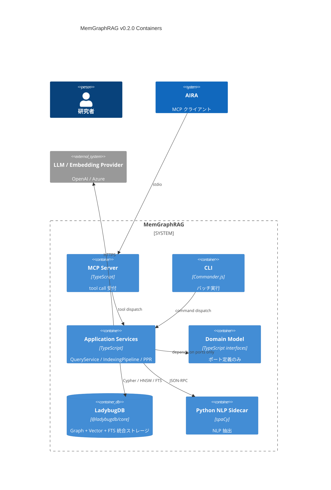
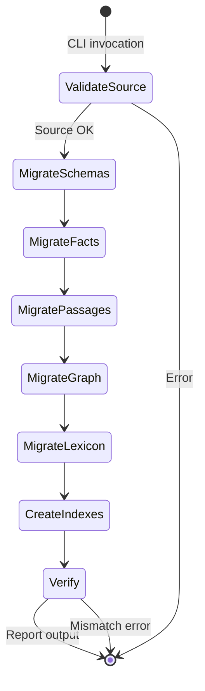

# MemGraphRAG v0.2.0 設計書 — LadybugDB ストレージ移行

**Document ID**: DES-MEMGRAPHRAG-002
**Version**: 1.6
**Status**: Draft
**Created**: 2026-06-15
**Traceability**: REQ-MEMGRAPHRAG-002 v1.0

---

## 1. アーキテクチャ概要

v0.2.0 はインフラストラクチャ層のストレージアダプターのみを置換する。ドメイン層のポート（IGraphStore, IVectorIndex, IMemoryStore, IGraphProjection, ILexicalRetriever）は変更しない。

### 1.1 C4 Container Diagram (v0.2.0)



### 1.2 変更スコープ

```
packages/memgraphrag/src/
├── domain/           # 変更なし
├── application/      # 変更なし（PPR は IGraphProjection 経由）
├── infrastructure/
│   └── storage/
│       ├── SQLiteGraphStore.ts      # 削除 → LadybugGraphStore.ts
│       ├── SQLiteMemoryStore.ts     # 削除 → LadybugMemoryStore.ts
│       ├── SQLiteLexiconStore.ts    # 削除 → LadybugLexiconStore.ts
│       ├── FileVectorIndex.ts       # 削除 → LadybugVectorIndex.ts
│       ├── LadybugGraphStore.ts     # 新規
│       ├── LadybugMemoryStore.ts    # 新規
│       ├── LadybugVectorIndex.ts    # 新規
│       ├── LadybugLexiconStore.ts   # 新規
│       ├── LadybugGraphProjection.ts # 新規（IGraphProjection 実装）
│       ├── LadybugConnection.ts     # 新規（共有接続管理）
│       └── migrate-to-ladybug.ts    # 新規（マイグレーション）
└── interface/        # 変更なし
```

---

## 2. 詳細設計

### 共通規約: ID Mapping ルール (rubber-duck review v5 修正)

全 LadybugDB アダプターは以下の ID 変換規約に従う:

```
書込み（Domain → Storage）: storageId(corpusId, domainId) = `${corpusId}:${domainId}`
読取り（Storage → Domain）: domainId(storageId) = storageId.slice(storageId.indexOf(':') + 1)
```

**適用対象**（漏れなく全アダプターに適用すること）:
- `LadybugGraphStore` — upsertNodes, upsertEdges, getNode, getAdjacent, getEdges, delete*
- `LadybugGraphProjection` — getTransitions (TransitionEntry.sourceNodeId/targetNodeId)
- `LadybugVectorIndex` — upsert (VectorRecord.id), search (VectorSearchMatch.id)
- `LadybugMemoryStore` — load/save (Schema.schemaId, Fact.factId, Passage.passageId)
- `LadybugLexicalRetriever` — search (passageId)
- `LadybugMultiHopTraversal` — traverse (nodeId)

**不変条件**: Domain 層・Application 層は storage ID を一切見ない。

### DES-LDB-001: LadybugDB 接続管理

**トレーサビリティ**: REQ-LDB-001, REQ-LDB-NFR-004
**パッケージ**: `memgraphrag`

**設計概要**:
LadybugDB は単一ライターモデル。Database インスタンスをシングルトンとして管理し、Connection プール（デフォルト 3）で並行クエリを安全に処理する。各 Connection は取得時に拡張をロード済みであることを保証する。

**⚠️ 並行性設計** (rubber-duck review #1 修正):
- Database: シングルトン（単一ライター制約）
- Connection: プール管理。acquire/release パターンで排他制御
- 各 Connection はセッション独立。拡張ロードは Connection 生成時に実行
- 書込み操作は暗黙的にシリアライズ（LadybugDB 内部 WAL）

```typescript
// infrastructure/storage/LadybugConnection.ts

export interface LadybugConfig {
  readonly databasePath: string;
  readonly bufferManagerSize?: number; // default: 1GB
  readonly enableCompression?: boolean; // default: true
  readonly numThreads?: number; // default: 4
  readonly poolSize?: number; // default: 3
}

export interface ILadybugConnection {
  initialize(): Promise<void>;
  close(): Promise<void>;
  query(cypher: string, params?: Record<string, unknown>): Promise<QueryResult>;
  withConnection<T>(fn: (conn: Connection) => Promise<T>): Promise<T>;
}

export class LadybugConnection implements ILadybugConnection {
  private _db: Database | null = null;
  private readonly _pool: Connection[] = [];
  private readonly _available: Connection[] = [];
  private readonly _waitQueue: Array<(conn: Connection) => void> = [];

  constructor(private readonly config: LadybugConfig) {}

  async initialize(): Promise<void> {
    this._db = new Database(
      this.config.databasePath,
      this.config.bufferManagerSize ?? 1024 * 1024 * 1024,
      this.config.enableCompression ?? true,
    );

    // Create connection pool
    const poolSize = this.config.poolSize ?? 3;
    for (let i = 0; i < poolSize; i++) {
      const conn = new Connection(this._db, this.config.numThreads ?? 4);
      await conn.query('INSTALL vector; LOAD vector;');
      await conn.query('INSTALL fts; LOAD fts;');
      await conn.query('INSTALL algo; LOAD algo;');
      this._pool.push(conn);
      this._available.push(conn);
    }

    // Create schema using first connection
    await this.ensureSchema();
  }

  async close(): Promise<void> {
    for (const conn of this._pool) {
      await conn.close();
    }
    await this._db?.close();
  }

  private acquire(): Promise<Connection> {
    const conn = this._available.pop();
    if (conn) return Promise.resolve(conn);
    return new Promise(resolve => this._waitQueue.push(resolve));
  }

  private release(conn: Connection): void {
    const waiter = this._waitQueue.shift();
    if (waiter) { waiter(conn); return; }
    this._available.push(conn);
  }

  async withConnection<T>(fn: (conn: Connection) => Promise<T>): Promise<T> {
    const conn = await this.acquire();
    try {
      return await fn(conn);
    } finally {
      this.release(conn);
    }
  }

  async query(cypher: string, params?: Record<string, unknown>): Promise<QueryResult> {
    return this.withConnection(async (conn) => {
      if (params) {
        const ps = await conn.prepare(cypher);
        return conn.execute(ps, params);
      }
      return conn.query(cypher);
    });
  }
}
```

---

### DES-LDB-002: LadybugDB スキーマ定義

**トレーサビリティ**: REQ-LDB-001, REQ-LDB-002, REQ-LDB-003
**パッケージ**: `memgraphrag`

**設計概要**:
LadybugDB のスキーマをノードテーブル・リレーションテーブルで定義する。ベクトルカラムを含む。

**⚠️ テーブル設計方針** (rubber-duck review #5 修正):
- **GNode**: IGraphStore 用のグラフトポロジー専用テーブル。PPR の遷移行列を構成する
- **SchemaNode/FactNode/PassageNode/EntityNode**: IMemoryStore + IVectorIndex 用。ドメインエンティティ + embedding を格納
- 両者は **独立**。GNode.ref_json が SchemaNode/FactNode/PassageNode の ID を参照する（外部キー的）
- ベクトル検索は SchemaNode/FactNode/PassageNode/EntityNode で実行し、グラフ探索は GNode + GEdge で実行
- 統合クエリ: ベクトル topK → ID 取得 → GNode MATCH で関連エッジ探索

```cypher
-- =============== Node Tables ===============

-- ⚠️ ID 設計 (rubber-duck review v2 #3, v4 #3 修正):
-- 全テーブルの PK は globally unique。フォーマット: `${corpusId}:${localId}`
-- GNode, SchemaNode, FactNode, PassageNode, EntityNode, LexiconEntry すべてに適用。
-- Adapter 内部で storageId ↔ domainId を変換。Domain 層は変更なし。

-- ⚠️ Layer 用語 (rubber-duck review v4 NB1 修正):
-- MemoryLayer = 'ontology' | 'fact' | 'passage' | 'entity' (domain 定義)
-- GNode.layer は 'ontology' を使用（'schema' ではない）
-- namespace mapping: ontology → SchemaNode, fact → FactNode, passage → PassageNode, entity → EntityNode

-- Graph layer nodes (maps to GraphNode domain entity)
-- PPR 遷移行列の構成要素。ref_json で SchemaNode/FactNode/PassageNode を参照
CREATE NODE TABLE IF NOT EXISTS GNode(
  node_id      STRING PRIMARY KEY,  -- format: ${corpusId}:${domainNodeId}
  corpus_id    STRING,
  layer        STRING,              -- 'ontology' | 'fact' | 'passage' (MemoryLayer, entity 除外)
  label        STRING,
  ref_json     STRING,      -- { kind, id } only
  document_ids STRING       -- JSON array of document IDs (for deleteByDocument)
);

-- Schema entities (maps to Schema domain entity)
CREATE NODE TABLE IF NOT EXISTS SchemaNode(
  schema_id               STRING PRIMARY KEY,  -- ${corpusId}:${localSchemaId}
  corpus_id               STRING,
  head_type               STRING,
  relation                STRING,
  tail_type               STRING,
  canonical_key           STRING,
  frequency               INT64,
  state                   STRING,
  stabilization_threshold INT64,
  version                 INT64,
  created_at              STRING,
  updated_at              STRING,
  embedding               FLOAT[1536]
);

-- Fact entities (maps to Fact domain entity)
CREATE NODE TABLE IF NOT EXISTS FactNode(
  fact_id       STRING PRIMARY KEY,  -- ${corpusId}:${localFactId}
  corpus_id     STRING,
  schema_id     STRING,
  head_entity   STRING,
  head_type     STRING,
  relation      STRING,
  tail_entity   STRING,
  tail_type     STRING,
  confidence    DOUBLE,
  source_text   STRING,
  document_id   STRING,
  passage_id    STRING,
  state         STRING,
  created_at    STRING,
  updated_at    STRING,
  embedding     FLOAT[1536]
);

-- Passage entities (maps to Passage domain entity)
CREATE NODE TABLE IF NOT EXISTS PassageNode(
  passage_id   STRING PRIMARY KEY,  -- ${corpusId}:${localPassageId}
  corpus_id    STRING,
  document_id  STRING,
  chunk_index  INT64,
  text         STRING,
  token_count  INT64,
  created_at   STRING,
  embedding    FLOAT[1536]
);

-- Entity nodes (for vector search namespace 'entity')
CREATE NODE TABLE IF NOT EXISTS EntityNode(
  entity_id   STRING PRIMARY KEY,  -- ${corpusId}:${localEntityId}
  corpus_id   STRING,
  name        STRING,
  entity_type STRING,
  document_id STRING,
  embedding   FLOAT[1536]
);

-- Job checkpoints
CREATE NODE TABLE IF NOT EXISTS Checkpoint(
  job_id                 STRING PRIMARY KEY,
  corpus_id              STRING,
  processed_document_ids STRING,  -- JSON array
  updated_at             STRING
);

-- Lexicon entries (dictionary + thesaurus)
CREATE NODE TABLE IF NOT EXISTS LexiconEntry(
  entry_id     STRING PRIMARY KEY,  -- ${corpusId}:${localEntryId}
  corpus_id    STRING,
  term         STRING,
  category     STRING,
  definition   STRING,
  source       STRING,
  confidence   DOUBLE,
  metadata     STRING   -- JSON
);

-- =============== Relationship Tables ===============

-- Graph edges (maps to GraphEdge domain entity)
CREATE REL TABLE IF NOT EXISTS GEdge(
  FROM GNode TO GNode,
  edge_id     STRING,
  corpus_id   STRING,
  relation    STRING,
  weight      DOUBLE,
  bridge_kind STRING
);

-- Fact → Schema (schema_instance)
CREATE REL TABLE IF NOT EXISTS FactToSchema(
  FROM FactNode TO SchemaNode
);

-- Fact → Passage (fact_evidence)
CREATE REL TABLE IF NOT EXISTS FactToPassage(
  FROM FactNode TO PassageNode
);

-- Schema aliases
CREATE NODE TABLE IF NOT EXISTS SchemaAlias(
  alias_id     SERIAL PRIMARY KEY,
  schema_id    STRING,
  label        STRING,
  language     STRING,
  source       STRING,
  confidence   DOUBLE,
  is_canonical BOOLEAN
);

-- Lexicon synonyms
CREATE REL TABLE IF NOT EXISTS Synonym(
  FROM LexiconEntry TO LexiconEntry,
  relation_type STRING,
  confidence    DOUBLE
);
```

---

### DES-LDB-003: LadybugGraphStore

**トレーサビリティ**: REQ-LDB-001, REQ-LDB-008
**パッケージ**: `memgraphrag`

**設計概要**:
IGraphStore を LadybugDB Cypher で実装する。バッチ upsert は UNWIND + MERGE パターンを使用。

**⚠️ ID Mapping 設計** (rubber-duck review v3 #1 修正):
- Storage 内部 PK: `${corpusId}:${domainNodeId}`（衝突回避）
- Domain 層への返却 ID: `domainNodeId`（既存アプリ層に変更なし）
- Mapping は LadybugGraphStore 内部で完結。外部からは透過的。

**⚠️ Cache Invalidation 設計** (rubber-duck review v3 #2 修正):
- LadybugGraphStore が write 完了時に `onGraphMutation(corpusId)` を emit
- LadybugGraphProjection / LadybugVectorIndex が listener として登録
- DI 時に共有 EventEmitter で接続

**⚠️ Document 追跡設計** (rubber-duck review v3 #5 修正):
- GNode に `document_ids` STRING カラム追加（JSON 配列）
- upsertNodes で document 情報を格納
- deleteByDocument は `document_ids` を検索して該当ノードを特定

```typescript
// infrastructure/storage/LadybugGraphStore.ts

import type { IGraphStore, GraphNode, GraphEdge } from '../../domain/storage/graphStore.js';
import type { ILadybugConnection } from './LadybugConnection.js';
import type { EventEmitter } from 'node:events';

export class LadybugGraphStore implements IGraphStore {
  constructor(
    private readonly connection: ILadybugConnection,
    private readonly events: EventEmitter,  // shared invalidation bus
  ) {}

  // --- ID Mapping (internal) ---
  private storageId(corpusId: string, nodeId: string): string {
    return `${corpusId}:${nodeId}`;
  }
  private domainId(storageId: string): string {
    const idx = storageId.indexOf(':');
    return idx >= 0 ? storageId.slice(idx + 1) : storageId;
  }

  async upsertNodes(nodes: readonly GraphNode[]): Promise<void> {
    if (nodes.length === 0) return;
    const params = {
      nodes: nodes.map(n => ({
        node_id: this.storageId(n.corpusId, n.nodeId),
        corpus_id: n.corpusId,
        layer: n.layer,
        label: n.label,
        ref_json: JSON.stringify({ kind: n.layer, id: n.nodeId }),
        document_ids: JSON.stringify(this.extractDocumentIds(n)),
      })),
    };
    await this.connection.query(`
      UNWIND $nodes AS n
      MERGE (g:GNode {node_id: n.node_id})
      SET g.corpus_id = n.corpus_id,
          g.layer = n.layer,
          g.label = n.label,
          g.ref_json = n.ref_json,
          g.document_ids = n.document_ids
    `, params);
    this.events.emit('graphMutation', nodes[0]!.corpusId);
  }
```

**注**: `ref_json` には `{ kind: 'ontology'|'fact'|'passage', id: string }` のみ格納し、
ドメインオブジェクト全体は格納しない（stale 防止）。参照解決時は該当ノードテーブルを MATCH する。

```typescript
  // --- Fix v4 B1: 全 query で storageId/domainId mapping を徹底 ---

  async upsertEdges(edges: readonly GraphEdge[]): Promise<void> {
    if (edges.length === 0) return;
    // Fix v4 B2: 真のアトミック edge upsert
    // 同一 corpusId のバッチのみ受付。DELETE + CREATE を単一トランザクションで実行。
    const BATCH_SIZE = 500;
    for (let i = 0; i < edges.length; i += BATCH_SIZE) {
      const batch = edges.slice(i, i + BATCH_SIZE);
      const corpusId = batch[0]!.corpusId;
      const edgeIds = batch.map(e => e.edgeId);
      const edgeParams = batch.map(e => ({
        src: this.storageId(e.corpusId, e.sourceNodeId),
        tgt: this.storageId(e.corpusId, e.targetNodeId),
        eid: e.edgeId, cid: e.corpusId,
        rel: e.relation, w: e.weight, bk: e.bridgeKind ?? null,
      }));

      // Single transaction: delete old → create new (rollback on failure)
      await this.connection.withConnection(async (conn) => {
        await conn.query('BEGIN TRANSACTION');
        try {
          // Delete existing edges by ID (idempotency)
          const delPs = await conn.prepare(`
            MATCH ()-[e:GEdge]->()
            WHERE e.edge_id IN $ids AND e.corpus_id = $cid
            DELETE e
          `);
          await conn.execute(delPs, { ids: edgeIds, cid: corpusId });

          // Create new edges
          const createPs = await conn.prepare(`
            UNWIND $edges AS e
            MATCH (src:GNode {node_id: e.src}), (tgt:GNode {node_id: e.tgt})
            CREATE (src)-[:GEdge {
              edge_id: e.eid, corpus_id: e.cid,
              relation: e.rel, weight: e.w, bridge_kind: e.bk
            }]->(tgt)
          `);
          await conn.execute(createPs, { edges: edgeParams });

          await conn.query('COMMIT');
        } catch (err) {
          await conn.query('ROLLBACK').catch(() => {});
          throw err;
        }
      });
    }
    this.events.emit('graphMutation', edges[0]!.corpusId);
  }

  async getNode(corpusId: string, nodeId: string): Promise<GraphNode | null> {
    const sid = this.storageId(corpusId, nodeId);  // Fix v4 B1
    const result = await this.connection.query(`
      MATCH (g:GNode {node_id: $nid})
      RETURN g.node_id, g.corpus_id, g.layer, g.label, g.ref_json
    `, { nid: sid });
    const rows = await result.getAll();
    if (rows.length === 0) return null;
    return this.toGraphNode(rows[0]);  // toGraphNode calls domainId()
  }

  async getAdjacent(corpusId: string, nodeId: string): Promise<readonly GraphEdge[]> {
    const sid = this.storageId(corpusId, nodeId);  // Fix v4 B1
    const result = await this.connection.query(`
      MATCH (src:GNode {node_id: $nid})-[e:GEdge]-(tgt:GNode)
      RETURN e.edge_id, e.corpus_id, src.node_id AS source,
             tgt.node_id AS target, e.relation, e.weight, e.bridge_kind
    `, { nid: sid });
    return (await result.getAll()).map(r => this.toGraphEdge(r));  // domainId() applied
  }

  async getEdges(corpusId: string, sourceNodeId?: string): Promise<readonly GraphEdge[]> {
    const cypher = sourceNodeId
      ? `MATCH (src:GNode {node_id: $src})-[e:GEdge]->(tgt:GNode)
         RETURN e.edge_id, e.corpus_id, src.node_id AS source,
                tgt.node_id AS target, e.relation, e.weight, e.bridge_kind`
      : `MATCH (src:GNode {corpus_id: $cid})-[e:GEdge]->(tgt:GNode)
         RETURN e.edge_id, e.corpus_id, src.node_id AS source,
                tgt.node_id AS target, e.relation, e.weight, e.bridge_kind`;
    const params = sourceNodeId
      ? { src: this.storageId(corpusId, sourceNodeId) }  // Fix v4 B1
      : { cid: corpusId };
    const result = await this.connection.query(cypher, params);
    return (await result.getAll()).map(r => this.toGraphEdge(r));
  }

  async deleteByCorpus(corpusId: string): Promise<{ deletedNodes: number; deletedEdges: number }> {
    const edgeResult = await this.connection.query(`
      MATCH (src:GNode {corpus_id: $cid})-[e:GEdge]->()
      DELETE e RETURN COUNT(*) AS cnt
    `, { cid: corpusId });
    const nodeResult = await this.connection.query(`
      MATCH (n:GNode {corpus_id: $cid}) DELETE n RETURN COUNT(*) AS cnt
    `, { cid: corpusId });
    const edgeRows = await edgeResult.getAll();
    const nodeRows = await nodeResult.getAll();
    this.events.emit('graphMutation', corpusId);  // Fix v4 NB2: invalidation
    return { deletedNodes: nodeRows[0]?.cnt ?? 0, deletedEdges: edgeRows[0]?.cnt ?? 0 };
  }

  // --- Private helpers ---
  private toGraphNode(row: Record<string, unknown>): GraphNode {
    return {
      nodeId: this.domainId(row['g.node_id'] as string),  // domain ID
      corpusId: row['g.corpus_id'] as string,
      layer: row['g.layer'] as MemoryLayer,
      ref: JSON.parse(row['g.ref_json'] as string),
      label: row['g.label'] as string,
    };
  }

  private toGraphEdge(row: Record<string, unknown>): GraphEdge {
    return {
      edgeId: row['e.edge_id'] as string,
      corpusId: row['e.corpus_id'] as string,
      sourceNodeId: this.domainId(row.source as string),  // domain ID
      targetNodeId: this.domainId(row.target as string),  // domain ID
      relation: row['e.relation'] as GraphEdge['relation'],
      weight: row['e.weight'] as number,
      bridgeKind: (row['e.bridge_kind'] as string) ?? undefined,
    };
  }
}
    return { deletedNodes: nodeRows[0]?.cnt ?? 0, deletedEdges: edgeRows[0]?.cnt ?? 0 };
  }

  // ... deleteNodes, deleteEdges, deleteByDocument similarly
}
```

---

### DES-LDB-004: LadybugVectorIndex

**トレーサビリティ**: REQ-LDB-002, REQ-LDB-NFR-001
**パッケージ**: `memgraphrag`

**設計概要**:
IVectorIndex を HNSW ベクトルインデックスで実装。namespace ごとに異なるノードテーブル（SchemaNode, FactNode, PassageNode, EntityNode）にベクトルを格納する。

```typescript
// infrastructure/storage/LadybugVectorIndex.ts

import type { IVectorIndex, VectorRecord, VectorSearchRequest, VectorSearchMatch } from '../../domain/storage/graphStore.js';
import type { ILadybugConnection } from './LadybugConnection.js';

const NAMESPACE_TABLE_MAP: Record<string, string> = {
  schema: 'SchemaNode',
  fact: 'FactNode',
  passage: 'PassageNode',
  entity: 'EntityNode',
};

const NAMESPACE_INDEX_MAP: Record<string, string> = {
  schema: 'schema_emb_idx',
  fact: 'fact_emb_idx',
  passage: 'passage_emb_idx',
  entity: 'entity_emb_idx',
};

const NAMESPACE_PK_MAP: Record<string, string> = {
  schema: 'schema_id',
  fact: 'fact_id',
  passage: 'passage_id',
  entity: 'entity_id',
};

export class LadybugVectorIndex implements IVectorIndex {
  constructor(private readonly connection: ILadybugConnection) {}

  async ensureIndexes(): Promise<void> {
    for (const [ns, table] of Object.entries(NAMESPACE_TABLE_MAP)) {
      const idx = NAMESPACE_INDEX_MAP[ns]!;
      await this.connection.query(`
        CALL CREATE_VECTOR_INDEX('${table}', '${idx}', 'embedding',
          metric := 'cosine', efc := 200)
      `).catch(() => { /* index may already exist */ });
    }
  }

  async upsert<TMetadata extends Readonly<Record<string, unknown>>>(
    records: readonly VectorRecord<TMetadata>[],
  ): Promise<void> {
    // Group by namespace
    const grouped = Map.groupBy(records, r => r.namespace);

    for (const [ns, nsRecords] of grouped) {
      const table = NAMESPACE_TABLE_MAP[ns]!;
      const pk = NAMESPACE_PK_MAP[ns]!;

      for (const record of nsRecords) {
        await this.connection.query(`
          MERGE (n:${table} {${pk}: $id})
          SET n.corpus_id = $corpusId,
              n.embedding = $embedding
        `, {
          id: record.id,
          corpusId: record.corpusId,
          embedding: Array.from(record.values),
        });
      }
    }
  }

  async search<TMetadata extends Readonly<Record<string, unknown>>>(
    request: VectorSearchRequest,
  ): Promise<readonly VectorSearchMatch<TMetadata>[]> {
    const table = NAMESPACE_TABLE_MAP[request.namespace]!;
    const idx = NAMESPACE_INDEX_MAP[request.namespace]!;
    const pk = NAMESPACE_PK_MAP[request.namespace]!;

    // ⚠️ Strategy: Corpus-partitioned HNSW index (rubber-duck review v2 #1 修正)
    //
    // 設計判断: MemGraphRAG は実運用上「1 DB = 1 corpus」が主パターン。
    // ベンチマーク DB は単一 corpus のみ含む。複数 corpus 共存時は
    // corpus 専用の HNSW インデックスを動的作成する。
    //
    // 戦略:
    // A) 単一 corpus DB（推奨）: グローバル HNSW をそのまま使用
    // B) 複数 corpus DB: corpus 固有の projected graph + HNSW を使用
    //    - projected graph は初回作成後キャッシュ（corpus 更新時に再作成）
    //    - キャッシュ名: `vec_{corpusId}_{namespace}`

    const corpusCount = await this.getCorpusCount(table);

    if (corpusCount <= 1) {
      // Fast path: single corpus — use global index directly
      const result = await this.connection.query(`
        CALL QUERY_VECTOR_INDEX('${table}', '${idx}', $vec, $k)
        RETURN node, distance
        ORDER BY distance
      `, { vec: Array.from(request.queryVector), k: request.topK });

      const rows = await result.getAll();
      return rows
        .filter(r => !request.threshold || (1 - r.distance) >= request.threshold)
        .map(r => ({
          id: this.domainId(r.node[pk] as string),  // Fix v5: strip storage prefix
          score: 1 - r.distance,
          metadata: this.extractMetadata(r.node) as TMetadata,
        }));
    }

    // Multi-corpus path: use cached projected graph
    const projName = `vec_${request.corpusId}_${request.namespace}`;
    await this.ensureProjection(projName, table, request.corpusId);

    const result = await this.connection.query(`
      CALL QUERY_VECTOR_INDEX('${projName}', '${idx}', $vec, $k)
      RETURN node, distance
      ORDER BY distance
    `, { vec: Array.from(request.queryVector), k: request.topK });

    const rows = await result.getAll();
    return rows
      .filter(r => !request.threshold || (1 - r.distance) >= request.threshold)
      .map(r => ({
        id: this.domainId(r.node[pk] as string),  // Fix v5: strip storage prefix
        score: 1 - r.distance,
        metadata: this.extractMetadata(r.node) as TMetadata,
      }));
  }

  // ID mapping (same as LadybugGraphStore)
  private domainId(storageId: string): string {
    const idx = storageId.indexOf(':');
    return idx >= 0 ? storageId.slice(idx + 1) : storageId;
  }

  // Projection cache: created once per corpus, invalidated on corpus update
  private readonly projectionCache = new Set<string>();

  private async ensureProjection(projName: string, table: string, corpusId: string): Promise<void> {
    if (this.projectionCache.has(projName)) return;
    await this.connection.query(`
      CALL DROP_PROJECTED_GRAPH('${projName}')
    `).catch(() => {});
    await this.connection.query(`
      CALL PROJECT_GRAPH('${projName}',
        {'${table}': 'n.corpus_id = "${corpusId}"'}, [])
    `);
    this.projectionCache.add(projName);
  }

  invalidateProjectionCache(corpusId?: string): void {
    if (corpusId) {
      for (const key of this.projectionCache) {
        if (key.startsWith(`vec_${corpusId}_`)) this.projectionCache.delete(key);
      }
    } else {
      this.projectionCache.clear();
    }
  }

  private async getCorpusCount(table: string): Promise<number> {
    const result = await this.connection.query(
      `MATCH (n:${table}) RETURN COUNT(DISTINCT n.corpus_id) AS cnt`
    );
    const rows = await result.getAll();
    return rows[0]?.cnt ?? 0;
  }

  async deleteByDocument(corpusId: string, documentId: string): Promise<void> {
    for (const table of Object.values(NAMESPACE_TABLE_MAP)) {
      await this.connection.query(`
        MATCH (n:${table} {corpus_id: $cid, document_id: $did})
        SET n.embedding = null
      `, { cid: corpusId, did: documentId }).catch(() => {});
    }
  }

  private extractMetadata(node: Record<string, unknown>): Record<string, unknown> {
    const { embedding, ...rest } = node;
    return rest;
  }
}
```

---

### DES-LDB-005: LadybugGraphProjection (PPR 用)

**トレーサビリティ**: REQ-LDB-004, REQ-LDB-008
**パッケージ**: `memgraphrag`

**設計概要**:
IGraphProjection を Cypher MATCH で実装。SimplePPR（既存の Personalized PageRank）をそのまま維持し、LadybugDB はグラフデータ供給のみ担当する。

**⚠️ PPR 設計判断** (rubber-duck review #2 修正):
- LadybugDB の PAGE_RANK はグローバル PageRank のみ（seed vector 非対応）
- MemGraphRAG の PPR は **Personalized** — query-specific な seed ノード重み付けが必須
- → SimplePPR を維持。LadybugDB は IGraphProjection（遷移行列供給）のみ実装
- → LadybugDB の PAGE_RANK は将来的にグローバル事前ランキングとして活用可能（別機能）

**⚠️ パフォーマンス設計** (rubber-duck review v2 #5 修正):
- getTransitions() の結果は corpus 単位でメモリキャッシュ（TTL: corpus 更新まで）
- 初回クエリ: Cypher で全エッジ取得 → キャッシュ格納
- 2回目以降: キャッシュから即時返却（DB アクセスなし）
- キャッシュ無効化: upsertEdges/deleteByCorpus 時に自動クリア

```typescript
// infrastructure/storage/LadybugGraphProjection.ts

import type { IGraphProjection, TransitionEntry } from '../../domain/retrieval/ppr.js';
import type { ILadybugConnection } from './LadybugConnection.js';

export class LadybugGraphProjection implements IGraphProjection {
  // Transition cache: corpus → edges (invalidated on write)
  private readonly cache = new Map<string, TransitionEntry[]>();

  constructor(private readonly connection: ILadybugConnection) {}

  invalidateCache(corpusId?: string): void {
    if (corpusId) this.cache.delete(corpusId);
    else this.cache.clear();
  }

  async *getTransitions(corpusId: string): AsyncIterable<TransitionEntry> {
    // Check cache first
    const cached = this.cache.get(corpusId);
    if (cached) {
      for (const entry of cached) yield entry;
      return;
    }

    // Load from DB and cache
    // ⚠️ Entity node exclusion (rubber-duck review v3 #3 修正):
    // entity 層ノードに接続するエッジを除外。entity サブグラフは
    // 高密度で PPR マスをトラップするため、fact↔passage↔schema のみ使用。
    const result = await this.connection.query(`
      MATCH (src:GNode {corpus_id: $cid})-[e:GEdge]->(tgt:GNode)
      WHERE src.layer <> 'entity' AND tgt.layer <> 'entity'
      RETURN src.node_id AS source, tgt.node_id AS target, e.weight AS weight
    `, { cid: corpusId });

    const rows = await result.getAll();
    const entries: TransitionEntry[] = rows.map(row => ({
      sourceNodeId: this.domainId(row.source as string),  // Fix v5: domain IDs for SimplePPR
      targetNodeId: this.domainId(row.target as string),
      weight: row.weight,
    }));

    this.cache.set(corpusId, entries);
    for (const entry of entries) yield entry;
  }

  // ID mapping
  private domainId(storageId: string): string {
    const idx = storageId.indexOf(':');
    return idx >= 0 ? storageId.slice(idx + 1) : storageId;
  }

  async getDanglingNodes(corpusId: string): Promise<readonly string[]> {
    // Exclude entity layer (consistent with getTransitions)
    const result = await this.connection.query(`
      MATCH (n:GNode {corpus_id: $cid})
      WHERE n.layer <> 'entity'
        AND NOT EXISTS { MATCH (n)-[:GEdge]->(m:GNode) WHERE m.layer <> 'entity' }
      RETURN n.node_id AS nid
    `, { cid: corpusId });
    return (await result.getAll()).map(r => r.nid);
  }

  async getNodeCount(corpusId: string): Promise<number> {
    // Exclude entity layer (consistent with getTransitions)
    const result = await this.connection.query(`
      MATCH (n:GNode {corpus_id: $cid})
      WHERE n.layer <> 'entity'
      RETURN COUNT(*) AS cnt
    `, { cid: corpusId });
    const rows = await result.getAll();
    return rows[0]?.cnt ?? 0;
  }
}
```

**注**: SimplePPR + LadybugGraphProjection の組合せにより、v0.1.0 と同一の PPR アルゴリズムがそのまま動作する。初回のみ Cypher でエッジ取得し、以降はメモリキャッシュから供給。28K エッジの場合 ~2MB のメモリ使用で、PPR 実行は v0.1.0 と同等速度。

---

### DES-LDB-006: LadybugMemoryStore

**トレーサビリティ**: REQ-LDB-003, REQ-LDB-007
**パッケージ**: `memgraphrag`

**設計概要**:
IMemoryStore を Cypher MATCH/MERGE で実装。MemorySnapshot の load/save は各ノードテーブルからの集約クエリ。

```typescript
// infrastructure/storage/LadybugMemoryStore.ts

import type { IMemoryStore, JobCheckpoint } from '../../domain/storage/graphStore.js';
import type { MemorySnapshot } from '../../domain/memory/globalMemory.js';
import type { ILadybugConnection } from './LadybugConnection.js';

export class LadybugMemoryStore implements IMemoryStore {
  constructor(private readonly connection: ILadybugConnection) {}

  async load(corpusId: string): Promise<MemorySnapshot> {
    // Load schemas
    const schemasResult = await this.connection.query(
      'MATCH (s:SchemaNode {corpus_id: $cid}) RETURN s', { cid: corpusId }
    );
    // Load facts
    const factsResult = await this.connection.query(
      'MATCH (f:FactNode {corpus_id: $cid}) RETURN f', { cid: corpusId }
    );
    // Load passages
    const passagesResult = await this.connection.query(
      'MATCH (p:PassageNode {corpus_id: $cid}) RETURN p', { cid: corpusId }
    );

    return {
      corpusId,
      schemas: (await schemasResult.getAll()).map(this.toSchema),
      facts: (await factsResult.getAll()).map(this.toFact),
      passages: (await passagesResult.getAll()).map(this.toPassage),
    };
  }

  async save(snapshot: MemorySnapshot): Promise<void> {
    // Batch upsert schemas, facts, passages via UNWIND + MERGE
    // (Similar pattern to LadybugGraphStore.upsertNodes)
    // ...implementation omitted for brevity
  }

  async saveCheckpoint(checkpoint: JobCheckpoint): Promise<void> {
    await this.connection.query(`
      MERGE (c:Checkpoint {job_id: $jid})
      SET c.corpus_id = $cid,
          c.processed_document_ids = $docs,
          c.updated_at = $ts
    `, {
      jid: checkpoint.jobId,
      cid: checkpoint.corpusId,
      docs: JSON.stringify(checkpoint.processedDocumentIds),
      ts: checkpoint.updatedAt,
    });
  }

  async loadCheckpoint(jobId: string): Promise<JobCheckpoint | null> {
    const result = await this.connection.query(
      'MATCH (c:Checkpoint {job_id: $jid}) RETURN c', { jid: jobId }
    );
    const rows = await result.getAll();
    if (rows.length === 0) return null;
    const c = rows[0].c;
    return {
      jobId: c.job_id,
      corpusId: c.corpus_id,
      processedDocumentIds: JSON.parse(c.processed_document_ids),
      updatedAt: c.updated_at,
    };
  }

  async validateIntegrity(corpusId: string): Promise<readonly string[]> {
    const errors: string[] = [];
    // Check orphan facts (no schema reference)
    const orphans = await this.connection.query(`
      MATCH (f:FactNode {corpus_id: $cid})
      WHERE NOT EXISTS { MATCH (s:SchemaNode {schema_id: f.schema_id}) }
      RETURN COUNT(*) AS cnt
    `, { cid: corpusId });
    const rows = await orphans.getAll();
    if (rows[0]?.cnt > 0) {
      errors.push(`${rows[0].cnt} orphan facts without schema reference`);
    }
    return errors;
  }
}
```

---

### DES-LDB-007: マイグレーションスクリプト

**トレーサビリティ**: REQ-LDB-006
**パッケージ**: `memgraphrag`
**CLI契約**: `npx memgraphrag migrate --from sqlite --to ladybug`

**設計概要**:
既存 SQLite + FileVectorIndex データを LadybugDB に変換。バッチ処理で段階的に移行し、検証レポートを出力。

```typescript
// infrastructure/storage/migrate-to-ladybug.ts

export interface MigrationReport {
  readonly schemas: { total: number; migrated: number };
  readonly facts: { total: number; migrated: number };
  readonly passages: { total: number; migrated: number };
  readonly graphNodes: { total: number; migrated: number };
  readonly graphEdges: { total: number; migrated: number };
  readonly vectors: { total: number; migrated: number };
  readonly durationMs: number;
  readonly errors: readonly string[];
}

export async function migrateToLadybug(opts: {
  sqlitePath: string;
  vectorIndexDir: string;
  ladybugPath: string;
  corpusId: string;
  batchSize?: number;
}): Promise<MigrationReport> {
  // 1. Open source (SQLite + FileVectorIndex)
  // 2. Open target (LadybugConnection)
  // 3. Validate source: count schemas/facts/passages/nodes/edges/vectors
  // 4. Migrate schemas → SchemaNode (with embedding from vector index)
  // 5. Migrate facts → FactNode (with embedding)
  // 6. Migrate passages → PassageNode (with embedding)
  // 7. Migrate graph_nodes → GNode
  // 8. Migrate graph_edges → GEdge relationships (UNWIND batch)
  // 9. Migrate lexicon → LexiconEntry
  // 10. Create HNSW indexes (AFTER bulk insert for optimal build)
  // 11. Verify: count parity + random vector byte parity + NN smoke test
  // 12. Output report
}

// ⚠️ Verification protocol (rubber-duck review #6 修正):
export interface MigrationVerification {
  readonly countParity: {
    schemas: boolean; facts: boolean; passages: boolean;
    nodes: boolean; edges: boolean; vectors: boolean;
  };
  readonly vectorDimensionCheck: boolean;     // all vectors are 1536-d
  readonly randomVectorParity: boolean;       // 10 random vectors byte-match
  readonly nnParityCheck: boolean;            // 5 random queries return same top-5 IDs
  readonly ftsSmoke: boolean;                 // 3 FTS queries return non-empty results
  readonly edgeDuplicateCheck: boolean;       // no duplicate edge_ids
}
```

**マイグレーションフロー**:



---

### DES-LDB-008: Runtime DI 統合

**トレーサビリティ**: REQ-LDB-NFR-004
**パッケージ**: `memgraphrag`

**設計概要**:
MemGraphRagRuntime の DI コンテナで、config の `storage.backend` フィールドに応じてアダプターを切り替える。

```typescript
// interface/runtime/MemGraphRagRuntime.ts (変更箇所)

// Config extension
export interface StorageConfig {
  backend: 'sqlite' | 'ladybug';  // NEW: backend selector
  sqlitePath?: string;             // for sqlite backend
  vectorIndexDir?: string;         // for sqlite backend
  ladybugPath?: string;            // for ladybug backend
  ladybugBufferSize?: number;      // for ladybug backend
}

// Factory based on backend config
function createStorageAdapters(config: StorageConfig): StorageAdapters {
  if (config.backend === 'ladybug') {
    const conn = new LadybugConnection({
      databasePath: config.ladybugPath!,
      bufferManagerSize: config.ladybugBufferSize,
    });

    // Shared invalidation event bus (rubber-duck review v3 #2 修正)
    const events = new EventEmitter();
    const graphStore = new LadybugGraphStore(conn, events);
    const vectorIndex = new LadybugVectorIndex(conn);
    const graphProjection = new LadybugGraphProjection(conn);

    // Wire cache invalidation: graphStore writes → projection/vector caches
    events.on('graphMutation', (corpusId: string) => {
      graphProjection.invalidateCache(corpusId);
      vectorIndex.invalidateProjectionCache(corpusId);
    });

    return {
      graphStore,
      vectorIndex,
      memoryStore: new LadybugMemoryStore(conn),
      graphProjection,
      connection: conn,
    };
  }
  // Fallback: existing SQLite + FileVectorIndex
  return createSQLiteAdapters(config);
}
```

---

### DES-LDB-009: BM25 全文検索統合

**トレーサビリティ**: REQ-LDB-005
**パッケージ**: `memgraphrag`

**設計概要**:
ILexicalRetriever を LadybugDB FTS で実装。既存の Bm25LexicalRetriever を置換。

```typescript
// infrastructure/storage/LadybugLexicalRetriever.ts

import type { ILexicalRetriever } from '../../domain/retrieval/ppr.js';
import type { ILadybugConnection } from './LadybugConnection.js';

export class LadybugLexicalRetriever implements ILexicalRetriever {
  constructor(private readonly connection: ILadybugConnection) {}

  async indexPassages(corpusId: string, passages: readonly Passage[]): Promise<void> {
    // Passages are already stored in PassageNode by LadybugMemoryStore.
    // FTS index is created once during schema initialization.
    // This method is a no-op for LadybugDB (index auto-updates on insert).
  }

  async search(corpusId: string, query: string, topK: number): Promise<readonly { passageId: string; score: number }[]> {
    // Fix v5 B2: PassageNode FTS + FactNode FTS 統合検索
    // 1. PassageNode.text で BM25 検索
    const passageResult = await this.connection.query(`
      CALL QUERY_FTS_INDEX('PassageNode', 'passage_fts_idx', $query, top := $k)
      YIELD node, score
      WHERE node.corpus_id = $cid
      RETURN node.passage_id AS pid, score
      ORDER BY score DESC
    `, { query, k: topK * 2, cid: corpusId });

    // 2. FactNode.head_entity/tail_entity で BM25 検索 → passage_id にマッピング
    const factResult = await this.connection.query(`
      CALL QUERY_FTS_INDEX('FactNode', 'fact_fts_idx', $query, top := $k)
      YIELD node, score
      WHERE node.corpus_id = $cid AND node.passage_id IS NOT NULL
      RETURN node.passage_id AS pid, score
      ORDER BY score DESC
    `, { query, k: topK, cid: corpusId });

    // 3. Merge: max(score) per passageId
    const scoreMap = new Map<string, number>();
    for (const rows of [await passageResult.getAll(), await factResult.getAll()]) {
      for (const r of rows) {
        const domainPid = this.domainId(r.pid as string);  // Fix v5: strip prefix
        scoreMap.set(domainPid, Math.max(scoreMap.get(domainPid) ?? 0, r.score as number));
      }
    }
    return [...scoreMap.entries()]
      .sort((a, b) => b[1] - a[1])
      .slice(0, topK)
      .map(([passageId, score]) => ({ passageId, score }));
  }

  // ID mapping
  private domainId(storageId: string): string {
    const idx = storageId.indexOf(':');
    return idx >= 0 ? storageId.slice(idx + 1) : storageId;
  }

  async deleteByDocument(corpusId: string, documentId: string): Promise<void> {
    // Deleting the node from PassageNode automatically removes from FTS index
    await this.connection.query(`
      MATCH (p:PassageNode {corpus_id: $cid, document_id: $did})
      DELETE p
    `, { cid: corpusId, did: documentId });
  }
}
```

---

### DES-LDB-010: マルチホップグラフ探索

**トレーサビリティ**: REQ-LDB-008
**パッケージ**: `memgraphrag`

**設計概要**:
Cypher の variable-length path を活用して 1〜3 ホップの関連ノードを効率的に取得する。
QueryService の context building フェーズで使用。

```typescript
// infrastructure/storage/LadybugMultiHopTraversal.ts

export interface MultiHopResult {
  readonly nodeId: string;
  readonly layer: MemoryLayer;
  readonly label: string;
  readonly hops: number;
  readonly pathWeight: number;
}

export class LadybugMultiHopTraversal {
  constructor(private readonly connection: ILadybugConnection) {}

  async traverse(
    corpusId: string,
    seedNodeIds: readonly string[],
    opts: { maxHops?: number; relationFilter?: string[]; minWeight?: number } = {},
  ): Promise<readonly MultiHopResult[]> {
    const maxHops = opts.maxHops ?? 3;
    const storageSeeds = seedNodeIds.map(id => `${corpusId}:${id}`);

    const result = await this.connection.query(`
      MATCH (start:GNode)-[e:GEdge* acyclic 1..${maxHops}]->(end:GNode)
      WHERE start.node_id IN $seeds
        AND end.layer <> 'entity'
        ${opts.relationFilter ? `AND ALL(r IN rels(e) WHERE r.relation IN $rels)` : ''}
        ${opts.minWeight ? `AND ALL(r IN rels(e) WHERE r.weight >= $minW)` : ''}
      RETURN DISTINCT end.node_id AS nid, end.layer AS layer,
             end.label AS label, length(e) AS hops,
             reduce(w = 1.0, r IN rels(e) | w * r.weight) AS pathWeight
      ORDER BY pathWeight DESC
    `, {
      seeds: storageSeeds,
      rels: opts.relationFilter ?? [],
      minW: opts.minWeight ?? 0,
    });

    const rows = await result.getAll();
    const idx = corpusId.length + 1; // strip "corpusId:" prefix
    return rows.map(r => ({
      nodeId: (r.nid as string).slice(idx),
      layer: r.layer as MemoryLayer,
      label: r.label as string,
      hops: r.hops as number,
      pathWeight: r.pathWeight as number,
    }));
  }
}
```

---

### DES-LDB-011: FTS 拡張（Fact フィールド対応）

**トレーサビリティ**: REQ-LDB-005
**パッケージ**: `memgraphrag`

**設計概要**:
REQ-LDB-005 の受入基準に従い、PassageNode.text に加えて FactNode の head_entity/tail_entity にも FTS インデックスを作成する。

```cypher
-- Passage FTS (text)
CALL CREATE_FTS_INDEX('PassageNode', 'passage_fts_idx', ['text'],
  stemmer := 'english');

-- Fact FTS (head + tail entity names)
CALL CREATE_FTS_INDEX('FactNode', 'fact_fts_idx', ['head_entity', 'tail_entity'],
  stemmer := 'english');
```

LadybugLexicalRetriever は search 時に両方のインデックスを検索し、
スコアで統合して返す。

---

## 3. ADR

### ADR-001: LadybugDB を統合ストレージバックエンドとして採用

**ステータス**: proposed
**日付**: 2026-06-15

#### Context

v0.1.0 では SQLite（リレーショナル）+ FileVectorIndex（ブルートフォース cosine）+ in-memory PPR（JavaScript）の 3 コンポーネント構成。800K ベクトルでクエリ 40s+、3.7GB の分散ファイル管理、10 万文書スケール困難。

#### Decision

LadybugDB（旧 Kuzu）を単一統合バックエンドとして採用する。理由:
1. **ネイティブ HNSW** — O(log n) ベクトル検索、ブルートフォースの 100x 高速化
2. **Cypher グラフクエリ** — IGraphProjection の高速データ供給、SimplePPR へのフィード
3. **BM25 FTS** — ハイブリッド検索を DB 内完結
4. **単一組込 DB** — 管理・バックアップの簡素化
5. **Node.js バインディング** — `@ladybugdb/core` で ESM 対応

**注**: SimplePPR（Personalized PageRank）は JS in-memory で維持する。LadybugDB の PAGE_RANK はグローバルのみで seed vector 非対応のため、PPR の drop-in replacement にはならない。LadybugDB はグラフプロジェクション（遷移行列供給）を担当する。

代替案として検討:
- CozoDB: Datalog + HNSW だが TypeScript SDK の成熟度が低い
- Parquet + LanceDB: カラムナ + ANN だがグラフ操作なし
- Neo4j: 高機能だが組込不可（サーバー必須）

#### Consequences

- **正**: クエリ速度 20x 改善、単一ファイル管理、10万文書スケール
- **正**: ドメイン層変更なし（依存性逆転による）
- **負**: native addon 依存（cmake-js ビルド要）
- **負**: SQLite の既存データ移行コスト
- **負**: LadybugDB の成熟度リスク（v0.17、まだ若い）
- **緩和**: SQLite バックエンドを fallback として維持、config で切替可能

#### SQLite Sunset 基準 (rubber-duck review #7 修正)

SQLite バックエンドは以下の **全条件** を満たした時点で削除候補とする:
1. マイグレーション検証がパス（MigrationVerification 全項目 true）
2. ベンチマーク精度が v0.1.0 比 -2pt 以内
3. クエリレイテンシ目標達成（15s 以下）
4. 本番運用 30日間安定
5. 共有コントラクトテスト（IGraphStore/IVectorIndex/IMemoryStore）が両バックエンドでパス

上記達成まで `storage.backend` config で切替可能を維持する。

### ADR-002: Multi-corpus HNSW ベクトル検索方式

**ステータス**: decided (spike 完了)
**日付**: 2026-06-15

#### Context

LadybugDB の `QUERY_VECTOR_INDEX` が `PROJECT_GRAPH` 名を受け付けるかは未検証。

#### Spike 結果 (T-00)

**LadybugDB v0.17.1 での検証結果**:

1. `PROJECT_GRAPH(['VN'], ['LINKS'])` → 作成可能だが、`QUERY_VECTOR_INDEX(projName, ...)` で
   `"must contain exactly one node table"` エラー。REL TABLE を含むと動作しない。
2. `PROJECT_GRAPH(['VN'], [])` → 作成可能だが、filter binding で parser error。
3. `YIELD ... WHERE` 構文 → LadybugDB 0.17.1 では未サポート。
4. **Over-fetch + application filter**: 動作するが recall が低い。

**Over-fetch recall テスト結果** (90:10 skew, 1000 vectors, dim=32, top-K=10):

| Over-fetch | Corpus B 取得数 (/100) | Top-K 充足 |
|------------|----------------------|------------|
| ×3 | ~4 | 不足 |
| ×5 | ~8 | 不足 |
| ×10 | ~11 | 充足 |
| ×20 | ~23 | 充足 |
| ×100 | 100 | 完全 |

#### Decision

- **Single corpus (推奨、主要ユースケース)**: グローバル HNSW を直接使用。フィルタ不要。
- **Multi corpus**: **Fallback A (1 DB per corpus)** を採用。各コーパスが独立した `.lbug` ディレクトリを持つ。Over-fetch は recall が不十分 (90:10 skew で ×10 必要、それでも HNSW 近似による recall 劣化あり)。
- Multi-corpus サポートは v0.2.0 スコープ外とし、将来バージョンで Fallback A を実装する。

#### Consequences

- v0.2.0 は single-corpus モードのみサポート（現行の主要ユースケース）
- `corpus_id` PK prefix は将来の multi-corpus 対応を見据えて維持
- VectorIndex の multi-corpus コードパスは実装しない（YAGNI）

---

## 4. 品質ゲート

- [x] 全 DES が少なくとも1つの REQ にトレース可能
- [x] TypeScript インターフェースが定義されている
- [x] CLI 契約が明記されている（migrate コマンド）
- [x] SOLID 原則準拠（DIP: ILadybugConnection 抽象, OCP: backend config 切替）
- [x] ADR が作成されている

---

## 5. 変更履歴

| Version | Date | Author | Changes |
|---------|------|--------|---------|
| 1.0 | 2026-06-15 | GitHub Copilot | 初版作成 |
| 1.1 | 2026-06-15 | GitHub Copilot | rubber-duck v1: Connection プール化, PPR 維持, Edge バッチ化, 検証強化, sunset 基準 |
| 1.2 | 2026-06-15 | GitHub Copilot | rubber-duck v2: corpus 分割 HNSW, 冪等 Edge, global PK, projection キャッシュ |
| 1.3 | 2026-06-15 | GitHub Copilot | rubber-duck v3: storageId mapping, EventEmitter invalidation, entity 除外, atomic edge, document_ids |
| 1.4 | 2026-06-15 | GitHub Copilot | rubber-duck v4: ID mapping 全メソッド徹底, atomic tx, 全テーブル PK prefix, layer=ontology, DES-LDB-010 multi-hop, DES-LDB-011 FTS fact, ADR-002 spike |
| 1.5 | 2026-06-15 | GitHub Copilot | rubber-duck v5: 共通 ID Mapping 規約, 全アダプター domainId() 適用, Fact FTS → passage mapping 統合, LexicalRetriever max(score) merge |
| 1.6 | 2026-06-15 | GitHub Copilot | T-00 spike 完了: ADR-002 decided (NO-GO), multi-corpus は v0.2.0 スコープ外, API 修正 (prepare+execute パターン, CALL CREATE_VECTOR_INDEX) |
