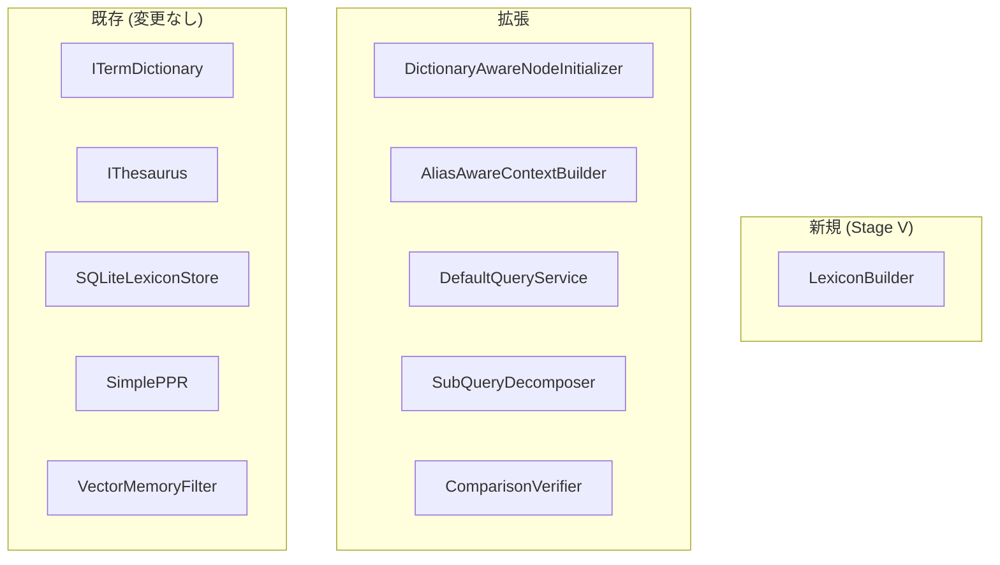
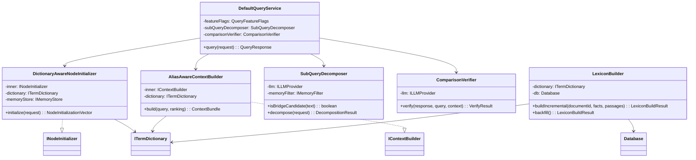
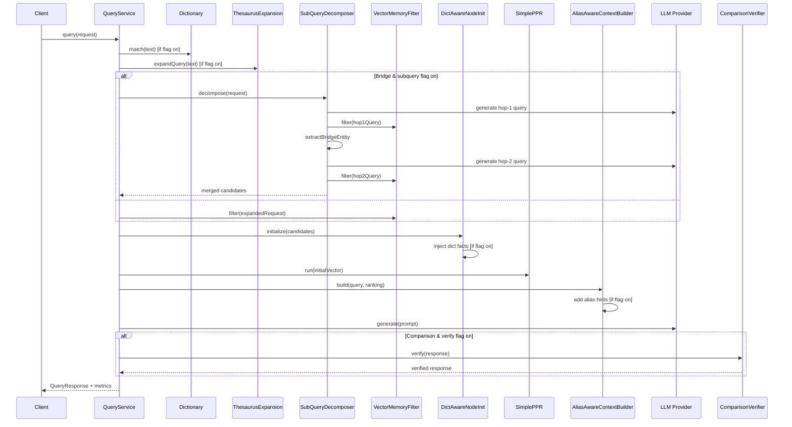

# DES-MEMGRAPHRAG-003: クエリ精度改善 設計書

| フィールド | 値 |
|-----------|---|
| **ID** | DES-MEMGRAPHRAG-003 |
| **バージョン** | 1.5 |
| **ステータス** | Draft |
| **作成日** | 2026-06-15 |
| **更新日** | 2026-06-15 |
| **対応要件** | REQ-MEMGRAPHRAG-003 v1.3 |
| **パッケージ** | `@nahisaho/memgraphrag` |
| **レビュー** | Rubber-duck review ×6 反映済み（v1.0 → v1.5） |

## 1. 設計概要

REQ-MEMGRAPHRAG-003 の 15 要件に対し、既存の 4 層アーキテクチャ（Domain / Application / Infrastructure / Interface）に沿って設計する。新規クラスは最小限に抑え、既存インターフェース（`ITermDictionary`, `IThesaurus`, `INodeInitializer`, `IContextBuilder`）を活用する。

### 変更のスコープ



## 2. フィーチャーフラグ設計 (DES-MG3-009)

### 2.1 型定義

```typescript
// domain/config/featureFlags.ts
export interface QueryFeatureFlags {
  readonly enableDictionaryInjection: boolean;   // default: true
  readonly enableThesaurusExpansion: boolean;     // default: true
  readonly enableHypernymExpansion: boolean;      // default: false
  readonly enableAliasHints: boolean;             // default: true
  readonly enableSubQueryDecomposition: boolean;  // default: true
  readonly enableComparisonVerification: boolean; // default: true
}

export interface EvalFeatureFlags {
  readonly enableEvalAliasNormalization: boolean; // default: true
}

export interface IndexingFeatureFlags {
  readonly enableDictionaryIndexing: boolean;     // default: true
}

export const DEFAULT_QUERY_FLAGS: QueryFeatureFlags = {
  enableDictionaryInjection: true,
  enableThesaurusExpansion: true,
  enableHypernymExpansion: false,
  enableAliasHints: true,
  enableSubQueryDecomposition: true,
  enableComparisonVerification: true,
};

export const DEFAULT_EVAL_FLAGS: EvalFeatureFlags = {
  enableEvalAliasNormalization: true,
};
```

### 2.2 フラグの注入

`QueryServiceDependencies` にオプショナルフィールドとして追加:

```typescript
export interface QueryServiceDependencies {
  // ... 既存フィールド ...
  readonly featureFlags?: QueryFeatureFlags;
}
```

## 3. 辞書自動構築 — Stage V (DES-MG3-001, DES-MG3-002)

### 3.1 LexiconBuilder クラス

```typescript
// application/indexing/LexiconBuilder.ts
export interface LexiconBuildResult {
  readonly dictionaryEntries: number;
  readonly thesaurusRelations: number;
  readonly ambiguousExcluded: number;
  readonly stopwordExcluded: number;
}

export class LexiconBuilder {
  constructor(
    private readonly dictionary: ITermDictionary,
    private readonly db: Database.Database,
    private readonly corpusId: string,
  ) {}

  /**
   * 増分ビルド: 新規ドキュメントの facts/passages から辞書を増分更新。
   * FullDocumentIndexingPipeline.processDocument() の末尾から呼び出される。
   * document_id 単位で evidence を追跡し、再インデキシング時は
   * 旧 evidence を削除してから再計算（冪等性保証）。
   */
  public async buildIncremental(
    documentId: string,
    facts: readonly Fact[],
    passages: readonly Passage[],
  ): Promise<LexiconBuildResult>;

  /**
   * バックフィル: 既存コーパスの全 facts/passages から辞書を全再構築する。
   * REQ-MG3-010a 対応。既存辞書データをクリアしてから再構築。
   */
  public async backfill(): Promise<LexiconBuildResult>;
}
```

**シソーラス永続化**: `IThesaurus.suggestSynonyms()` は関係を返すのみで永続化しない。
`LexiconBuilder` は SQLite の `thesaurus_relations` テーブルに直接 `INSERT OR REPLACE` する。
hypernym 関係も同様に直接永続化する。これは Infrastructure 層の実装詳細であり、
`LexiconBuilder` は `db: Database.Database` を通じてアクセスする。

**冪等性**: `lexicon_evidence` テーブル（新設、辞書＋シソーラス統合）で document_id × entity の証拠を追跡する。

#### Evidence テーブルスキーマ

```sql
CREATE TABLE IF NOT EXISTS lexicon_evidence (
  id INTEGER PRIMARY KEY AUTOINCREMENT,
  corpus_id TEXT NOT NULL REFERENCES corpora(corpus_id) ON DELETE CASCADE,
  document_id TEXT NOT NULL,
  entity_normalized TEXT NOT NULL,  -- 正規化済みエンティティ名（安定キー）
  surface_form TEXT NOT NULL,       -- 原文の表記
  evidence_type TEXT NOT NULL,      -- 'frequency' | 'alias_apposition' | 'alias_parenthetical' | 'alias_cooccurrence' | 'synonym' | 'hypernym'
  related_entity TEXT NOT NULL DEFAULT '',  -- alias/synonym/hypernym の場合の関連エンティティ（なしは空文字）
  occurrence_count INTEGER NOT NULL DEFAULT 1,  -- 同一ドキュメント内の出現回数
  confidence REAL NOT NULL DEFAULT 0.7,
  source_passage_id TEXT,           -- 証拠元パッセージ
  created_at TEXT NOT NULL DEFAULT (datetime('now')),
  UNIQUE(corpus_id, document_id, entity_normalized, surface_form, evidence_type, related_entity)
);
CREATE INDEX IF NOT EXISTS idx_lexicon_evidence_doc ON lexicon_evidence(corpus_id, document_id);
CREATE INDEX IF NOT EXISTS idx_lexicon_evidence_entity ON lexicon_evidence(corpus_id, entity_normalized);
```

**注意**: `occurrence_count` はドキュメント内の出現回数を保持する。同一エンティティが同一ドキュメント内で
複数回出現する場合、UNIQUE 制約により 1 行に集約し、`occurrence_count` を加算する
（`INSERT ... ON CONFLICT DO UPDATE SET occurrence_count = occurrence_count + ?`）。

**マイグレーション**: `lexicon_evidence` テーブルは `SchemaVersionManager` の既存マイグレーション基盤に従い、
新規マイグレーションファイル（例: `migrations/0004_add_lexicon_evidence.sql`）として追加する。
`SQLiteLexiconStore.ensureTables()` での直接作成は行わない（既存コードベースのマイグレーションパターンに準拠）。

#### トランザクショナル再インデックスフロー

再インデキシング時（`buildIncremental` で既知の document_id が渡された場合）:

```typescript
async buildIncremental(documentId: string, facts: Fact[], passages: Passage[]): Promise<LexiconBuildResult> {
  return this.db.transaction(() => {
    // 0. 旧 evidence の影響エンティティを削除前に取得（消滅エンティティ検出用）
    const oldEntities = this.getEntitiesByDocument(documentId);

    // 1. 旧 evidence 削除
    this.db.prepare('DELETE FROM lexicon_evidence WHERE corpus_id = ? AND document_id = ?')
      .run(this.corpusId, documentId);

    // 2. 新 evidence 挿入（Step 1-5 のアルゴリズムで生成）
    const insertResult = this.insertEvidenceForDocument(documentId, facts, passages);

    // 3. 新 evidence の影響エンティティを取得
    const newEntities = this.getEntitiesByDocument(documentId);

    // 4. 旧 + 新の和集合で影響範囲を計算
    const affectedEntities = new Set([...oldEntities, ...newEntities]);

    // 5. 各エンティティの辞書エントリ再計算
    let dictionaryEntries = 0;
    let deletedEntries = 0;
    for (const entity of affectedEntities) {
      const evidenceCount = this.getEvidenceCount(entity);
      if (evidenceCount === 0) {
        this.deleteDictionaryEntry(entity);
        deletedEntries++;
      } else {
        this.recomputeDictionaryEntry(entity);
        dictionaryEntries++;
      }
    }

    // 6. 影響を受けたシソーラス関係の再計算（証拠なしは削除）
    const thesaurusRelations = this.recomputeThesaurusRelations(affectedEntities);

    // 7. 曖昧性の再評価: 複数 entityId に紐づく surfaceForm を除外
    const ambiguousExcluded = this.recomputeAmbiguity();

    return {
      dictionaryEntries,
      thesaurusRelations,
      ambiguousExcluded,
      stopwordExcluded: insertResult.stopwordExcluded,
    } satisfies LexiconBuildResult;
  })();
}

private getEntitiesByDocument(documentId: string): Set<string> {
  const rows = this.db.prepare(
    'SELECT DISTINCT entity_normalized FROM lexicon_evidence WHERE corpus_id = ? AND document_id = ?'
  ).all(this.corpusId, documentId);
  return new Set(rows.map(r => r.entity_normalized));
}

private getEvidenceCount(entity: string): number {
  const row = this.db.prepare(
    'SELECT COUNT(*) as cnt FROM lexicon_evidence WHERE corpus_id = ? AND entity_normalized = ?'
  ).get(this.corpusId, entity);
  return row?.cnt ?? 0;
}

private deleteDictionaryEntry(entity: string): void {
  // term は正規化済みエンティティ名（安定キー）。canonical_form ではなく term で削除。
  this.db.prepare('DELETE FROM term_dictionary WHERE corpus_id = ? AND LOWER(term) = LOWER(?)')
    .run(this.corpusId, entity);
  this.db.prepare('DELETE FROM thesaurus_relations WHERE corpus_id = ? AND (source_term = ? OR target_term = ?)')
    .run(this.corpusId, entity, entity);
}
```

辞書エントリの `frequency` / `confidence` は evidence テーブルからの集計クエリで再計算:

```sql
-- frequency 再計算（occurrence_count の合計）
SELECT entity_normalized, SUM(occurrence_count) as freq
FROM lexicon_evidence WHERE corpus_id = ? AND evidence_type = 'frequency'
GROUP BY entity_normalized;

-- canonical_form 再計算（最高頻度の surface_form を採用）
SELECT entity_normalized, surface_form, SUM(occurrence_count) as surface_freq
FROM lexicon_evidence WHERE corpus_id = ? AND evidence_type = 'frequency'
GROUP BY entity_normalized, surface_form
ORDER BY surface_freq DESC;

-- confidence 再計算（全 evidence_type から最高信頼度を採用、frequency-only は 0.7 デフォルト）
SELECT entity_normalized, COALESCE(MAX(confidence), 0.7) as max_confidence
FROM lexicon_evidence WHERE corpus_id = ?
GROUP BY entity_normalized;
```

### 3.2 エンティティ解決アルゴリズム

```
Input: corpus の全 facts + passages
Output: term_dictionary entries, thesaurus_relations

Step 1: エンティティ頻度集計
  - 全 facts の headEntity, tailEntity を小文字正規化
  - Map<normalizedEntity, { surfaces: Map<originalForm, count>, totalCount }>

Step 2: エイリアス検出
  For each passage:
    - 同格構文パターン検出:
      (a) "X, also known as Y" / "X, a.k.a. Y" / "X, or Y"
      (b) "X (Y)" — 括弧内エイリアス
    - 同一 NER タイプ + Jaccard ≥ 0.8 + 共出現 ≥ 2 passages の検出
  → aliasGroups: Map<canonicalEntityId, Set<surfaceForms>>

Step 3: 曖昧性除外
  - 複数の異なる entityId に紐づく surfaceForm を除外
  → cleanAliasGroups

Step 4: 辞書エントリ生成
  For each entityId:
    - term_id = `lex:${corpusId}:${entityNormalized}` (corpus-scoped, 決定論的)
    - term = entityNormalized
    - canonical_form = 最高頻度の surfaceForm
    - aliases = 他の surfaceForms（曖昧なものを除く）
    - frequency = totalCount
    - confidence = aliasEvidence に基づくスコア（同格構文: 0.9, NER+Jaccard: 0.7, frequency-only: 0.7）
    - domainCategory = ファクトの headType/tailType から推定（未設定の場合 'general'）
    - source = 'extracted'
  → dictionary.upsertEntries(entries)

**term_id の生成規則**: `lex:${corpusId}:${entityNormalized}` 形式で生成する。
これにより同一エンティティが複数コーパスに存在しても `INSERT OR REPLACE` による
コーパス間干渉を防止する。シソーラス関係の `relation_id` も同様に
`rel:${corpusId}:${sourceNormalized}:${targetNormalized}:${relationType}` で生成する。

Step 5: シソーラス関係生成
  For each aliasGroup:
    - synonym 関係: canonical ↔ 各 alias（bidirectional=true）
  For each passage with apposition "X, a Y":
    - hypernym 関係: X → Y（bidirectional=false）
  - stopword 除外: 頻度上位 1% のエンティティは関係生成から除外
  → thesaurus.suggestSynonyms(pairs)
```

### 3.3 パイプライン統合

`FullDocumentIndexingPipeline` に `LexiconBuilder` ファクトリを注入し、corpus ごとにインスタンスを生成する:

```typescript
// FullDocumentIndexingPipeline のオプション拡張
export interface FullPipelineOptions {
  // ... 既存オプション ...
  enableDictionaryIndexing?: boolean;  // default: true
  lexiconBuilderFactory?: (corpusId: string) => LexiconBuilder;
}

// processDocument() に Stage V を追加:
// 重要: Stage V は早期リターン前にも実行する。
// 再インデキシングで抽出結果が0件になった場合でも、旧 evidence のクリーンアップが必要。

// Stage V: Lexicon construction / cleanup
if (this.options.enableDictionaryIndexing !== false && this.options.lexiconBuilderFactory) {
  const lexiconBuilder = this.options.lexiconBuilderFactory(corpusId);
  // allFacts/passages が空の場合でも buildIncremental は旧 evidence を削除し、
  // 影響エンティティの辞書エントリを再計算（→ 証拠0件で削除）する。
  await lexiconBuilder.buildIncremental(document.documentId, allFacts, passages);
}
```

**注意**: 既存パイプラインの早期リターン（抽出結果0件時の `return` 前）にも
Stage V の cleanup を追加すること。具体的には:

```typescript
// processDocument() の早期リターンパス
if (allFacts.length === 0 && passages.length === 0) {
  // Stage V cleanup: 旧 evidence の削除
  if (this.options.enableDictionaryIndexing !== false && this.options.lexiconBuilderFactory) {
    const lexiconBuilder = this.options.lexiconBuilderFactory(corpusId);
    await lexiconBuilder.buildIncremental(document.documentId, [], []);
  }
  return emptyResult;
}
```

`MemGraphRagRuntime` でファクトリを構築:

```typescript
// MemGraphRagRuntime での組み立て
const lexiconBuilderFactory = (corpusId: string) => new LexiconBuilder(
  new SQLiteLexiconStore(db, corpusId),
  db,
  corpusId,
);
```

**増分ビルド**: ドキュメント単位で呼び出される。冪等性は `lexicon_evidence` テーブルによるトランザクショナル再インデックスフロー（§3.1）で保証される。同一ドキュメントの再インデキシング時は旧 evidence を削除してから新 evidence を挿入し、影響エンティティの辞書エントリ・シソーラス関係を再計算する。

### 3.4 バックフィルコマンド (DES-MG3-010a)

```typescript
// interface/cli/lexiconCommand.ts
export function registerLexiconCommand(program: Command): void {
  program.command('lexicon')
    .command('build <corpusId>')
    .description('Build dictionary/thesaurus from existing indexed data')
    .action(async (corpusId) => { /* ... */ });
}
```

## 4. 辞書注入 — DictionaryAwareNodeInitializer (DES-MG3-003)

### 4.1 Decorator パターン

既存の `SimpleNodeInitializer` をラップし、辞書マッチに基づくファクト注入を追加する。

```typescript
// application/query/DictionaryAwareNodeInitializer.ts
export class DictionaryAwareNodeInitializer implements INodeInitializer {
  constructor(
    private readonly inner: INodeInitializer,
    private readonly dictionary: ITermDictionary,
    private readonly memoryStore: IMemoryStore,
    private readonly flags: QueryFeatureFlags,
  ) {}

  public async initialize(request: NodeInitializationRequest): Promise<NodeInitializationVector> {
    const base = await this.inner.initialize(request);

    if (!this.flags.enableDictionaryInjection) return base;

    const matches = await this.dictionary.match(request.query.text, 'unknown');
    if (matches.length === 0) return base;

    const scores = { ...base.scores };
    const baseValues = Object.values(base.scores).filter(v => v > 0);
    // ベクトル結果がある場合は maxBaseScore × 0.3、ない場合はデフォルト 0.3 で注入
    // いずれの場合も L1 正規化により相対スコアは調整される
    const maxBaseScore = baseValues.length > 0 ? Math.max(...baseValues) : 1.0;
    const snapshot = await this.memoryStore.load(request.query.corpusId);

    let injectedCount = 0;
    const MAX_PER_ENTITY = 10;
    const MAX_TOTAL = 30;

    for (const match of matches) {
      if (match.entry.confidence < 0.5) continue;
      let entityInjected = 0;
      const canonical = match.entry.canonicalForm.toLowerCase();
      const aliases = [canonical, ...match.entry.aliases.map(a => a.toLowerCase())];

      for (const fact of snapshot.facts) {
        if (injectedCount >= MAX_TOTAL) break;
        if (entityInjected >= MAX_PER_ENTITY) break;
        // 非アクティブファクトは除外
        if (fact.state !== undefined && fact.state !== 'active') continue;

        const factKey = `fact:${fact.factId}`;
        if (scores[factKey] !== undefined) continue;

        const head = fact.headEntity.toLowerCase();
        const tail = fact.tailEntity.toLowerCase();
        if (aliases.some(a => head === a || tail === a)) {
          scores[factKey] = maxBaseScore * 0.3;
          injectedCount++;
          entityInjected++;
        }
      }
    }

    // L1 normalize
    if (injectedCount > 0) {
      const sum = Object.values(scores).reduce((a, b) => a + b, 0);
      if (sum > 0) {
        for (const key of Object.keys(scores)) {
          scores[key] = scores[key]! / sum;
        }
      }
    }

    return { scores, fallbackTriggered: base.fallbackTriggered, injectedCount };
  }
}
```

**注入数メトリクス**: `NodeInitializationVector` に `injectedCount?: number` を追加（オプショナル、後方互換）。`QueryService` はこの値を `QueryMetrics.dictionaryInjectedCount` に転記する。

**パフォーマンス注意**: 大規模コーパス（20万ノード超）では `memoryStore.load()` の全ファクトスキャンが p95 レイテンシに影響する可能性がある。CachedMemoryStore 使用時はインメモリのため問題ないが、キャッシュなしの場合は `(corpus_id, head_entity)` / `(corpus_id, tail_entity)` のインデックス付き SQL クエリへのフォールバックを検討する。

### 4.2 メトリクス

`QueryService.query()` 内で注入数を記録:

```typescript
dictionaryInjectedCount: initialVector.injectedCount ?? 0
```

## 5. シソーラス展開強化 (DES-MG3-004)

既存の `ThesaurusExpansionPolicy` はトークン単位で展開するため、マルチワードエイリアス（"Lord Byron" 等）に対応できない。以下の拡張を行う:

### 5.1 コンストラクタ拡張

```typescript
// application/query/ThesaurusExpansionPolicy.ts
export class ThesaurusExpansionPolicy {
  constructor(
    private readonly thesaurus: IThesaurus,
    private readonly dictionary: ITermDictionary,  // 新規追加: フレーズマッチ用
    private readonly options: ThesaurusExpansionOptions = {},
  ) {}

  public async expandQuery(query: string): Promise<QueryExpansion> {
    const expandedTerms: string[] = [];
    const seen = new Set<string>();

    // Phase 1: 辞書ベースのフレーズマッチ（longest-match-first）
    const matches = await this.dictionary.match(query, 'unknown');
    // matchedText の長さ（実際にマッチしたスパン）で降順ソート
    // 短い別名による誤マッチを防ぎ、重複するスパンは最長一致を優先
    const sortedMatches = [...matches].sort(
      (a, b) => (b.matchedText?.length ?? b.entry.canonicalForm.length)
              - (a.matchedText?.length ?? a.entry.canonicalForm.length)
    );
    const consumedSpans: Array<[number, number]> = []; // 重複スパン抑制用
    for (const match of sortedMatches) {
      if (match.entry.confidence < 0.5) continue;
      for (const alias of match.entry.aliases) {
        const normalized = alias.toLowerCase();
        if (!seen.has(normalized) && normalized !== match.entry.canonicalForm.toLowerCase()) {
          seen.add(normalized);
          expandedTerms.push(alias);
        }
      }
      // canonical 自体も展開候補に（クエリにエイリアスが含まれる場合）
      const canonical = match.entry.canonicalForm;
      if (!seen.has(canonical.toLowerCase())) {
        seen.add(canonical.toLowerCase());
        expandedTerms.push(canonical);
      }
    }

    // Phase 2: 既存のトークン単位シソーラス展開（synonym/hypernym）
    // IThesaurus.getRelations() で全関係を取得し、relationType でフィルタ
    const tokens = tokenize(query);
    for (const token of tokens) {
      const relations = await this.thesaurus.getRelations(token);

      // synonym
      const synonyms = relations
        .filter(r => r.relationType === 'synonym')
        .map(r => r.targetTerm);
      for (const syn of synonyms.slice(0, this.options.synonymLimit ?? 3)) {
        if (!seen.has(syn.toLowerCase())) {
          seen.add(syn.toLowerCase());
          expandedTerms.push(syn);
        }
      }

      // hypernym（フラグ連動）
      if ((this.options.hypernymLimit ?? 0) > 0) {
        const hypernyms = relations
          .filter(r => r.relationType === 'hypernym')
          .map(r => r.targetTerm);
        for (const hyp of hypernyms.slice(0, this.options.hypernymLimit)) {
          if (!seen.has(hyp.toLowerCase())) {
            seen.add(hyp.toLowerCase());
            expandedTerms.push(hyp);
          }
        }
      }
    }

    // 重複排除・曖昧エンティティ除外（dictionary が曖昧と判定したものは除外）
    const rewrittenQuery = expandedTerms.length > 0
      ? `${query} (${expandedTerms.join(', ')})`
      : query;

    return { originalQuery: query, expandedTerms, rewrittenQuery };
  }
}
```

### 5.2 フラグ連動

```typescript
// MemGraphRagRuntime での組み立て
new ThesaurusExpansionPolicy(thesaurus, dictionary, {
  synonymLimit: 3,
  hypernymLimit: flags.enableHypernymExpansion ? 2 : 0,
});
```

### 5.3 辞書マッチングの改修

`SQLiteLexiconStore.match()` を改修し、トークン境界を考慮した完全一致に変更:

```typescript
// 現行: haystack.includes(normalizeText(candidate))
// 改修: \\b ワード境界 + 完全一致
const pattern = new RegExp(`\\b${escapeRegex(normalizeText(candidate))}\\b`);
if (pattern.test(haystack)) { ... }
```

### 5.4 QueryService 統合

```typescript
// QueryService.query() 内
const expansion = flags.enableThesaurusExpansion
  ? await this.dependencies.expansionPolicy.expandQuery(normalizedText)
  : { originalQuery: normalizedText, expandedTerms: [], rewrittenQuery: normalizedText };
```

## 6. エイリアスヒント — AliasAwareContextBuilder (DES-MG3-005)

### 6.1 Decorator パターン

```typescript
// application/query/AliasAwareContextBuilder.ts
export class AliasAwareContextBuilder implements IContextBuilder {
  constructor(
    private readonly inner: IContextBuilder,
    private readonly dictionary: ITermDictionary,
    private readonly flags: QueryFeatureFlags,
  ) {}

  public async build(query: QueryRequest, ranking: PPRResult): Promise<ContextBundle> {
    const base = await this.inner.build(query, ranking);

    if (!this.flags.enableAliasHints) return base;

    // コンテキスト内のエンティティを抽出
    const entityMentions = this.extractEntities(base);
    const matches = await this.dictionary.match(
      entityMentions.join(' '), 'unknown'
    );

    // エイリアスヒントセクション構築
    const hints = matches
      .filter(m => m.entry.aliases.length > 0 && m.entry.confidence >= 0.5)
      .map(m => `- ${m.entry.canonicalForm} (also known as: ${m.entry.aliases.join(', ')})`)
      .slice(0, 10); // 最大10エンティティ

    if (hints.length === 0) return { ...base, metadata: { ...base.metadata, aliasHintCount: 0 } };

    const contextTokens = Math.ceil(base.promptContext.length / 4);
    const budget = contextTokens * 0.1;

    // 10% トークン増加制限: greedy に実際のトークン数をチェック
    const selected: string[] = [];
    for (const hint of hints) {
      const candidateSection = `\n## Entity Aliases\n${[...selected, hint].join('\n')}\n`;
      if (Math.ceil(candidateSection.length / 4) > budget) break;
      selected.push(hint);
    }

    if (selected.length === 0) {
      return { ...base, metadata: { ...base.metadata, aliasHintCount: 0 } };
    }

    const hintSection = `\n## Entity Aliases\n${selected.join('\n')}\n`;
    return {
      ...base,
      promptContext: base.promptContext + hintSection,
      metadata: { ...base.metadata, aliasHintCount: selected.length },
    };
  }
}
```

## 7. 評価エイリアス正規化 (DES-MG3-006)

ベンチマークスクリプト内の `normalizedContains` 関数を拡張:

```javascript
// scripts/benchmark-hotpotqa-ladybug.mjs
function aliasNormalizedContains(response, goldAnswer, aliasMap) {
  // Step 1: 通常の normalizedContains
  if (normalizedContains(response, goldAnswer)) return true;
  if (!aliasMap || aliasMap.size === 0) return false;

  // Step 2: 対称的エイリアス正規化
  const respAliases = expandToAliasSet(response, aliasMap);
  const goldAliases = expandToAliasSet(goldAnswer, aliasMap);
  
  // 等価集合の交差判定
  for (const r of respAliases) {
    for (const g of goldAliases) {
      if (normalizedContains(r, g)) return true;
    }
  }
  return false;
}
```

## 8. 2-hop サブクエリ分解 (DES-MG3-007, DES-MG3-008)

### 8.1 SubQueryDecomposer クラス

```typescript
// application/query/SubQueryDecomposer.ts

export interface DecompositionResult {
  readonly decomposed: boolean;
  readonly hop1Query?: string;
  readonly expectedBridgeType?: string;
  readonly bridgeEntity?: string;
  readonly hop2Query?: string;
  readonly fallbackReason?: string;
  // マージ用に検索結果も返す
  readonly hop1Candidates?: FilteredMemoryCandidates;
  readonly hop2Candidates?: FilteredMemoryCandidates;
}

export class SubQueryDecomposer {
  constructor(
    private readonly decompositionLlm: ILLMProvider, // gpt-5.4-mini 専用
    private readonly memoryFilter: IMemoryFilter,
    private readonly perHopTimeoutMs: number = 3000,
    private readonly totalTimeoutMs: number = 8000,
  ) {}

  /**
   * Bridge 検出: isComparisonQuery=false かつ連鎖パターンあり
   */
  public isBridgeCandidate(text: string): boolean {
    if (isComparisonQuery(text)) return false;
    return BRIDGE_PATTERNS.test(text);
  }

  /**
   * 逐次 2-hop 分解
   * 全体を totalTimeoutMs で制御し、LLM 生成と検索の両方をタイムアウト対象とする。
   */
  public async decompose(
    request: QueryRequest,
  ): Promise<DecompositionResult> {
    const deadline = Date.now() + this.totalTimeoutMs;

    // Step 1: LLM で hop-1 サブクエリ生成（Promise.race でタイムアウト制御）
    const hop1Result = await this.withTimeout(
      this.generateHop1(request.text),
      this.perHopTimeoutMs,
    );
    if (!hop1Result) return { decomposed: false, fallbackReason: 'hop1_generation_timeout' };

    // Step 2: hop-1 ベクトル検索（残時間チェック + タイムアウト制御）
    let remaining = deadline - Date.now();
    if (remaining <= 0) return { decomposed: false, fallbackReason: 'timeout' };
    const hop1Candidates = await this.withTimeout(
      this.memoryFilter.filter({ ...request, text: hop1Result.hop1Query }),
      Math.min(this.perHopTimeoutMs, remaining),
    );
    if (!hop1Candidates || hop1Candidates.passages.length === 0) {
      return { decomposed: false, fallbackReason: hop1Candidates ? 'hop1_no_results' : 'hop1_retrieval_timeout' };
    }

    // Step 3: ブリッジエンティティ抽出（エビデンスベース）
    const bridge = this.extractBridgeEntity(
      hop1Candidates, hop1Result.expectedBridgeType
    );
    if (!bridge) return { decomposed: false, fallbackReason: 'bridge_extraction_failed' };

    // Step 4: hop-2 サブクエリ生成（deadline チェック + Promise.race）
    remaining = deadline - Date.now();
    if (remaining <= 0) return { decomposed: false, fallbackReason: 'timeout' };
    const hop2Query = await this.withTimeout(
      this.generateHop2(request.text, bridge),
      Math.min(this.perHopTimeoutMs, remaining),
    );
    if (!hop2Query) return { decomposed: false, fallbackReason: 'hop2_generation_timeout' };

    // Step 5: hop-2 ベクトル検索（残時間チェック + タイムアウト制御）
    remaining = deadline - Date.now();
    if (remaining <= 0) return { decomposed: false, fallbackReason: 'timeout' };
    const hop2Candidates = await this.withTimeout(
      this.memoryFilter.filter({ ...request, text: hop2Query }),
      Math.min(this.perHopTimeoutMs, remaining),
    );
    if (!hop2Candidates) return { decomposed: false, fallbackReason: 'hop2_retrieval_timeout' };

    return {
      decomposed: true,
      hop1Query: hop1Result.hop1Query,
      expectedBridgeType: hop1Result.expectedBridgeType,
      bridgeEntity: bridge,
      hop2Query,
      hop1Candidates,
      hop2Candidates,
    };
  }

  private async withTimeout<T>(promise: Promise<T>, ms: number): Promise<T | null> {
    return Promise.race([
      promise,
      new Promise<null>((resolve) => setTimeout(() => resolve(null), ms)),
    ]);
  }
}
```

### 8.2 Bridge 検出パターン

```typescript
const BRIDGE_PATTERNS = /\b(the\s+(director|author|founder|creator|singer|actor|writer|producer|composer|star|member|captain|president|manager|coach|wife|husband|son|daughter|father|mother)\s+of|who\s+(directed|wrote|founded|created|starred|played|composed|produced|sang)\s+|that\s+(was|is|has|had|were|are)\s+|where\s+(the|a|an)\s+)/i;
```

### 8.3 QueryService への統合

```typescript
// QueryService.query() — 辞書マッチ/展開後、PPR 前に挿入
if (flags.enableSubQueryDecomposition && this.subQueryDecomposer?.isBridgeCandidate(normalizedText)) {
  const decomposition = await this.subQueryDecomposer.decompose(expandedRequest);
  if (decomposition.decomposed && decomposition.hop1Candidates && decomposition.hop2Candidates) {
    // マージ重み: original 0.4 + hop1 0.3 + hop2 0.3
    candidates = mergeCandidates(candidates, decomposition.hop1Candidates, decomposition.hop2Candidates, [0.4, 0.3, 0.3]);
  }
}
```

### 8.4 候補マージ

```typescript
function mergeCandidates(
  original: FilteredMemoryCandidates,
  hop1: FilteredMemoryCandidates,
  hop2: FilteredMemoryCandidates,
  weights: [number, number, number],
): FilteredMemoryCandidates {
  const merged = new Map<string, { item: Fact; similarity: number }>();
  
  for (const [candidates, weight] of [
    [original.facts, weights[0]],
    [hop1.facts, weights[1]],
    [hop2.facts, weights[2]],
  ] as const) {
    for (const c of candidates) {
      const key = c.item.factId;
      const existing = merged.get(key);
      const weighted = c.similarity * weight;
      if (!existing || existing.similarity < weighted) {
        merged.set(key, { item: c.item, similarity: weighted });
      }
    }
  }
  // 同様に passages, ontology もマージ
  // ...
}
```

## 9. Comparison 回答検証 (DES-MG3-014)

### 9.1 ComparisonVerifier クラス

```typescript
// application/query/ComparisonVerifier.ts

/** extractFinalAnswer を共有ユーティリティとして query-utils.ts に移動 */
import { extractFinalAnswer } from './query-utils.js';

export class ComparisonVerifier {
  constructor(private readonly llm: ILLMProvider) {}

  /**
   * 回答に両エンティティの比較属性が含まれるか検証。
   * 不十分な場合、プロンプト強化で再生成を 1 回試行。
   * 再生成後も不十分な場合は initialAnswer（初回回答）を返す。
   */
  public async verify(
    initialAnswer: string,
    rawResponse: string,
    query: string,
    context: string,
    hyperParams: QueryHyperParams,
  ): Promise<{ response: string; verified: boolean }> {
    if (this.hasExplicitComparison(rawResponse)) {
      return { response: initialAnswer, verified: true };
    }

    // 再生成（1回のみ）
    const enhancedPrompt = `${query}\n\nIMPORTANT: Before giving your yes/no answer, you MUST explicitly state the relevant attribute or value for EACH entity being compared. Then derive your answer from those values.\n\nContext:\n${context}\n\nReasoning and answer:`;
    
    try {
      const result = await this.llm.generate({
        prompt: enhancedPrompt,
        temperature: 0.0,
        reasoningEffort: hyperParams.reasoningEffort,
        verbosity: hyperParams.verbosity,
      });
      
      const regenerated = extractFinalAnswer(result.text);
      if (this.hasExplicitComparison(result.text)) {
        return { response: regenerated, verified: true };
      }
    } catch {
      // 再生成失敗時は初回回答を採用
    }
    
    // 再生成後も不十分 → 初回回答を採用（REQ-MG3-014: 回答拒否はしない）
    return { response: initialAnswer, verified: false };
  }
}
```

## 10. QueryMetrics 拡張 (DES-MG3-013)

### 10.1 メトリクス型定義

```typescript
export interface QueryMetrics {
  // 既存
  readonly dictionaryMatchCount: number;
  readonly expandedTerms: readonly string[];
  readonly fallbackTriggered: boolean;
  readonly pprIterations: number;
  readonly pprConverged: boolean;
  readonly citedPassageCount: number;
  readonly llmInputTokens: number;
  readonly llmOutputTokens: number;
  readonly scVotes?: readonly string[];
  // 新規
  readonly dictionaryInjectedCount: number;
  readonly subQueryDecomposed: boolean;
  readonly bridgeEntityExtracted: boolean;
  readonly subQueryFallbackReason?: string;
  readonly aliasHintCount: number;
  readonly comparisonVerified?: boolean;
}
```

### 10.2 メトリクス伝搬パス

各コンポーネントからメトリクスを QueryService に伝搬する仕組み:

| メトリクス | ソース | 伝搬方法 |
|-----------|-------|---------|
| `dictionaryInjectedCount` | `DictionaryAwareNodeInitializer` | `NodeInitializationVector.injectedCount` (オプショナルフィールド) |
| `aliasHintCount` | `AliasAwareContextBuilder` | `ContextBundle.metadata.aliasHintCount` (オプショナル metadata フィールド新設) |
| `subQueryDecomposed` | `SubQueryDecomposer` | `DecompositionResult.decomposed` |
| `bridgeEntityExtracted` | `SubQueryDecomposer` | `DecompositionResult.bridgeEntity !== undefined` |
| `subQueryFallbackReason` | `SubQueryDecomposer` | `DecompositionResult.fallbackReason` |
| `comparisonVerified` | `ComparisonVerifier` | `verify()` の戻り値 `.verified` |

#### ContextBundle メタデータ拡張

既存の `ContextBundle` インターフェース（`promptContext`, `citedPassages`, `citedFacts`, `confidence`）は変更しない。オプショナルな `metadata` フィールドのみ追加:

```typescript
// domain/retrieval/ppr.ts — 既存インターフェースの拡張（後方互換）
export interface ContextBundle {
  readonly promptContext: string;
  readonly citedPassages: readonly Passage[];
  readonly citedFacts: readonly Fact[];
  readonly confidence: number;
  // v0.3.0 追加（オプショナル、後方互換）
  readonly metadata?: {
    readonly aliasHintCount?: number;
  };
}
```

`AliasAwareContextBuilder.build()` は `metadata.aliasHintCount` を設定して返す:

```typescript
// AliasAwareContextBuilder の greedy 選択後:
return {
  ...base,
  promptContext: base.promptContext + hintSection,
  metadata: { ...base.metadata, aliasHintCount: selected.length },
};
```

#### QueryService でのメトリクス組み立て

```typescript
// QueryService.query() 内
const metrics: QueryMetrics = {
  // ... 既存フィールド ...
  dictionaryInjectedCount: initialVector.injectedCount ?? 0,
  aliasHintCount: contextBundle.metadata?.aliasHintCount ?? 0,
  subQueryDecomposed: decomposition?.decomposed ?? false,
  bridgeEntityExtracted: decomposition?.bridgeEntity !== undefined,
  subQueryFallbackReason: decomposition?.fallbackReason,
  comparisonVerified: cvResult?.verified,
};
```

### 10.3 ベンチマーク結果スキーマ

ベンチマークスクリプトの per-question JSON に追加:

```json
{
  "evalAliasNormalized": true,
  "evalOriginalCorrect": false,
  "evalNormalizedCorrect": true
}
```

`evalAliasNormalized` はベンチマーク結果にのみ記録される（product `QueryMetrics` には含まない）。
これにより、product accuracy と eval accuracy を後から分離分析可能。

## 11. クラス図



## 12. シーケンス図 — 強化クエリパイプライン



## 13. ファイル構成

### 新規ファイル

| ファイル | 層 | 対応 DES |
|---------|---|---------|
| `src/domain/config/featureFlags.ts` | Domain | DES-MG3-009 |
| `src/application/indexing/LexiconBuilder.ts` | Application | DES-MG3-001, 002 |
| `src/application/query/DictionaryAwareNodeInitializer.ts` | Application | DES-MG3-003 |
| `src/application/query/AliasAwareContextBuilder.ts` | Application | DES-MG3-005 |
| `src/application/query/SubQueryDecomposer.ts` | Application | DES-MG3-007, 008 |
| `src/application/query/ComparisonVerifier.ts` | Application | DES-MG3-014 |
| `src/application/query/query-utils.ts` | Application | 共有ユーティリティ（extractFinalAnswer 等） |
| `src/interface/cli/lexiconCommand.ts` | Interface | DES-MG3-010a |
| `migrations/0004_add_lexicon_evidence.sql` | Infrastructure | DES-MG3-001 |

### 変更ファイル

| ファイル | 変更内容 | 対応 DES |
|---------|---------|---------|
| `src/application/query/QueryService.ts` | フラグ制御・SubQuery/CV 統合・メトリクス拡張 | DES-MG3-003,004,007,013,014 |
| `src/application/query/ThesaurusExpansionPolicy.ts` | フレーズマッチ対応の拡張 | DES-MG3-004 |
| `src/application/indexing/FullDocumentIndexingPipeline.ts` | Stage V 呼び出し追加 | DES-MG3-001 |
| `src/infrastructure/storage/SQLiteLexiconStore.ts` | トークン境界マッチング改修 | DES-MG3-003 |
| `src/domain/retrieval/memoryFilter.ts` | NodeInitializationVector に injectedCount 追加 | DES-MG3-013 |
| `src/interface/runtime/MemGraphRagRuntime.ts` | Decorator 組み立て | DES-MG3-003,005 |
| `scripts/benchmark-hotpotqa-ladybug.mjs` | aliasNormalizedContains・フラグ対応・アブレーション | DES-MG3-006,011,012 |
| `scripts/benchmark-hotpotqa.mjs` | 同上 | DES-MG3-006,011,012 |

## 14. トレーサビリティ

| 要件 ID | 設計 ID | 実装クラス/ファイル |
|---------|--------|-------------------|
| REQ-MG3-001 | DES-MG3-001 | `LexiconBuilder.buildIncremental()` / `backfill()` |
| REQ-MG3-002 | DES-MG3-002 | `LexiconBuilder` (synonym/hypernym 生成) |
| REQ-MG3-003 | DES-MG3-003 | `DictionaryAwareNodeInitializer` |
| REQ-MG3-004 | DES-MG3-004 | `ThesaurusExpansionPolicy` + フラグ制御 |
| REQ-MG3-005 | DES-MG3-005 | `AliasAwareContextBuilder` |
| REQ-MG3-006 | DES-MG3-006 | `aliasNormalizedContains()` (benchmark scripts) |
| REQ-MG3-007 | DES-MG3-007 | `SubQueryDecomposer` |
| REQ-MG3-008 | DES-MG3-008 | `SubQueryDecomposer.isBridgeCandidate()` |
| REQ-MG3-009 | DES-MG3-009 | `QueryFeatureFlags` + 各クラスのフラグ参照 |
| REQ-MG3-010 | DES-MG3-010 | 既存レイテンシ制約 + タイムアウト設定 |
| REQ-MG3-010a | DES-MG3-010a | `lexiconCommand.ts` + `LexiconBuilder.backfill()` |
| REQ-MG3-011 | DES-MG3-011 | ベンチマークスクリプトのアブレーション機能 |
| REQ-MG3-012 | DES-MG3-012 | フラグ全無効時の条件分岐 |
| REQ-MG3-013 | DES-MG3-013 | `QueryMetrics` 拡張 |
| REQ-MG3-014 | DES-MG3-014 | `ComparisonVerifier` |

## 15. 設計判断 (ADR)

### ADR-1: Decorator パターン vs サービス内統合

**決定**: Decorator パターン（`DictionaryAwareNodeInitializer`, `AliasAwareContextBuilder`）を採用。

**理由**: 既存クラス（`SimpleNodeInitializer`, `SimpleContextBuilder`）を変更せずに機能追加でき、フィーチャーフラグによる有効/無効切り替えが容易。テスト時に内部クラスを単独でテスト可能。

### ADR-2: SubQueryDecomposer を QueryService から分離

**決定**: `SubQueryDecomposer` を独立クラスとして設計。

**理由**: 2-hop 分解はLLM呼び出し + ベクトル検索の複雑なフローを含み、QueryService に埋め込むと責務過多になる。独立テストが容易。

### ADR-3: hop-2 クエリ構築方法

**決定**: LLM ベースの hop-2 クエリ生成を採用（テンプレートではない）。

**理由**: Bridge 問題の質問構造は多様であり、テンプレートでは十分にカバーできない。hop-1 で得たブリッジエンティティと元の質問を LLM に渡し、hop-2 サブクエリを動的に生成する。コストは gpt-5.4-mini 使用により最小化。

### ADR-5: LexiconBuilder の DB 依存

**決定**: `LexiconBuilder`（Application 層）が `Database.Database` を直接受け取る設計を許容する。

**理由**: `IThesaurus` インターフェースは `suggestSynonyms()` のみで永続化メソッドを持たない。
`ILexiconEvidenceStore` のような新規ポートを追加する選択肢もあるが、
evidence テーブルは LexiconBuilder 専用の内部構造であり、他の実装（in-memory 等）で差し替える
実用的なユースケースが現時点では存在しない。テスト時は `:memory:` SQLite を使用する。
将来的にマルチバックエンド対応が必要になった時点で `ILexiconEvidenceStore` を抽出する（YAGNI）。

### ADR-4: v15 同一性の検証方法

**決定**: 全クエリ時フラグ無効 + 評価フラグ無効時に、v15 ベンチマーク結果ファイル（`results_ladybug_500.json`）と per-question の response 一致率で検証。

**理由**: byte-for-byte 一致は LLM の非決定性により不可能。検証は 2 段階で行う:

1. **パス/フェイル基準（REQ-MG3-012 準拠）**: 精度が 87.6%（v15 同一）であること。非決定性により精度が変動した場合は、同一設定で 3 回実行し中央値を採用する。中央値が 87.6% でない場合はフェイルとする。
2. **診断情報（参考値）**: response 完全一致率を報告する（期待値 ≥ 98%）。一致率が低い場合はコード変更による退行の可能性を調査する。

## 16. アブレーションベンチマーク設計 (DES-MG3-011)

### 16.1 ベンチマーク CLI フラグ

```javascript
// scripts/benchmark-hotpotqa-ladybug.mjs
const ABLATION_FLAGS = {
  '--no-dictionary-injection': { enableDictionaryInjection: false },
  '--no-thesaurus-expansion': { enableThesaurusExpansion: false },
  '--no-alias-hints': { enableAliasHints: false },
  '--no-subquery-decomposition': { enableSubQueryDecomposition: false },
  '--no-comparison-verification': { enableComparisonVerification: false },
  '--no-eval-alias': { enableEvalAliasNormalization: false },
  '--v15-baseline': {
    // 全フラグ無効（v15 同一性検証用）
    enableDictionaryInjection: false,
    enableThesaurusExpansion: false,
    enableAliasHints: false,
    enableSubQueryDecomposition: false,
    enableComparisonVerification: false,
    enableEvalAliasNormalization: false,
  },
};
```

### 16.2 アブレーション出力 JSON

```json
{
  "ablation": {
    "flagsDisabled": ["enableDictionaryInjection"],
    "baselineAccuracy": 0.876,
    "ablatedAccuracy": 0.854,
    "delta": -0.022,
    "questionsFlipped": {
      "gainedCorrect": ["q_001", "q_042"],
      "lostCorrect": ["q_103", "q_205", "q_310"]
    }
  }
}
```

### 16.3 アブレーション実行手順

```bash
# 1. 全フラグ ON (v0.3.0 フル機能)
node scripts/benchmark-hotpotqa-ladybug.mjs --tag v16-full

# 1b. プロダクト精度ゲート（eval正規化OFF）
node scripts/benchmark-hotpotqa-ladybug.mjs --no-eval-alias --tag v16-product

# 2. 個別フラグ OFF (各機能の寄与度測定)
node scripts/benchmark-hotpotqa-ladybug.mjs --no-dictionary-injection --tag v16-no-dict
node scripts/benchmark-hotpotqa-ladybug.mjs --no-thesaurus-expansion --tag v16-no-thes
node scripts/benchmark-hotpotqa-ladybug.mjs --no-alias-hints --tag v16-no-alias
node scripts/benchmark-hotpotqa-ladybug.mjs --no-subquery-decomposition --tag v16-no-sq
node scripts/benchmark-hotpotqa-ladybug.mjs --no-comparison-verification --tag v16-no-cv

# 3. v15 同一性検証
node scripts/benchmark-hotpotqa-ladybug.mjs --v15-baseline --tag v16-v15baseline
```

### 16.4 パス/フェイル基準

| 基準 | 条件 | 根拠 |
|------|------|------|
| **プロダクト精度** | 全フラグ ON + `enableEvalAliasNormalization=false` で ≥ 87.6% | REQ-MG3-011 |
| **個別アブレーション** | 各フラグ個別 OFF 時に精度 ≥ 85% (退行上限 2.6pt) | REQ-MG3-011 |
| **v15 同一性** | `--v15-baseline` で精度 87.6%（3回実行の中央値）。response 一致率は診断情報として報告 | REQ-MG3-012, ADR-4 |
| **全有効精度** | 全フラグ ON + `enableEvalAliasNormalization=true` は参考値として報告 | 情報のみ |

**注意**: プロダクト精度ゲートには `enableEvalAliasNormalization=false` を使用する。
eval 正規化はマスキング防止のため、ゲート判定には含めない。

各アブレーション結果は以下の 3 値を報告する:
1. 絶対精度（%）
2. v15 差分（δ vs 87.6%）
3. 全有効時差分（δ vs full-enabled）

### 16.5 ベンチマーク プリフライトチェック

ベンチマーク実行前に辞書データの有無を検査し、空の場合は自動バックフィルを実行する（REQ-MG3-010a）:

```javascript
// scripts/benchmark-hotpotqa-ladybug.mjs — ベンチマーク開始前
async function preflightDictionaryCheck(runtime, corpusId) {
  const stats = await runtime.getLexiconStats(corpusId);
  if (stats.dictionaryEntries === 0) {
    console.log(`[preflight] Dictionary empty for corpus ${corpusId}, running backfill...`);
    const result = await runtime.lexiconBackfill(corpusId);
    console.log(`[preflight] Backfill complete: ${result.dictionaryEntries} entries, ${result.thesaurusRelations} relations`);
  }
}
```

`MemGraphRagRuntime` に `getLexiconStats(corpusId)` と `lexiconBackfill(corpusId)` を追加する（既存の `LexiconBuilder.backfill()` のラッパー）。

## 17. v15 後方互換性設計 (DES-MG3-012)

### 17.1 QueryService のフラグ無効時パス

全クエリフラグ無効時、QueryService は以下の分岐で v15 と同一のコードパスを通る:

```typescript
// QueryService.query() — フラグチェック箇所
const flags = this.dependencies.featureFlags ?? DEFAULT_QUERY_FLAGS;

// 1. 辞書マッチ: フラグ OFF → dictionary.match() を呼ばない
if (flags.enableDictionaryInjection || flags.enableAliasHints) {
  matches = await this.dependencies.dictionary.match(text, 'unknown');
}

// 2. シソーラス展開: フラグ OFF → expandQuery() を呼ばない
if (flags.enableThesaurusExpansion) {
  expansion = await this.dependencies.expansionPolicy.expandQuery(text);
}

// 3. SubQuery: フラグ OFF → decompose() を呼ばない
if (flags.enableSubQueryDecomposition && this.subQueryDecomposer?.isBridgeCandidate(text)) {
  decomposition = await this.subQueryDecomposer.decompose(request);
}

// 4. DictionaryAwareNodeInitializer: フラグ OFF → inner.initialize() を直接返す
// 5. AliasAwareContextBuilder: フラグ OFF → inner.build() を直接返す
// 6. ComparisonVerifier: フラグ OFF → verify() を呼ばない
if (flags.enableComparisonVerification && isComparisonQuery(text)) {
  cvResult = await this.comparisonVerifier.verify(...);
}
```

### 17.2 辞書/シソーラスの非参照保証

フラグ全無効時:
- `dictionary.match()` は呼ばれない（辞書テーブルに行があっても結果に影響しない）
- `expansionPolicy.expandQuery()` は呼ばれない
- `SubQueryDecomposer.decompose()` は呼ばれない
- `DictionaryAwareNodeInitializer` は `inner.initialize()` を直接委譲
- `AliasAwareContextBuilder` は `inner.build()` を直接委譲

これにより、`term_dictionary` / `thesaurus_relations` テーブルにデータが存在しても、
クエリ結果は v15 と同一になることが保証される。
