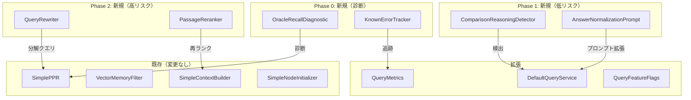
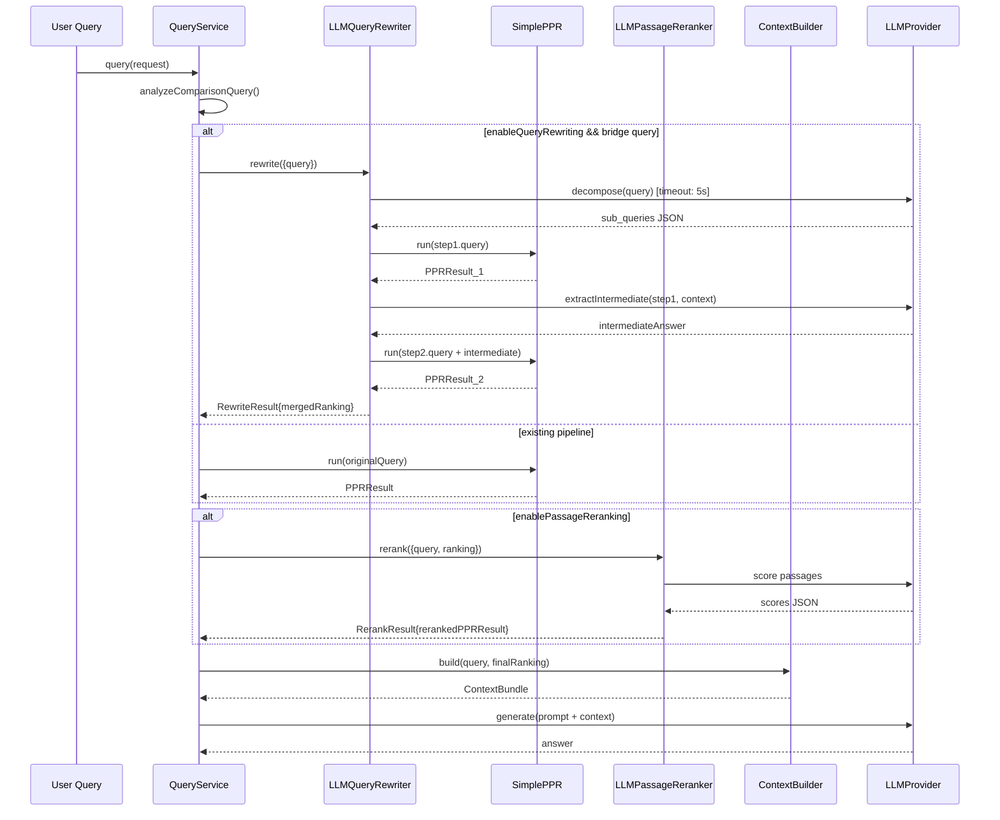

# DES-MEMGRAPHRAG-004: クエリ精度改善 Phase 2 設計書

| フィールド | 値 |
|-----------|---|
| **ID** | DES-MEMGRAPHRAG-004 |
| **バージョン** | 1.1 |
| **ステータス** | Draft |
| **作成日** | 2026-06-18 |
| **更新日** | 2026-06-18 |
| **対応要件** | REQ-MEMGRAPHRAG-004 v1.2 |
| **パッケージ** | `@nahisaho/memgraphrag` |
| **レビュー** | Rubber-duck review ×1 反映済み（v1.0 → v1.1） |

## 1. 設計概要

REQ-MEMGRAPHRAG-004 の 14 要件に対し、既存の 4 層アーキテクチャに沿って設計する。
**v0.3.0 の教訓**（PPR teleport vector への注入は逆効果）を踏まえ、Phase 2 では PPR の前段（クエリ改善）と後段（再ランキング・回答正規化）のみを変更する。PPR 本体には一切手を加えない。

### 設計方針

1. **既存パイプラインを壊さない**: 新機能は全てオプショナル。フィーチャーフラグで制御
2. **段階的検証**: Phase 0 診断 → Phase 1（低リスク）→ Phase 2（高リスク）
3. **可逆性**: 各機能を独立して ON/OFF 可能。退行時は即座に無効化

### 変更のスコープ



## 2. Phase 0: 診断インフラ

### DES-MG4-001: Oracle Recall 診断 (REQ-MG4-001)

**トレーサビリティ**: REQ-MG4-001
**パッケージ**: `@nahisaho/memgraphrag`

HotpotQA の supporting facts を使い、PPR top-K に正解支持パッセージが含まれるかを測定するスクリプト。

```typescript
// scripts/oracle-recall-diagnostic.mjs (スタンドアロンスクリプト)

interface OracleRecallConfig {
  readonly knownErrorsPath: string;       // known_errors_v15.json
  readonly hotpotqaPath: string;          // 元データ (supporting_facts)
  readonly kValues: readonly number[];    // [10, 20, 50]
  readonly outputPath: string;            // oracle_recall_report.json
}

interface SupportingFactMatch {
  readonly questionId: string;
  readonly category: ErrorCategory;
  readonly supportingFactTitles: readonly string[];  // HotpotQA ground truth
  readonly pprPassageTitles: Record<number, readonly string[]>;  // K → titles
  readonly strictRecall: Record<number, boolean>;    // 両方含む
  readonly lenientRecall: Record<number, boolean>;   // 少なくとも1つ含む
  readonly answerStringRecall: Record<number, boolean>; // 補助: gold answer 文字列含有
}

interface OracleRecallReport {
  readonly timestamp: string;
  readonly kValues: readonly number[];
  readonly perQuestion: readonly SupportingFactMatch[];
  readonly aggregated: {
    readonly byCategory: Record<ErrorCategory, CategoryRecall>;
    readonly overall: CategoryRecall;
  };
  readonly decision: {
    readonly reranking: 'proceed' | 'skip';
    readonly reason: string;
  };
}

interface CategoryRecall {
  readonly total: number;
  readonly strictRecall: Record<number, number>;   // K → count
  readonly lenientRecall: Record<number, number>;
}

type ErrorCategory = 'retrieval' | 'expression' | 'yesno' | 'generic' | 'spelling';
```

**実行フロー:**
1. `known_errors_v15.json` を読み込み（50問 + カテゴリ）
2. 各問について HotpotQA 元データから `supporting_facts` タイトルを取得
3. **retrieval-only パス** で PPR を実行（LLM 回答生成なし、ContextBuilder 不使用）:
   - memoryFilter.filter() → nodeInitializer.initialize() → ppr.run()
4. top-K パッセージの nodeId からタイトルを逆引き
5. supporting fact タイトルとの一致を strict/lenient で判定
6. カテゴリ別に Recall@K を集計
7. 検索失敗 14 件の lenient Recall@20 で Phase 2b ゲート判定

**CLI**: `node scripts/oracle-recall-diagnostic.mjs`

### DES-MG4-002: 既知エラー追跡セット (REQ-MG4-002)

**トレーサビリティ**: REQ-MG4-002
**パッケージ**: `@nahisaho/memgraphrag`

```typescript
// domain/benchmark/KnownErrorTracker.ts

interface KnownError {
  readonly questionId: string;
  readonly category: ErrorCategory;
  readonly goldAnswer: string;
  readonly baselineResponse: string;  // v15 eval v2 時の応答
}

interface KnownErrorSet {
  readonly version: string;
  readonly baselineAccuracy: string;
  readonly errors: readonly KnownError[];
  readonly correctIds: readonly string[];  // 450 問の正解 ID（退行検出用）
}

interface BenchmarkDelta {
  readonly recovered: Record<ErrorCategory, readonly string[]>;  // ID list
  readonly regressed: readonly string[];  // 正解→不正解になった ID
  readonly unchanged: readonly string[];
  readonly summary: {
    readonly recoveredTotal: number;
    readonly regressedTotal: number;
    readonly netGain: number;
  };
}

interface IKnownErrorTracker {
  load(path: string): Promise<KnownErrorSet>;
  compare(
    errorSet: KnownErrorSet,
    newResults: Map<string, { correct: boolean; response: string }>
  ): BenchmarkDelta;
  report(delta: BenchmarkDelta): string;  // human-readable summary
}
```

**データ形式** (`known_errors_v15.json`):
```json
{
  "version": "v15-eval-v2",
  "baseline_accuracy": "90.0%",
  "errors": [
    {
      "questionId": "5a8b57f25542995d1e6f1371",
      "category": "retrieval",
      "goldAnswer": "Edward Snowden",
      "baselineResponse": "Chelsea Manning"
    }
  ],
  "correct_ids": ["id1", "id2", "...450 items..."]
}
```

**ベンチマークスクリプトへの統合:**
既存の `benchmark-hotpotqa-ladybug.mjs` の結果出力に `delta` セクションを追加。

## 3. Phase 1a: 比較クエリ改善

### DES-MG4-003: Yes/No 比較クエリ検出と推論強化 (REQ-MG4-003)

**トレーサビリティ**: REQ-MG4-003
**パッケージ**: `@nahisaho/memgraphrag`

既存の `comparisonDetector.ts` を拡張し、Yes/No 回答期待クエリを分離検出する。

```typescript
// application/query/comparisonDetector.ts (拡張)

type ComparisonType = 'yesno' | 'which' | 'shared_attribute' | 'none';

interface ComparisonAnalysis {
  readonly type: ComparisonType;
  readonly entities: readonly string[];       // 検出されたエンティティ（2つ以上）
  readonly confidence: number;                // 0.0-1.0
}

/**
 * Yes/No 回答期待の検出パターン:
 * ^(are|is|do|does|did|was|were|have|has|had|can|could|will|would|should)\b
 * + 2つ以上のエンティティ参照
 *
 * 'which'/'who is more' は ComparisonType='which' として別処理
 */
function analyzeComparisonQuery(query: string): ComparisonAnalysis;
```

**Yes/No 専用プロンプト（新規）:**

```typescript
// application/query/prompts/comparisonYesNoPrompt.ts

function buildYesNoComparisonPrompt(
  query: string,
  entities: readonly string[],
  context: string
): string {
  return `You are answering a yes/no comparison question.

Step-by-step:
1. Identify the claim or comparison being made about: ${entities.join(', ')}
2. Find evidence FOR the claim in the context
3. Find evidence AGAINST the claim in the context
4. Weigh the evidence and determine yes or no

Rules:
- Use ONLY the provided context
- Answer MUST be exactly "yes" or "no" (lowercase)
- If evidence is contradictory, go with the stronger evidence
- Your last line MUST be: FINAL: yes  OR  FINAL: no

Question: ${query}

Context:
${context}

Evidence analysis and answer:`;
}
```

**DefaultQueryService への統合:**

```typescript
// QueryService.ts の query() メソッド内（既存 isComparison 分岐を拡張）

const compAnalysis = this.flags.enableComparisonReasoning
  ? analyzeComparisonQuery(normalizedText)
  : { type: 'none' as const, entities: [], confidence: 0 };

// Yes/No 専用パスの場合
if (compAnalysis.type === 'yesno' && compAnalysis.entities.length >= 2) {
  // 両エンティティの個別パッセージ取得はスコープ外（既存 PPR で十分）
  // プロンプトのみ変更
  prompt = buildYesNoComparisonPrompt(
    expandedRequest.text,
    compAnalysis.entities,
    enrichedContext
  );
}
```

**ADR-MG4-001: Yes/No に対して個別 PPR を行わない判断**

**ステータス**: proposed
**日付**: 2026-06-18

**Context:**
REQ-MG4-003 では「両エンティティについて個別にパッセージを取得」を求めている。

**Decision:**
初期実装では個別 PPR を行わず、プロンプト改善のみで 3 件中 2 件の回復を目指す。
理由: 現在の PPR は既に比較対象の両エンティティのパッセージを拾えている（エラー分析で確認済み）。
問題は検索ではなく LLM の論理判断ミス。

**Consequences:**
- 2 件回復できなければ、個別 PPR を Phase 2 で追加実装する
- メトリクスで回復状況を追跡し、判断を検証

## 4. Phase 1b: 回答正規化

### DES-MG4-004: 回答正規化プロンプト (REQ-MG4-004)

**トレーサビリティ**: REQ-MG4-004
**パッケージ**: `@nahisaho/memgraphrag`

既存の QA プロンプトに正規化指示を追加する。**プロンプトのみの変更**で、コードロジック変更は最小限。

```typescript
// application/query/prompts/normalizationInstructions.ts

export const NORMALIZATION_INSTRUCTIONS = `
Output format rules:
- Use the full official name (not abbreviations or nicknames)
- For people: use "FirstName LastName" format
- For organizations: use the official registered name
- For locations: use the most commonly recognized name
- For dates: use the format found in the context
- Do NOT add qualifiers like "approximately", "around", "about"
- Do NOT add units unless explicitly asked
`;
```

**既存プロンプトへの挿入位置:**

```typescript
// DefaultQueryService.query() — Rules セクションの直前に挿入

const normInstructions = this.flags.enableAnswerNormalization
  ? NORMALIZATION_INSTRUCTIONS
  : '';

const prompt = `...
${normInstructions}
Rules:
...`;
```

**影響範囲:**
- bridge プロンプト、comparison プロンプトの両方に適用
- フィーチャーフラグ `enableAnswerNormalization` で制御
- 退行リスク: 低（プロンプト末尾への追加のみ）

## 5. Phase 2a: クエリリライト

### DES-MG4-005: マルチホップクエリリライタ (REQ-MG4-005, REQ-MG4-006)

**トレーサビリティ**: REQ-MG4-005, REQ-MG4-006
**パッケージ**: `@nahisaho/memgraphrag`

既存の `SubQueryDecomposer`（v0.3.0）を**完全に置き換え**る新実装。
v0.3.0 は PPR teleport vector にサブクエリ結果を注入していたが、Phase 2 では**クエリ自体を段階的に実行**する方式に変更。

```typescript
// domain/retrieval/queryRewriter.ts (新規 — Domain 層インターフェース)

interface RewriteRequest {
  readonly query: QueryRequest;
}

interface RewriteResult {
  readonly decomposed: boolean;
  readonly subQueries: readonly SubQuery[];
  readonly intermediateAnswers: readonly string[];
  readonly mergedRanking: PPRResult;      // 両ステップの結果を統合した PPRResult
  readonly fallback: boolean;
  readonly fallbackReason?: string;
}

interface SubQuery {
  readonly step: number;
  readonly query: string;
  readonly dependsOn?: number;
  readonly purpose: string;
}

/**
 * IQueryRewriter — クエリ分解 + 段階実行 + 結果統合
 * 
 * 設計方針: 内部で PPR を2回実行するが、依存はコンストラクタ注入。
 * rewrite() は QueryRequest のみ受け取り、統合済み PPRResult を返す。
 * フォールバック時は decomposed=false, mergedRanking=通常の1回PPR結果 を返す。
 */
interface IQueryRewriter {
  rewrite(request: RewriteRequest): Promise<RewriteResult>;
}
```

**実装: LLMQueryRewriter**

```typescript
// application/query/LLMQueryRewriter.ts (新規)

interface QueryRewriterDependencies {
  readonly llm: ILLMProvider;
  readonly memoryFilter: IMemoryFilter;
  readonly nodeInitializer: INodeInitializer;
  readonly ppr: IPPR;
  readonly projection: IGraphProjection;
  readonly timeoutMs?: number;  // default: 5000
}

class LLMQueryRewriter implements IQueryRewriter {
  constructor(private readonly deps: QueryRewriterDependencies) {}

  async rewrite(request: RewriteRequest): Promise<RewriteResult> {
    // 1. LLM でサブクエリ分解（タイムアウト付き）
    const subQueries = await this.safeDecompose(request.query.text);
    if (!subQueries) {
      return this.fallbackResult(request, 'decomposition_failed');
    }

    // 2. Step 1: サブクエリで PPR 実行
    const step1Query: QueryRequest = { ...request.query, text: subQueries[0].query };
    const step1Candidates = await this.deps.memoryFilter.filter(step1Query);
    const step1Vector = await this.deps.nodeInitializer.initialize({ query: step1Query, candidates: step1Candidates });
    const step1Ranking = await this.deps.ppr.run({
      corpusId: request.query.corpusId,
      initialVector: step1Vector,
      teleportProbability: 0.5,
      convergenceEpsilon: 1e-6,
      maxIterations: 100,
      topK: request.query.topK ?? 10,
      topM: request.query.topM ?? 10,
    }, this.deps.projection);

    // 3. 中間回答抽出（LLM 1回）
    const intermediateAnswer = await this.extractIntermediate(subQueries[0].query, step1Ranking);
    if (!intermediateAnswer) {
      return this.fallbackResult(request, 'intermediate_extraction_failed');
    }

    // 4. Step 2: 中間回答を埋め込んだクエリで PPR 実行
    const step2Text = subQueries[1].query.replace('{step1}', intermediateAnswer);
    const step2Query: QueryRequest = { ...request.query, text: step2Text };
    const step2Candidates = await this.deps.memoryFilter.filter(step2Query);
    const step2Vector = await this.deps.nodeInitializer.initialize({ query: step2Query, candidates: step2Candidates });
    const step2Ranking = await this.deps.ppr.run({
      corpusId: request.query.corpusId,
      initialVector: step2Vector,
      teleportProbability: 0.5,
      convergenceEpsilon: 1e-6,
      maxIterations: 100,
      topK: request.query.topK ?? 10,
      topM: request.query.topM ?? 10,
    }, this.deps.projection);

    // 5. 両ステップの rankedPassages を統合（スコア加重平均でマージ）
    const mergedRanking = this.mergeRankings(step1Ranking, step2Ranking);

    return {
      decomposed: true,
      subQueries,
      intermediateAnswers: [intermediateAnswer],
      mergedRanking,
      fallback: false,
    };
  }

  private async fallbackResult(request: RewriteRequest, reason: string): Promise<RewriteResult> {
    // フォールバック: 通常の1回PPRを実行して返す
    const candidates = await this.deps.memoryFilter.filter(request.query);
    const vector = await this.deps.nodeInitializer.initialize({ query: request.query, candidates });
    const ranking = await this.deps.ppr.run({
      corpusId: request.query.corpusId,
      initialVector: vector,
      teleportProbability: 0.5,
      convergenceEpsilon: 1e-6,
      maxIterations: 100,
      topK: request.query.topK ?? 10,
      topM: request.query.topM ?? 10,
    }, this.deps.projection);
    return { decomposed: false, subQueries: [], intermediateAnswers: [], mergedRanking: ranking, fallback: true, fallbackReason: reason };
  }

  private mergeRankings(r1: PPRResult, r2: PPRResult): PPRResult {
    // rankedPassages: r2 を優先しつつ、r1 のユニークなものを追加
    const seen = new Set(r2.rankedPassages.map(n => n.nodeId));
    const merged = [...r2.rankedPassages];
    for (const node of r1.rankedPassages) {
      if (!seen.has(node.nodeId)) {
        merged.push(node);
        seen.add(node.nodeId);
      }
    }
    return {
      rankedPassages: merged,
      rankedEntities: [...r2.rankedEntities],  // step2 のエンティティを採用
      iterations: r1.iterations + r2.iterations,
      converged: r1.converged && r2.converged,
      l1Delta: Math.max(r1.l1Delta, r2.l1Delta),
    };
  }
}
```

**DefaultQueryService との統合（明確な分岐）:**

```typescript
// QueryService.ts の query() メソッド — 既存パイプラインとの明確な分岐

let ranking: PPRResult;
let queryRewriteMetrics = { decomposed: false, fallback: false, fallbackReason: undefined };

// Phase 2a: クエリリライト（既存パイプラインを完全に置き換え）
if (this.flags.enableQueryRewriting && this.dependencies.queryRewriter && !isComparison) {
  const rewriteResult = await this.dependencies.queryRewriter.rewrite({ query: expandedRequest });
  ranking = rewriteResult.mergedRanking;
  queryRewriteMetrics = {
    decomposed: rewriteResult.decomposed,
    fallback: rewriteResult.fallback,
    fallbackReason: rewriteResult.fallbackReason,
  };
} else {
  // 既存パイプライン（変更なし）
  const initRequest = { query: expandedRequest, candidates };
  let initialVector = await this.dependencies.nodeInitializer.initialize(initRequest);
  // ... existing SubQueryDecomposer logic (deprecated) ...
  ranking = await this.dependencies.ppr.run({ ... }, this.dependencies.projection);
}

// ここから先は共通パス: reranking → contextBuilder → LLM
```

**排他制御（blocking issue #4 対応）:**

```typescript
// DefaultQueryService constructor

if (this.flags.enableQueryRewriting && this.flags.enableSubQueryDecomposition) {
  console.warn('[QueryService] enableQueryRewriting and enableSubQueryDecomposition are mutually exclusive. Disabling old SubQueryDecomposition.');
  this.flags = { ...this.flags, enableSubQueryDecomposition: false };
}
```

**分解プロンプトとフォールバック (REQ-MG4-006):**

```typescript
// application/query/prompts/queryDecompositionPrompt.ts

export function buildDecompositionPrompt(query: string): string {
  return `Decompose this multi-hop question into sequential sub-queries.

Rules:
- Maximum 2 sub-queries (most multi-hop questions need exactly 2)
- Step 1 finds an intermediate entity/fact
- Step 2 uses step 1's result to find the final answer
- Use {step1} as placeholder in step 2 for the intermediate answer
- Output valid JSON only

Question: ${query}

Output format:
{"sub_queries": [{"step": 1, "query": "...", "purpose": "..."}, {"step": 2, "query": "... {step1} ...", "depends_on": 1, "purpose": "..."}]}

JSON:`;
}
```

**LLMQueryRewriter.safeDecompose() — 全エラーケースのフォールバック:**

```typescript
private async safeDecompose(query: string): Promise<SubQuery[] | null> {
  try {
    const result = await Promise.race([
      this.deps.llm.generate({
        prompt: buildDecompositionPrompt(query),
        responseFormat: 'json',
        reasoningEffort: 'low',
        verbosity: 'low',
      }),
      new Promise<never>((_, reject) =>
        setTimeout(() => reject(new Error('timeout')), this.deps.timeoutMs ?? 5000)
      ),
    ]);

    const parsed = JSON.parse(result.text);
    const subQueries = parsed.sub_queries;

    // バリデーション
    if (!Array.isArray(subQueries) || subQueries.length === 0 || subQueries.length > 3) {
      return null;
    }
    for (const sq of subQueries) {
      if (!sq.step || !sq.query || typeof sq.query !== 'string' || sq.query.trim() === '') {
        return null;
      }
    }
    return subQueries;
  } catch {
    return null;  // JSON パースエラー、タイムアウト、LLM エラー等 → 全てフォールバック
  }
}
```

## 6. Phase 2b: パッセージ再ランキング

### DES-MG4-006: LLM パッセージ再ランキング (REQ-MG4-007)

**トレーサビリティ**: REQ-MG4-007
**パッケージ**: `@nahisaho/memgraphrag`

**前提条件**: Oracle Recall@20 > 50%（8+/14, lenient recall で検索失敗カテゴリを評価）が確認済み

```typescript
// domain/retrieval/passageReranker.ts (新規)

interface RerankRequest {
  readonly query: string;
  readonly ranking: PPRResult;    // 元の PPRResult をそのまま受け取る
  readonly topN: number;          // 再ランク対象数 (default: 20)
  readonly selectN: number;       // 最終選択数 (default: 10)
}

interface RerankResult {
  readonly rerankedPPRResult: PPRResult;  // rankedPassages を並べ替えた新 PPRResult
  readonly metrics: {
    readonly positionChanges: number;
    readonly scoreRange: { min: number; max: number; median: number };
    readonly latencyMs: number;
    readonly tokensUsed: number;
  };
}

interface IPassageReranker {
  rerank(request: RerankRequest): Promise<RerankResult>;
}
```

**PPRResult 互換の維持:**

再ランキングは `PPRResult.rankedPassages` の**順序のみを変更**し、`rankedEntities`, `iterations`, `converged`, `l1Delta` はそのまま保持する。これにより `IContextBuilder.build(query, ranking)` に直接渡せる。

```typescript
// application/query/LLMPassageReranker.ts (新規)

class LLMPassageReranker implements IPassageReranker {
  constructor(private readonly llm: ILLMProvider) {}

  async rerank(request: RerankRequest): Promise<RerankResult> {
    const startTime = Date.now();
    const topPassages = request.ranking.rankedPassages.slice(0, request.topN);
    
    // 1バッチ呼び出しで全パッセージをスコアリング
    // (パッセージテキストは別途取得が必要 — contextBuilder 内部で解決済みの ID を使用)
    const prompt = this.buildRerankPrompt(request.query, topPassages);
    const response = await this.llm.generate({
      prompt,
      responseFormat: 'json',
      reasoningEffort: 'low',
      verbosity: 'low',
    });
    
    const scores = this.parseScores(response.text, topPassages.length);
    
    // スコアエラー時はフォールバック（元の PPRResult をそのまま返す）
    if (!scores) {
      return {
        rerankedPPRResult: request.ranking,
        metrics: { positionChanges: 0, scoreRange: { min: 0, max: 0, median: 0 }, latencyMs: Date.now() - startTime, tokensUsed: 0 },
      };
    }

    // スコア順にソート、上位 selectN + 残りの元順序を維持
    const scored = topPassages.map((node, i) => ({ node, score: scores[i] }));
    scored.sort((a, b) => b.score - a.score);
    const reranked = scored.slice(0, request.selectN).map(s => s.node);
    const remaining = request.ranking.rankedPassages.slice(request.topN);

    return {
      rerankedPPRResult: {
        ...request.ranking,
        rankedPassages: [...reranked, ...remaining],
      },
      metrics: { ... },
    };
  }

  private buildRerankPrompt(query: string, passages: readonly RankedNode[]): string {
    // Note: passage text resolution is handled by looking up node IDs
    // This uses a passage-text resolver injected at construction time
    return `Rate the relevance of each passage to the query (0-10).
Query: ${query}
Passages: [indexed by nodeId]
Output: {"scores": [score_0, score_1, ...]}`;
  }
}
```

**QueryService への統合ポイント:**

```typescript
// DefaultQueryService.query() — PPR 実行後、contextBuilder.build() 前

let finalRanking = ranking;  // PPRResult

if (this.flags.enablePassageReranking && this.dependencies.passageReranker) {
  const rerankResult = await this.dependencies.passageReranker.rerank({
    query: normalizedText,
    ranking,
    topN: 20,
    selectN: 10,
  });
  finalRanking = rerankResult.rerankedPPRResult;
  // メトリクス記録
}

const context = await this.dependencies.contextBuilder.build(expandedRequest, finalRanking);
```

## 7. フィーチャーフラグ拡張

### DES-MG4-007: Phase 2 フィーチャーフラグ (REQ-MG4-008)

**トレーサビリティ**: REQ-MG4-008
**パッケージ**: `@nahisaho/memgraphrag`

```typescript
// domain/config/featureFlags.ts (拡張)

export interface QueryFeatureFlags {
  // --- v0.3.0 flags (all OFF by default) ---
  readonly enableDictionaryInjection: boolean;
  readonly enableThesaurusExpansion: boolean;
  readonly enableHypernymExpansion: boolean;
  readonly enableAliasHints: boolean;
  readonly enableSubQueryDecomposition: boolean;   // v0.3.0 方式 (deprecated)
  readonly enableComparisonVerification: boolean;  // v0.3.0 方式 (deprecated)

  // --- Phase 2 flags (all OFF by default) ---
  readonly enableQueryRewriting: boolean;          // Phase 2a: マルチホップ分解
  readonly enablePassageReranking: boolean;        // Phase 2b: LLM 再ランキング
  readonly enableComparisonReasoning: boolean;     // Phase 1a: Yes/No 推論強化
  readonly enableAnswerNormalization: boolean;     // Phase 1b: 回答正規化
}

export const DEFAULT_QUERY_FLAGS: Readonly<QueryFeatureFlags> = {
  // v0.3.0 (all OFF - proven regression)
  enableDictionaryInjection: false,
  enableThesaurusExpansion: false,
  enableHypernymExpansion: false,
  enableAliasHints: false,
  enableSubQueryDecomposition: false,
  enableComparisonVerification: false,
  // Phase 2 (all OFF - opt-in after ablation)
  enableQueryRewriting: false,
  enablePassageReranking: false,
  enableComparisonReasoning: false,
  enableAnswerNormalization: false,
};

/**
 * Promoted configuration — set after ablation confirms improvement.
 * Initially empty; populated based on Phase 1/2 results.
 */
export const PROMOTED_PHASE2_FLAGS: Partial<QueryFeatureFlags> = {
  // Will be populated after ablation testing
};
```

**環境変数オーバーライド:**

```typescript
// infrastructure/config/envFlagOverrides.ts (新規)

const ENV_FLAG_MAP: Record<string, keyof QueryFeatureFlags> = {
  'QUERY_REWRITE': 'enableQueryRewriting',
  'PASSAGE_RERANK': 'enablePassageReranking',
  'COMPARISON_REASONING': 'enableComparisonReasoning',
  'ANSWER_NORMALIZATION': 'enableAnswerNormalization',
};

export function applyEnvOverrides(flags: QueryFeatureFlags): QueryFeatureFlags {
  const overrides: Partial<QueryFeatureFlags> = {};
  for (const [envKey, flagKey] of Object.entries(ENV_FLAG_MAP)) {
    const val = process.env[envKey];
    if (val !== undefined) {
      overrides[flagKey] = val === 'true' || val === '1';
    }
  }
  return { ...flags, ...overrides };
}
```

## 8. 観測可能性メトリクス

### DES-MG4-008: クエリメトリクス拡張 (REQ-MG4-NFR-003)

**トレーサビリティ**: REQ-MG4-NFR-003
**パッケージ**: `@nahisaho/memgraphrag`

既存の `QueryMetrics` インターフェースに Phase 2 フィールドを追加:

```typescript
// QueryService.ts — QueryMetrics 拡張

export interface QueryMetrics {
  // --- 既存フィールド ---
  readonly dictionaryMatchCount: number;
  readonly expandedTerms: readonly string[];
  readonly fallbackTriggered: boolean;
  readonly pprIterations: number;
  readonly pprConverged: boolean;
  readonly citedPassageCount: number;
  readonly llmInputTokens: number;
  readonly llmOutputTokens: number;
  readonly scVotes?: readonly string[];
  readonly totalLatencyMs?: number;
  // v0.3.0 fields (omitted for brevity)

  // --- Phase 2 additions ---
  readonly subQueryCount?: number;             // 分解サブクエリ数 (0=未分解)
  readonly subQueryParseSuccess?: boolean;     // JSON パース成功
  readonly rerankScoreRange?: { min: number; max: number; median: number };
  readonly rerankPositionChange?: number;      // 順位変動パッセージ数
  readonly comparisonDetected?: ComparisonType;
  readonly queryRewriteFallback?: boolean;     // フォールバック発生
  readonly queryRewriteFallbackReason?: string;
  readonly phase2LlmCalls?: number;            // Phase 2 追加 LLM 呼び出し数
  readonly phase2TokensUsed?: number;          // Phase 2 追加トークン消費
}
```

## 9. QueryServiceDependencies 拡張

```typescript
export interface QueryServiceDependencies {
  // --- 既存 ---
  readonly dictionary: ITermDictionary;
  readonly expansionPolicy: ThesaurusExpansionPolicy | {...};
  readonly memoryFilter: IMemoryFilter;
  readonly nodeInitializer: INodeInitializer;
  readonly ppr: IPPR;
  readonly projection: IGraphProjection;
  readonly contextBuilder: IContextBuilder;
  readonly llm: ILLMProvider;
  readonly responseGenerator?: TemplateResponseGenerator;
  readonly hyperParams?: QueryHyperParams;
  readonly featureFlags?: QueryFeatureFlags;
  readonly subQueryDecomposer?: SubQueryDecomposer;      // v0.3.0 (deprecated)
  readonly comparisonVerifier?: ComparisonVerifier;       // v0.3.0 (deprecated)

  // --- Phase 2 additions ---
  readonly queryRewriter?: IQueryRewriter;               // Phase 2a
  readonly passageReranker?: IPassageReranker;           // Phase 2b
}
```

## 9.1 統合シーケンス図



## 10. ファイル構成

```
packages/memgraphrag/
├── src/
│   ├── domain/
│   │   ├── config/
│   │   │   └── featureFlags.ts          # 拡張: Phase 2 フラグ追加
│   │   ├── retrieval/
│   │   │   └── passageReranker.ts       # 新規: IPassageReranker
│   │   └── benchmark/
│   │       └── KnownErrorTracker.ts     # 新規: エラー追跡
│   ├── application/
│   │   └── query/
│   │       ├── QueryService.ts          # 拡張: Phase 2 統合
│   │       ├── QueryRewriter.ts         # 新規: LLMQueryRewriter
│   │       ├── LLMPassageReranker.ts    # 新規: 再ランキング実装
│   │       ├── comparisonDetector.ts    # 拡張: Yes/No 分離
│   │       └── prompts/
│   │           ├── queryDecompositionPrompt.ts    # 新規
│   │           ├── intermediateAnswerPrompt.ts    # 新規
│   │           ├── comparisonYesNoPrompt.ts       # 新規
│   │           └── normalizationInstructions.ts   # 新規
│   └── infrastructure/
│       └── config/
│           └── envFlagOverrides.ts      # 新規: 環境変数オーバーライド
├── scripts/
│   └── oracle-recall-diagnostic.mjs     # 新規: Phase 0 診断
└── data/
    └── benchmark/
        └── hotpotqa/
            ├── known_errors_v15.json    # 新規: 50問エラーセット
            └── oracle_recall_report.json # 生成: 診断結果
```

## 11. SOLID 準拠検証

| 原則 | 検証 |
|------|------|
| **SRP** | QueryRewriter は分解のみ、LLMPassageReranker は再ランキングのみ、KnownErrorTracker は追跡のみ |
| **OCP** | IPassageReranker / IQueryRewriter インターフェースで拡張に開放、修正に閉鎖 |
| **LSP** | LLMQueryRewriter は IQueryRewriter を完全実装。フォールバック時も正常な RewriteResult を返す |
| **ISP** | IPassageReranker は rerank() のみ。IQueryRewriter は rewrite() のみ。肥大化なし |
| **DIP** | QueryService は IQueryRewriter / IPassageReranker に依存。具象クラスへの直接依存なし |

## 12. ADR 一覧

| ID | タイトル | ステータス |
|----|---------|-----------|
| ADR-MG4-001 | Yes/No に対して個別 PPR を行わない | proposed |
| ADR-MG4-002 | v0.3.0 SubQueryDecomposer を deprecated にする | proposed |

### ADR-MG4-002: v0.3.0 SubQueryDecomposer を deprecated にする

**ステータス**: proposed
**日付**: 2026-06-18

**Context:**
v0.3.0 の SubQueryDecomposer は PPR teleport vector にサブクエリ結果を注入する方式だった。
ablation で -3.4% の退行が確認されており、DEFAULT_QUERY_FLAGS で無効化済み。

**Decision:**
SubQueryDecomposer を deprecated とし、新規の IQueryRewriter（段階実行方式）に置き換える。
旧クラスは削除せず、フラグ `enableSubQueryDecomposition` で残す（後方互換性）。

**Consequences:**
- 新旧のフラグが共存するが、排他制御で同時有効を防止
- 将来的にはリファクタリングで旧コードを削除

## 13. v1.0 → v1.1 変更点（Rubber-duck review #1 反映）

| 指摘 | 対応 |
|------|------|
| Reranker が PPRResult と互換性なし | IPassageReranker を PPRResult IN/OUT に変更。rankedPassages 順序のみ変更、ContextBuilder に直接渡せる設計に |
| IQueryRewriter が QueryService 内部に密結合 | 依存をコンストラクタ注入に変更。rewrite() は QueryRequest のみ受取、PPRResult を返す |
| クエリリライト統合ポイントが不明確 | DefaultQueryService 内で明確な if/else 分岐を定義。rewrite 時は既存パイプラインをバイパス |
| SubQueryDecomposer 排他制御が未実装 | constructor で相互排他バリデーション追加（warn + force-disable） |
| KnownErrorTracker が correctIds を読めない | KnownErrorSet に correctIds フィールドを追加 |
| LLM 障害時のフォールバックが不完全 | QueryRewriter.fallbackResult() で全エラーケースを処理、Reranker も scores パース失敗時に元 PPRResult を返す |
| Oracle Recall 診断が QueryService 全体を実行 | retrieval-only パス（memoryFilter → nodeInitializer → PPR のみ）に変更 |
| isComparisonQuery() の後方互換性 | 既存 boolean export を維持、analyzeComparisonQuery() を追加 |

## 14. 要件トレーサビリティマトリクス

| 要件 ID | 設計 ID | 実装ファイル |
|---------|---------|-------------|
| REQ-MG4-000 | — | ベンチマーク結果で検証 |
| REQ-MG4-001 | DES-MG4-001 | scripts/oracle-recall-diagnostic.mjs |
| REQ-MG4-002 | DES-MG4-002 | domain/benchmark/KnownErrorTracker.ts |
| REQ-MG4-003 | DES-MG4-003 | application/query/comparisonDetector.ts, prompts/comparisonYesNoPrompt.ts |
| REQ-MG4-004 | DES-MG4-004 | application/query/prompts/normalizationInstructions.ts |
| REQ-MG4-005 | DES-MG4-005 | application/query/QueryRewriter.ts |
| REQ-MG4-006 | DES-MG4-005 | QueryRewriter.safeDecompose() |
| REQ-MG4-007 | DES-MG4-006 | domain/retrieval/passageReranker.ts, application/query/LLMPassageReranker.ts |
| REQ-MG4-008 | DES-MG4-007 | domain/config/featureFlags.ts |
| REQ-MG4-009 | — | ベンチマークプロトコル（スクリプト） |
| REQ-MG4-010 | — | ablation テスト結果で検証 |
| REQ-MG4-NFR-001 | — | メトリクスで検証 |
| REQ-MG4-NFR-002 | — | メトリクスで検証 |
| REQ-MG4-NFR-003 | DES-MG4-008 | QueryMetrics 拡張 |
