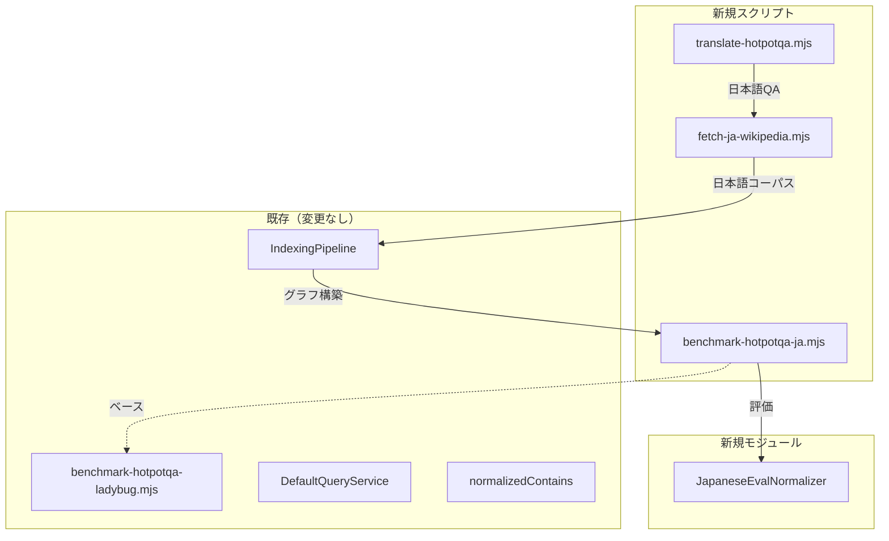

# DES-MEMGRAPHRAG-005: 日本語 HotpotQA ベンチマーク 設計書

| フィールド | 値 |
|-----------|---|
| **ID** | DES-MEMGRAPHRAG-005 |
| **バージョン** | 1.0 |
| **ステータス** | Draft |
| **作成日** | 2026-06-18 |
| **更新日** | 2026-06-18 |
| **対応要件** | REQ-MEMGRAPHRAG-005 v1.0 |
| **パッケージ** | `@nahisaho/memgraphrag` |

## 1. 設計概要

REQ-MEMGRAPHRAG-005 の 6 機能要件 + 2 非機能要件に対し、既存のベンチマークインフラ（`benchmark-hotpotqa-ladybug.mjs`）を拡張する形で日本語ベンチマークを実現する。新規コードは主にスクリプト層（`scripts/`）に集約し、アプリケーション層への変更は日本語評価ロジックのみに留める。

### 変更のスコープ



## 2. データフロー

```
┌─────────────────────────────────────────────────────────────────┐
│ Phase A: データセット準備（1回のみ）                               │
│                                                                 │
│  benchmark_500.json ──→ translate-hotpotqa.mjs ──→ hotpotqa_ja_500.json │
│       (英語)              (LLM翻訳)                (日英対訳)     │
│                                                                 │
│  hotpotqa_ja_500.json ──→ fetch-ja-wikipedia.mjs ──→ corpus/hotpotqa-ja/ │
│                           (Wikipedia API)            (日本語MD)   │
│                                                                 │
│  corpus/hotpotqa-ja/ ──→ 既存 IndexingPipeline ──→ hotpotqa-ja.lbug │
│                                                    hotpotqa-ja.sqlite │
└─────────────────────────────────────────────────────────────────┘

┌─────────────────────────────────────────────────────────────────┐
│ Phase B: ベンチマーク実行（繰り返し可能）                         │
│                                                                 │
│  hotpotqa_ja_500.json + hotpotqa-ja.lbug                        │
│       ──→ benchmark-hotpotqa-ja.mjs                             │
│            ──→ DefaultQueryService.query()                      │
│            ──→ JapaneseEvalNormalizer + normalizedContains       │
│            ──→ results_ja_500.json                              │
└─────────────────────────────────────────────────────────────────┘
```

## 3. コンポーネント設計

### DES-005-001: 翻訳スクリプト (REQ-005-001)

**ファイル**: `scripts/translate-hotpotqa.mjs`

```typescript
// 入力: benchmark_500.json (既存の英語QAデータ)
// 出力: hotpotqa_ja_500.json

interface HotpotQAItem {
  question: string;          // 英語の質問
  answer: string;            // 英語の正解
  type: 'bridge' | 'comparison';
  level: string;
  supporting_facts: [string, number][];  // [title, sent_idx]
  context: [string, string[]][];         // [title, sentences]
}

interface JaHotpotQAItem extends HotpotQAItem {
  question_ja: string;       // 日本語の質問
  answer_ja: string;         // 日本語の正解
  supporting_titles_ja: string[];  // 日本語 Wikipedia タイトル
  ja_coverage: boolean;      // 日本語 Wiki に対応記事があるか
  translation_model: string; // 翻訳に使用したモデル
}
```

**翻訳戦略**:
- GPT-5.4-mini で一括翻訳（バッチ処理、concurrency=10）
- 1リクエストで質問 + 正解 + supporting titles をまとめて翻訳
- 翻訳結果をファイルにキャッシュ（再実行時はスキップ）
- 推定コスト: 500問 × ~200 tokens/問 ≈ 100K tokens ≈ $1-2

**LLM プロンプト**:
```
以下の英語のQAペアを日本語に翻訳してください。
固有名詞は日本語Wikipediaでの表記に従ってください。
人名・地名はカタカナ表記してください。

Question: {question}
Answer: {answer}
Supporting titles: {titles}

JSON形式で返してください:
{
  "question_ja": "...",
  "answer_ja": "...",
  "supporting_titles_ja": ["...", "..."]
}
```

---

### DES-005-002: Wikipedia コーパス取得 (REQ-005-002)

**ファイル**: `scripts/fetch-ja-wikipedia.mjs`

```typescript
// 入力: hotpotqa_ja_500.json
// 出力: data/corpus/hotpotqa-ja/*.md

interface WikiFetchResult {
  title_en: string;
  title_ja: string | null;    // null = 対応記事なし
  content_md: string | null;
  fetch_method: 'langlinks' | 'search' | 'not_found';
}
```

**記事取得戦略（2段階フォールバック）**:

1. **Langlinks API**: 英語 Wikipedia の interlanguage link から日本語版を取得
   ```
   GET https://en.wikipedia.org/w/api.php
     ?action=query&titles={en_title}&prop=langlinks&lllang=ja
   ```

2. **日本語 Wikipedia 検索**: langlinks がない場合、翻訳タイトルで検索
   ```
   GET https://ja.wikipedia.org/w/api.php
     ?action=query&list=search&srsearch={ja_title}
   ```

3. **Not Found**: どちらも失敗 → `ja_coverage: false`

**出力形式**: 各記事を `{sanitized_title}.md` として保存。ファイル先頭にメタデータ:
```markdown
---
title_en: "Christopher Nolan"
title_ja: "クリストファー・ノーラン"
source: "ja.wikipedia.org"
fetched_at: "2026-06-18T..."
---

クリストファー・ノーラン（Christopher Nolan）は...
```

---

### DES-005-003: インデキシング (REQ-005-003)

既存の `FullDocumentIndexingPipeline` をそのまま使用する。日本語テキストは LLM（GPT-5.4-mini）がファクト抽出するため、形態素解析なしでも動作する。

**設定**:
```yaml
# config/hotpotqa-ja.memgraphrag.yml
corpus:
  id: hotpotqa-ja
  name: "HotpotQA Japanese"
  language: ja
indexing:
  chunkSize: 512       # 日本語は文字密度が高いため英語より小さく
  chunkOverlap: 64
  extractionModel: gpt-5.4-mini
```

**ADR-005-001: 日本語チャンクサイズ**

| 項目 | 英語 | 日本語 |
|------|------|--------|
| チャンクサイズ | 1024 chars | 512 chars |
| 理由 | — | 日本語は1文字あたりの情報量が多く、同等の意味量をカバー |

---

### DES-005-004: 日本語評価ロジック (REQ-005-006)

**ファイル**: `scripts/ja-eval-normalizer.mjs`（スクリプト内モジュール）

```typescript
/**
 * 日本語テキストの正規化関数。
 * 既存の normalizedContains の前段として適用する。
 */
function normalizeJapanese(text: string): string {
  let s = text;
  // 1. 全角英数 → 半角
  s = s.replace(/[Ａ-Ｚａ-ｚ０-９]/g, ch =>
    String.fromCharCode(ch.charCodeAt(0) - 0xFEE0));
  // 2. 全角スペース → 半角
  s = s.replace(/　/g, ' ');
  // 3. 長音正規化: 末尾の「ー」を除去（コンピューター → コンピュータ）
  s = s.replace(/ー$/g, '');
  // 4. カタカナ小文字正規化（ヴ → ブ 等は将来対応）
  // 5. 助詞・接尾辞の除去（都道府県、市区町村）
  s = s.replace(/(都|道|府|県|市|区|町|村|郡)$/g, '');
  return s;
}

/**
 * 日本語対応の正解判定。
 * 英語版 normalizedContains を拡張する。
 */
function normalizedContainsJa(
  response: string,
  goldAnswer: string,
  goldAnswerEn: string
): boolean {
  // 1. 日本語正規化して比較
  const normResp = normalizeJapanese(response);
  const normGold = normalizeJapanese(goldAnswer);
  if (normalizedContains(normResp, normGold)) return true;

  // 2. 英語の正解でもチェック（LLMが英語で回答する場合）
  if (normalizedContains(response, goldAnswerEn)) return true;

  // 3. カタカナ/ひらがな変換チェック
  const kataResp = toKatakana(normResp);
  const kataGold = toKatakana(normGold);
  if (normalizedContains(kataResp, kataGold)) return true;

  return false;
}
```

**テスト対象の表記揺れパターン**:

| パターン | 例 | 正規化 |
|---------|-----|--------|
| 全角/半角 | ＡＩ → AI | ✅ |
| 長音 | コンピューター → コンピュータ | ✅ |
| 行政区分 | 東京都 → 東京 | ✅ |
| カタカナ統一 | ヴァイオリン → バイオリン | v0.5.0 |
| ひらがな/カタカナ | にほん → ニホン | ✅ |

---

### DES-005-005: ベンチマークスクリプト (REQ-005-004, REQ-005-005)

**ファイル**: `scripts/benchmark-hotpotqa-ja.mjs`

既存の `benchmark-hotpotqa-ladybug.mjs` をベースに、以下を変更:

```typescript
// 変更点のみ
const BENCHMARK_DIR = resolve(REPO_ROOT, 'data/benchmark/hotpotqa-ja');
const LADYBUG_DB_PATH = resolve(BENCHMARK_DIR, 'hotpotqa-ja.lbug');
const SQLITE_PATH = resolve(BENCHMARK_DIR, 'hotpotqa-ja.sqlite');
const QUESTIONS_FILE = resolve(BENCHMARK_DIR, 'hotpotqa_ja_500.json');
const RESULTS_FILE = resolve(BENCHMARK_DIR, 'results_ja_500.json');

// 評価関数を日本語対応に拡張
function isCorrect(response, item) {
  return normalizedContainsJa(response, item.answer_ja, item.answer);
}

// ja_coverage: false の問題をスキップ
const questions = allQuestions.filter(q => q.ja_coverage !== false);
```

**サブコマンド**:
```bash
node scripts/benchmark-hotpotqa-ja.mjs translate  # Phase A-1: 翻訳
node scripts/benchmark-hotpotqa-ja.mjs fetch       # Phase A-2: Wikipedia取得
node scripts/benchmark-hotpotqa-ja.mjs index       # Phase A-3: インデキシング
node scripts/benchmark-hotpotqa-ja.mjs query       # Phase B: ベンチマーク実行
node scripts/benchmark-hotpotqa-ja.mjs all         # 全パイプライン
```

## 4. ディレクトリ構成

```
data/benchmark/hotpotqa-ja/
├── hotpotqa_ja_500.json       # 翻訳済みQAデータ
├── corpus/                     # 日本語 Wikipedia 記事
│   ├── クリストファー・ノーラン.md
│   ├── ダークナイト.md
│   └── ...
├── hotpotqa-ja.lbug           # LadybugDB グラフ
├── hotpotqa-ja.sqlite         # メタデータDB
├── vectors/                    # ベクトルインデックス
├── corpus_id.txt              # コーパスID
├── coverage_report.json       # カバレッジレポート
└── results_ja_500.json        # ベンチマーク結果
```

## 5. 新規ファイル一覧

| ファイル | 層 | DES | REQ |
|---------|-----|-----|-----|
| `scripts/translate-hotpotqa.mjs` | Script | DES-005-001 | REQ-005-001 |
| `scripts/fetch-ja-wikipedia.mjs` | Script | DES-005-002 | REQ-005-002 |
| `scripts/benchmark-hotpotqa-ja.mjs` | Script | DES-005-005 | REQ-005-004, 005 |
| `scripts/ja-eval-normalizer.mjs` | Script | DES-005-004 | REQ-005-006 |
| `config/hotpotqa-ja.memgraphrag.yml` | Config | DES-005-003 | REQ-005-003 |

## 6. ADR

### ADR-005-001: スクリプトファーストアプローチ

**ステータス**: proposed
**日付**: 2026-06-18

**Context**: 日本語ベンチマークはアプリケーション層（`src/`）に入れるか、スクリプト層（`scripts/`）に入れるか。

**Decision**: スクリプト層に集約する。理由:
1. ベンチマークは開発者ツールであり、ライブラリの公開 API ではない
2. 既存の英語ベンチマーク（`benchmark-hotpotqa-ladybug.mjs`）もスクリプト
3. 日本語評価ロジックが成熟したら `src/` に昇格させる

**Consequences**:
- TypeScript 型チェックは適用されない（`.mjs`）
- テストは手動ベンチマーク実行で検証
- 成熟後、`JapaneseEvalNormalizer` を `src/application/eval/` に移動

### ADR-005-002: 翻訳方式の選択

**ステータス**: proposed
**日付**: 2026-06-18

**Context**: 日本語ベンチマーク作成に3つのアプローチがある（A: 翻訳、B: 新規作成、C: 英語問題を日本語Wikiで回答）。

**Decision**: アプローチ A（LLM 翻訳方式）を採用。

**Consequences**:
- 英語版との直接比較が可能
- 日本語 Wikipedia に対応記事がない問題は除外（カバレッジ率を追跡）
- 翻訳品質のばらつきは人手サンプル検証で担保
- 将来的にアプローチ B（日本語独自問題）への拡張も可能
