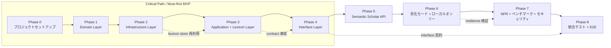
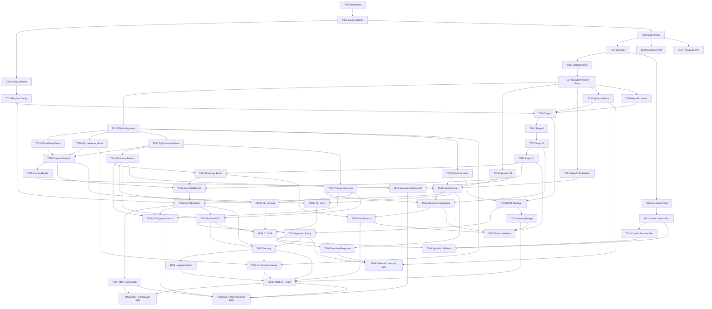

# MemGraphRAG 実装計画

**Document ID**: PLAN-MEMGRAPHRAG-001  
**Version**: 1.2  
**Status**: Draft  
**Created**: 2026-06-08  
**Traceability**: REQ-MEMGRAPHRAG-001 v1.2 / DES-MEMGRAPHRAG-001 v1.4

---

## 1. 実装フェーズ概要

本計画は **61 タスク / 298h / 9 フェーズ** で MemGraphRAG を段階実装する。  
**Phase 0〜4 を Must 要件中心の MVP クリティカルパス**、**Phase 5〜6 を Could/Should 拡張と劣化モード**、**Phase 7〜8 を NFR・統合検証**とする。

**実装方針**:
- Article III に従い、全タスクで **Red→Green→Blue** を強制する。
- Domain → Infrastructure → Application → Interface の依存方向を厳守する。
- `corpus_id` 分離、JSON Schema バリデーション、安全なエラーを MVP クリティカルパスに含める。
- Should/Could 要件は原則 Phase 5 以降で段階投入する。ただし辞書・シソーラス（Phase 3）では Must 機能実装時に Should/Could を同一モジュール内で併せて実装する（分割コストが利点を上回るため）。Must 機能の完了を Should/Could がブロックしてはならない。

---

## 2. フェーズ詳細

### Phase 0: プロジェクトセットアップ
- **目的**: `packages/memgraphrag` の workspace、ビルド、テスト、lint、設定基盤を作る。
- **成果物**: `package.json` / `tsconfig.json` / `vitest.config.ts` / `eslint.config.js` / CI / YAML config schema。
- **出口条件**: `build`, `test`, `test:coverage`, `lint` の最小パイプラインが green。
- **対象タスク**: TASK-MG-001 〜 TASK-MG-005

### Phase 1: Domain Layer（コアモデル + ポート）
- **目的**: 三層メモリ、エージェント、辞書、検索、永続化、provider の不変契約を定義する。
- **成果物**: `src/domain/**` の型・インターフェース一式。
- **出口条件**: Domain は外部ライブラリ非依存、純粋型テストが green。
- **対象タスク**: TASK-MG-006 〜 TASK-MG-017

### Phase 2: Infrastructure Layer（SQLite + Vector + NLP）
- **目的**: Domain ポートの具象実装を SQLite / file index / OpenAI / Python sidecar で提供する。
- **成果物**: `src/infrastructure/**`, `python/sidecar/server.py`, SQL migration。
- **出口条件**: SQLite, vector, NLP, config の統合テストが green。
- **対象タスク**: TASK-MG-018 〜 TASK-MG-027

### Phase 3: Application Layer（IndexingService + QueryService + Lexicon Services）
- **目的**: 論文 Algorithm 1 Stage I-IV、辞書/シソーラス application service、PPR 検索、Corpus 管理、非同期ジョブを orchestration する。
- **成果物**: `src/application/**` の主要サービスと lexicon 統合。
- **出口条件**: インデキシング、lexicon 管理、検索が mock/integration 両面で green。
- **対象タスク**: TASK-MG-028 〜 TASK-MG-035, TASK-MG-041 〜 TASK-MG-044

### Phase 4: Interface Layer（MCP Server + CLI）
- **目的**: MCP 14 tools と CLI 8 commands を同一 application service 上に公開する。
- **成果物**: `src/interface/mcp/**`, `src/interface/cli/**`, runtime composition root。
- **出口条件**: 契約テストで JSON Schema / CLI option contract が固定化される。
- **対象タスク**: TASK-MG-036 〜 TASK-MG-038, TASK-MG-039a 〜 TASK-MG-040

### Phase 5: Semantic Scholar API 連携（Could/Should 拡張）
- **目的**: Could 要件の Semantic Scholar API 連携を追加し、辞書自動構築を後続拡張として提供する。
- **成果物**: `SemanticScholarClient`, `SemanticScholarCache`, `BuildDictionaryFromApi`。
- **出口条件**: API rate-limit 制御と 24h cache を含む辞書自動構築が green。
- **対象タスク**: TASK-MG-045

### Phase 6: 劣化モード + ローカルオンリー
- **目的**: `local_only` で API 非依存動作と品質劣化の明示を実装する。
- **成果物**: BM25 fallback、symbolic-only conflict、template response。
- **出口条件**: `LOCAL_EMBEDDING_REQUIRED` / `FEATURE_REQUIRES_API` / fallback chain が検証済み。
- **対象タスク**: TASK-MG-046 〜 TASK-MG-049

### Phase 7: NFR + ベンチマーク + セキュリティ
- **目的**: スループット、メモリ制約、監査ログ、構造化ログ、マイグレーション運用を完成させる。
- **成果物**: benchmark suite、security adapters、logging/metrics、schema version manager、Must NFR gate。
- **出口条件**: Must NFR の測定と NFR gate が green。
- **対象タスク**: TASK-MG-050 〜 TASK-MG-054, TASK-MG-054b

### Phase 8: 統合テスト + E2E
- **目的**: MCP/CLI/論文アルゴリズム/sidecar の E2E 品質ゲートを閉じる。
- **成果物**: integration test suite、paper validation、local-only E2E。
- **出口条件**: 全 tool/command 経路が green、主要論文指標を sample data で再現。
- **対象タスク**: TASK-MG-055a 〜 TASK-MG-058

---

## 3. タスク一覧

### Phase 0: プロジェクトセットアップ

#### TASK-MG-001: Workspace とビルド基盤を作成する

**フェーズ**: Phase 0  
**DES トレーサビリティ**: DES-MG-041, DES-MG-042  
**REQ トレーサビリティ**: REQ-MG-060, REQ-MG-065, REQ-MG-NF-007  
**依存タスク**: なし  
**推定工数**: 4h  
**テストファースト**: Red→Green→Blue

**スコープ**:
- `packages/memgraphrag/package.json` に `build`, `test`, `test:coverage`, `lint`, `bench`, `start:mcp`, `start:cli` script を定義する。
- `packages/memgraphrag/tsconfig.json`, `packages/memgraphrag/tsconfig.build.json`, `packages/memgraphrag/src/index.ts` を作成し ESM/Node20 構成を固定する。
- `packages/memgraphrag/vitest.config.ts` の最小起動設定と workspace 参照を通す。

**受入基準**:
- [ ] `packages/memgraphrag/tests/setup/workspace.test.ts` の Red ケース（script/tsconfig 必須項目）が Green 化される。
- [ ] セットアップ系ファイルの設定カバレッジを 80% 以上で維持する。

#### TASK-MG-002: ESLint と共通テストハーネスを整備する

**フェーズ**: Phase 0  
**DES トレーサビリティ**: DES-MG-041  
**REQ トレーサビリティ**: REQ-MG-NF-007, Article II  
**依存タスク**: TASK-MG-001  
**推定工数**: 4h  
**テストファースト**: Red→Green→Blue

**スコープ**:
- `packages/memgraphrag/eslint.config.js` に TypeScript/ESM/Vitest 用の lint ルールを定義する。
- `packages/memgraphrag/tests/setup/vitest.setup.ts`, `packages/memgraphrag/tests/setup/testDoubles.ts` を作成する。
- `packages/memgraphrag/vitest.config.ts` に coverage threshold と setup file を追加する。

**受入基準**:
- [ ] `packages/memgraphrag/tests/setup/linting-harness.test.ts` の Red ケース（setup 読み込み・coverage 閾値）が Green 化される。
- [ ] setup モジュールと lint 設定の分岐カバレッジ 80% 以上を満たす。

#### TASK-MG-003: 4層ディレクトリと barrel export を作成する

**フェーズ**: Phase 0  
**DES トレーサビリティ**: DES-MG-001, DES-MG-020, DES-MG-030, DES-MG-040  
**REQ トレーサビリティ**: REQ-MG-NF-005, REQ-MG-NF-007  
**依存タスク**: TASK-MG-001  
**推定工数**: 3h  
**テストファースト**: Red→Green→Blue

**スコープ**:
- `packages/memgraphrag/src/domain/index.ts`, `application/index.ts`, `infrastructure/index.ts`, `interface/index.ts` を作成する。
- `packages/memgraphrag/tests/unit/.gitkeep`, `tests/integration/.gitkeep`, `tests/contract/.gitkeep`, `tests/benchmark/.gitkeep` を配置する。
- barrel export の依存方向が Domain ← Application ← Infrastructure ← Interface になるよう整理する。

**受入基準**:
- [ ] `packages/memgraphrag/tests/unit/architecture/layer-boundary.test.ts` の Red ケース（逆依存禁止）が Green 化される。
- [ ] barrel export と層境界テストの分岐カバレッジ 80% 以上を満たす。

#### TASK-MG-004: MemGraphRAG 用 CI ワークフローを追加する

**フェーズ**: Phase 0  
**DES トレーサビリティ**: DES-MG-041  
**REQ トレーサビリティ**: REQ-MG-NF-007, REQ-MG-NF-017  
**依存タスク**: TASK-MG-001, TASK-MG-002  
**推定工数**: 3h  
**テストファースト**: Red→Green→Blue

**スコープ**:
- `.github/workflows/memgraphrag-ci.yml` に `lint`, `test`, `test:coverage` を含む workflow を追加する。
- Python sidecar 用ジョブセットアップ（Python 3.10+）と Node 20+ セットアップを含める。
- PR 時に `packages/memgraphrag/**` と `spec/PLAN-MEMGRAPHRAG-001.md` 変更を対象にする。

**受入基準**:
- [ ] `packages/memgraphrag/tests/contract/ci/workflow-contract.test.ts` の Red ケース（必須 job/step 存在）が Green 化される。
- [ ] workflow contract テストの分岐カバレッジ 80% 以上を満たす。

#### TASK-MG-005: YAML config schema と型バリデーション骨格を作成する

**フェーズ**: Phase 0  
**DES トレーサビリティ**: DES-MG-050  
**REQ トレーサビリティ**: REQ-MG-065, REQ-MG-NF-011, REQ-MG-NF-012, REQ-MG-NF-013  
**依存タスク**: TASK-MG-001, TASK-MG-003  
**推定工数**: 5h  
**テストファースト**: Red→Green→Blue

**スコープ**:
- `packages/memgraphrag/src/infrastructure/config/memGraphRagConfigSchema.ts` に `MemGraphRagConfig` の schema validator を定義する。
- `packages/memgraphrag/src/infrastructure/config/loadMemGraphRagConfig.ts` に YAML 読み込み API の骨格 `loadMemGraphRagConfig(path)` を追加する。
- `packages/memgraphrag/config/default.memgraphrag.yml` に DES-MG-050 準拠の初期設定を記述する。

**受入基準**:
- [ ] `packages/memgraphrag/tests/unit/infrastructure/config/memGraphRagConfigSchema.test.ts` の Red ケース（必須項目/範囲/enum 検証）が Green 化される。
- [ ] config schema/loader の分岐カバレッジ 80% 以上を満たす。

### Phase 1: Domain Layer（コアモデル + ポート）

#### TASK-MG-006: 共通 value object と基底型を定義する

**フェーズ**: Phase 1  
**DES トレーサビリティ**: DES-MG-001  
**REQ トレーサビリティ**: REQ-MG-001, REQ-MG-002, REQ-MG-003, REQ-MG-050  
**依存タスク**: TASK-MG-003  
**推定工数**: 3h  
**テストファースト**: Red→Green→Blue

**スコープ**:
- `packages/memgraphrag/src/domain/memory/types.ts` に `LanguageCode`, `SchemaState`, `FactState`, `MemoryLayer`, `BridgeKind`, `ProvenanceSource`, `Timestamped`, `CorpusScoped` を定義する。
- 文字列 union と corpus scope 不変条件を type guard で提供する。
- `packages/memgraphrag/src/domain/memory/index.ts` から export する。

**受入基準**:
- [ ] `packages/memgraphrag/tests/unit/domain/memory/types.test.ts` の Red ケース（enum 互換・scope 不変条件）が Green 化される。
- [ ] `types.ts` の分岐カバレッジ 80% 以上を満たす。

#### TASK-MG-007: Schema と SchemaCandidate を定義する

**フェーズ**: Phase 1  
**DES トレーサビリティ**: DES-MG-001, DES-MG-003  
**REQ トレーサビリティ**: REQ-MG-001, REQ-MG-004, REQ-MG-010b, REQ-MG-013  
**依存タスク**: TASK-MG-006  
**推定工数**: 4h  
**テストファースト**: Red→Green→Blue

**スコープ**:
- `packages/memgraphrag/src/domain/memory/schema.ts` に `SchemaAlias`, `Schema`, `SchemaCandidate` を実装する。
- `canonicalKey`, `aliases`, `frequency`, `state`, `stabilizationThreshold`, `version` の不変条件を定義する。
- schema alias の `isCanonical` 一意制約を pure function で検証する。

**受入基準**:
- [ ] `packages/memgraphrag/tests/unit/domain/memory/schema.test.ts` の Red ケース（canonical alias 一意・stable 判定）が Green 化される。
- [ ] schema model の分岐カバレッジ 80% 以上を満たす。

#### TASK-MG-008: Fact・Passage・DocumentMetadata・候補モデルを定義する

**フェーズ**: Phase 1  
**DES トレーサビリティ**: DES-MG-001, DES-MG-003  
**REQ トレーサビリティ**: REQ-MG-002, REQ-MG-003, REQ-MG-010, REQ-MG-082  
**依存タスク**: TASK-MG-006  
**推定工数**: 5h  
**テストファースト**: Red→Green→Blue

**スコープ**:
- `packages/memgraphrag/src/domain/memory/fact.ts` に `Fact`, `FactCandidate` を定義する。
- `packages/memgraphrag/src/domain/memory/passage.ts` に `DocumentMetadata`, `Passage` を定義する。
- `supportingSpanIds`, `passageIds`, `qualityFlags`, `sectionPath`, `offsetStart/offsetEnd` の不変条件を定義する。

**受入基準**:
- [ ] `packages/memgraphrag/tests/unit/domain/memory/fact.test.ts` と `passage.test.ts` の Red ケース（Φ/Ψ 前提、metadata 完備）が Green 化される。
- [ ] fact/passage model の分岐カバレッジ 80% 以上を満たす。

#### TASK-MG-009: GlobalMemory・Snapshot・Statistics 契約を定義する

**フェーズ**: Phase 1  
**DES トレーサビリティ**: DES-MG-001, DES-MG-002  
**REQ トレーサビリティ**: REQ-MG-004, REQ-MG-005, REQ-MG-006, REQ-MG-NF-009  
**依存タスク**: TASK-MG-007, TASK-MG-008  
**推定工数**: 5h  
**テストファースト**: Red→Green→Blue

**スコープ**:
- `packages/memgraphrag/src/domain/memory/globalMemory.ts` に `MemorySnapshot`, `MemoryStatistics`, `GlobalMemory` を定義する。
- `linkFactToSchema`, `linkFactToPassage`, `promoteSchema`, `exportSnapshot` 相当の振る舞い契約を純粋関数で表す。
- dense indexing（Φ/Ψ）と document delete cascade の expected state transition を型として固定する。

**受入基準**:
- [ ] `packages/memgraphrag/tests/unit/domain/memory/globalMemory.test.ts` の Red ケース（snapshot/export/statistics 契約）が Green 化される。
- [ ] global memory 契約の分岐カバレッジ 80% 以上を満たす。

#### TASK-MG-010: ExtractionAgent と SchemaCanonicalizer のポートを定義する

**フェーズ**: Phase 1  
**DES トレーサビリティ**: DES-MG-003  
**REQ トレーサビリティ**: REQ-MG-010, REQ-MG-010b, REQ-MG-052, REQ-MG-053, REQ-MG-055  
**依存タスク**: TASK-MG-007, TASK-MG-008  
**推定工数**: 4h  
**テストファースト**: Red→Green→Blue

**スコープ**:
- `packages/memgraphrag/src/domain/agent/extraction.ts` に `ExtractionChunk`, `CompositeExtractionRecord`, `CanonicalizationResult`, `IExtractionAgent`, `ISchemaCanonicalizer` を定義する。
- `extract(chunk)` と `canonicalize(candidate)` の input/output 契約を固定する。
- chunk metadata と sourcePassage の整合性を型レベルで表現する。

**受入基準**:
- [ ] `packages/memgraphrag/tests/unit/domain/agent/extraction.contract.test.ts` の Red ケース（chunk→record 契約）が Green 化される。
- [ ] extraction port の分岐カバレッジ 80% 以上を満たす。

#### TASK-MG-011: ConflictDetector のポートを定義する

**フェーズ**: Phase 1  
**DES トレーサビリティ**: DES-MG-004  
**REQ トレーサビリティ**: REQ-MG-011, REQ-MG-013, REQ-MG-014, REQ-MG-NF-004  
**依存タスク**: TASK-MG-008, TASK-MG-010  
**推定工数**: 4h  
**テストファースト**: Red→Green→Blue

**スコープ**:
- `packages/memgraphrag/src/domain/agent/conflictDetection.ts` に `ConflictType`, `ConflictCandidate`, `ConflictSet`, `ConflictDetectionRequest`, `IConflictDetector` を定義する。
- `activeFactLimit`, `similarityThreshold`, `thesaurusDistance` を含む契約を固定する。
- `same_corpus` と `active only` のルールを contract comment ではなく type/API に埋め込む。

**受入基準**:
- [ ] `packages/memgraphrag/tests/unit/domain/agent/conflictDetection.contract.test.ts` の Red ケース（active fact 限定・scanLimit 契約）が Green 化される。
- [ ] conflict detection port の分岐カバレッジ 80% 以上を満たす。

#### TASK-MG-012: ConflictResolver のポートを定義する

**フェーズ**: Phase 1  
**DES トレーサビリティ**: DES-MG-005  
**REQ トレーサビリティ**: REQ-MG-012, REQ-MG-077, REQ-MG-NF-014  
**依存タスク**: TASK-MG-011  
**推定工数**: 4h  
**テストファースト**: Red→Green→Blue

**スコープ**:
- `packages/memgraphrag/src/domain/agent/conflictResolution.ts` に `ConflictResolutionState`, `ResolutionEvidence`, `ConflictResolution`, `ConflictResolutionRequest`, `IConflictResolver` を定義する。
- 6 状態 union と `keptFactIds`, `inactivatedFactIds`, `derivedFacts`, `evidence` の整合ルールを固定する。
- `unresolved` を監査対象にするための metadata 項目を含める。

**受入基準**:
- [ ] `packages/memgraphrag/tests/unit/domain/agent/conflictResolution.contract.test.ts` の Red ケース（6 状態完全性・evidence 必須条件）が Green 化される。
- [ ] conflict resolution port の分岐カバレッジ 80% 以上を満たす。

#### TASK-MG-013: 専門用語辞書モデルと ITermDictionary を定義する

**フェーズ**: Phase 1  
**DES トレーサビリティ**: DES-MG-006  
**REQ トレーサビリティ**: REQ-MG-020, REQ-MG-022, REQ-MG-023, REQ-MG-024, REQ-MG-025, REQ-MG-026  
**依存タスク**: TASK-MG-006  
**推定工数**: 4h  
**テストファースト**: Red→Green→Blue

**スコープ**:
- `packages/memgraphrag/src/domain/dictionary/termDictionary.ts` に `DictionarySource`, `TermDictionaryEntry`, `DictionaryMatch`, `DictionaryStatistics`, `ITermDictionary` を定義する。
- `upsertEntries`, `match`, `suggest`, `exportJson`, `importJson`, `getStatistics` の契約を固定する。
- domain category, version, boostFactor の取り扱いを型で制約する。

**受入基準**:
- [ ] `packages/memgraphrag/tests/unit/domain/dictionary/termDictionary.test.ts` の Red ケース（JSON round-trip・boost metric）が Green 化される。
- [ ] term dictionary model の分岐カバレッジ 80% 以上を満たす。

#### TASK-MG-014: シソーラスモデルと IThesaurus を定義する

**フェーズ**: Phase 1  
**DES トレーサビリティ**: DES-MG-007  
**REQ トレーサビリティ**: REQ-MG-030, REQ-MG-031, REQ-MG-032, REQ-MG-033, REQ-MG-034, REQ-MG-035, REQ-MG-036  
**依存タスク**: TASK-MG-006  
**推定工数**: 4h  
**テストファースト**: Red→Green→Blue

**スコープ**:
- `packages/memgraphrag/src/domain/dictionary/thesaurus.ts` に `ThesaurusRelationType`, `ThesaurusRelation`, `NormalizationResult`, `QueryExpansion`, `IThesaurus` を定義する。
- `normalize`, `expandQuery`, `getRelations`, `suggestSynonyms`, `exportJson`, `importJson` の契約を固定する。
- synonym/hypernym/hyponym/related の表現と `bidirectional` ルールを明示する。

**受入基準**:
- [ ] `packages/memgraphrag/tests/unit/domain/dictionary/thesaurus.test.ts` の Red ケース（双方向 relation・query expansion 契約）が Green 化される。
- [ ] thesaurus model の分岐カバレッジ 80% 以上を満たす。

#### TASK-MG-015: MemoryFilter と NodeInitializer の検索ポートを定義する

**フェーズ**: Phase 1  
**DES トレーサビリティ**: DES-MG-008  
**REQ トレーサビリティ**: REQ-MG-040, REQ-MG-041, REQ-MG-044, REQ-MG-045, REQ-MG-046  
**依存タスク**: TASK-MG-007, TASK-MG-008, TASK-MG-013, TASK-MG-014  
**推定工数**: 4h  
**テストファースト**: Red→Green→Blue

**スコープ**:
- `packages/memgraphrag/src/domain/retrieval/memoryFilter.ts` に `QueryRequest`, `MemoryCandidate`, `FilteredMemoryCandidates`, `IMemoryFilter` を定義する。
- `packages/memgraphrag/src/domain/retrieval/nodeInitializer.ts` に `NodeInitializationVector`, `NodeInitializationRequest`, `INodeInitializer` を定義する。
- `topK`, `topM`, `threshold`, `contextTokenLimit`, `fallbackRequired` の契約を固定する。

**受入基準**:
- [ ] `packages/memgraphrag/tests/unit/domain/retrieval/memoryFilter.test.ts` の Red ケース（三層 Top-K / fallback 契約）が Green 化される。
- [ ] memory filter / node initializer 契約の分岐カバレッジ 80% 以上を満たす。

#### TASK-MG-016: PPR・GraphProjection・LexicalRetriever・ContextBuilder の検索ポートを定義する

**フェーズ**: Phase 1  
**DES トレーサビリティ**: DES-MG-009  
**REQ トレーサビリティ**: REQ-MG-042, REQ-MG-043, REQ-MG-044, REQ-MG-NF-003, REQ-MG-NF-013  
**依存タスク**: TASK-MG-015  
**推定工数**: 4h  
**テストファースト**: Red→Green→Blue

**スコープ**:
- `packages/memgraphrag/src/domain/retrieval/ppr.ts` に `RankedNode`, `PPRRequest`, `PPRResult`, `IPPR` を定義する。
- `packages/memgraphrag/src/domain/retrieval/graphProjection.ts`, `lexicalRetriever.ts`, `contextBuilder.ts` に `TransitionEntry`, `IGraphProjection`, `ILexicalRetriever`, `ContextBundle`, `IContextBuilder` を定義する。
- degraded mode 契約（BM25/TF-IDF, template response）を interface comment ではなく明示型として埋め込む。

**受入基準**:
- [ ] `packages/memgraphrag/tests/unit/domain/retrieval/ppr.contract.test.ts` の Red ケース（λ/ε/maxIterations 契約、fallback route）が Green 化される。
- [ ] retrieval port 群の分岐カバレッジ 80% 以上を満たす。

#### TASK-MG-017: 永続化ポートと Provider ポートを定義する

**フェーズ**: Phase 1  
**DES トレーサビリティ**: DES-MG-010, DES-MG-011  
**REQ トレーサビリティ**: REQ-MG-018, REQ-MG-051, REQ-MG-054, REQ-MG-NF-005, REQ-MG-NF-008, REQ-MG-NF-009, REQ-MG-NF-012, REQ-MG-NF-013  
**依存タスク**: TASK-MG-009, TASK-MG-016  
**推定工数**: 6h  
**テストファースト**: Red→Green→Blue

**スコープ**:
- `packages/memgraphrag/src/domain/storage/graphStore.ts`, `vectorIndex.ts`, `memoryStore.ts` に `IGraphStore`, `IVectorIndex`, `IMemoryStore`, `GraphNode`, `GraphEdge`, `VectorRecord`, `JobCheckpoint` を定義する。
- `packages/memgraphrag/src/domain/provider/llmProvider.ts`, `embeddingProvider.ts`, `nlpExtractor.ts` に `ILLMProvider`, `IEmbeddingProvider`, `INLPExtractor`, `ProviderHealth` などを定義する。
- CRUD, checkpoint, healthCheck, batch embed の境界契約を固定する。

**受入基準**:
- [ ] `packages/memgraphrag/tests/unit/domain/storage/ports.test.ts` と `provider/ports.test.ts` の Red ケースが Green 化される。
- [ ] storage/provider port 群の分岐カバレッジ 80% 以上を満たす。
- [ ] Provider port に対する新しい adapter が既存コードを変更せずに追加できることを contract test で検証する。

### Phase 2: Infrastructure Layer（SQLite + Vector + NLP）

#### TASK-MG-018: SQLite 初期スキーマと migration runner を実装する

**フェーズ**: Phase 2  
**DES トレーサビリティ**: DES-MG-030, DES-MG-032  
**REQ トレーサビリティ**: REQ-MG-NF-008, REQ-MG-NF-009, REQ-MG-NF-010, REQ-MG-NF-014  
**依存タスク**: TASK-MG-017  
**推定工数**: 6h  
**テストファースト**: Red→Green→Blue

**スコープ**:
- `packages/memgraphrag/src/infrastructure/storage/migrations/0001_init.sql` に `corpora`, `schemas`, `schema_aliases`, `term_dictionary(term_id, corpus_id, term, canonical_form, domain_category, aliases_json, frequency, confidence, source, version, created_at, updated_at)`, `thesaurus_relations(relation_id, corpus_id, source_term, target_term, relation_type, language, weight, bidirectional, created_at, updated_at)`, `dictionary_candidates(candidate_id, corpus_id, term, frequency, confidence, source, status, created_at)`, `facts`, `passages`, `fact_passages`, `graph_nodes`, `graph_edges`, `documents`, `jobs`, `checkpoints`, `audit_logs` を定義する。
- `packages/memgraphrag/src/infrastructure/storage/migrate.ts` に `runMigrations(sqlitePath)` を実装する。
- WAL, foreign key, pragma 設定と schema version 記録の骨格を追加する。

**受入基準**:
- [ ] `packages/memgraphrag/tests/integration/infrastructure/storage/migrations.test.ts` の Red ケース（初回 migration / 再実行冪等）が Green 化される。
- [ ] lexicon table を含む初期 schema が migration 後に検証できること。
- [ ] migration runner の分岐カバレッジ 80% 以上を満たす。

#### TASK-MG-019: SQLiteGraphStore を実装する

**フェーズ**: Phase 2  
**DES トレーサビリティ**: DES-MG-030  
**REQ トレーサビリティ**: REQ-MG-014, REQ-MG-015, REQ-MG-NF-001, REQ-MG-NF-003, REQ-MG-NF-008, REQ-MG-NF-009  
**依存タスク**: TASK-MG-018  
**推定工数**: 6h  
**テストファースト**: Red→Green→Blue

**スコープ**:
- `packages/memgraphrag/src/infrastructure/storage/SQLiteGraphStore.ts` に `upsertNodes`, `upsertEdges`, `getAdjacent`, `getEdges`, `deleteByDocument`, `deleteByCorpus` を実装する。
- graph node/edge と `corpus_id` isolation を SQL transaction で保証する。
- row-stochastic projection 用 read API の土台を SQLite 側に用意する。

**受入基準**:
- [ ] `packages/memgraphrag/tests/integration/infrastructure/storage/SQLiteGraphStore.test.ts` の Red ケース（atomic write / corpus isolation / cascade delete）が Green 化される。
- [ ] `SQLiteGraphStore.ts` の分岐カバレッジ 80% 以上を満たす。

#### TASK-MG-020: SQLiteMemoryStore を実装する

**フェーズ**: Phase 2  
**DES トレーサビリティ**: DES-MG-032  
**REQ トレーサビリティ**: REQ-MG-004, REQ-MG-005, REQ-MG-006, REQ-MG-072, REQ-MG-NF-006, REQ-MG-NF-008, REQ-MG-NF-009  
**依存タスク**: TASK-MG-018  
**推定工数**: 5h  
**テストファースト**: Red→Green→Blue

**スコープ**:
- `packages/memgraphrag/src/infrastructure/storage/SQLiteMemoryStore.ts` に `load`, `save`, `saveCheckpoint`, `loadCheckpoint`, `validateIntegrity` を実装する。
- authoritative state から `MemorySnapshot` を組み立てる read model を実装する。
- broken Φ / broken Ψ / orphan edge 検出を integrity check に含める。

**受入基準**:
- [ ] `packages/memgraphrag/tests/integration/infrastructure/storage/SQLiteMemoryStore.test.ts` の Red ケース（checkpoint resume / snapshot round-trip / integrity error）が Green 化される。
- [ ] `SQLiteMemoryStore.ts` の分岐カバレッジ 80% 以上を満たす。

#### TASK-MG-021: SQLiteLexiconStore を実装する

**フェーズ**: Phase 2  
**DES トレーサビリティ**: DES-MG-023, DES-MG-024, DES-MG-030  
**REQ トレーサビリティ**: REQ-MG-020, REQ-MG-023, REQ-MG-030, REQ-MG-035, REQ-MG-NF-009  
**依存タスク**: TASK-MG-018, TASK-MG-013, TASK-MG-014  
**推定工数**: 4h  
**テストファースト**: Red→Green→Blue

**スコープ**:
- `packages/memgraphrag/src/infrastructure/storage/SQLiteLexiconStore.ts` に辞書・シソーラスの upsert/search/import/export 用 adapter を実装する。
- `term_dictionary`, `thesaurus_relations`, `dictionary_candidates`, `thesaurus_candidates` テーブル access を閉じ込める。
- `corpus_id` ごとの lexicon 分離を保証する。

**受入基準**:
- [ ] `packages/memgraphrag/tests/integration/infrastructure/storage/SQLiteLexiconStore.test.ts` の Red ケース（非破壊 merge / corpus isolation）が Green 化される。
- [ ] `SQLiteLexiconStore.ts` の分岐カバレッジ 80% 以上を満たす。

#### TASK-MG-022: FileVectorIndex を実装する

**フェーズ**: Phase 2  
**DES トレーサビリティ**: DES-MG-031  
**REQ トレーサビリティ**: REQ-MG-011, REQ-MG-014, REQ-MG-040, REQ-MG-042, REQ-MG-NF-004, REQ-MG-NF-008  
**依存タスク**: TASK-MG-018  
**推定工数**: 6h  
**テストファースト**: Red→Green→Blue

**スコープ**:
- `packages/memgraphrag/src/infrastructure/storage/FileVectorIndex.ts` に `upsert`, `search`, `deleteByDocument` を実装する。
- `*.f32`, `*.jsonl`, `manifest.json` 形式、namespace partition、append+tombstone compaction を実装する。
- `L_conf` / `L_bridge` を前提に topK search を提供する。

**受入基準**:
- [ ] `packages/memgraphrag/tests/integration/infrastructure/storage/FileVectorIndex.test.ts` の Red ケース（namespace partition / tombstone delete / threshold search）が Green 化される。
- [ ] `FileVectorIndex.ts` の分岐カバレッジ 80% 以上を満たす。

#### TASK-MG-023: OpenAILLMProvider を実装する

**フェーズ**: Phase 2  
**DES トレーサビリティ**: DES-MG-033  
**REQ トレーサビリティ**: REQ-MG-018, REQ-MG-043, REQ-MG-NF-012, REQ-MG-NF-015, REQ-MG-NF-017  
**依存タスク**: TASK-MG-017, TASK-MG-027  
**推定工数**: 4h  
**テストファースト**: Red→Green→Blue

**スコープ**:
- `packages/memgraphrag/src/infrastructure/llm/OpenAILLMProvider.ts` に `generate`, `healthCheck` を実装する。
- `retryWithBackoff`, rate limit classification, secret masking, safe error envelope を統合する。
- request 単位で `model`, `temperature`, `maxTokens`, `responseFormat` を渡せるようにする。

**受入基準**:
- [ ] `packages/memgraphrag/tests/unit/infrastructure/llm/OpenAILLMProvider.test.ts` の Red ケース（retry / redaction / healthcheck）が Green 化される。
- [ ] `OpenAILLMProvider.ts` の分岐カバレッジ 80% 以上を満たす。

#### TASK-MG-024: OpenAIEmbeddingProvider と埋め込みキャッシュを実装する

**フェーズ**: Phase 2  
**DES トレーサビリティ**: DES-MG-034  
**REQ トレーサビリティ**: REQ-MG-010b, REQ-MG-011, REQ-MG-040, REQ-MG-054, REQ-MG-NF-012, REQ-MG-NF-013, REQ-MG-NF-017  
**依存タスク**: TASK-MG-017, TASK-MG-027  
**推定工数**: 5h  
**テストファースト**: Red→Green→Blue

**スコープ**:
- `packages/memgraphrag/src/infrastructure/embedding/OpenAIEmbeddingProvider.ts` に `embed`, `healthCheck` を実装する。
- `packages/memgraphrag/src/infrastructure/embedding/EmbeddingCache.ts` に LRU/FS cache を実装する。
- `local_only` 時の `LOCAL_EMBEDDING_REQUIRED` 分岐を provider 側で明示する。

**受入基準**:
- [ ] `packages/memgraphrag/tests/unit/infrastructure/embedding/OpenAIEmbeddingProvider.test.ts` の Red ケース（batch embed / cache hit / local_only error）が Green 化される。
- [ ] embedding provider/cache の分岐カバレッジ 80% 以上を満たす。

#### TASK-MG-025: PythonSidecarExtractor と JSON-RPC sidecar を実装する

**フェーズ**: Phase 2  
**DES トレーサビリティ**: DES-MG-035  
**REQ トレーサビリティ**: REQ-MG-050, REQ-MG-051, REQ-MG-052, REQ-MG-083  
**依存タスク**: TASK-MG-017, TASK-MG-027  
**推定工数**: 6h  
**テストファースト**: Red→Green→Blue

**スコープ**:
- `packages/memgraphrag/src/infrastructure/nlp/PythonSidecarExtractor.ts` に `extract`, `healthCheck`, stdio JSON-RPC client を実装する。
- `packages/memgraphrag/python/sidecar/server.py` に `health`, `extract_entities`, `extract_noun_phrases` を実装する。
- 英語: `en_core_sci_lg`（scispaCy）、日本語: GiNZA（`ja_ginza_electra`）を使用する。
- mixed language ルーティング（sentence-level 言語判定）、timeout、起動失敗時の fallback signal を返す。
- `python/sidecar/requirements.txt` に `spacy`, `scispacy`, `ginza`, `ja_ginza_electra` を定義する。

**受入基準**:
- [ ] `packages/memgraphrag/tests/integration/infrastructure/nlp/PythonSidecarExtractor.test.ts` の Red ケース（health / timeout / mixed text routing）が Green 化される。
- [ ] sidecar client/server 連携コードの分岐カバレッジ 80% 以上を満たす。

#### TASK-MG-026: RegexExtractor フォールバックを実装する

**フェーズ**: Phase 2  
**DES トレーサビリティ**: DES-MG-036  
**REQ トレーサビリティ**: REQ-MG-051, REQ-MG-NF-013  
**依存タスク**: TASK-MG-017  
**推定工数**: 4h  
**テストファースト**: Red→Green→Blue

**スコープ**:
- `packages/memgraphrag/src/infrastructure/nlp/RegexExtractor.ts` に英語 title case/acronym、日本語連続名詞/カタカナ語/略語抽出を実装する。
- `qualityFlags` と degradation reason を返す。
- `healthCheck()` は常時利用可能な local extractor として実装する。

**受入基準**:
- [ ] `packages/memgraphrag/tests/unit/infrastructure/nlp/RegexExtractor.test.ts` の Red ケース（日英パターン抽出 / qualityFlags 付与）が Green 化される。
- [ ] `RegexExtractor.ts` の分岐カバレッジ 80% 以上を満たす。

#### TASK-MG-027: 実行時 config loader と env overlay を実装する

**フェーズ**: Phase 2  
**DES トレーサビリティ**: DES-MG-050  
**REQ トレーサビリティ**: REQ-MG-065, REQ-MG-NF-005, REQ-MG-NF-011, REQ-MG-NF-012, REQ-MG-NF-013, REQ-MG-NF-017  
**依存タスク**: TASK-MG-005  
**推定工数**: 5h  
**テストファースト**: Red→Green→Blue

**スコープ**:
- `packages/memgraphrag/src/infrastructure/config/loadMemGraphRagConfig.ts` を完成させる。
- `packages/memgraphrag/src/infrastructure/config/resolveConfigFromEnv.ts` に `OPENAI_API_KEY`, `MEMGRAPHRAG_DATA_DIR`, `MEMGRAPHRAG_NLP_BACKEND` などの overlay を実装する。
- config validation error を `INVALID_PARAMS` / `FEATURE_REQUIRES_API` に正規化する。

**受入基準**:
- [ ] `packages/memgraphrag/tests/unit/infrastructure/config/resolveConfigFromEnv.test.ts` の Red ケース（env override / secret redaction / local_only 整合）が Green 化される。
- [ ] config の `providers.nlp.backend` を変更するだけで NLP バックエンドが切り替わることを検証する。
- [ ] config loader 系の分岐カバレッジ 80% 以上を満たす。

### Phase 3: Application Layer（IndexingService + QueryService + Lexicon Services）

#### TASK-MG-028: CorpusManager の create/delete/list を実装する

**フェーズ**: Phase 3  
**DES トレーサビリティ**: DES-MG-022  
**REQ トレーサビリティ**: REQ-MG-071, REQ-MG-071b, REQ-MG-071c, REQ-MG-NF-006, REQ-MG-NF-016  
**依存タスク**: TASK-MG-019, TASK-MG-020, TASK-MG-021  
**推定工数**: 5h  
**テストファースト**: Red→Green→Blue

**スコープ**:
- `packages/memgraphrag/src/application/corpus/CorpusManager.ts` に `create`, `delete`, `list` を実装する。
- `packages/memgraphrag/src/application/corpus/corpusDtos.ts` に `CorpusInfo`, `DeleteCorpusResult` を実装する。
- delete cascade 順序（jobs → vectors → edges/nodes → passages → facts/schema → corpora）を service で制御する。

**受入基準**:
- [ ] `packages/memgraphrag/tests/unit/application/corpus/CorpusManager.lifecycle.test.ts` の Red ケース（create/list/delete cascade）が Green 化される。
- [ ] corpus lifecycle モジュールの分岐カバレッジ 80% 以上を満たす。

#### TASK-MG-029: CorpusManager の stats/job/conflict/export API を実装する

**フェーズ**: Phase 3  
**DES トレーサビリティ**: DES-MG-022  
**REQ トレーサビリティ**: REQ-MG-006, REQ-MG-072b, REQ-MG-072c, REQ-MG-074, REQ-MG-077, REQ-MG-078, REQ-MG-NF-018  
**依存タスク**: TASK-MG-028, TASK-MG-019, TASK-MG-020, TASK-MG-021  
**推定工数**: 4h  
**テストファースト**: Red→Green→Blue

**スコープ**:
- `packages/memgraphrag/src/application/corpus/CorpusManager.ts` に `getStats`, `getJobStatus`, `cancelJob`, `analyzeConflicts`, `exportGraph` を実装する。
- `CorpusStats`, `JobSummary`, `ConflictAnalysis`, `GraphExportPage` DTO を整備する。
- GraphML/JSON export のページングと `hasMore`, `nextOffset`, `totalNodes` を実装する。

**受入基準**:
- [ ] `packages/memgraphrag/tests/unit/application/corpus/CorpusManager.reads.test.ts` の Red ケース（stats/export/job summary/conflict analysis）が Green 化される。
- [ ] corpus read API の分岐カバレッジ 80% 以上を満たす。

#### TASK-MG-030: IndexingService Stage I（前処理・品質検査・チャンキング・抽出）を実装する

**フェーズ**: Phase 3  
**DES トレーサビリティ**: DES-MG-020  
**REQ トレーサビリティ**: REQ-MG-010, REQ-MG-017, REQ-MG-080, REQ-MG-081, REQ-MG-082, REQ-MG-083, REQ-MG-084, REQ-MG-050, REQ-MG-052, REQ-MG-053, REQ-MG-055  
**依存タスク**: TASK-MG-010, TASK-MG-025, TASK-MG-026, TASK-MG-027  
**推定工数**: 6h  
**テストファースト**: Red→Green→Blue

**スコープ**:
- `packages/memgraphrag/src/application/indexing/MarkdownPreprocessor.ts` に Unicode/空白/制御文字正規化を実装する。
- `packages/memgraphrag/src/application/indexing/MarkdownChunker.ts` に見出しベース chunking、sectionPath 維持、code block/table/reference 検出を実装する。
- `packages/memgraphrag/src/application/indexing/StageIExtractor.ts` に `preprocessMarkdown`, `validateMarkdownQuality`, `chunkDocument`, `extractChunks` を実装する。

**受入基準**:
- [ ] `packages/memgraphrag/tests/unit/application/indexing/StageIExtractor.test.ts` の Red ケース（品質検査 / semantic chunking / batch continue-on-error）が Green 化される。
- [ ] Stage I モジュールの分岐カバレッジ 80% 以上を満たす。

#### TASK-MG-031: IndexingService Stage II（正規化・頻度更新・Stable昇格）を実装する

**フェーズ**: Phase 3  
**DES トレーサビリティ**: DES-MG-020, DES-MG-003  
**REQ トレーサビリティ**: REQ-MG-001, REQ-MG-004, REQ-MG-010b, REQ-MG-013, REQ-MG-016  
**依存タスク**: TASK-MG-030, TASK-MG-007, TASK-MG-009, TASK-MG-013, TASK-MG-014, TASK-MG-024  
**推定工数**: 6h  
**テストファースト**: Red→Green→Blue

**スコープ**:
- `packages/memgraphrag/src/application/indexing/StageIICanonicalizer.ts` に `canonicalizeSchemas`, `incrementSchemaFrequency`, `promoteStableSchemas`, `cascadeActivateFacts` を実装する。
- canonicalKey 単位の frequency 集約と alias 保持を実装する。
- incremental indexing 時の schema reuse と document delete 後の demotion を扱えるようにする。

**受入基準**:
- [ ] `packages/memgraphrag/tests/unit/application/indexing/StageIICanonicalizer.test.ts` の Red ケース（canonical merge / stable promotion / fact activation）が Green 化される。
- [ ] Stage II モジュールの分岐カバレッジ 80% 以上を満たす。

#### TASK-MG-032: IndexingService Stage III（衝突検出・解決）を実装する

**フェーズ**: Phase 3  
**DES トレーサビリティ**: DES-MG-020, DES-MG-004, DES-MG-005  
**REQ トレーサビリティ**: REQ-MG-011, REQ-MG-012, REQ-MG-013, REQ-MG-077, REQ-MG-NF-014  
**依存タスク**: TASK-MG-031, TASK-MG-011, TASK-MG-012, TASK-MG-023, TASK-MG-024  
**推定工数**: 6h  
**テストファースト**: Red→Green→Blue

**スコープ**:
- `packages/memgraphrag/src/application/indexing/StageIIIConflictPipeline.ts` に `detectConflicts`, `resolveConflicts`, `recordConflictAudit` を実装する。
- `C_ctx = Ψ(t_new) ∪ Ψ(t')` 構築、`unresolved` の監査記録、resolution metadata 保存を実装する。
- `L_conf` と `similarityThreshold` の config 適用を組み込む。

**受入基準**:
- [ ] `packages/memgraphrag/tests/unit/application/indexing/StageIIIConflictPipeline.test.ts` の Red ケース（3 conflict type / 6 resolution state / unresolved audit）が Green 化される。
- [ ] Stage III モジュールの分岐カバレッジ 80% 以上を満たす。

#### TASK-MG-033: IndexingService Stage IV（グラフ射影・ブリッジング・削除）を実装する

**フェーズ**: Phase 3  
**DES トレーサビリティ**: DES-MG-020, DES-MG-030, DES-MG-031  
**REQ トレーサビリティ**: REQ-MG-014, REQ-MG-015, REQ-MG-016, REQ-MG-072d, REQ-MG-NF-001, REQ-MG-NF-004  
**依存タスク**: TASK-MG-032, TASK-MG-019, TASK-MG-022  
**推定工数**: 7h  
**テストファースト**: Red→Green→Blue

**スコープ**:
- `packages/memgraphrag/src/application/indexing/StageIVGraphProjector.ts` に `projectGraph`, `buildTypeBasedBridges`, `buildSimilarityBridges`, `upsertVectors` を実装する。
- `packages/memgraphrag/src/application/indexing/DeleteDocumentService.ts` に `deleteDocument(corpusId, documentId)` を実装する。
- `G_ont`, `G_fac`, `G_pas` の cross reference と bridge metadata を保存する。

**受入基準**:
- [ ] `packages/memgraphrag/tests/unit/application/indexing/StageIVGraphProjector.test.ts` の Red ケース（3 graph view / bridge generation / delete cascade）が Green 化される。
- [ ] Stage IV モジュールの分岐カバレッジ 80% 以上を満たす。

#### TASK-MG-041: DictionaryService を実装する

**フェーズ**: Phase 3  
**DES トレーサビリティ**: DES-MG-023  
**REQ トレーサビリティ**: REQ-MG-020, REQ-MG-023, REQ-MG-024, REQ-MG-025, REQ-MG-026, REQ-MG-075  
**依存タスク**: TASK-MG-021, TASK-MG-028  
**推定工数**: 5h  
**テストファースト**: Red→Green→Blue

**スコープ**:
- `packages/memgraphrag/src/application/dictionary/DictionaryService.ts` に `handle(command)` を実装する。
- `packages/memgraphrag/src/application/dictionary/DictionaryImportExport.ts` に JSON import/export, merge, version metadata を実装する。
- `add`, `search`, `stats`, `import`, `export` の action dispatch を `DictionaryCommand` に沿って実装する。

**受入基準**:
- [ ] `packages/memgraphrag/tests/unit/application/dictionary/DictionaryService.test.ts` の Red ケース（add/search/stats/import/export）が Green 化される。
- [ ] DictionaryService の分岐カバレッジ 80% 以上を満たす。

#### TASK-MG-042: ThesaurusService を実装する

**フェーズ**: Phase 3  
**DES トレーサビリティ**: DES-MG-024  
**REQ トレーサビリティ**: REQ-MG-030, REQ-MG-031, REQ-MG-034, REQ-MG-035, REQ-MG-036, REQ-MG-076  
**依存タスク**: TASK-MG-021, TASK-MG-028  
**推定工数**: 5h  
**テストファースト**: Red→Green→Blue

**スコープ**:
- `packages/memgraphrag/src/application/thesaurus/ThesaurusService.ts` に `handle(command)` を実装する。
- `packages/memgraphrag/src/application/thesaurus/ThesaurusValidator.ts` に cycle validation と bidirectional normalization を実装する。
- `add`, `lookup`, `stats`, `import`, `export` に加えて normalize support を service 内で提供する。

**受入基準**:
- [ ] `packages/memgraphrag/tests/unit/application/thesaurus/ThesaurusService.test.ts` の Red ケース（lookup/import/export/cycle validation）が Green 化される。
- [ ] ThesaurusService の分岐カバレッジ 80% 以上を満たす。

#### TASK-MG-043: IndexingService に辞書ブーストとシソーラス正規化を統合する

**フェーズ**: Phase 3  
**DES トレーサビリティ**: DES-MG-020, DES-MG-023, DES-MG-024  
**REQ トレーサビリティ**: REQ-MG-022, REQ-MG-052, REQ-MG-055  
**依存タスク**: TASK-MG-030, TASK-MG-031, TASK-MG-033, TASK-MG-041, TASK-MG-042  
**推定工数**: 7h  
**テストファースト**: Red→Green→Blue

**スコープ**:
- `packages/memgraphrag/src/application/indexing/DictionaryBoostPipeline.ts` に `boostEntities`, `recoverMissedCompositeTerms` を実装する。
- `packages/memgraphrag/src/application/indexing/ThesaurusNormalizationPipeline.ts` に抽出後のシソーラス正規化（`normalizeExtractedEntities`）を実装する。
- Stage I の NLP→辞書ブースト→シソーラス正規化のハイブリッドパイプライン統合を完成させる（REQ-MG-052）。
- Stage I/II 結果に boostAppliedRate, discoveredTermCount, normalizationAppliedCount を反映する。

**受入基準**:
- [ ] `packages/memgraphrag/tests/unit/application/indexing/DictionaryBoostPipeline.test.ts` の Red ケース（boost factor / missed entity recovery）が Green 化される。
- [ ] `packages/memgraphrag/tests/unit/application/indexing/ThesaurusNormalizationPipeline.test.ts` の Red ケース（NLP→辞書→シソーラス 3段パイプライン統合）が Green 化される。
- [ ] ハイブリッドパイプライン統合の分岐カバレッジ 80% 以上を満たす。

#### TASK-MG-034: QueryService を実装する

**フェーズ**: Phase 3  
**DES トレーサビリティ**: DES-MG-021  
**REQ トレーサビリティ**: REQ-MG-040, REQ-MG-041, REQ-MG-042, REQ-MG-043, REQ-MG-044, REQ-MG-045, REQ-MG-046, REQ-MG-073, REQ-MG-NF-003, REQ-MG-NF-018  
**依存タスク**: TASK-MG-015, TASK-MG-016, TASK-MG-022, TASK-MG-023, TASK-MG-024, TASK-MG-029  
**推定工数**: 7h  
**テストファースト**: Red→Green→Blue

**スコープ**:
- `packages/memgraphrag/src/application/query/QueryService.ts` に `execute(request)` を実装する。
- `packages/memgraphrag/src/application/query/ContextBuilderService.ts` に `buildContext`, `attachCitations`, `computeMetrics` を実装する。
- query normalization → dictionary match → memory filter → node init → PPR → context → LLM 応答の orchestration を実装する。
- 辞書/シソーラス拡張は extension hook（`IQueryExpansionPolicy`）として注入可能にし、実体は TASK-MG-044 で実装する。

**受入基準**:
- [ ] `packages/memgraphrag/tests/unit/application/query/QueryService.test.ts` の Red ケース（三層 Top-K / fallback / citations / metrics）が Green 化される。
- [ ] query service の分岐カバレッジ 80% 以上を満たす。

#### TASK-MG-044: Query/Conflict/Graph にシソーラス統合を実装する

**フェーズ**: Phase 3  
**DES トレーサビリティ**: DES-MG-024, DES-MG-021, DES-MG-004  
**REQ トレーサビリティ**: REQ-MG-031, REQ-MG-032, REQ-MG-033, REQ-MG-034, REQ-MG-045, REQ-MG-052  
**依存タスク**: TASK-MG-032, TASK-MG-034, TASK-MG-042  
**推定工数**: 5h  
**テストファースト**: Red→Green→Blue

**スコープ**:
- `packages/memgraphrag/src/application/query/ThesaurusExpansionPolicy.ts` に `expandQuery` と synonym/hypernym limit 制御を実装する。
- `packages/memgraphrag/src/application/indexing/ThesaurusConflictSignals.ts` に `computeThesaurusDistance` を実装する。
- `packages/memgraphrag/src/application/indexing/ThesaurusGraphExpansion.ts` に optional IS-A graph expansion を実装する。

**受入基準**:
- [ ] `packages/memgraphrag/tests/unit/application/query/ThesaurusExpansionPolicy.test.ts` の Red ケース（query expansion / conflict similarity boost / graph expansion guard）が Green 化される。
- [ ] thesaurus integration モジュールの分岐カバレッジ 80% 以上を満たす。

#### TASK-MG-035: AsyncJobRunner と IndexingService 本体を実装する

**フェーズ**: Phase 3  
**DES トレーサビリティ**: DES-MG-020  
**REQ トレーサビリティ**: REQ-MG-072, REQ-MG-072b, REQ-MG-072c, REQ-MG-017, REQ-MG-084, REQ-MG-NF-006, REQ-MG-NF-017  
**依存タスク**: TASK-MG-028, TASK-MG-030, TASK-MG-031, TASK-MG-032, TASK-MG-033, TASK-MG-043, TASK-MG-044  
**推定工数**: 5h  
**テストファースト**: Red→Green→Blue

**スコープ**:
- `packages/memgraphrag/src/application/indexing/IndexingService.ts` に `start`, `resume`, `cancel`, `deleteDocument` を実装する。
- `packages/memgraphrag/src/application/indexing/AsyncJobRunner.ts` に `enqueue`, `execute`, `cancel` を実装する。
- document 単位 checkpoint、processedCount/totalCount/errorCount 更新、resume 冪等処理を実装する。

**受入基準**:
- [ ] `packages/memgraphrag/tests/unit/application/indexing/AsyncJobRunner.test.ts` の Red ケース（enqueue / resume / cancel / checkpoint reuse）が Green 化される。
- [ ] job orchestration の分岐カバレッジ 80% 以上を満たす。

### Phase 4: Interface Layer（MCP Server + CLI）

#### TASK-MG-036: MCP Server ブートストラップと schema catalog を実装する

**フェーズ**: Phase 4  
**DES トレーサビリティ**: DES-MG-040  
**REQ トレーサビリティ**: REQ-MG-070, REQ-MG-NF-011, REQ-MG-NF-015, REQ-MG-NF-016  
**依存タスク**: TASK-MG-029, TASK-MG-034, TASK-MG-035, TASK-MG-027  
**推定工数**: 4h  
**テストファースト**: Red→Green→Blue

**スコープ**:
- `packages/memgraphrag/src/interface/mcp/server.ts` に stdio transport 起動を実装する。
- `packages/memgraphrag/src/interface/mcp/toolSchemaCatalog.ts` に 14 tool の JSON schema catalog を定義する。
- `packages/memgraphrag/src/interface/mcp/errors.ts` に `ToolError` 変換と protocol-safe serializer を用意する。

**受入基準**:
- [ ] `packages/memgraphrag/tests/contract/mcp/toolSchemaCatalog.test.ts` の Red ケース（14 tool schema / required defs / error enum）が Green 化される。
- [ ] MCP bootstrap/schema catalog の分岐カバレッジ 80% 以上を満たす。

#### TASK-MG-037: corpus/index/job 系 MCP handler を実装する

**フェーズ**: Phase 4  
**DES トレーサビリティ**: DES-MG-040  
**REQ トレーサビリティ**: REQ-MG-071, REQ-MG-071b, REQ-MG-071c, REQ-MG-072, REQ-MG-072b, REQ-MG-072c, REQ-MG-072d  
**依存タスク**: TASK-MG-036, TASK-MG-028, TASK-MG-033, TASK-MG-035  
**推定工数**: 6h  
**テストファースト**: Red→Green→Blue

**スコープ**:
- `packages/memgraphrag/src/interface/mcp/handlers/corpusHandlers.ts` に `create_corpus`, `delete_corpus`, `list_corpora` を実装する。
- `packages/memgraphrag/src/interface/mcp/handlers/jobHandlers.ts` に `index_documents`, `get_job_status`, `cancel_job`, `delete_document` を実装する。
- JSON schema validation → application call → DTO serialization → safe error mapping を統一する。

**受入基準**:
- [ ] `packages/memgraphrag/tests/contract/mcp/corpus-job-handlers.test.ts` の Red ケース（input validation / jobId 即時返却 / delete cascade DTO）が Green 化される。
- [ ] corpus/job MCP handler の分岐カバレッジ 80% 以上を満たす。

#### TASK-MG-038: query/lexicon/export 系 MCP handler を実装する

**フェーズ**: Phase 4  
**DES トレーサビリティ**: DES-MG-040  
**REQ トレーサビリティ**: REQ-MG-073, REQ-MG-074, REQ-MG-075, REQ-MG-076, REQ-MG-077, REQ-MG-078, REQ-MG-079, REQ-MG-079b  
**依存タスク**: TASK-MG-036, TASK-MG-029, TASK-MG-034, TASK-MG-041, TASK-MG-042  
**推定工数**: 6h  
**テストファースト**: Red→Green→Blue

**スコープ**:
- `packages/memgraphrag/src/interface/mcp/handlers/queryHandlers.ts` に `query`, `get_stats`, `analyze_conflicts`, `export_graph` を実装する。
- `packages/memgraphrag/src/interface/mcp/handlers/dictionaryHandlers.ts`, `thesaurusHandlers.ts` に `manage_dictionary`, `manage_thesaurus`, `build_dictionary_from_api` を実装する。
- `docs/aira-mcp.template.json` の出力 DTO 互換性を意識した response schema を固定する。

**受入基準**:
- [ ] `packages/memgraphrag/tests/contract/mcp/query-lexicon-handlers.test.ts` の Red ケース（query output / inline export / structured tool errors）が Green 化される。
- [ ] query/lexicon MCP handler の分岐カバレッジ 80% 以上を満たす。

#### TASK-MG-039a: Commander.js CLI 基本 4 コマンドを実装する

**フェーズ**: Phase 4  
**DES トレーサビリティ**: DES-MG-041  
**REQ トレーサビリティ**: REQ-MG-060, REQ-MG-061, REQ-MG-064, REQ-MG-065  
**依存タスク**: TASK-MG-028, TASK-MG-029, TASK-MG-034, TASK-MG-035, TASK-MG-027  
**推定工数**: 4h  
**テストファースト**: Red→Green→Blue

**スコープ**:
- `packages/memgraphrag/src/interface/cli/index.ts` に CLI entrypoint を実装する。
- `registerIndexCommand.ts`, `registerQueryCommand.ts`, `registerStatsCommand.ts`, `registerInitCommand.ts` を実装する。
- `--json` 出力、stderr progress、config path 読み込みを基本 4 コマンドで統一する。

**受入基準**:
- [ ] `packages/memgraphrag/tests/contract/cli/command-contract.test.ts` の Red ケース（index/query/stats/init command / option schema / JSON output）が Green 化される。
- [ ] CLI 基本 command 実装の分岐カバレッジ 80% 以上を満たす。

#### TASK-MG-039b: Commander.js CLI 拡張 4 コマンドを実装する

**フェーズ**: Phase 4  
**DES トレーサビリティ**: DES-MG-041  
**REQ トレーサビリティ**: REQ-MG-062, REQ-MG-063, REQ-MG-066, REQ-MG-067  
**依存タスク**: TASK-MG-029, TASK-MG-041, TASK-MG-042, TASK-MG-027  
**推定工数**: 4h  
**テストファースト**: Red→Green→Blue

**スコープ**:
- `registerDictionaryCommand.ts`, `registerThesaurusCommand.ts`, `registerVisualizeCommand.ts`, `registerConflictsCommand.ts` を実装する。
- dictionary/thesaurus の import/export/stats/lookup と visualize/conflicts の DTO 変換を CLI に統合する。
- `dictionary build` は TASK-MG-045 完了前でも feature gate を返せる command contract として固定する。

**受入基準**:
- [ ] `packages/memgraphrag/tests/contract/cli/command-contract.test.ts` の Red ケース（dictionary/thesaurus/visualize/conflicts command / option schema / JSON output）が Green 化される。
- [ ] CLI 拡張 command 実装の分岐カバレッジ 80% 以上を満たす。

#### TASK-MG-040: MemGraphRagRuntime・DTO adapter・AIRA 設定テンプレートを実装する

**フェーズ**: Phase 4  
**DES トレーサビリティ**: DES-MG-042, DES-MG-040  
**REQ トレーサビリティ**: REQ-MG-070, REQ-MG-079b, REQ-MG-NF-005, REQ-MG-NF-006, REQ-MG-NF-012, REQ-MG-NF-017  
**依存タスク**: TASK-MG-019, TASK-MG-020, TASK-MG-022, TASK-MG-023, TASK-MG-024, TASK-MG-025, TASK-MG-026, TASK-MG-027, TASK-MG-028, TASK-MG-029, TASK-MG-034, TASK-MG-036, TASK-MG-041, TASK-MG-042  
**推定工数**: 6h  
**テストファースト**: Red→Green→Blue

**スコープ**:
- `packages/memgraphrag/src/interface/runtime/MemGraphRagRuntime.ts` に `createMemGraphRagRuntime`, `start`, `shutdown`, `getService` を実装する。
- `packages/memgraphrag/src/interface/mcp/dtoAdapters.ts` に Domain↔MCP/CLI DTO 変換を実装する。
- `packages/memgraphrag/docs/aira-mcp.template.json`, `packages/memgraphrag/docs/aira-mcp.md` に AIRA 登録テンプレートと環境変数説明を作成する。

**受入基準**:
- [ ] `packages/memgraphrag/tests/integration/interface/runtime/MemGraphRagRuntime.test.ts` の Red ケース（startup/shutdown order / service wiring / template doc completeness）が Green 化される。
- [ ] DI composition root で provider 実装を差し替えられることを検証する。
- [ ] runtime/adapters の分岐カバレッジ 80% 以上を満たす。

### Phase 5: Semantic Scholar API 連携（Could/Should 拡張）

#### TASK-MG-045: Semantic Scholar 連携による辞書自動構築を実装する

**フェーズ**: Phase 5  
**DES トレーサビリティ**: DES-MG-023  
**REQ トレーサビリティ**: REQ-MG-021, REQ-MG-079, REQ-MG-NF-012  
**依存タスク**: TASK-MG-023, TASK-MG-041  
**推定工数**: 6h  
**テストファースト**: Red→Green→Blue

**スコープ**:
- `packages/memgraphrag/src/infrastructure/api/SemanticScholarClient.ts` に search API adapter と指数バックオフを実装する。
- `packages/memgraphrag/src/infrastructure/api/SemanticScholarCache.ts` に 24h TTL cache を実装する。
- `packages/memgraphrag/src/application/dictionary/BuildDictionaryFromApi.ts` に `buildFromApi(corpusId, domains, maxPapers)` を実装する。

**受入基準**:
- [ ] `packages/memgraphrag/tests/integration/application/dictionary/BuildDictionaryFromApi.test.ts` の Red ケース（rate limit retry / TTL cache / domain distribution）が Green 化される。
- [ ] API dictionary builder の分岐カバレッジ 80% 以上を満たす。

### Phase 6: 劣化モード + ローカルオンリー

#### TASK-MG-046: BM25/TF-IDF ベース ILexicalRetriever を実装する

**フェーズ**: Phase 6  
**DES トレーサビリティ**: DES-MG-009  
**REQ トレーサビリティ**: REQ-MG-044, REQ-MG-NF-013, REQ-MG-NF-003  
**依存タスク**: TASK-MG-016, TASK-MG-022, TASK-MG-030  
**推定工数**: 5h  
**テストファースト**: Red→Green→Blue

**スコープ**:
- `packages/memgraphrag/src/infrastructure/retrieval/Bm25LexicalRetriever.ts` に `indexPassages`, `search`, `deleteByDocument` を実装する。
- `packages/memgraphrag/src/application/query/FallbackRetrievalService.ts` に passage-only fallback orchestration を実装する。
- `local_only` かつ embedding 不在時の node initialization 代替経路を作る。

**受入基準**:
- [ ] `packages/memgraphrag/tests/unit/infrastructure/retrieval/Bm25LexicalRetriever.test.ts` の Red ケース（index/search/delete/fallback scoring）が Green 化される。
- [ ] lexical retriever 系の分岐カバレッジ 80% 以上を満たす。

#### TASK-MG-047: config-driven 劣化モード policy を実装する

**フェーズ**: Phase 6  
**DES トレーサビリティ**: DES-MG-050, DES-MG-042  
**REQ トレーサビリティ**: REQ-MG-NF-013, REQ-MG-NF-012, REQ-MG-NF-015  
**依存タスク**: TASK-MG-040, TASK-MG-046  
**推定工数**: 4h  
**テストファースト**: Red→Green→Blue

**スコープ**:
- `packages/memgraphrag/src/application/runtime/DegradedModePolicy.ts` に fallback chain を実装する。
- `packages/memgraphrag/src/interface/runtime/providerFactory.ts` に `selectNlpExtractor`, `selectEmbeddingProvider`, `assertApiCapabilities` を実装する。
- `local_only: true` 時の capability summary log と feature gate を追加する。

**受入基準**:
- [ ] `packages/memgraphrag/tests/unit/application/runtime/DegradedModePolicy.test.ts` の Red ケース（local_only chain / feature gate / summary log）が Green 化される。
- [ ] degraded mode policy の分岐カバレッジ 80% 以上を満たす。

#### TASK-MG-048: symbolic-only canonicalization / conflict fallback を実装する

**フェーズ**: Phase 6  
**DES トレーサビリティ**: DES-MG-003, DES-MG-004  
**REQ トレーサビリティ**: REQ-MG-010b, REQ-MG-011, REQ-MG-NF-013  
**依存タスク**: TASK-MG-011, TASK-MG-012, TASK-MG-046, TASK-MG-047  
**推定工数**: 4h  
**テストファースト**: Red→Green→Blue

**スコープ**:
- `packages/memgraphrag/src/application/indexing/SymbolicCanonicalizer.ts` に dictionary/exact-match ベース canonicalization を実装する。
- `packages/memgraphrag/src/application/indexing/SymbolicConflictDetector.ts` に `Match()` のみを使う conflict detection を実装する。
- embedding 不在時の scan strategy と quality downgrade 記録を追加する。

**受入基準**:
- [ ] `packages/memgraphrag/tests/unit/application/indexing/SymbolicFallback.test.ts` の Red ケース（exact-only canonicalization / symbolic conflict detect）が Green 化される。
- [ ] symbolic fallback モジュールの分岐カバレッジ 80% 以上を満たす。

#### TASK-MG-049: LLM 非依存の template response generation を実装する

**フェーズ**: Phase 6  
**DES トレーサビリティ**: DES-MG-021, DES-MG-009  
**REQ トレーサビリティ**: REQ-MG-043, REQ-MG-044, REQ-MG-NF-013, REQ-MG-NF-015  
**依存タスク**: TASK-MG-034, TASK-MG-047  
**推定工数**: 4h  
**テストファースト**: Red→Green→Blue

**スコープ**:
- `packages/memgraphrag/src/application/query/TemplateResponseGenerator.ts` に citation-driven 要約生成を実装する。
- `packages/memgraphrag/src/interface/mcp/featureGate.ts` に `FEATURE_REQUIRES_API` の生成を実装する。
- query 実行時に LLM unavailable/local_only の場合の template route を追加する。

**受入基準**:
- [ ] `packages/memgraphrag/tests/unit/application/query/TemplateResponseGenerator.test.ts` の Red ケース（template summary / API feature gate / safe error）が Green 化される。
- [ ] template response モジュールの分岐カバレッジ 80% 以上を満たす。

### Phase 7: NFR + ベンチマーク + セキュリティ

#### TASK-MG-050: throughput / latency benchmark suite を実装する

**フェーズ**: Phase 7  
**DES トレーサビリティ**: DES-MG-020, DES-MG-021, DES-MG-030, DES-MG-031  
**REQ トレーサビリティ**: REQ-MG-NF-001, REQ-MG-NF-003, REQ-MG-NF-004  
**依存タスク**: TASK-MG-033, TASK-MG-034, TASK-MG-043, TASK-MG-044  
**推定工数**: 5h  
**テストファースト**: Red→Green→Blue

**スコープ**:
- `packages/memgraphrag/tests/benchmark/indexing.throughput.bench.ts` に preprocessing/NLP/boost throughput ベンチを作成する。
- `packages/memgraphrag/tests/benchmark/query.latency.bench.ts` に filter/PPR/context latency ベンチを作成する。
- README ではなく test 出力に `100 docs/s`, `500ms`, `1000ms`, `3s` の gate 判定を埋め込む。

**受入基準**:
- [ ] benchmark テストの Red ケース（しきい値未達を fail）が Green 化される。
- [ ] benchmark 補助コードの分岐カバレッジ 80% 以上を満たす。

#### TASK-MG-051: RSS メモリ予算とリーク検証を実装する

**フェーズ**: Phase 7  
**DES トレーサビリティ**: DES-MG-009, DES-MG-010, DES-MG-031  
**REQ トレーサビリティ**: REQ-MG-NF-002, REQ-MG-NF-004  
**依存タスク**: TASK-MG-033, TASK-MG-034, TASK-MG-046  
**推定工数**: 4h  
**テストファースト**: Red→Green→Blue

**スコープ**:
- `packages/memgraphrag/tests/benchmark/memory.rss.bench.ts` に 100K node / 10K document 相当の memory budget test を作成する。
- `packages/memgraphrag/tests/integration/runtime/leak.test.ts` に long-running query/index repetition を追加する。
- `packages/memgraphrag/src/infrastructure/logging/MemorySampler.ts` に RSS 計測 helper を実装する。

**受入基準**:
- [ ] memory/leak テストの Red ケース（4GB/2GB 超過、増分リーク）が Green 化される。
- [ ] memory sampling 補助コードの分岐カバレッジ 80% 以上を満たす。

#### TASK-MG-052: secret masking・error redaction・corpus isolation を強化する

**フェーズ**: Phase 7  
**DES トレーサビリティ**: DES-MG-033, DES-MG-040, DES-MG-042  
**REQ トレーサビリティ**: REQ-MG-NF-011, REQ-MG-NF-012, REQ-MG-NF-015, REQ-MG-NF-016  
**依存タスク**: TASK-MG-036, TASK-MG-040, TASK-MG-047  
**推定工数**: 6h  
**テストファースト**: Red→Green→Blue

**スコープ**:
- `packages/memgraphrag/src/infrastructure/security/SecretMasker.ts` に key masking を実装する。
- `packages/memgraphrag/src/interface/mcp/safeErrorSerializer.ts` に path/stack/config redaction を実装する。
- `packages/memgraphrag/tests/integration/security/corpusIsolation.test.ts` で cross-corpus leakage を防ぐ。

**受入基準**:
- [ ] `packages/memgraphrag/tests/integration/security/security-hardening.test.ts` の Red ケース（secret leakage / path exposure / cross-corpus access）が Green 化される。
- [ ] security module の分岐カバレッジ 80% 以上を満たす。

#### TASK-MG-053: structured logging・audit log・metrics collector を実装する

**フェーズ**: Phase 7  
**DES トレーサビリティ**: DES-MG-020, DES-MG-021, DES-MG-022, DES-MG-042  
**REQ トレーサビリティ**: REQ-MG-NF-014, REQ-MG-NF-017, REQ-MG-NF-018  
**依存タスク**: TASK-MG-035, TASK-MG-041, TASK-MG-042, TASK-MG-052  
**推定工数**: 5h  
**テストファースト**: Red→Green→Blue

**スコープ**:
- `packages/memgraphrag/src/infrastructure/logging/StructuredLogger.ts` に stage timing / usage / cache hit log を実装する。
- `packages/memgraphrag/src/infrastructure/logging/AuditLogger.ts` に corpus/document/dictionary mutation audit を実装する。
- `packages/memgraphrag/src/application/observability/MetricsCollector.ts` に indexing/query aggregate metrics を実装する。

**受入基準**:
- [ ] `packages/memgraphrag/tests/integration/observability/logging-metrics.test.ts` の Red ケース（JSONL shape / audit events / get_stats metrics）が Green 化される。
- [ ] observability module の分岐カバレッジ 80% 以上を満たす。

#### TASK-MG-054: schema versioning と migration rollback を実装する

**フェーズ**: Phase 7  
**DES トレーサビリティ**: DES-MG-030, DES-MG-032  
**REQ トレーサビリティ**: REQ-MG-NF-009, REQ-MG-NF-010  
**依存タスク**: TASK-MG-018, TASK-MG-020, TASK-MG-052  
**推定工数**: 4h  
**テストファースト**: Red→Green→Blue

**スコープ**:
- `packages/memgraphrag/src/infrastructure/storage/SchemaVersionManager.ts` に `getCurrentVersion`, `migrate`, `rollback`, `validateCompatibility` を実装する。
- `packages/memgraphrag/src/infrastructure/storage/migrations/0002_schema_versioning.sql` を追加する。
- failed migration rollback と startup compatibility check を runtime に統合する。

**受入基準**:
- [ ] `packages/memgraphrag/tests/integration/infrastructure/storage/SchemaVersionManager.test.ts` の Red ケース（forward migration / rollback / incompatible startup）が Green 化される。
- [ ] schema versioning module の分岐カバレッジ 80% 以上を満たす。

#### TASK-MG-054b: Must NFR ゲート検証を実施する

**フェーズ**: Phase 7  
**DES トレーサビリティ**: DES-MG-010, DES-MG-020, DES-MG-021, DES-MG-042  
**REQ トレーサビリティ**: REQ-MG-NF-001, REQ-MG-NF-002, REQ-MG-NF-003, REQ-MG-NF-004, REQ-MG-NF-005, REQ-MG-NF-006, REQ-MG-NF-007, REQ-MG-NF-008, REQ-MG-NF-009, REQ-MG-NF-011, REQ-MG-NF-012, REQ-MG-NF-015, REQ-MG-NF-016, REQ-MG-NF-017  
**依存タスク**: TASK-MG-050, TASK-MG-051, TASK-MG-052, TASK-MG-053, TASK-MG-054  
**推定工数**: 4h  
**テストファースト**: Red→Green→Blue

**スコープ**:
- Must NFR 全件のゲートチェックリストを作成し、各 NFR の検証結果を集約する。
- 未達 NFR があればブロッカーとして報告する。
- `packages/memgraphrag/tests/integration/nfr/nfr-gate.test.ts` に全 Must NFR の pass/fail を一覧化するテストスイートを実装する。

**受入基準**:
- [ ] 全 Must NFR（14件）の検証結果が pass であること
- [ ] NFR ゲートレポートが生成されること

### Phase 8: 統合テスト + E2E

#### TASK-MG-055a: MCP corpus/index/job 系 E2E を実装する

**フェーズ**: Phase 8  
**DES トレーサビリティ**: DES-MG-040, DES-MG-042  
**REQ トレーサビリティ**: REQ-MG-070, REQ-MG-071, REQ-MG-071b, REQ-MG-071c, REQ-MG-072, REQ-MG-072b, REQ-MG-072c, REQ-MG-072d, REQ-MG-NF-007  
**依存タスク**: TASK-MG-037, TASK-MG-047, TASK-MG-052, TASK-MG-053, TASK-MG-054, TASK-MG-054b  
**推定工数**: 5h  
**テストファースト**: Red→Green→Blue

**スコープ**:
- `packages/memgraphrag/tests/integration/mcp/corpus-job.integration.test.ts` に corpus/index/job 系 tool の E2E を実装する。
- `packages/memgraphrag/tests/fixtures/mcp/corpus-job/*.json` に request/response fixture を追加する。
- create→index→get_job_status→cancel/delete の通しシナリオと failure path を固定する。

**受入基準**:
- [ ] MCP E2E テストの Red ケース（corpus/index/job happy path + failure path）が Green 化される。
- [ ] MCP corpus/index/job integration 補助コードの分岐カバレッジ 80% 以上を満たす。

#### TASK-MG-055b: MCP query/lexicon/export 系 E2E を実装する

**フェーズ**: Phase 8  
**DES トレーサビリティ**: DES-MG-040, DES-MG-042  
**REQ トレーサビリティ**: REQ-MG-073, REQ-MG-074, REQ-MG-075, REQ-MG-076, REQ-MG-077, REQ-MG-078, REQ-MG-079, REQ-MG-NF-007  
**依存タスク**: TASK-MG-037, TASK-MG-038, TASK-MG-041, TASK-MG-042, TASK-MG-045, TASK-MG-047, TASK-MG-052, TASK-MG-053, TASK-MG-054, TASK-MG-054b  
**推定工数**: 5h  
**テストファースト**: Red→Green→Blue

**スコープ**:
- `packages/memgraphrag/tests/integration/mcp/query-lexicon.integration.test.ts` に query/lexicon/export 系 tool の E2E を実装する。
- `packages/memgraphrag/tests/fixtures/mcp/query-lexicon/*.json` に request/response fixture を追加する。
- query→stats→dictionary/thesaurus→export→build_dictionary_from_api の通しシナリオと error path を固定する。

**受入基準**:
- [ ] MCP E2E テストの Red ケース（query/lexicon/export happy path + failure path）が Green 化される。
- [ ] MCP query/lexicon/export integration 補助コードの分岐カバレッジ 80% 以上を満たす。

#### TASK-MG-056: CLI 8 コマンドの統合テストを実装する

**フェーズ**: Phase 8  
**DES トレーサビリティ**: DES-MG-041, DES-MG-042  
**REQ トレーサビリティ**: REQ-MG-060, REQ-MG-061, REQ-MG-062, REQ-MG-063, REQ-MG-064, REQ-MG-065, REQ-MG-066, REQ-MG-067, REQ-MG-NF-007  
**依存タスク**: TASK-MG-039a, TASK-MG-039b, TASK-MG-040, TASK-MG-041, TASK-MG-042, TASK-MG-045, TASK-MG-047, TASK-MG-052, TASK-MG-053  
**推定工数**: 6h  
**テストファースト**: Red→Green→Blue

**スコープ**:
- `packages/memgraphrag/tests/integration/cli/commands.integration.test.ts` に 8 command の human/json output を検証する。
- `packages/memgraphrag/tests/fixtures/cli/*.md` に markdown input fixture、dictionary/thesaurus JSON fixture を追加する。
- stderr progress, config loading, non-zero exit, output table format を検証する。

**受入基準**:
- [ ] CLI integration テストの Red ケース（8 command / JSON output / non-zero exit）が Green 化される。
- [ ] CLI integration 補助コードの分岐カバレッジ 80% 以上を満たす。

#### TASK-MG-057: 論文アルゴリズム妥当性テストを実装する

**フェーズ**: Phase 8  
**DES トレーサビリティ**: DES-MG-020, DES-MG-021, ADR-003, ADR-005, ADR-007  
**REQ トレーサビリティ**: REQ-MG-013, REQ-MG-014, REQ-MG-015, REQ-MG-040, REQ-MG-041, REQ-MG-042, REQ-MG-NF-001, REQ-MG-NF-003  
**依存タスク**: TASK-MG-033, TASK-MG-034, TASK-MG-043, TASK-MG-044, TASK-MG-050, TASK-MG-051  
**推定工数**: 6h  
**テストファースト**: Red→Green→Blue

**スコープ**:
- `packages/memgraphrag/tests/integration/validation/memgraphrag-paper.validation.test.ts` に sample corpus 上の Algorithm 1 Stage I-IV 検証を実装する。
- `packages/memgraphrag/tests/fixtures/paper-sample-corpus/*` に小規模論文データセットを用意する。
- stable schema promotion、bridge 生成、PPR λ=0.5、query recall 向上を指標化する。

**受入基準**:
- [ ] paper validation テストの Red ケース（schema filter / bridging / PPR / recall improvement）が Green 化される。
- [ ] validation 補助コードの分岐カバレッジ 80% 以上を満たす。

#### TASK-MG-058: Python sidecar と local-only fallback の E2E を実装する

**フェーズ**: Phase 8  
**DES トレーサビリティ**: DES-MG-035, DES-MG-036, DES-MG-042  
**REQ トレーサビリティ**: REQ-MG-050, REQ-MG-051, REQ-MG-NF-013, REQ-MG-NF-007  
**依存タスク**: TASK-MG-025, TASK-MG-026, TASK-MG-047, TASK-MG-049  
**推定工数**: 6h  
**テストファースト**: Red→Green→Blue

**スコープ**:
- `packages/memgraphrag/tests/integration/nlp/pythonSidecar.e2e.test.ts` に sidecar 起動〜extract〜shutdown の E2E を追加する。
- `packages/memgraphrag/tests/integration/nlp/localOnlyFallback.e2e.test.ts` に regex/BM25/template fallback の E2E を追加する。
- startup failure 時の graceful degradation と capability summary log を検証する。

**受入基準**:
- [ ] NLP/fallback E2E テストの Red ケース（sidecar success / sidecar failure / local_only route）が Green 化される。
- [ ] NLP E2E 補助コードの分岐カバレッジ 80% 以上を満たす。

---

## 4. 依存関係グラフ

### 4.1 クリティカルパス

最長の MVP クリティカルパスは以下の代表的パスとする（実際のスケジューリングは DAG 全体を参照）。

**主要ブロッカー鎖**:
- Setup: `TASK-MG-001 → TASK-MG-003 → TASK-MG-005`
- Domain: `TASK-MG-006 → TASK-MG-008 → TASK-MG-015 → TASK-MG-016 → TASK-MG-017`
- Infrastructure: `TASK-MG-017 → TASK-MG-018 → TASK-MG-019`
- NLP: `TASK-MG-017 → TASK-MG-025`
- Application (indexing): `TASK-MG-028 → TASK-MG-030 → TASK-MG-031 → TASK-MG-032 → TASK-MG-033 → TASK-MG-043 → TASK-MG-035`
- Application (query): `TASK-MG-034 → TASK-MG-044`
- Interface: `TASK-MG-036 → TASK-MG-037 → TASK-MG-040`
- Lexicon MVP: `TASK-MG-021 → TASK-MG-041 → TASK-MG-043` / `TASK-MG-021 → TASK-MG-042 → TASK-MG-044`

**最長依存チェーン（推定）**:
`001 → 003 → 006 → 008 → 015 → 016 → 017 → 025 → 030 → 031 → 032 → 033 → 043 → 035 → 036 → 040 → 055a`

### 4.2 Mermaid DAG（代表依存 + 並列トラック）

---

## 5. トレーサビリティマトリクス（タスク→DES→REQ）

| タスク | フェーズ | DES | REQ |
|--------|----------|-----|-----|
| TASK-MG-001 | Phase 0 | DES-MG-041, DES-MG-042 | REQ-MG-060, REQ-MG-065, REQ-MG-NF-007 |
| TASK-MG-002 | Phase 0 | DES-MG-041 | REQ-MG-NF-007, Article II |
| TASK-MG-003 | Phase 0 | DES-MG-001, DES-MG-020, DES-MG-030, DES-MG-040 | REQ-MG-NF-005, REQ-MG-NF-007 |
| TASK-MG-004 | Phase 0 | DES-MG-041 | REQ-MG-NF-007, REQ-MG-NF-017 |
| TASK-MG-005 | Phase 0 | DES-MG-050 | REQ-MG-065, REQ-MG-NF-011, REQ-MG-NF-012, REQ-MG-NF-013 |
| TASK-MG-006 | Phase 1 | DES-MG-001 | REQ-MG-001, REQ-MG-002, REQ-MG-003, REQ-MG-050 |
| TASK-MG-007 | Phase 1 | DES-MG-001, DES-MG-003 | REQ-MG-001, REQ-MG-004, REQ-MG-010b, REQ-MG-013 |
| TASK-MG-008 | Phase 1 | DES-MG-001, DES-MG-003 | REQ-MG-002, REQ-MG-003, REQ-MG-010, REQ-MG-082 |
| TASK-MG-009 | Phase 1 | DES-MG-001, DES-MG-002 | REQ-MG-004, REQ-MG-005, REQ-MG-006, REQ-MG-NF-009 |
| TASK-MG-010 | Phase 1 | DES-MG-003 | REQ-MG-010, REQ-MG-010b, REQ-MG-052, REQ-MG-053, REQ-MG-055 |
| TASK-MG-011 | Phase 1 | DES-MG-004 | REQ-MG-011, REQ-MG-013, REQ-MG-014, REQ-MG-NF-004 |
| TASK-MG-012 | Phase 1 | DES-MG-005 | REQ-MG-012, REQ-MG-077, REQ-MG-NF-014 |
| TASK-MG-013 | Phase 1 | DES-MG-006 | REQ-MG-020, REQ-MG-022, REQ-MG-023, REQ-MG-024, REQ-MG-025, REQ-MG-026 |
| TASK-MG-014 | Phase 1 | DES-MG-007 | REQ-MG-030, REQ-MG-031, REQ-MG-032, REQ-MG-033, REQ-MG-034, REQ-MG-035, REQ-MG-036 |
| TASK-MG-015 | Phase 1 | DES-MG-008 | REQ-MG-040, REQ-MG-041, REQ-MG-044, REQ-MG-045, REQ-MG-046 |
| TASK-MG-016 | Phase 1 | DES-MG-009 | REQ-MG-042, REQ-MG-043, REQ-MG-044, REQ-MG-NF-003, REQ-MG-NF-013 |
| TASK-MG-017 | Phase 1 | DES-MG-010, DES-MG-011 | REQ-MG-018, REQ-MG-051, REQ-MG-054, REQ-MG-NF-005, REQ-MG-NF-008, REQ-MG-NF-009, REQ-MG-NF-012, REQ-MG-NF-013 |
| TASK-MG-018 | Phase 2 | DES-MG-030, DES-MG-032 | REQ-MG-NF-008, REQ-MG-NF-009, REQ-MG-NF-010, REQ-MG-NF-014 |
| TASK-MG-019 | Phase 2 | DES-MG-030 | REQ-MG-014, REQ-MG-015, REQ-MG-NF-001, REQ-MG-NF-003, REQ-MG-NF-008, REQ-MG-NF-009 |
| TASK-MG-020 | Phase 2 | DES-MG-032 | REQ-MG-004, REQ-MG-005, REQ-MG-006, REQ-MG-072, REQ-MG-NF-006, REQ-MG-NF-008, REQ-MG-NF-009 |
| TASK-MG-021 | Phase 2 | DES-MG-023, DES-MG-024, DES-MG-030 | REQ-MG-020, REQ-MG-023, REQ-MG-030, REQ-MG-035, REQ-MG-NF-009 |
| TASK-MG-022 | Phase 2 | DES-MG-031 | REQ-MG-011, REQ-MG-014, REQ-MG-040, REQ-MG-042, REQ-MG-NF-004, REQ-MG-NF-008 |
| TASK-MG-023 | Phase 2 | DES-MG-033 | REQ-MG-018, REQ-MG-043, REQ-MG-NF-012, REQ-MG-NF-015, REQ-MG-NF-017 |
| TASK-MG-024 | Phase 2 | DES-MG-034 | REQ-MG-010b, REQ-MG-011, REQ-MG-040, REQ-MG-054, REQ-MG-NF-012, REQ-MG-NF-013, REQ-MG-NF-017 |
| TASK-MG-025 | Phase 2 | DES-MG-035 | REQ-MG-050, REQ-MG-051, REQ-MG-052, REQ-MG-083 |
| TASK-MG-026 | Phase 2 | DES-MG-036 | REQ-MG-051, REQ-MG-NF-013 |
| TASK-MG-027 | Phase 2 | DES-MG-050 | REQ-MG-065, REQ-MG-NF-005, REQ-MG-NF-011, REQ-MG-NF-012, REQ-MG-NF-013, REQ-MG-NF-017 |
| TASK-MG-028 | Phase 3 | DES-MG-022 | REQ-MG-071, REQ-MG-071b, REQ-MG-071c, REQ-MG-NF-006, REQ-MG-NF-016 |
| TASK-MG-029 | Phase 3 | DES-MG-022 | REQ-MG-006, REQ-MG-072b, REQ-MG-072c, REQ-MG-074, REQ-MG-077, REQ-MG-078, REQ-MG-NF-018 |
| TASK-MG-030 | Phase 3 | DES-MG-020 | REQ-MG-010, REQ-MG-017, REQ-MG-080, REQ-MG-081, REQ-MG-082, REQ-MG-083, REQ-MG-084, REQ-MG-050, REQ-MG-052, REQ-MG-053, REQ-MG-055 |
| TASK-MG-031 | Phase 3 | DES-MG-020, DES-MG-003 | REQ-MG-001, REQ-MG-004, REQ-MG-010b, REQ-MG-013, REQ-MG-016 |
| TASK-MG-032 | Phase 3 | DES-MG-020, DES-MG-004, DES-MG-005 | REQ-MG-011, REQ-MG-012, REQ-MG-013, REQ-MG-077, REQ-MG-NF-014 |
| TASK-MG-033 | Phase 3 | DES-MG-020, DES-MG-030, DES-MG-031 | REQ-MG-014, REQ-MG-015, REQ-MG-016, REQ-MG-072d, REQ-MG-NF-001, REQ-MG-NF-004 |
| TASK-MG-041 | Phase 3 | DES-MG-023 | REQ-MG-020, REQ-MG-023, REQ-MG-024, REQ-MG-025, REQ-MG-026, REQ-MG-075 |
| TASK-MG-042 | Phase 3 | DES-MG-024 | REQ-MG-030, REQ-MG-031, REQ-MG-034, REQ-MG-035, REQ-MG-036, REQ-MG-076 |
| TASK-MG-043 | Phase 3 | DES-MG-020, DES-MG-023 | REQ-MG-021, REQ-MG-022, REQ-MG-024, REQ-MG-025, REQ-MG-052 |
| TASK-MG-034 | Phase 3 | DES-MG-021 | REQ-MG-040, REQ-MG-041, REQ-MG-042, REQ-MG-043, REQ-MG-044, REQ-MG-045, REQ-MG-046, REQ-MG-073, REQ-MG-NF-003, REQ-MG-NF-018 |
| TASK-MG-044 | Phase 3 | DES-MG-024, DES-MG-021, DES-MG-004 | REQ-MG-031, REQ-MG-032, REQ-MG-033, REQ-MG-034, REQ-MG-045 |
| TASK-MG-035 | Phase 3 | DES-MG-020 | REQ-MG-072, REQ-MG-072b, REQ-MG-072c, REQ-MG-017, REQ-MG-084, REQ-MG-NF-006, REQ-MG-NF-017 |
| TASK-MG-036 | Phase 4 | DES-MG-040 | REQ-MG-070, REQ-MG-NF-011, REQ-MG-NF-015, REQ-MG-NF-016 |
| TASK-MG-037 | Phase 4 | DES-MG-040 | REQ-MG-071, REQ-MG-071b, REQ-MG-071c, REQ-MG-072, REQ-MG-072b, REQ-MG-072c, REQ-MG-072d |
| TASK-MG-038 | Phase 4 | DES-MG-040 | REQ-MG-073, REQ-MG-074, REQ-MG-075, REQ-MG-076, REQ-MG-077, REQ-MG-078, REQ-MG-079, REQ-MG-079b |
| TASK-MG-039a | Phase 4 | DES-MG-041 | REQ-MG-060, REQ-MG-061, REQ-MG-064, REQ-MG-065 |
| TASK-MG-039b | Phase 4 | DES-MG-041 | REQ-MG-062, REQ-MG-063, REQ-MG-066, REQ-MG-067 |
| TASK-MG-040 | Phase 4 | DES-MG-042, DES-MG-040 | REQ-MG-070, REQ-MG-079b, REQ-MG-NF-005, REQ-MG-NF-006, REQ-MG-NF-012, REQ-MG-NF-017 |
| TASK-MG-045 | Phase 5 | DES-MG-023 | REQ-MG-021, REQ-MG-079, REQ-MG-NF-012 |
| TASK-MG-046 | Phase 6 | DES-MG-009 | REQ-MG-044, REQ-MG-NF-013, REQ-MG-NF-003 |
| TASK-MG-047 | Phase 6 | DES-MG-050, DES-MG-042 | REQ-MG-NF-013, REQ-MG-NF-012, REQ-MG-NF-015 |
| TASK-MG-048 | Phase 6 | DES-MG-003, DES-MG-004 | REQ-MG-010b, REQ-MG-011, REQ-MG-NF-013 |
| TASK-MG-049 | Phase 6 | DES-MG-021, DES-MG-009 | REQ-MG-043, REQ-MG-044, REQ-MG-NF-013, REQ-MG-NF-015 |
| TASK-MG-050 | Phase 7 | DES-MG-020, DES-MG-021, DES-MG-030, DES-MG-031 | REQ-MG-NF-001, REQ-MG-NF-003, REQ-MG-NF-004 |
| TASK-MG-051 | Phase 7 | DES-MG-009, DES-MG-010, DES-MG-031 | REQ-MG-NF-002, REQ-MG-NF-004 |
| TASK-MG-052 | Phase 7 | DES-MG-033, DES-MG-040, DES-MG-042 | REQ-MG-NF-011, REQ-MG-NF-012, REQ-MG-NF-015, REQ-MG-NF-016 |
| TASK-MG-053 | Phase 7 | DES-MG-020, DES-MG-021, DES-MG-022, DES-MG-042 | REQ-MG-NF-014, REQ-MG-NF-017, REQ-MG-NF-018 |
| TASK-MG-054 | Phase 7 | DES-MG-030, DES-MG-032 | REQ-MG-NF-009, REQ-MG-NF-010 |
| TASK-MG-054b | Phase 7 | DES-MG-010, DES-MG-020, DES-MG-021, DES-MG-042 | REQ-MG-NF-001, REQ-MG-NF-002, REQ-MG-NF-003, REQ-MG-NF-004, REQ-MG-NF-005, REQ-MG-NF-006, REQ-MG-NF-007, REQ-MG-NF-008, REQ-MG-NF-009, REQ-MG-NF-011, REQ-MG-NF-012, REQ-MG-NF-015, REQ-MG-NF-016, REQ-MG-NF-017 |
| TASK-MG-055a | Phase 8 | DES-MG-040, DES-MG-042 | REQ-MG-070, REQ-MG-071, REQ-MG-071b, REQ-MG-071c, REQ-MG-072, REQ-MG-072b, REQ-MG-072c, REQ-MG-072d, REQ-MG-NF-007 |
| TASK-MG-055b | Phase 8 | DES-MG-040, DES-MG-042 | REQ-MG-073, REQ-MG-074, REQ-MG-075, REQ-MG-076, REQ-MG-077, REQ-MG-078, REQ-MG-079, REQ-MG-NF-007 |
| TASK-MG-056 | Phase 8 | DES-MG-041, DES-MG-042 | REQ-MG-060, REQ-MG-061, REQ-MG-062, REQ-MG-063, REQ-MG-064, REQ-MG-065, REQ-MG-066, REQ-MG-067, REQ-MG-NF-007 |
| TASK-MG-057 | Phase 8 | DES-MG-020, DES-MG-021, ADR-003, ADR-005, ADR-007 | REQ-MG-013, REQ-MG-014, REQ-MG-015, REQ-MG-040, REQ-MG-041, REQ-MG-042, REQ-MG-NF-001, REQ-MG-NF-003 |
| TASK-MG-058 | Phase 8 | DES-MG-035, DES-MG-036, DES-MG-042 | REQ-MG-050, REQ-MG-051, REQ-MG-NF-013, REQ-MG-NF-007 |

---

**承認観点（Phase 3 → 4 移行ゲート）**:
- 全 DES-MG-001〜050 に対応するタスクが存在すること
- Must REQ が Phase 0〜4 のクリティカルパスで実装可能であること
- Domain → Infrastructure → Application → Interface の依存方向に循環がないこと
- 各タスクに Red→Green→Blue と受入基準が定義されていること
- MCP 14 tools / CLI 8 commands / local-only / NFR 検証まで計画に含まれていること
