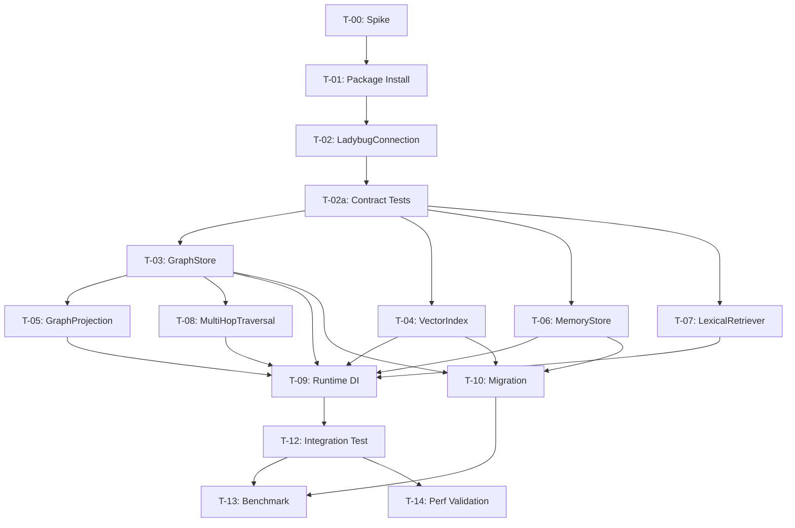

# MemGraphRAG v0.2.0 実装計画 — LadybugDB ストレージ移行

**Document ID**: PLAN-MEMGRAPHRAG-002
**Version**: 1.1
**Status**: Draft
**Created**: 2026-06-15
**Traceability**: REQ-MEMGRAPHRAG-002 v1.0, DES-MEMGRAPHRAG-002 v1.5

---

## 1. 概要

v0.2.0 は MemGraphRAG のストレージバックエンドを SQLite + FileVectorIndex から LadybugDB に移行する。
ドメイン層・アプリケーション層は変更しない（REQ-LDB-NFR-004）。

**総タスク数**: 15 (T-00〜T-10, T-12〜T-14, T-02a)
**フェーズ数**: 5
**推定工数**: 中〜大（各タスクにテスト含む）

---

## 2. フェーズ構成

| Phase | 名称 | タスク | 前提 | Go/No-Go ゲート |
|-------|------|--------|------|-----------------|
| 0 | Spike | T-00 | なし | Multi-corpus vector 戦略確定 |
| 1 | Foundation | T-01, T-02, T-02a | Phase 0 完了 | SQLite backend が Ladybug 未使用で動作 |
| 2 | Core Adapters | T-03, T-04, T-05, T-06, T-07 | Phase 1 完了 | 全 Contract テスト pass (SQLite / Ladybug 両方) |
| 3 | Integration | T-08, T-09, T-10 | Phase 2 完了 | Migration count parity, DI backend switch pass |
| 4 | Validation | T-12, T-13, T-14 | Phase 3 完了 | Benchmark + パフォーマンス閾値 pass |

---

## 3. タスク詳細

### Phase 0: Spike

#### T-00: PROJECT_GRAPH + QUERY_VECTOR_INDEX 検証スパイク

**DES**: ADR-002
**REQ**: REQ-LDB-002, REQ-LDB-004
**優先度**: P0 (ブロッカー)
**依存**: なし

**目的**:
LadybugDB の PROJECT_GRAPH で作成したサブグラフに対して QUERY_VECTOR_INDEX が動作するかを検証する。
マルチコーパス HNSW の実現可否を確定し、ADR-002 の decision を fix する。

**作業内容**:
1. spike 用に `@ladybugdb/core` を `testing/spike-ladybug/package.json` にローカルインストール
2. 最小限の LadybugDB スクリプトを `testing/spike-ladybug/` に作成
3. ノードテーブル作成 → HNSW インデックス作成 → PROJECT_GRAPH → QUERY_VECTOR_INDEX
4. 結果を ADR-002 に記録（Go / No-Go）
5. No-Go の場合: corpus_id フィルタ + グローバル HNSW + over-fetch 戦略を検証
   - **over-fetch recall 検証**: 偏りのあるマルチコーパスデータセット (90:10 比率) で
     over-fetch×3 が true top-K に対して recall ≥ 95% を達成するか測定
   - 不達の場合: per-corpus インデックス戦略を検討し ADR-002 に記録

**完了条件**:
- [ ] spike スクリプトが実行可能
- [ ] ADR-002 に Go/No-Go 判定が記録されている
- [ ] No-Go の場合、over-fetch recall ≥ 95% が検証されている
- [ ] No-Go かつ recall 不達の場合、代替戦略が ADR-002 に記録されている

---

### Phase 1: Foundation

#### T-01: LadybugDB パッケージ導入

**DES**: DES-LDB-001
**REQ**: REQ-LDB-001, REQ-LDB-NFR-004
**優先度**: P0
**依存**: T-00

**作業内容**:
1. `@ladybugdb/core` を `packages/memgraphrag/package.json` の `optionalDependencies` に追加
2. `npm install` 実行・動作確認
3. TypeScript 型定義の import 確認
4. **Lazy import ラッパー** 作成: `loadLadybugCore()` — dynamic import で `@ladybugdb/core` を読み込み、未インストール時はエラーメッセージで案内
5. SQLite-only 環境テスト: `@ladybugdb/core` 未インストール状態で `backend: 'sqlite'` が正常動作することを確認

**完了条件**:
- [ ] `@ladybugdb/core` が optionalDependencies に追加されている
- [ ] TypeScript で import/type check が通る
- [ ] `loadLadybugCore()` が dynamic import で動作する
- [ ] `@ladybugdb/core` 未インストールでも SQLite backend が正常動作する

---

#### T-02: LadybugConnection 接続管理

**DES**: DES-LDB-001
**REQ**: REQ-LDB-001, REQ-LDB-NFR-004
**優先度**: P0
**依存**: T-01

**作業内容**:
1. `ILadybugConnection` インターフェース定義
2. `LadybugConnection` クラス実装
   - Database singleton + Connection pool (size=3)
   - acquire/release パターン
   - `INSTALL` + `LOAD` (vector, fts, algo) の自動実行
   - `withConnection<T>(fn)` ヘルパー
3. スキーマ初期化（DES-LDB-002 のノード/エッジテーブル作成）
4. `close()` でリソース解放
5. EventEmitter（graphMutation イベント）統合
6. ユニットテスト

**完了条件**:
- [ ] `LadybugConnection` が acquire/release で接続を提供する
- [ ] 拡張 (vector, fts, algo) が自動ロードされる
- [ ] スキーマテーブルが初回接続時に作成される
- [ ] HNSW/FTS インデックスが作成される
- [ ] テスト 100% パス

---

#### T-02a: Contract テストスイート抽出

**DES**: DES-LDB-003, DES-LDB-004, DES-LDB-005, DES-LDB-006, DES-LDB-009
**REQ**: REQ-LDB-NFR-004
**優先度**: P0
**依存**: T-02

**目的**:
Phase 2 のアダプター実装前に、ポートインターフェースの契約テストを抽出・共有化する。
全アダプターが同一テストスイートに対して実装されることで、挙動の一貫性を保証する。

**作業内容**:
1. 既存テストから IGraphStore / IVectorIndex / IMemoryStore / IGraphProjection / ILexicalRetriever の契約テストを抽出
2. `tests/contracts/` ディレクトリに共通テストスイートを作成
3. テストファクトリパターン: `createGraphStoreContractTests(factory: () => IGraphStore)`
4. SQLite 実装で全 Contract テストが通ることを確認（回帰チェック）
5. **ID mapping エッジケーステスト追加**: `:` を含む localId、空文字、Unicode ID
6. **Cross-corpus edge 分離テスト追加**: getAdjacent/getEdges/projection が corpus 境界を越えないこと
7. **トランザクション/並行性テスト追加**: rollback on failed upsert, concurrent read/write, event emission after commit only

**完了条件**:
- [ ] 5 インターフェースの契約テストが `tests/contracts/` に存在する
- [ ] SQLite 実装で全契約テストがパスする
- [ ] ID エッジケーステストが含まれている
- [ ] Cross-corpus 分離テストが含まれている
- [ ] 並行性テストが含まれている

---

### Phase 2: Core Adapters

#### T-03: LadybugGraphStore

**DES**: DES-LDB-003
**REQ**: REQ-LDB-001, REQ-LDB-007
**優先度**: P0
**依存**: T-02, T-02a

**作業内容**:
1. `LadybugGraphStore implements IGraphStore` 実装
   - upsertNodes(): MERGE + SET (corpus_id prefix PK)
   - upsertEdges(): BEGIN/COMMIT atomic upsert
   - getNode(): MATCH by storageId → domainId 変換
   - getAdjacent(): MATCH (n)-[r]-() パターン
   - getEdges(): corpus_id フィルタ
   - deleteByDocument(): document_ids JSON array フィルタ
   - deleteAll(): corpus_id 一括削除
2. ID mapping: storageId() / domainId() 全メソッドに適用
3. graphMutation イベント emit
4. Contract テスト (既存 IGraphStore テストを共有化)

**完了条件**:
- [ ] IGraphStore の全メソッドが実装されている
- [ ] ID mapping が全 read/write パスに適用されている
- [ ] graphMutation イベントが write 操作で emit される（commit 後のみ）
- [ ] rollback 時に graphMutation が emit されない
- [ ] close() 時に EventEmitter リスナーが解除される
- [ ] `tests/contracts/` の IGraphStore 契約テストが全パス
- [ ] インクリメンタル追加（既存データ保持 + 新規追加）が動作する

---

#### T-04: LadybugVectorIndex

**DES**: DES-LDB-004
**REQ**: REQ-LDB-002, REQ-LDB-007
**優先度**: P0
**依存**: T-02, T-02a

**作業内容**:
1. `LadybugVectorIndex implements IVectorIndex` 実装
   - upsert(): prepare + execute で MERGE + SET vector カラム (FLOAT[1536])
   - search(): CALL QUERY_VECTOR_INDEX → domainId 変換
   - deleteByDocument(): corpus_id + document_ids フィルタ
   - count(): COUNT(n) by corpus_id
2. **Single corpus only** (ADR-002: multi-corpus は v0.2.0 スコープ外)
3. LadybugDB API: `conn.prepare()` + `conn.execute(ps, params)` パターン
4. Contract テスト

**完了条件**:
- [ ] IVectorIndex の全メソッドが実装されている
- [ ] search() が domainId を返す
- [ ] 検索レイテンシが 100ms 以下 (800K vectors)
- [ ] `tests/contracts/` の IVectorIndex 契約テストが全パス
- [ ] HNSW インデックスが新規ベクトル挿入時に自動更新される

---

#### T-05: LadybugGraphProjection

**DES**: DES-LDB-005
**REQ**: REQ-LDB-004
**優先度**: P0
**依存**: T-03, T-02a

**作業内容**:
1. `LadybugGraphProjection implements IGraphProjection` 実装
   - getTransitions(): Cypher MATCH → domainId 変換
   - getDanglingNodes(): Cypher leaf node query
   - Entity node 除外 (layer='entity')
2. TransitionEntry キャッシュ (Map<corpusId, TransitionEntry[]>)
3. graphMutation リスナーでキャッシュ invalidation
4. Contract テスト

**完了条件**:
- [ ] IGraphProjection の全メソッドが実装されている
- [ ] entity ノードが除外されている
- [ ] キャッシュが graphMutation で invalidate される
- [ ] close() 時に graphMutation リスナーが解除される
- [ ] SimplePPR と組み合わせたテストが通る
- [ ] `tests/contracts/` の IGraphProjection 契約テストが全パス

---

#### T-06: LadybugMemoryStore

**DES**: DES-LDB-006
**REQ**: REQ-LDB-003, REQ-LDB-007
**優先度**: P0
**依存**: T-02, T-02a

**作業内容**:
1. `LadybugMemoryStore implements IMemoryStore` 実装
   - load(): corpus_id フィルタで Schema/Fact/Passage を読み込み → MemorySnapshot 構築
   - save(): upsert (MERGE + SET) for each entity type
   - saveJobCheckpoint() / getJobCheckpoint()
   - validateIntegrity(): ノード参照整合性チェック
   - deleteByDocument()
2. ID mapping 全メソッドに適用
3. Contract テスト

**完了条件**:
- [ ] IMemoryStore の全メソッドが実装されている
- [ ] MemorySnapshot のラウンドトリップ (save → load) が正しい
- [ ] JobCheckpoint の永続化が動作する
- [ ] `tests/contracts/` の IMemoryStore 契約テストが全パス

---

#### T-07: LadybugLexicalRetriever

**DES**: DES-LDB-009, DES-LDB-011
**REQ**: REQ-LDB-005
**優先度**: P1
**依存**: T-02, T-02a

**作業内容**:
1. `LadybugLexicalRetriever implements ILexicalRetriever` 実装
   - indexPassages(): no-op (FTS auto-updates)
   - search(): PassageNode FTS + FactNode FTS → passage_id mapping → max(score) merge
   - deleteByDocument(): PassageNode 削除 (FTS auto-updates)
2. domainId() 適用
3. Contract テスト

**完了条件**:
- [ ] ILexicalRetriever の全メソッドが実装されている
- [ ] Fact FTS → passage mapping が動作する
- [ ] domainId が返り値に適用されている
- [ ] `tests/contracts/` の ILexicalRetriever 契約テストが全パス

---

### Phase 3: Integration

#### T-08: LadybugMultiHopTraversal

**DES**: DES-LDB-010
**REQ**: REQ-LDB-008
**優先度**: P1
**依存**: T-03, T-02a

**作業内容**:
1. `LadybugMultiHopTraversal` 実装
   - traverse(): Cypher variable-length path `MATCH (a)-[*1..N]-(b)`
   - relation type フィルタ
   - weight による top-K パス選択
   - acyclic (IS_TRAIL) セマンティクス
2. domainId() 適用
3. ユニットテスト

**完了条件**:
- [ ] 1〜3 ホップ探索が動作する
- [ ] 循環パスが排除されている
- [ ] 20,000 ノードで 500ms 以下
- [ ] テストが全パス

---

#### T-09: Runtime DI 統合

**DES**: DES-LDB-008
**REQ**: REQ-LDB-NFR-004
**優先度**: P0
**依存**: T-03, T-04, T-05, T-06, T-07, T-08

**作業内容**:
1. `StorageBackend` config type 拡張 (`'sqlite' | 'ladybug'`)
2. `createLadybugAdapters(config)` ファクトリ関数
3. `createStorageAdapters(config)` ルーター（backend に応じて SQLite or Ladybug を返す）
4. 環境変数 `MEMGRAPHRAG_BACKEND=ladybug` サポート
5. 既存 DI コードとの統合テスト

**完了条件**:
- [ ] `backend: 'ladybug'` で LadybugDB アダプターが生成される
- [ ] `backend: 'sqlite'` で既存アダプターが生成される（後方互換）
- [ ] 既存テストが `backend: 'sqlite'` で変わらずパスする

---

#### T-10: マイグレーションスクリプト

**DES**: DES-LDB-007
**REQ**: REQ-LDB-006
**優先度**: P0
**依存**: T-03, T-04, T-06

**作業内容**:
1. `migrate-to-ladybug.ts` スクリプト実装
   - SQLite → LadybugDB 全データ移行
   - FileVectorIndex → LadybugDB HNSW ベクトル移行
   - MemoryStore (Schema/Fact/Passage) 移行
   - GraphStore (Node/Edge) 移行
2. 冪等性: MERGE による重複防止
3. 検証レポート: 移行前後の件数比較出力
4. CLI コマンド: `npx memgraphrag migrate --from sqlite --to ladybug`
5. テスト (小規模データでの round-trip)

**完了条件**:
- [ ] CLI コマンドが実行可能
- [ ] 全データ種別が移行される
- [ ] 冪等 (再実行で重複なし)
- [ ] 検証レポートが出力される
- [ ] テストが全パス

---

### Phase 4: Validation

#### T-12: 統合テストとリグレッションチェック

**DES**: 全 DES
**REQ**: REQ-LDB-NFR-002, REQ-LDB-NFR-004
**優先度**: P0
**依存**: T-09

**作業内容**:
1. 既存全テストを `backend: 'ladybug'` で実行 → **100% パス必須**
   - SQLite 固有テスト (例: SQLite pragma テスト) は `@sqlite-only` タグで明示除外し、除外理由を文書化
2. E2E テスト: indexing → query → answer の全パイプライン
3. close/dispose テスト: 全アダプターの close() 後にリソースリークがないこと

**完了条件**:
- [ ] backend-agnostic テストが 100% パス
- [ ] SQLite 固有除外テストが文書化されている
- [ ] E2E パイプラインが正常動作
- [ ] close/dispose 後のリソースリークがないこと

---

#### T-13: HotpotQA ベンチマーク (精度回帰テスト)

**DES**: 全 DES
**REQ**: REQ-LDB-NFR-002
**優先度**: P0
**依存**: T-10, T-12

**作業内容**:
1. v0.1.0 の 500q SQLite DB を LadybugDB にマイグレーション
2. 同一 500 問ベンチマークを実行
3. 精度比較: v0.1.0 (83.6%) との差異分析
4. 2pt 以上の低下がある場合、原因分析・修正

**完了条件**:
- [ ] HotpotQA 500q 精度 ≥ 81.6% (v0.1.0 - 2pt)
- [ ] Bridge 精度 ≥ 80%
- [ ] Comparison 精度 ≥ 88%
- [ ] ベンチマーク結果が記録されている

---

#### T-14: パフォーマンス検証

**DES**: 全 DES
**REQ**: REQ-LDB-NFR-001, REQ-LDB-NFR-005
**優先度**: P0
**依存**: T-12

**作業内容**:
1. パフォーマンスベンチマークスクリプト作成 (`testing/perf-ladybug/`)
2. テストデータセット生成:
   - 800K ランダムベクトル (FLOAT[1536]) for ベクトル検索
   - 20K ノード + 28K エッジ for グラフ操作
3. 計測項目:
   - ベクトル検索 (topK=10, 800K vectors): 目標 100ms 以下
   - グラフ隣接取得 (20K nodes): 目標 10ms 以下
   - PPR 計算 (20K nodes, 28K edges): 目標 1秒以下
   - DB オープン時間: 目標 3秒以下
   - 3ホップ探索 (20K nodes): 目標 500ms 以下
4. 結果レポート出力（Markdown テーブル）
5. CI 統合用の閾値チェックスクリプト

**完了条件**:
- [ ] パフォーマンスベンチマークスクリプトが実行可能
- [ ] REQ-LDB-NFR-001 の全基準を満たす
- [ ] 結果が Markdown レポートとして記録されている

---

## 4. 依存関係図

---

## 5. カバレッジマトリクス

### 5.1 DES カバレッジ

| DES ID | タスク | 状態 |
|--------|--------|------|
| DES-LDB-001 | T-01, T-02 | ⬜ |
| DES-LDB-002 | T-02 | ⬜ |
| DES-LDB-003 | T-03, T-02a | ⬜ |
| DES-LDB-004 | T-04, T-02a | ⬜ |
| DES-LDB-005 | T-05, T-02a | ⬜ |
| DES-LDB-006 | T-06, T-02a | ⬜ |
| DES-LDB-007 | T-10 | ⬜ |
| DES-LDB-008 | T-09 | ⬜ |
| DES-LDB-009 | T-07, T-02a | ⬜ |
| DES-LDB-010 | T-08 | ⬜ |
| DES-LDB-011 | T-07 | ⬜ |
| ADR-001 | T-02 (SimplePPR維持) | ⬜ |
| ADR-002 | T-00 (spike) | ⬜ |

**DES カバレッジ: 100%** (全 11 DES + 2 ADR にタスクが割当済み)

### 5.2 REQ カバレッジ

| REQ ID | タスク | 状態 |
|--------|--------|------|
| REQ-LDB-001 | T-01, T-02, T-03 | ⬜ |
| REQ-LDB-002 | T-00, T-04 | ⬜ |
| REQ-LDB-003 | T-06 | ⬜ |
| REQ-LDB-004 | T-00, T-05 | ⬜ |
| REQ-LDB-005 | T-07 | ⬜ |
| REQ-LDB-006 | T-10 | ⬜ |
| REQ-LDB-007 | T-03, T-04, T-06 | ⬜ |
| REQ-LDB-008 | T-08 | ⬜ |
| REQ-LDB-NFR-001 | T-14 | ⬜ |
| REQ-LDB-NFR-002 | T-12, T-13 | ⬜ |
| REQ-LDB-NFR-003 | T-10, T-14 | ⬜ |
| REQ-LDB-NFR-004 | T-01, T-02a, T-09, T-12 | ⬜ |
| REQ-LDB-NFR-005 | T-14 | ⬜ |

**REQ カバレッジ: 100%** (全 8 機能要件 + 5 NFR にタスクが割当済み)

---

## 6. リスクと緩和策

| リスク | 影響 | 確率 | 緩和策 |
|--------|------|------|--------|
| PROJECT_GRAPH + HNSW が動作しない | Multi-corpus vector search のアーキテクチャ変更 | 中 | T-00 spike で早期判明。over-fetch recall ≥ 95% 検証済み fallback で対応 |
| Over-fetch recall 不足 (偏りデータ) | Top-K 精度低下 | 中 | T-00 で 90:10 偏りデータセットで検証。不達なら per-corpus index 戦略 |
| LadybugDB の Node.js binding 不安定 | 全アダプターに影響 | 低 | v0.17.1 は stable release。SQLite fallback を lazy import で維持 |
| SQLite fallback が LadybugDB 導入で壊れる | SQLite ユーザーに影響 | 中 | optionalDependencies + lazy import + T-01 で SQLite-only テスト |
| 精度回帰 2pt 超 | リリースブロッカー | 低 | ID mapping / FTS merge が正確なら精度は維持される |
| マイグレーション時のデータ損失 | 既存ユーザーに影響 | 低 | 冪等設計 + 検証レポート + 元データ非破壊 |
| ID に `:` 含有で mapping 破損 | データ破損 | 低 | T-02a でエッジケーステスト + prefix-length strip 戦略 |

---

## 7. 変更履歴

| Version | Date | Author | Changes |
|---------|------|--------|---------|
| 1.0 | 2026-06-15 | GitHub Copilot | 初版: 14 タスク, 5 フェーズ |
| 1.1 | 2026-06-15 | GitHub Copilot | rubber-duck v1: B1 spike install 自己完結, B2 REQ-LDB-007 mapping 追加, B3 T-08→T-09 依存追加, B4 Contract テスト Phase 1 前倒し (T-02a), B5 optionalDeps+lazy import, B6 over-fetch recall 検証基準, B7 100%パス必須+除外文書化, N8 T-14 perf validation, N9-12 テスト基準強化, REQ カバレッジマトリクス追加, Phase ゲート明示 |
