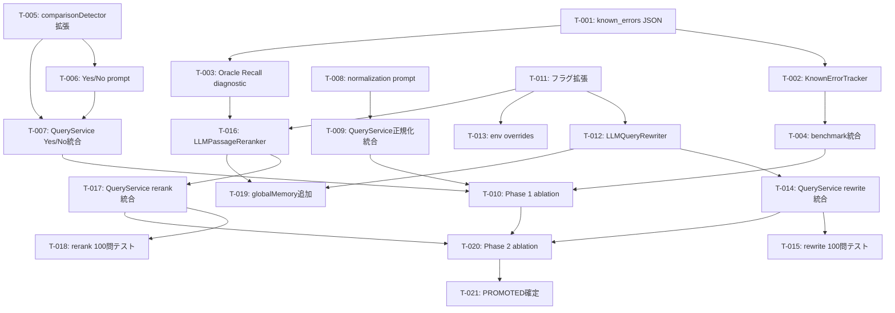

# PLAN-MEMGRAPHRAG-004: クエリ精度改善 Phase 2 実装計画

| フィールド | 値 |
|-----------|---|
| **ID** | PLAN-MEMGRAPHRAG-004 |
| **バージョン** | 1.0 |
| **ステータス** | Draft |
| **作成日** | 2026-06-18 |
| **対応設計** | DES-MEMGRAPHRAG-004 v1.3 |
| **対応要件** | REQ-MEMGRAPHRAG-004 v1.2 |
| **パッケージ** | `@nahisaho/memgraphrag` |

## 1. 実装方針

### 1.1 フェーズ順序（リスク低→高）

```
Phase 0: 診断インフラ（前提条件の確立）
  ↓
Phase 1a: 比較クエリ改善（低リスク、3問回復目標）
  ↓
Phase 1b: 回答正規化（低リスク、3問回復目標）
  ↓
  [ablation: Phase 1 成果検証 — 500問ベンチマーク]
  ↓
Phase 2a: クエリリライト（高リスク、Phase 0 結果次第）
  ↓
Phase 2b: パッセージ再ランキング（高リスク、Oracle Recall@20 > 50% の場合のみ）
  ↓
  [ablation: Phase 2 成果検証 — 500問ベンチマーク × 2回]
  ↓
Final: PROMOTED_PHASE2_FLAGS 確定
```

### 1.2 テスト戦略

- 各コンポーネントはユニットテスト（Vitest）を先に書く（Red→Green→Blue）
- 統合テストは MockLLMProvider + in-memory PPR で実行
- ベンチマークは 100問（速度）→ 500問（精度検証）→ 500問×2（再現性）

### 1.3 見積もり

| フェーズ | タスク数 | 見積もり |
|---------|:-------:|---------|
| Phase 0 | 4 | 2-3h |
| Phase 1a | 3 | 1-2h |
| Phase 1b | 2 | 0.5-1h |
| Phase 1 ablation | 1 | 1h (実行待ち) |
| Phase 2a | 5 | 3-4h |
| Phase 2b | 4 | 2-3h |
| Phase 2 ablation | 2 | 2h (実行待ち) |
| **合計** | **21** | **12-16h** |

## 2. タスク一覧

### Phase 0: 診断インフラ

#### T-001: known_errors_v15.json 作成

**依存**: なし
**ファイル**: `data/benchmark/hotpotqa/known_errors_v15.json`
**内容**:
- 既存の `results_eval_v2_500.json` から 50 問のエラーを抽出
- カテゴリ分類（retrieval/expression/yesno/generic/spelling）を付与
- 450 問の correct_ids を記録
- スクリプトで自動生成

**受入基準**:
- [ ] 50 errors + 450 correct_ids が JSON に保存
- [ ] カテゴリ合計が 50 に一致

#### T-002: KnownErrorTracker 実装

**依存**: T-001
**ファイル**: `src/domain/benchmark/KnownErrorTracker.ts`, `tests/domain/benchmark/KnownErrorTracker.test.ts`
**内容**:
- `IKnownErrorTracker` インターフェース + 実装
- `load()`: JSON 読み込み → `KnownErrorSet`
- `compare()`: 新結果と比較 → `BenchmarkDelta`
- `report()`: human-readable サマリ文字列生成

**受入基準**:
- [ ] ユニットテスト: 全カテゴリの回復/退行を正しく検出
- [ ] レポート形式: `recovered: {retrieval: N, expression: N, yesno: N, generic: N, spelling: N}`

#### T-003: Oracle Recall 診断スクリプト

**依存**: T-001
**ファイル**: `scripts/oracle-recall-diagnostic.mjs`
**内容**:
- HotpotQA 元データから supporting_facts タイトルを取得
- 50 問の既知エラーについて retrieval-only パス（memoryFilter → nodeInitializer → PPR）を実行
- Recall@10/20/50 を strict/lenient で計算
- Phase 2b ゲート判定（検索失敗 14 件の lenient Recall@20 > 50%）

**受入基準**:
- [ ] `oracle_recall_report.json` が生成される
- [ ] カテゴリ別 Recall@K が報告される
- [ ] 判定結果（proceed/skip）が含まれる

#### T-004: ベンチマークスクリプトに KnownErrorTracker 統合

**依存**: T-002
**ファイル**: `scripts/benchmark-hotpotqa-ladybug.mjs` (拡張)
**内容**:
- ベンチマーク結果に `delta` セクションを追加
- 既知エラーの回復/退行をカテゴリ別に報告
- 450 問正解からの退行数も報告

**受入基準**:
- [ ] ベンチマーク結果 JSON に `knownErrorDelta` が含まれる
- [ ] 全 5 カテゴリの回復数が報告される

---

### Phase 1a: 比較クエリ改善

#### T-005: comparisonDetector 拡張

**依存**: なし
**ファイル**: `src/application/query/comparisonDetector.ts`, `tests/application/query/comparisonDetector.test.ts`
**内容**:
- `analyzeComparisonQuery()` を新規追加（既存 `isComparisonQuery()` は維持）
- `ComparisonType`: 'yesno' | 'which' | 'shared_attribute' | 'none'
- Yes/No 検出パターン: `^(are|is|do|does|did|was|were|have|has|had|can|could|will|would|should)\b`

**受入基準**:
- [ ] 既知 3 件の Yes/No エラーが正しく 'yesno' に分類
- [ ] "Which is more..." は 'which' に分類（yesno ではない）
- [ ] 既存 `isComparisonQuery()` のテストが全パス

#### T-006: Yes/No 専用プロンプト

**依存**: T-005
**ファイル**: `src/application/query/prompts/comparisonYesNoPrompt.ts`, テスト
**内容**:
- `buildYesNoComparisonPrompt(query, entities, context)` 実装
- エンティティ名をプロンプトに埋め込み
- 証拠比較 + yes/no 結論の推論チェーン

**受入基準**:
- [ ] プロンプトに両エンティティ名が含まれる
- [ ] "FINAL: yes" or "FINAL: no" フォーマットを要求

#### T-007: QueryService に Yes/No 分岐統合

**依存**: T-005, T-006
**ファイル**: `src/application/query/QueryService.ts`
**内容**:
- `enableComparisonReasoning` フラグで制御
- `compAnalysis.type === 'yesno'` 時に専用プロンプト使用
- メトリクスに `comparisonDetected` を記録

**受入基準**:
- [ ] フラグ OFF 時は既存動作と完全一致
- [ ] フラグ ON 時に Yes/No 検出クエリで専用プロンプト使用
- [ ] 既知 3 件中 2 件以上が回復（100問テストで確認）

---

### Phase 1b: 回答正規化

#### T-008: 正規化指示プロンプト

**依存**: なし
**ファイル**: `src/application/query/prompts/normalizationInstructions.ts`, テスト
**内容**:
- `NORMALIZATION_INSTRUCTIONS` 定数を定義
- 公式名称、FirstName LastName、略称禁止等

**受入基準**:
- [ ] プロンプト文字列がエクスポートされる
- [ ] テストで期待する指示が含まれることを確認

#### T-009: QueryService に正規化プロンプト統合

**依存**: T-008
**ファイル**: `src/application/query/QueryService.ts`
**内容**:
- `enableAnswerNormalization` フラグで制御
- bridge/comparison 両プロンプトの Rules 直前に挿入
- 退行テスト（既存 450 問正解が維持されること）

**受入基準**:
- [ ] フラグ OFF 時は既存動作と完全一致
- [ ] フラグ ON 時にプロンプトに正規化指示が含まれる
- [ ] 100問テストで退行 0

---

### Phase 1 Ablation

#### T-010: Phase 1 ablation ベンチマーク

**依存**: T-007, T-009, T-004
**ファイル**: 結果 JSON のみ
**内容**:
1. `enableComparisonReasoning` のみ ON → 500問
2. `enableAnswerNormalization` のみ ON → 500問
3. 両方 ON → 500問
4. KnownErrorTracker で回復/退行レポート
5. 推奨構成を決定

**受入基準**:
- [ ] 各構成で 89.5% 以上（非劣化保証）
- [ ] Phase 1 回復合計 ≥ 3問（yesno 2+ expression 1+）
- [ ] 結果が `data/benchmark/hotpotqa/` に保存

---

### Phase 2a: クエリリライト

#### T-011: フィーチャーフラグ拡張

**依存**: なし
**ファイル**: `src/domain/config/featureFlags.ts`
**内容**:
- `enableQueryRewriting`, `enablePassageReranking`, `enableComparisonReasoning`, `enableAnswerNormalization` を追加
- `DEFAULT_QUERY_FLAGS` に全て false で追加
- 排他制御ロジック（enableQueryRewriting vs enableSubQueryDecomposition）

**受入基準**:
- [ ] 新フラグが型定義に存在
- [ ] 全てデフォルト false
- [ ] 既存テストが全パス（後方互換）

#### T-012: IQueryRewriter インターフェース + LLMQueryRewriter

**依存**: T-011
**ファイル**: `src/domain/retrieval/queryRewriter.ts`, `src/application/query/LLMQueryRewriter.ts`, テスト
**内容**:
- Domain 層: `IQueryRewriter`, `RewriteRequest`, `RewriteResult`, `SubQuery`
- Application 層: `LLMQueryRewriter` 実装
  - `safeDecompose()`: exactly 2, depends_on 正規化, {step1} 必須
  - `extractIntermediate()`: GlobalMemory でテキスト取得
  - `mergeRankings()`: スコア正規化 + 加重結合 + topK キャップ
  - `fallbackResult()`: 全段フォールバック
- 分解プロンプト、中間回答抽出プロンプト

**受入基準**:
- [ ] MockLLM で分解→中間回答→マージのフローが動作
- [ ] JSON パースエラー時にフォールバック
- [ ] タイムアウト時にフォールバック
- [ ] 1 subquery / 3 subqueries / missing {step1} → フォールバック
- [ ] mergeRankings がスコア正規化 + topK キャップ

#### T-013: 環境変数オーバーライド

**依存**: T-011
**ファイル**: `src/infrastructure/config/envFlagOverrides.ts`, テスト
**内容**:
- `QUERY_REWRITE=true` 等で QueryFeatureFlags をオーバーライド
- `applyEnvOverrides()` 関数

**受入基準**:
- [ ] 環境変数設定時にフラグが変更される
- [ ] 未設定時は元の値を維持

#### T-014: QueryService にクエリリライト統合

**依存**: T-012
**ファイル**: `src/application/query/QueryService.ts`
**内容**:
- Step 2（comparison 分析）→ Step 3 で rewrite/既存パイプライン分岐
- 排他制御: enableQueryRewriting && enableSubQueryDecomposition → warn + disable old
- メトリクスに subQueryCount, subQueryParseSuccess, queryRewriteFallback 記録

**受入基準**:
- [ ] フラグ OFF 時は既存動作と完全一致
- [ ] フラグ ON + bridge クエリ → QueryRewriter 実行
- [ ] フラグ ON + comparison クエリ → 既存パス（リライト対象外）
- [ ] 両フラグ ON → old decomposer が無効化

#### T-015: クエリリライト 100問テスト

**依存**: T-014
**ファイル**: 結果のみ
**内容**:
- enableQueryRewriting のみ ON で 100問テスト
- フォールバック率、分解成功率、レイテンシを確認
- 退行がないことを確認

**受入基準**:
- [ ] 分解成功率 > 70%（bridge クエリ）
- [ ] 精度が baseline 以上
- [ ] 平均レイテンシ < 10s

---

### Phase 2b: パッセージ再ランキング

#### T-016: IPassageReranker + LLMPassageReranker

**依存**: T-011, T-003 (Oracle Recall 結果が前提)
**ファイル**: `src/domain/retrieval/passageReranker.ts`, `src/application/query/LLMPassageReranker.ts`, テスト
**内容**:
- Domain 層: `IPassageReranker`, `RerankRequest`, `RerankResult`
- Application 層: `LLMPassageReranker`
  - GlobalMemory 注入でパッセージテキスト取得
  - 1 バッチ LLM 呼び出しでスコアリング
  - parseScores: 長さ不一致/パースエラー → フォールバック
  - 全パッセージ保持（順序のみ変更）

**受入基準**:
- [ ] MockLLM で rerank フローが動作
- [ ] スコアパースエラー時に元 PPRResult を返す
- [ ] 全パッセージ数が入力と出力で同一

#### T-017: QueryService に再ランキング統合

**依存**: T-016
**ファイル**: `src/application/query/QueryService.ts`
**内容**:
- PPR 後、contextBuilder.build() 前に rerank を挿入
- enablePassageReranking フラグで制御
- メトリクスに rerankScoreRange, rerankPositionChange 記録

**受入基準**:
- [ ] フラグ OFF 時は既存動作と完全一致
- [ ] フラグ ON 時に reranker が実行され、メトリクスが記録

#### T-018: 再ランキング 100問テスト

**依存**: T-017
**ファイル**: 結果のみ
**内容**:
- enablePassageReranking のみ ON で 100問テスト
- 再ランキングの効果（スコア変動、順位変更数）を確認

**受入基準**:
- [ ] 精度が baseline 以上
- [ ] positionChanges が発生していること（全パッセージ不動でないこと）

#### T-019: QueryServiceDependencies に globalMemory 追加

**依存**: T-012 or T-016
**ファイル**: `src/application/query/QueryService.ts`
**内容**:
- `QueryServiceDependencies` に `globalMemory?: GlobalMemory` 追加
- QueryRewriter / Reranker 生成時に渡す

**受入基準**:
- [ ] 既存テストが全パス（optional なので後方互換）

---

### Phase 2 Ablation

#### T-020: Phase 2 ablation ベンチマーク（500問 × 2）

**依存**: T-014, T-017, T-010
**ファイル**: 結果 JSON のみ
**内容**:
1. Phase 1 推奨構成 + enableQueryRewriting → 500問
2. Phase 1 推奨構成 + enablePassageReranking → 500問（Oracle Recall 許可の場合のみ）
3. Phase 1 + Phase 2 全有効 → 500問 × 2回
4. KnownErrorTracker で全回復/退行レポート
5. PROMOTED_PHASE2_FLAGS を確定

**受入基準**:
- [ ] 最終構成で ≥ 458/500（91.6%+）
- [ ] 2回実行で ±0.5% 以内
- [ ] 退行 ≤ 3問

#### T-021: PROMOTED_PHASE2_FLAGS 確定 + ドキュメント更新

**依存**: T-020
**ファイル**: `src/domain/config/featureFlags.ts`, `docs/memgraphrag-aira-synapse.md`
**内容**:
- ablation 結果に基づき PROMOTED_PHASE2_FLAGS を定義
- ドキュメントに最終精度と推奨構成を記載

**受入基準**:
- [ ] featureFlags.ts に PROMOTED_PHASE2_FLAGS が定義
- [ ] ドキュメントに ablation 結果が記載

## 3. 依存関係グラフ



## 4. リスクと対策

| リスク | 影響 | 対策 |
|--------|------|------|
| クエリリライトの LLM 呼び出しがレイテンシ超過 | NFR-001 違反 | タイムアウト 5s、reasoningEffort=low |
| 分解成功率が低い | Phase 2a 効果なし | フォールバックが既存パスと同等性能を保証 |
| Oracle Recall@20 ≤ 50% | Phase 2b スキップ | Phase 2a に集中、Phase 1 で目標に近づける |
| 再ランキングが退行を引き起こす | 非劣化違反 | フラグ OFF に戻して無効化 |
| LLM コスト増大 | NFR-002 違反 | reasoningEffort=low、バッチ呼び出し |

## 5. 完了基準

- [ ] 全 21 タスクが done
- [ ] ユニットテスト: 新規コンポーネント全てにテスト（カバレッジ 80%+）
- [ ] 500問ベンチマーク ≥ 458/500（91.6%+）を 2回再現
- [ ] 退行 ≤ 3問
- [ ] PROMOTED_PHASE2_FLAGS が確定
- [ ] ドキュメント更新
